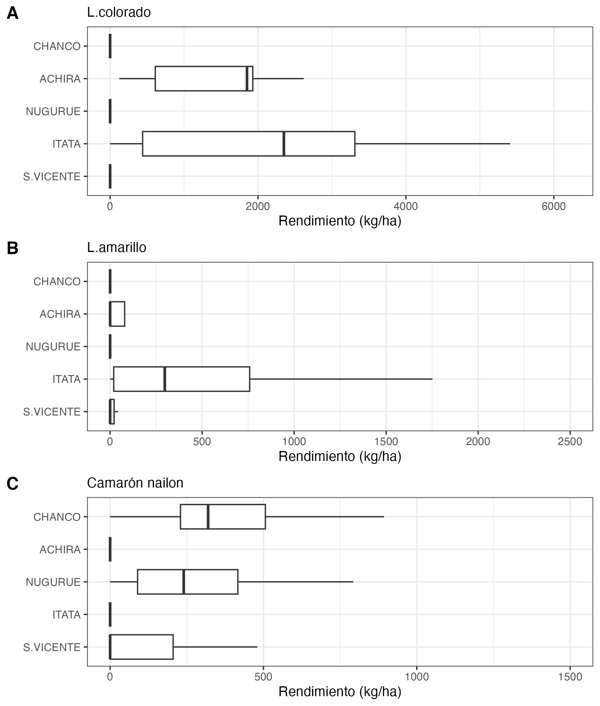
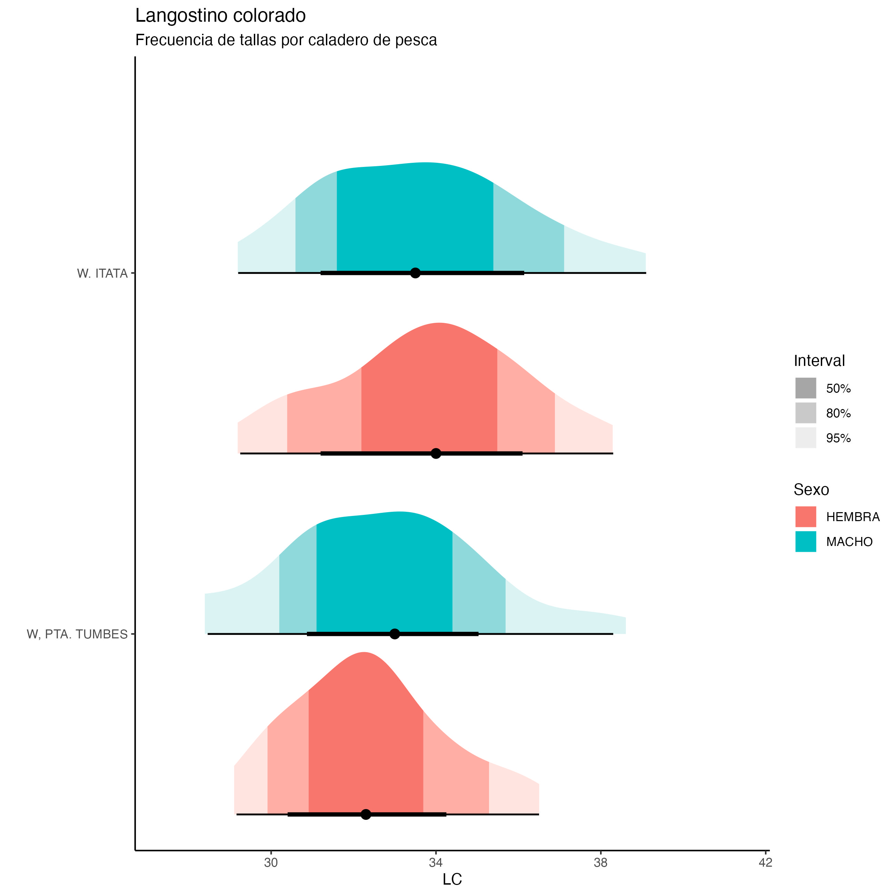

```{r setup, include=FALSE}
knitr::opts_chunk$set(echo = TRUE,warning = FALSE,message = FALSE)
```

[Vuelve a página incial](https://luisacubillos.github.io/Indicadores_camanchaca/)

# Resumen de los resultados 

En marzo de 2024, la captura de crustáceos demersales se realizó entre las regiones del Biobío y del Maule. El esfuerzo de pesca se dirigió preferentemente al camarón nailon, con 132 lances de pesca y lográndose una captura de 143052 kg. En tanto, sólo en la última semana comenzaron las operaciones de pesca orientadas al langostino colorado, con 47 lances y una captura de 107320 kg. El langostino amarillo se capturó en 34 lances de pesca,en forma conjunta con langostino colorado, totalizando 29874 kg.

El rendimiento de pesca promedio fue mayor en langostino colorado,  y se presentó en el caladero a la cuadra de Itata. El rendimiento de langostino amarillo fue 90% mayor en comparación al año 2023, y el camarón nailon presentó los mayores rendimientos en Chanco y Nugurue con valores entre los 100 y 2500 kg/ha. 

En cuanto a la proporción sexual en langostino colorado fue favorable a las hembras con un aporte de 61% al igual que en camarón nailon con un aporte de hembras de 62%. En tanto, en langostino amarillo predominó el aporte de machos con un 74%. 

En el langostino colorado hubo presencia de un 20% de hembras en estado ovígero, situación que no se observaba desde los años 2017-2018. Esto se interpreta como un adelanto de la actividad reproductiva, hipótisis que se debe verificar el proximo mes. A su vez los indicadores biológicos muestran una disminución en la talla media tanto en langostino colorado como langostino amarillo, tallas que incluso en langostino colorado dejan de diferenciarse por sexos. Sin embargo, estos ejemplares proviene de muestras obtenidas durante la última semana de marzo ya que las capturas fueron dirigidas esencialmente al camarón nailon, lo que hace que no sean del todo concluyentes.


# Aspectos Pesqueros

## Actividad pesquera

Las operaciones de pesca realizadas durante junio cubrieron los caladeros ubicados desde la región del Bío-Bío a la región de Maule, destacando los caladeros del weste de Itata, Chanco y Nugurue (Fig. 1). 

```{r echo=FALSE, fig.width=4,fig.height=5}

```

##### *Figura 1. Distribución espacial del total de lances de pesca realizados durante marzo de 2024.*

## Captura,esfuerzo y rendimientos de pesca

En marzo de 2024, los de lances de pesca estuvieron orientados a camarón nailon, con el 78,5% de los lances constituidos por esta especie. Luego, en el 1,1 % de los lances se capturó sólo langostino colorado y en el 0,6% sólo langostino amarillo de forma exclusiva. En el 19,6% de las capturas se presentó de forma conjunta langostino amarillo y colorado (Fig. 2). 

```{r echo=FALSE, out.width="50%",fig.align = 'center'}

```

#####  *Figura 2. Distribución espacial de los lances de pesca orientados a langostino colorado, langostino amarillo y camarón nailon durante marzo de 2024.*

Durante marzo las capturas por lance de langostino colorado fluctuaron entre 48 y 5472 kg, totalizando una captura de 107320 kg. Se logró un promedio de 2283 kg por lance de pesca, desplegando 54 horas de arrastre (ha) y un rendimiento de pesca de 2003 kg/ha (Tabla 1).

En cuanto a langostino amarillo se registro en 34 lances con una captura total de 29874 kg y un rendimiento de 787 kg/ha (Tabla 1) y el camarón nailon destacó con las mayores capturas estando presente en 132 lances con un total de 143052 kg.

##### *Tabla 1. Indicadores operacionales de la pesquería de langostino colorado, langostino amarillo y camarón nailon 2024.*

|**Recurso**|**Mes**|**Número de lances(n)**|**Captura(kg)**|**Captura por lances(kg/n)**|**Hora de arrastre(ha)**|**Rendimiento(kg/ha)**|**Profundidad promedio de fondo(m)**| 
|:--------:|:--------:|:-------:|:-------:|:-------:|:-------:|:------:|:--------:|
|**L.colorado**|marzo|47|107320|2283,4|53,5|2002,8|192|
|**L.amarillo**|marzo|34|29874|878,6|37,9|787,1|191|
|**Camarón**|marzo|132|143052|1083,7|353,6|404,4|343|

El rendimiento de pesca de langostino colorado fluctúo entre 42 y 6221 kg/ha, con una moda en 1674 kg/ha. En cambio, el esfuerzo de pesca fluctúo entre 23 y 116 minutos, con una mayor frecuencia en 68 minutos (Fig. 3). En cuanto a langostino amarillo, presentó un rendimiento entre los 25 y 5510 kg/ha, y el esfuerzo tuvo una mayor frecuencia en 67 min (Fig. 3), y el camarón nailon presentó un rendimiento medio de 336 kg/ha con un esfuerzo entorno a las 2 horas 40 minutos.

```{r echo=FALSE}

```

#####  *Figura 3. Distribución de frecuencia del esfuerzo de pesa, en términos de duración del lance en horas de arrastre (ha) (A) y del rendimiento de pesca (kg/ha) (B), de langostino colorado, langostino amarillo y camarón nailon en marzo de 2024.*

En cuanto a la distribución espacial del rendimiento de pesca, durante el mes de marzo destacó una zona de alto rendimiento de langostino colorado localizada a la cuadra del W. de Itata, con rendimientos entre los 2500 y >7500 kg/ha (Fig. 4). El langostino amarillo se capturó en su mayoría en conjunto con langostino colorado, y presentó los mayores rendimientos en la cuadra del W. de Itata, con rendimientos entre los 2500 y 7500 kg/ha (Fig. 4). El rendimiento de pesca fue mayor en un 90% con relación con igual periodo 2023. En cuanto a camarón nailon, este recurso presentó los mayores rendimientos en los caladeros de Chanco y Nugurue con valores entre los 100 y 2500 kg/ha. (Fig. 5)

```{r echo=FALSE, out.width="50%",fig.align = 'center'}

```

#####  *Figura 4. Distribución del rendimiento de pesca (kg/ha) de langostino colorado, langostino amarillo y camarón nailon en marzo de 2024.*

```{r echo=FALSE}

```

#####  *Figura 5. Rendimiento de pesca (captura por hora de arrastre) anual de langostino colorado (A), langostino amarillo (B) y camarón nailon (C), en los caladeros visitados de en la unidad de pesquería sur, marzo de 2024.*

# Aspectos biológicos

Los indicadores biológicos dicen relación con la talla promedio de machos y hembras, la proporción sexual, la estructura de tallas, el estado de madurez de las hembras ovígeras y la proporción de hembras ovígeras. Los datos fueron obtenidos a partir de muestreos aleatorios diarios de ejemplares capturados en zonas de pesca visitadas por la flota. El tamaño mínimo de muestra fue de 300 ejemplares, a los que se les midió la longitud del cefalotórax utilizando un pie de metro (0,01 mm de precisión). Los ejemplares además fueron pesados (0,01 gramos), indicándose si se trataba de ejemplares completos o incompletos. Se determinó el sexo, y en el caso de las hembras se registraron las hembras portadoras de huevos (ovígeras) y el estado de madurez de los huevos según escala de 4 puntos de Palma y Arana (1997).

## Proporción sexual y talla promedio

En las capturas de marzo 2024, el langostino colorado presentó una proporción sexual favorable a las hembras con un aporte de 61%. En el langostino amarillo se observó una diferencia más marcada, con un aporte mayor de machos de 74% con relación a las hembras. En tanto, en el camarón nailon predominó el aporte de hembras con un 62% (Fig. 6).

En cuanto a la talla media se capturó ejemplares de langostino colorado con una talla entre 33 y 41  mm longitud cefalotórax (LC), con un promedio muy similar entre sexos. Al comparar las tallas medias por años de capturas en langostino colorado se observa que las tallas tienden a comenzar altas durante marzo, sin embargo durante este año se presentan tallas menores y sin diferenciación entre sexos (Fig. 7).

En langostino amarillo, los machos presentaron una talla más grande y en torno a 38 mm LC. Al comparar las tallas medias por años de captura se observa en ambos sexos una tendencia a comenzar la temporada de pesca con tallas inferiores que igual periodo 2023 (Tabla 2, Fig. 7).

En camarón nailon las tallas estuvieron entre los 27-28 mm LC, presentandose tallas similares entre sexos y destacando los machos por tener el mayor rango de tallas entre los 17 y 35 mm (Tabla 2).

##### *Tabla 2. Proporción sexual y talla promedio de langostino colorado, langostino amarillo y camarón nailon en las capturas de la UPS, 2024*

|   |Mes|Sexo|n|LC(mm)|DE(mm)|Mínimo(mm)|Máximo(mm)|
|----|---|----|-|------|------|----------|----------|
|**L.colorado**|marzo|hembra|606|33,4|2,42|27,4|40,3|
|         |    |macho|386|33,4|2,58|28,2|41,4|
|**L.amarillo**|marzo|hembra|55|30,8|2,72|25,4|38,5|
|         |    |macho|160|38,3|2,92|30,1|48,1|
|**Camarón**|marzo|hembra|1540|28,2|2,74|19,9|34,9|
|      |     |macho|957|27,7|2,81|17,3|35,3|


```{r echo=FALSE}

```

#####  *Figura 6. Proporción sexual de langostino colorado (A), langostino amarillo (B) y camarón nailon durante marzo de 2024*

```{r echo=FALSE}

```

#####  *Figura 7. Talla promedio (LC, mm) de langostino colorado y langostino amarillo por sexo, en el periodo enero 2016 a marzo de 2024*

## Aspectos reproductivos

Durante marzo de 2024, las hembras de langostino colorado presentaron un 20% en estado ovígero, escenario que no se registraba en esta especie desde los años 2017-2018 (Fig.8, Tabla 3). En el caso de langostino amarillo no hubo presencia de hembras en estado ovígero siguiendo la tendencia resgistrada desde el año 2017 (Fig.8, Tabla 3). En camarón nailon sólo se registró un 7% de hembras portadoras (Tabla 3).

```{r echo=FALSE}

```

#####  *Figura 8. Comparación de hembras ovígeras de langostino colorado (panel superior) y langostino amarillo (panel inferior), entre los años 2017 a marzo del año 2024*

##### *Tabla 2. Porcentaje de hembras ovígeras y hembras maduras de langostino colorado y amarillo UPS 2024, y de hembras potadoras e inmaduras de camarón nailon*

|Recurso|Estado|marzo|
|-------|------|-----|
|**L.colorado**|Normal|80%|
|          |Ovígeras|20%|
|          |Madura|0%|
|Total n°|       |606|
|**L.amarillo**|Normal|100%|
|         |Ovígeras|0%|
|         |Madura|0%|
|Total n°|        |55|
|**Camarón nailon**|Portadoras|7%|
|            |Inmaduras|93%|
|Total n°|    |1540|

## Composición de tallas

La composición de tallas de langostino colorado y camarón nailon no muestran diferencias significativas entre sexos (t-Student p >0,05). En el langostino colorado macho, la talla media fue de 33 mm LC y en las hembras fue de 28 mm (Tabla 2, Figs. 9 y 11). A diferencia de langostino amarillo, recurso que si presenta diferencias significativas entre sexos, se registraron machos con una talla promedio de 38 mm, y hembras de 30 mm LC (Tabla 2, Fig. 10). El análisis de la composición de tallas por zonas de pesca de langostino colorado mostró las tallas modales más pequeñas el caladero de Tumbes, en tanto las tallas más grandes se presentaron al W. de Itata (Fig. 12). En los otros recursos no se pudo analizar por caladeros debido a que el muestreo biologico se realizó con muestras provenientes de un solo caladero, el caladero de Tumbes en langostino amarillo y Nugurue en el caso de camarón nailon (Fig. 10, 11).

```{r echo=FALSE}

```

#####  *Figura 9. Composición de tallas de langostino colorado entre sexos, en marzo de 2024*

```{r echo=FALSE}

```

#####  *Figura 10. Composición de tallas de langostino amarillo entre sexos, en marzo de 2024*

```{r echo=FALSE}

```

#####  *Figura 11. Composición de tallas de camarón nailon entre sexos, en marzo de 2024*

```{r echo=FALSE}

```

#####  *Figura 12. Composición de tallas de langostino colorado en la UPS por zonas de pesca en marzo de 2024*

## Relación longitud-peso

La relación longitud-peso de machos y hembras utilizó ejemplares que fueron pesados completos;, es decir, con todas sus extremidades. El mejor modelo para la relación longitud-peso fue con una intersección fija y diferentes pendientes entre sexos, el peso esperado más alto a una talla determinada se presentó en hembras tanto en langostino colorado como camarón nailon y en machos en el caso de langostino amarillo (Fig. 13).

```{r echo=FALSE}

```

#####  *Figura 13. Relación longitud-peso de langostino colorado (A), langostino amarillo (B) y camarón nailon (C), por sexos, en marzo 2024.*


## Fauna acompañante

Las operaciones de pesca efectuadas durante marzo de 2024, muestran presencia del pejerrata en los caladeros de pesca de Chanco, Nugurue, W. de Itata y W. de San Vicente (Fig. 14), con un aporte de 2,35% y 6745 kg. 

En cuanto al aporte de otros recursos como fauna acompañante, la merluza común se extrajo en los caladeros de Chanco y Nugurue, con valores entre los 5 y 25 kg/ha. El lenguado de ojos grandes se registró en el caladero de Itata, con una captura de entre 15 y rendimiento de 50 kg/ha (Fig. 15).

La jaiba paco y jaiba limón se registró en términos de unidades por hora de arrastre, con una distribución característica al borde del talud continental (Figura 15).

```{r echo=FALSE, out.width="50%",fig.align = 'center'}

```

#####  *Figura 14. Distribución de los lances de pesca con captura de pejerrata en las capturas de camarón nailon, langostino colorado y langostino amarillo, y la fracción de pejerrata en las capturas totales, desde marzo  año 2024.*


```{r echo=FALSE, out.width="50%",fig.align = 'center'}
knitr::include_graphics("Figuras/Fauna_Acompañante_marzo_2024.jpeg")
```

#####  *Figura 15. Distribución espacial y abundancia de la fauna acompañante en los lances de pesca orientados a langostinos colorado y langostinos amarillos por la flota arrastrera de Camanchaca Pesca Sur, marzo de 2024*


[Vuelve a página incial](https://luisacubillos.github.io/Indicadores_camanchaca/)
