```{r setup, include=FALSE}
knitr::opts_chunk$set(echo = TRUE)
```

[Vuelve a página incial](https://luisacubillos.github.io/Indicadores_camanchaca/)

# Resumen

En abril pasado, las operaciones de pesca se realizaron entre la region del Biobío y la región de Maule. La especie objetivo fue el langostino colorado, con 276 lances de pesca y una captura de 719014 kg. En tanto, la captura de langostino amarillo se presentó en 223 lances de pesca orientados al langostino colorado, lográndose 106812 kg.

En cuanto al rendimiento de pesca, este fue mayor en langostino colorado  y se presentó en la cuadra de Achira y Nugurue, en el caso de langostino amarillo su mejor rendimiento fue en el caladero de San Vicente. 

En los indicadores biológicos, la proporción sexual en langostino colorado fue favorable a las hembras (con un aporte de 57%). En tanto, en el langostino amarillo predominó el aporte de machos con 88%.

En langostino colorado, 70% de las hembras se encontraron en estado ovígero. Esta situación no se observaba desde los años 2017-2019, lo que indica un adelanto de la actividad reproductiva. Aunque en marzo pasado se registraron tallas medias bajas para el langostino colorado y langostino amarillo, en abril se revierte el indicador con tallas más grandes debido a un muestreo más representativo. En efecto, en marzo la pesca fue dirigida al camarón nailon durante gran parte del mes, y por lo tanto los muestreos biológicos de langostino colorado y langostino amarillo se obtuvieron sólo la última semana de marzo.

# Aspectos Pesqueros

## Actividad pesquera

Las operaciones de pesca realizadas durante abril cubrieron los caladeros ubicados desde la región del Bío-Bío a la región de Maule, destacando los caladeros de Iloca, Carranza y el W. de Itata (Fig. 1). 

```{r echo=FALSE, out.width="50%",fig.align = 'center'}
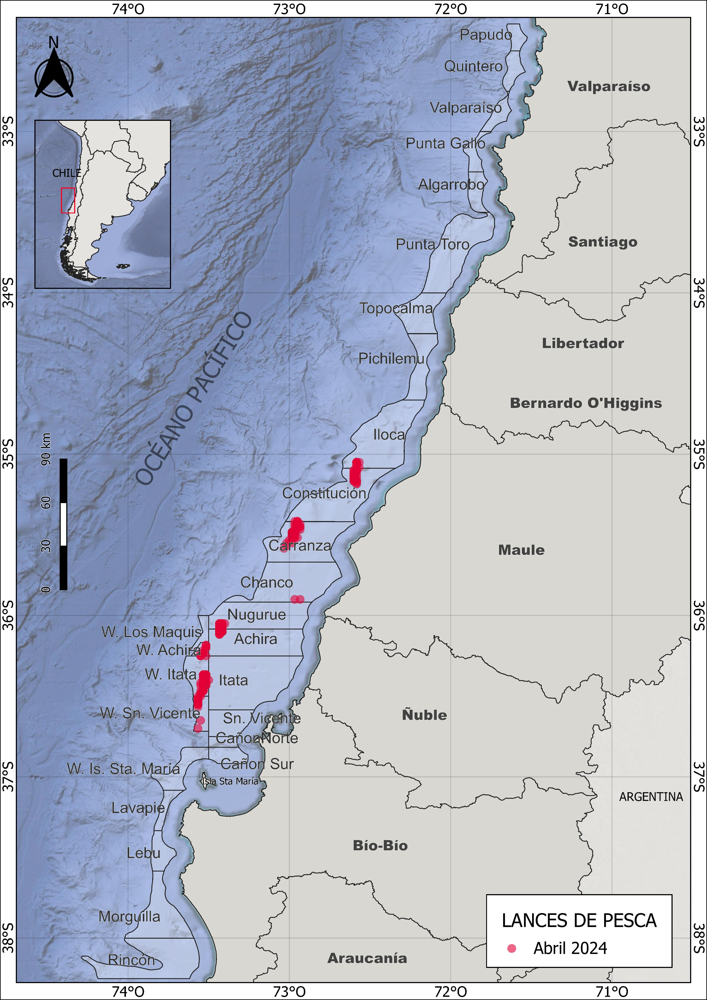
```

##### *Figura 1. Distribución espacial del total de lances de pesca realizados durante abril de 2024.*

## Captura,esfuerzo y rendimientos de pesca

En abril de 2024, los de lances de pesca estuvieron orientados a langostino colorado en el 100 % de los lances. De estos, el 22% correspondio a captura exclusiva de esta especie y el 78% restante a capturas conjuntas con langostino amarillo (Fig. 2). En cuanto a las capturas de estas especies por zonas de pesca, en todos los caladeros predominó el langostino colorado, y el langostino amarillo se presentó mayormente en caladeros al Oeste de San Vicente, Achira, Nugurue e Itata, en donde representó aproximadamente un cuarto del total extraido (Fig. 3)  

```{r echo=FALSE, out.width="50%",fig.align = 'center'}
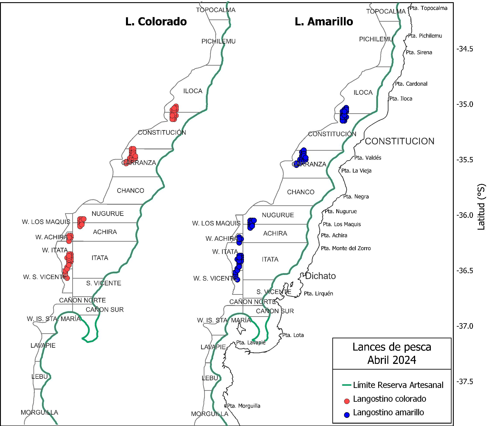
```

#####  *Figura 2. Distribución espacial de los lances de pesca orientados a langostino colorado, langostino amarillo y camarón nailon durante marzo de 2024.*

```{r echo=FALSE, out.width="50%",fig.align = 'center'}
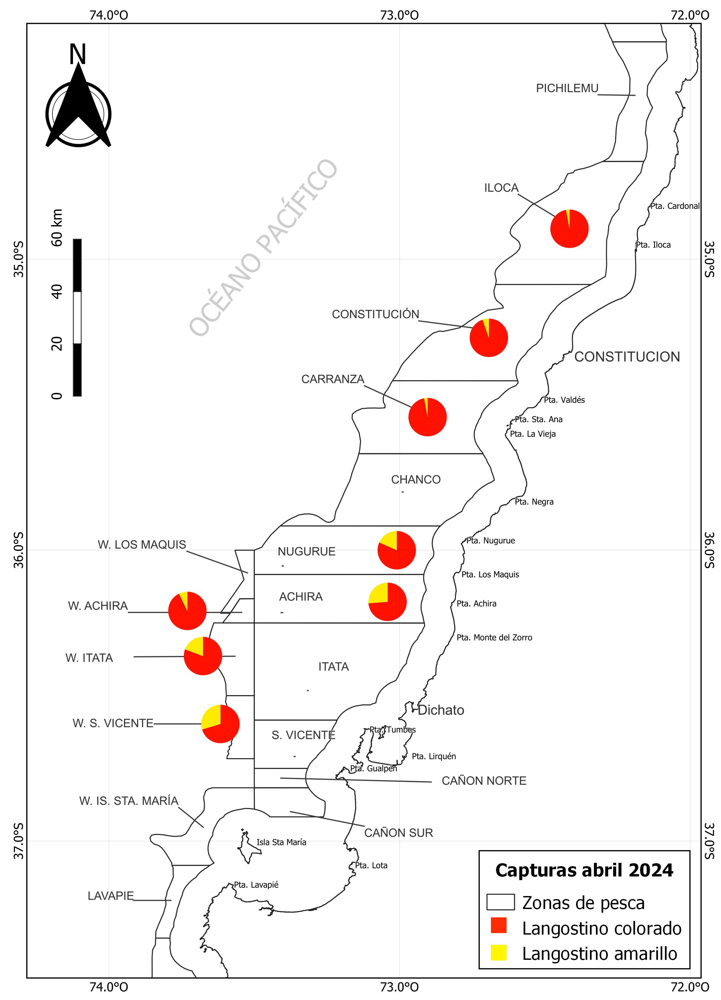
```

#####  *Figura 3. Distribución espacial de la composición de las capturas durante abril de 2024.*

Durante abril las capturas por lance de langostino colorado fluctuaron entre 16 y 14240 kg, totalizando una captura de 719014 kg. Se logró un promedio de 2605 kg por lance de pesca, desplegando 382 horas de arrastre (ha) y un rendimiento de pesca de 1879 kg/ha (Tabla 1). En cuanto a langostino amarillo se registro en 223 lances con una captura total de 106812 kg y un rendimiento de 346 kg/ha (Tabla 1).

##### *Tabla 1. Indicadores operacionales de la pesquería de langostino colorado, langostino amarillo y camarón nailon 2024.*

|**Recurso**|**Mes**|**Número de lances(n)**|**Captura(kg)**|**Captura por lances(kg/n)**|**Hora de arrastre(ha)**|**Rendimiento(kg/ha)**|**Profundidad promedio de fondo(m)**| 
|:--------:|:--------:|:-------:|:-------:|:-------:|:-------:|:------:|:--------:|
|**L.colorado**|marzo|47|107320|2283,4|53,5|2002,8|192|
|             |abril|276|719014|2605,1|382,5|1879,5|190|
|**L.amarillo**|marzo|34|29874|878,6|37,9|787,1|191|
|              |abril|223|106812|478,9|308,5|346,1|192|
|**Camarón**|marzo|132|143052|1083,7|353,6|404,4|343|

El rendimiento de pesca de langostino colorado fluctúo entre 8 y 14240 kg/ha, con una moda en 1739 kg/ha. En cambio, el esfuerzo de pesca fluctúo entre 15 y 225 minutos, con una mayor frecuencia en 1 hora 20 minutos (Fig. 4). En cuanto a langostino amarillo, presentó un rendimiento entre los 6 y 3428 kg/ha, y el esfuerzo tuvo una mayor frecuencia en 1 hora 20 min, al igual que en langostino colorado, debido a la captura conjunta de esta especie (Fig. 4).

```{r echo=FALSE, out.width="50%",fig.align = 'center'}
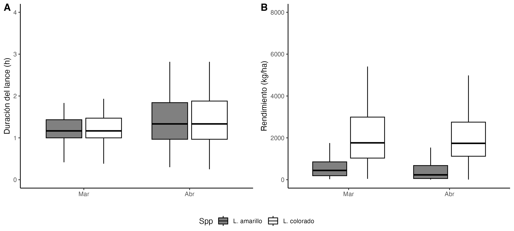
```

#####  *Figura 4. Distribución de frecuencia del esfuerzo de pesa, en términos de duración del lance en horas de arrastre (ha) (A) y del rendimiento de pesca (kg/ha) (B), de langostino colorado Y langostino amarillo durante el año 2024.*

En cuanto a la distribución espacial del rendimiento de pesca, en abril destacaron los caladeros de Achira y Nugurue con rendimientos entre los 2500 y >7500 kg/ha (Fig. 5, 6). En el caso de langostino amarillo, se capturó solo en conjunto con langostino colorado y presentó los mayores rendimientos en caladeros localizados a la cuadra del San Vicente y Nugurue, y los más bajos en Chanco y Carranza (Fig. 5, 6).

```{r echo=FALSE, out.width="50%",fig.align = 'center'}
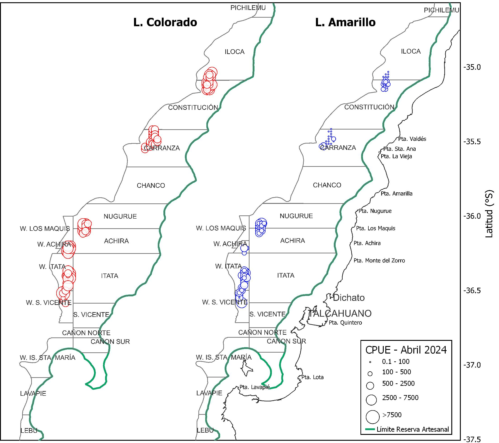
```

#####  *Figura 5. Distribución del rendimiento de pesca (kg/ha) de langostino colorado y langostino amarillo en abril de 2024.*

```{r echo=FALSE, out.width="50%",fig.align = 'center'}
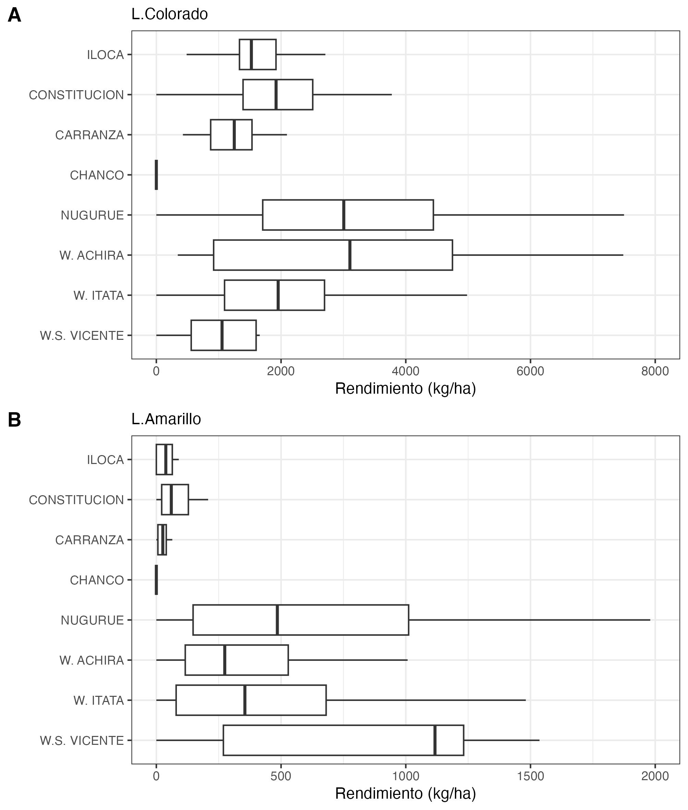
```

#####  *Figura 6. Rendimiento de pesca (captura por hora de arrastre) de langostino colorado (A) y langostino amarillo (B), en los caladeros visitados de en la unidad de pesquería sur, abril de 2024.*

# Aspectos biológicos

Los indicadores biológicos dicen relación con la talla promedio de machos y hembras, la proporción sexual, la estructura de tallas, el estado de madurez de las hembras ovígeras y la proporción de hembras ovígeras. Los datos fueron obtenidos a partir de muestreos aleatorios diarios de ejemplares capturados en zonas de pesca visitadas por la flota. El tamaño mínimo de muestra fue de 300 ejemplares, a los que se les midió la longitud del cefalotórax utilizando un pie de metro (0,01 mm de precisión). Los ejemplares además fueron pesados (0,01 gramos), indicándose si se trataba de ejemplares completos o incompletos. Se determinó el sexo, y en el caso de las hembras se registraron las hembras portadoras de huevos (ovígeras) y el estado de madurez de los huevos según escala de 4 puntos de Palma y Arana (1997).

## Proporción sexual y talla promedio

En las capturas de abril 2024, el langostino colorado presentó una proporción sexual favorable a las hembras con un aporte de 57%. En el langostino amarillo, en cambio, la diferencia fue más marcada con un aporte mayor de machos de 88% que de hembras (Fig. 7).

En cuanto a la talla media se capturó ejemplares de langostino colorado con una talla promedio entre 35 y 47 mm longitud cefalotórax (LC) con una talla mayor en machos. Al comparar las tallas medias por años de capturas en langostino colorado se observa que las tallas tienden a comenzar altas durante marzo. Sin embargo, durante este año se presentaron tallas menores y sin diferenciación entre sexos, escenario que cambia durante abril, mes en donde aumentan las tallas y se diferincian entre sexos (Fig. 8). En el langostino amarillo, los machos presentaron una talla promedio en torno a los 38 mm LC. 

##### *Tabla 2. Proporción sexual y talla promedio de langostino colorado, langostino amarillo y camarón nailon en las capturas de la UPS, 2024*

|   |**Mes**|**Sexo**|**n**|**LC(mm)**|**DE(mm)**|**Mínimo(mm)**|**Máximo(mm)**|
|----|---|----|-|------|------|----------|----------|
|**L.colorado**|marzo|hembra|606|33,4|2,42|27,4|40,3|
|         |    |macho|386|33,4|2,58|28,2|41,4|
|        |abril|hembra|2542|35,1|2,43|28,5|46,0|
|         |     |macho|1928|37,1|3,17|28,8|47,2|
|**L.amarillo**|marzo|hembra|55|30,8|2,72|25,4|38,5|
|         |    |macho|160|38,3|2,92|30,1|48,1|
|         |abril|hembra|30|33,2|2,59|29,8|39,0|
|         |    |macho|220|38,7|2,85|30,4|49,3|
|**Camarón**|marzo|hembra|1540|28,2|2,74|19,9|34,9|
|      |     |macho|957|27,7|2,81|17,3|35,3|


```{r echo=FALSE, out.width="50%",fig.align = 'center'}
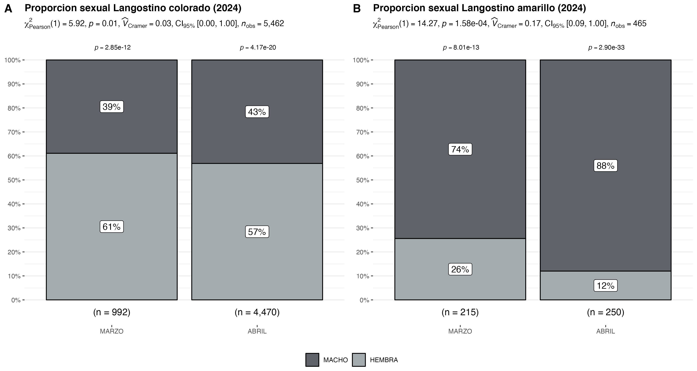
```

#####  *Figura 7. Proporción sexual de langostino colorado (A), langostino amarillo (B) y camarón nailon durante marzo de 2024*

```{r echo=FALSE, out.width="50%",fig.align = 'center'}
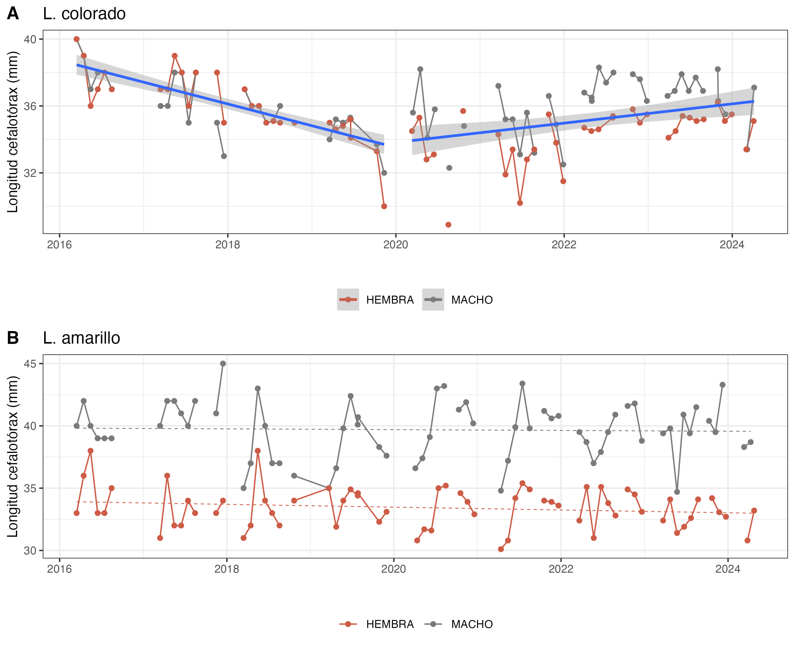
```

#####  *Figura 8. Talla promedio (LC, mm) de langostino colorado y langostino amarillo por sexo, en el periodo enero 2016 a marzo de 2024*

## Aspectos reproductivos

Durante abril del 2024, las hembras de langostino colorado se presentaron con 70% en estado ovígero, escenario que no se registraba en esta especie desde los años 2017-2019 (Fig. 9, Tabla 3). En el caso de langostino amarillo no hubo presencia de hembras en estado ovígero siguiendo la tendencia resgistrada desde el año 2017 (Fig. 9, Tabla 3). 


```{r echo=FALSE, out.width="50%",fig.align = 'center'}
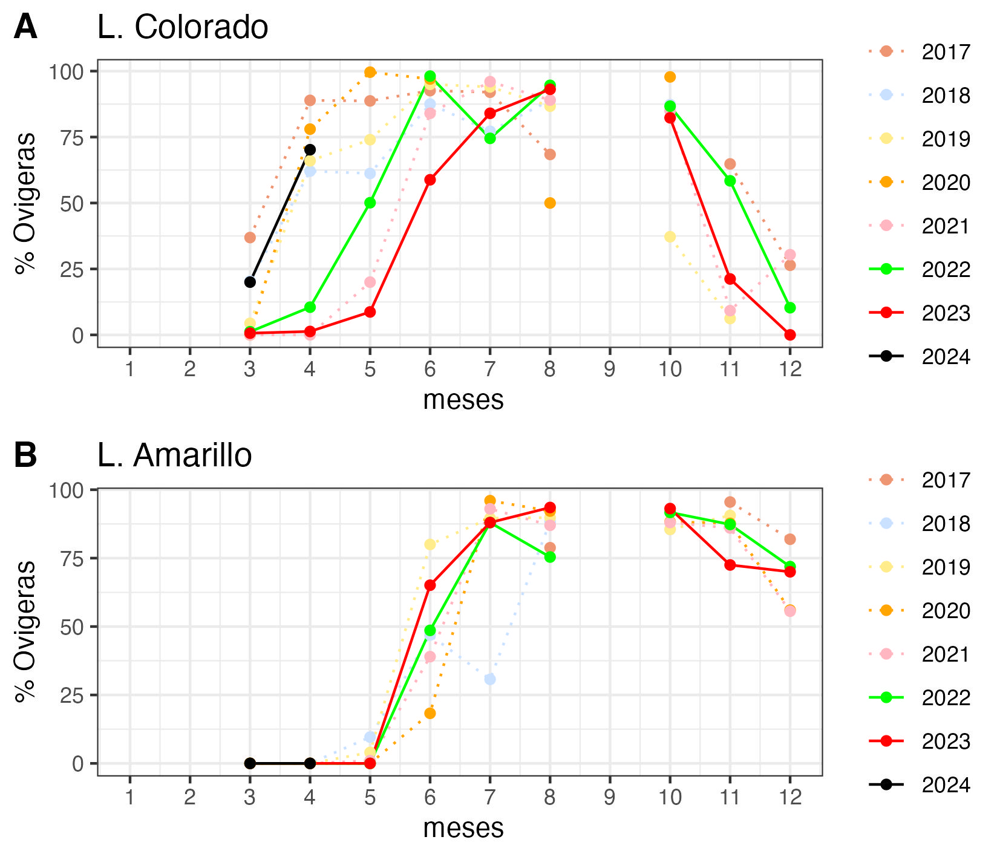
```

#####  *Figura 9. Comparación de hembras ovígeras de langostino colorado (panel superior) y langostino amarillo (panel inferior), entre los años 2017 a abril del año 2024*

##### *Tabla 2. Porcentaje de hembras ovígeras y hembras maduras de langostino colorado y amarillo UPS 2024.

|**Recurso**|**Estado**|**marzo**|**abril**|
|-------|------|-----|-----|
|**L.colorado**|Normal|80%|27%|
|          |Ovígeras|20%|70%|
|          |Madura|0%|3%|
|Total n°|       |606|2542|
|**L.amarillo**|Normal|100%|100%|
|         |Ovígeras|0%|0%|
|         |Madura|0%|0%|
|Total n°|        |55|30|


## Composición de tallas

La comparación de tallas de langostino colorado y langostino amarillo muestran diferencias significativas entre sexos (t-Student p <0,05). En el primer caso la talla media es de 35 mm en hembras y 37 mm en machos; y en el segundo, es tambien menor en hembras con 33 mm versus 39 mm en machos (Tabla 2, Figs. 10 y 12). El análisis de la composición de tallas por zonas de pesca de langostino colorado mostró tallas modales más pequeñas en el caladero de Achira; en tanto, las tallas más grandes se presentaron en Iloca y Carranza (Fig. 11). No se pudo efectuar este analisis en langostino amarillo debido a que el muestreo biologico se realizó con muestras provenientes del caladero de Tumbes (Fig. 11).

```{r echo=FALSE, out.width="50%",fig.align = 'center'}
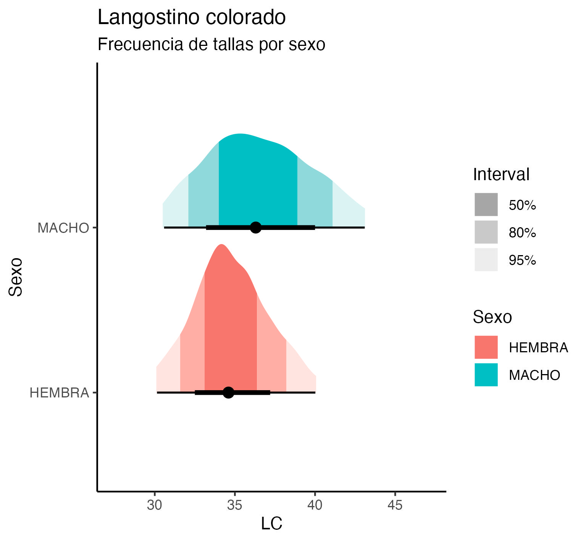
```

#####  *Figura 10. Composición de tallas de langostino colorado entre sexos, en abril de 2024*

```{r echo=FALSE, out.width="50%",fig.align = 'center'}
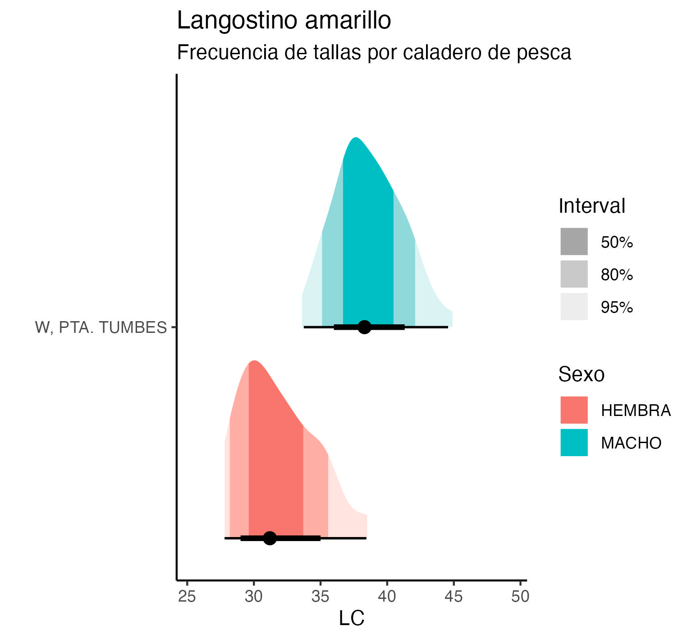
```

#####  *Figura 11. Composición de tallas de langostino amarillo entre sexos, en abril de 2024*

```{r echo=FALSE, out.width="50%",fig.align = 'center'}
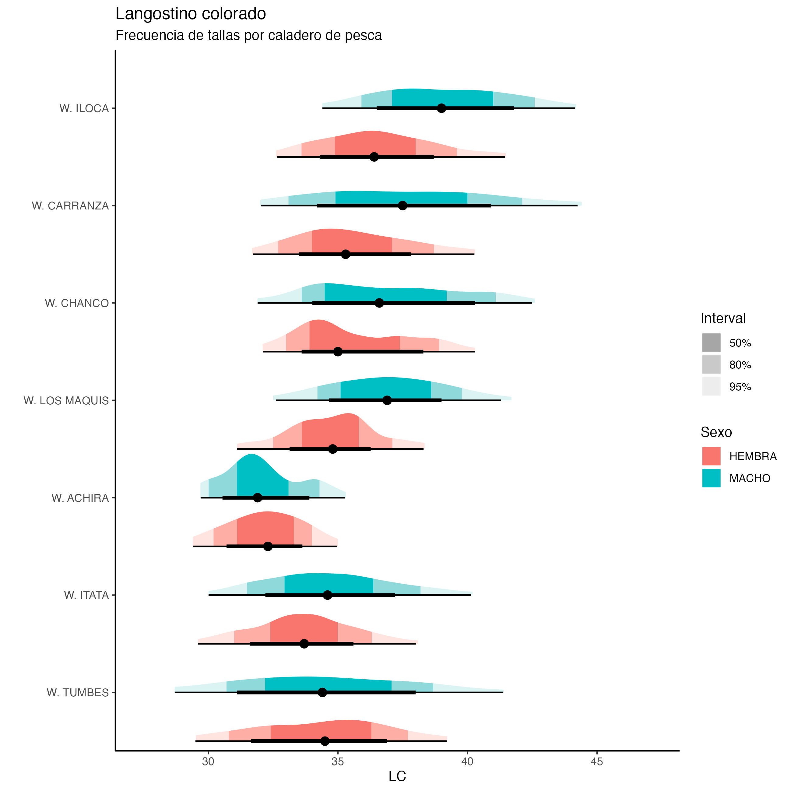
```

#####  *Figura 12. Composición de tallas de langostino colorado en la UPS por zonas de pesca en abril de 2024*


## Relación longitud-peso

La relación longitud-peso se determinó para machos y hembras, utilizando ejemplares que fueron pesados completos; es decir, con todas sus extremidades. El mejor modelo para la relación longitud-peso fue con una intersección fija y diferentes pendientes entre sexos, el peso esperado más alto a una talla determinada se presentó en machos tanto en langostino colorado como  langostino amarillo (Fig. 13).

```{r echo=FALSE, out.width="50%",fig.align = 'center'}
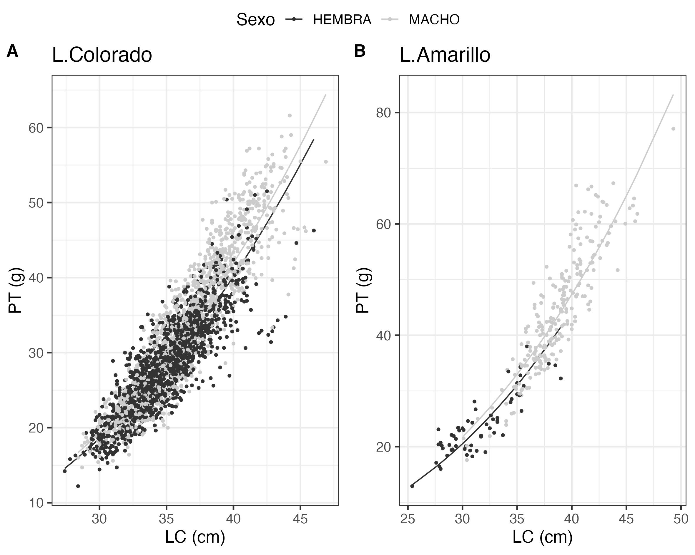
```

#####  *Figura 13. Relación longitud-peso de langostino colorado (A), langostino amarillo (B) y camarón nailon (C), por sexos, en los meses de marzo-abril 2024.*


## Fauna acompañante

Las operaciones de pesca efectuadas durante el durante abril de 2024 por la flota de Camanchaca, muestran la presencia del pejerrata en los caladeros de Nugurue, Itata y San Vicente (Fig. 14), siendo el aporte en peso de esta especie de 0,05% con 420 kg en las capturas totales de langostino colorado y langostino amarillo.

En cuanto a otros recursos presentes en la fauna acompañante de langostino colorado y amarillo, la merluza común se extrajo en los caladeros de Iloca e Itata con valores entre los 50 y 100 kg/ha. El lenguado de ojos grandes fue parte de la fauna acompañante en el caladero de Itata y San Vicente con una captura de entre 25 y 50 kg/ha (Fig. 15).

Destaca también la presencia de otros recursos como la kaiba paco y jaiba limón, pero en menor cantidad (en termino de unidades por hora de arrastre) como se muestra en la Figura 15.

```{r echo=FALSE, out.width="50%",fig.align = 'center'}
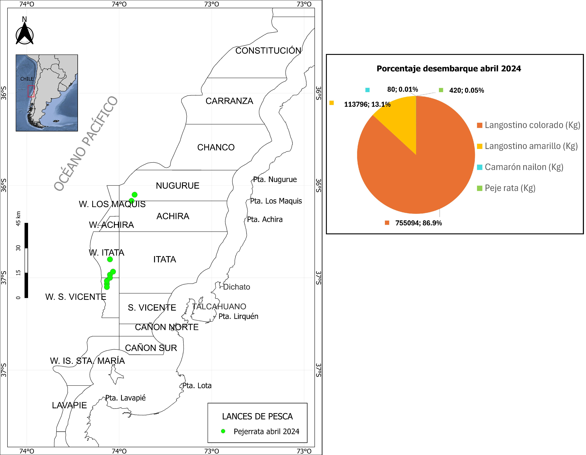
```

#####  *Figura 14. Distribución de los lances de pesca con captura de pejerrata en las capturas de  langostino colorado y langostino amarillo, y la fracción de pejerrata en las capturas totales, de abril 2024.*


```{r echo=FALSE, out.width="50%",fig.align = 'center'}
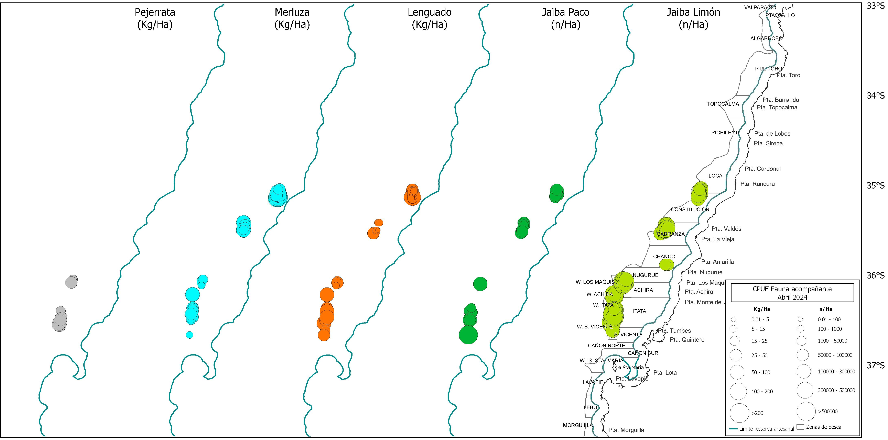
```

#####  *Figura 15. Distribución espacial y abundancia de la fauna acompañante en los lances de pesca orientados a langostinos colorado y langostinos amarillos por la flota arrastrera de Camanchaca Pesca Sur, abril 2024*


[Vuelve a página incial](https://luisacubillos.github.io/Indicadores_camanchaca/)


