```{r setup, include=FALSE}
knitr::opts_chunk$set(echo = TRUE)
```

[Vuelve a página incial](https://luisacubillos.github.io/Indicadores_camanchaca/)


# Resumen

En mayo, la captura se realizó desde la región del Biobío a la región de Maule, y fue dirigida a langostino colorado con 250 lances de pesca, lográndose una captura total de 797 ton. En tanto, langostino amarillo se presentó en 101 lances de pesca solo en conjunto con langostino colorado y  alcanzó una captura total de 38 ton. Durante este mes también se capturó camarón nailon solo en el caladero de Chanco logrando una captura de 51 ton., en 30 lances de pesca.

En cuanto al rendimiento de pesca en promedio este fue mayor en langostino colorado  y se presentó en la cuadra de Iloca y Nugurue, en el caso de langostino amarillo su mejor rendimiento fue en los caladeros de Nugurue e Itata. 

En cuanto a la proporción sexual en langostino colorado fue favorable a las hembras con un aporte de 61%, al igual que en camarón nailon con un 60%. 

En langostino colorado hubo presencia de un 84% de hembras en estado ovígero, lo que indica un adelanto de su actividad reproductiva en dos meses en relación al periodo pasado. A su vez los indicadores biológicos muestras un aumento en las tallas medias a cifras no registradas desde el año 2017, con 37 mm LC en hembras y 39 mm en machos.


# Aspectos Pesqueros
## Actividad pesquera

Las operaciones de pesca realizadas durante mayo cubrieron los caladeros ubicados desde la región del Bío-Bío a la región de Maule, destacando los caladeros de Iloca, Nugurue, Achira y el W. de Itata (Fig. 1). 

```{r echo=FALSE, out.width="50%",fig.align = 'center'}
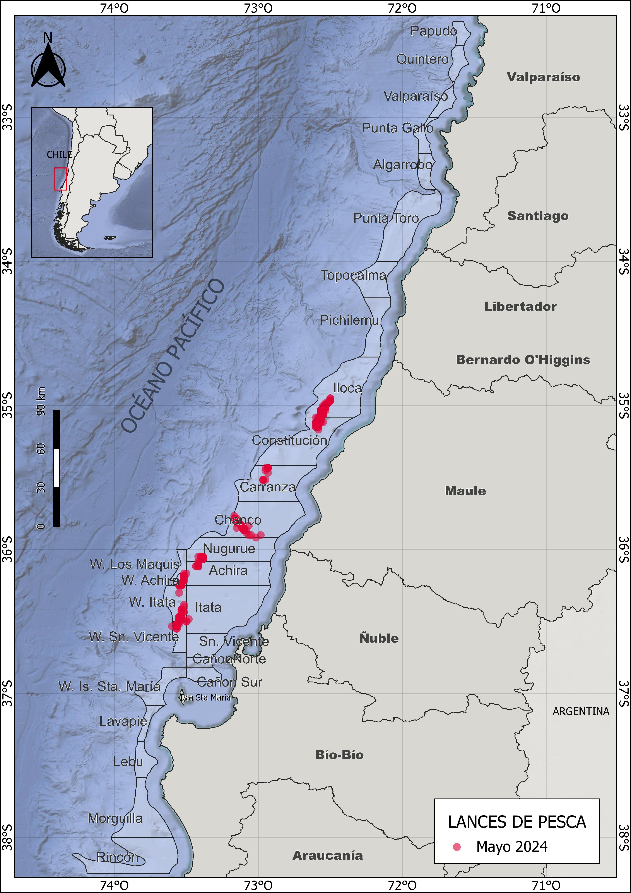
```

##### *Figura 1. Distribución espacial del total de lances de pesca realizados durante mayo de 2024.*

## Captura,esfuerzo y rendimientos de pesca

En abril de mayo, los de lances de pesca estuvieron orientados a langostino colorado en el 89 % de los lances, de los cuales el 54% correspondió a captura exclusiva de esta especie y el 35% restante a capturas conjuntas con langostino amarillo, el otro 30% correspondió a la captura de camarón nailon en la cuadra de Chanco (Fig. 2). En cuanto a las capturas de estas especies por zonas de pesca en todos los caladeros (exceptuando chanco), predominó el langostino colorado, y el langostino amarillo se presentó mayormente en el W. de Itata y el W. de San Vicente, en donde represento aproximadamente un cuarto del total extraído (Fig. 3).  

```{r echo=FALSE, out.width="50%",fig.align = 'center'}
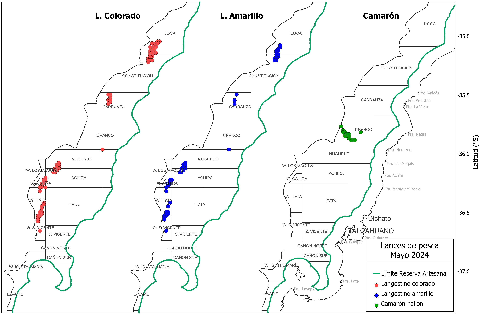
```

#####  *Figura 2. Distribución espacial de los lances de pesca orientados a langostino colorado, langostino amarillo y camarón nailon durante mayo de 2024.*

```{r echo=FALSE, out.width="50%",fig.align = 'center'}
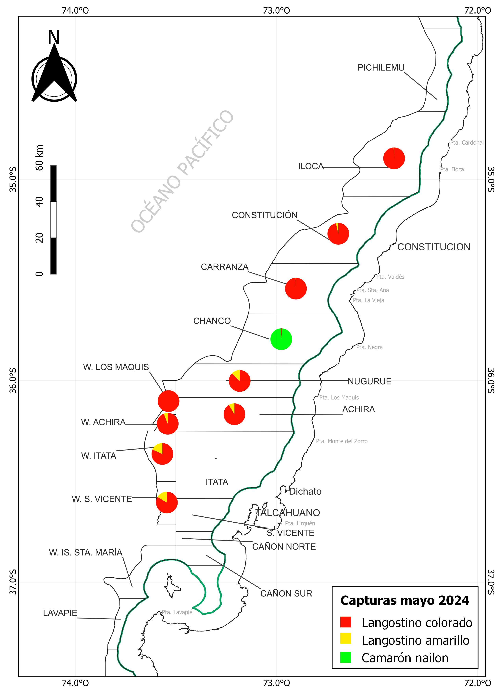
```

#####  *Figura 3. Distribución espacial de la composición de las capturas durante mayo de 2024.*

Durante mayo las capturas por lance de langostino colorado fluctuaron entre 16 y 10100 kg, totalizando una captura de 797 ton. Se logró un promedio de 3190 kg por lance de pesca, desplegando 451 horas de arrastre (ha) y un rendimiento de pesca de 1769 kg/ha (Tabla 1).
En cuanto a langostino amarillo se registró en 101 lances con una captura total de 38 ton. y un rendimiento de 223 kg/ha, por último, el camarón nailon registro solo en 30 lances y alcanzó una captura de 51 ton (Tabla 1).


##### *Tabla 1. Indicadores operacionales de la pesquería de langostino colorado, langostino amarillo y camarón nailon 2024.*

|**Recurso**|**Mes**|**Número de lances(n)**|**Captura(kg)**|**Captura por lances(kg/n)**|**Hora de arrastre(ha)**|**Rendimiento(kg/ha)**|**Profundidad promedio de fondo(m)**| 
|:--------:|:--------:|:-------:|:-------:|:-------:|:-------:|:------:|:--------:|
|**L.colorado**|marzo|47|107320|2283,4|53,5|2002,8|192|
|             |abril|276|719014|2605,1|382,5|1879,5|190|
|             |mayo|250|797434|3190|451|1769|168|
|**L.amarillo**|marzo|34|29874|878,6|37,9|787,1|191|
|              |abril|223|106812|478,9|308,5|346,1|192|
|              |mayo|101|38540|382|172|223|176|
|**Camarón**|marzo|132|143052|1083,7|353,6|404,4|343|
|           |mayo|30|51236|1708|52|994|317|

El rendimiento de pesca de langostino colorado fluctúo entre 32 y 6336 kg/ha, con una moda en 1753 kg/ha. En cambio, el esfuerzo de pesca fluctúo entre 16 y 204 minutos, con una mayor frecuencia en 1 hora 57 minutos (Fig. 4). En cuanto a langostino amarillo, presentó un rendimiento entre los 6 y 3520 kg/ha, y el esfuerzo tuvo una mayor frecuencia en 1 hora 40 min, similar a langostino colorado, debido a la captura conjunta de esta especie (Fig. 4). Por último, el camarón nailon los rendimientos se presentaron entre los 99 y 1992 kg/ha, y el esfuerzo presentó una mayor frecuencia en 1 hora 48 minutos (Fig. 4).

```{r echo=FALSE, out.width="50%",fig.align = 'center'}
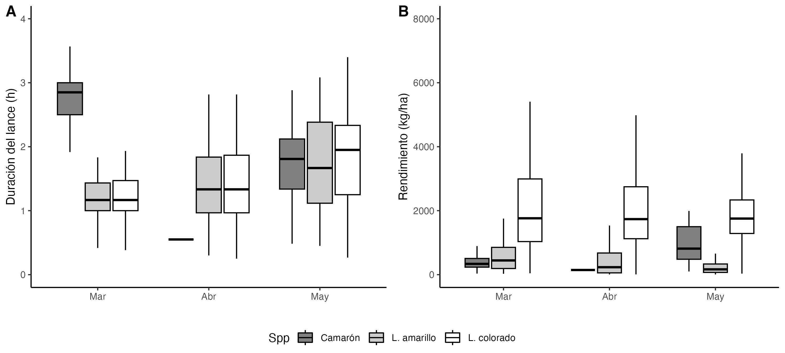
```

#####  *Figura 4. Distribución de frecuencia del esfuerzo de pesca, en términos de duración del lance en horas de arrastre (ha) (A) y del rendimiento de pesca (kg/ha) (B), de langostino colorado, langostino amarillo y camarón nailon durante el año 2024.*

En cuanto a la distribución espacial del rendimiento de pesca durante el mes de mayo destacaron los caladeros de Iloca y Nugurue con rendimientos entre los 2500 y >7500 kg/ha (Fig. 5, 6). En el caso de langostino amarillo durante mayo, se capturó solo en conjunto con langostino colorado y presentó los mayores rendimientos en la cuadra de Itata y Nugurue, y los más bajos en Iloca, Carraza, Chanco y los Maquis (Fig. 5, 6).

```{r echo=FALSE, out.width="50%",fig.align = 'center'}
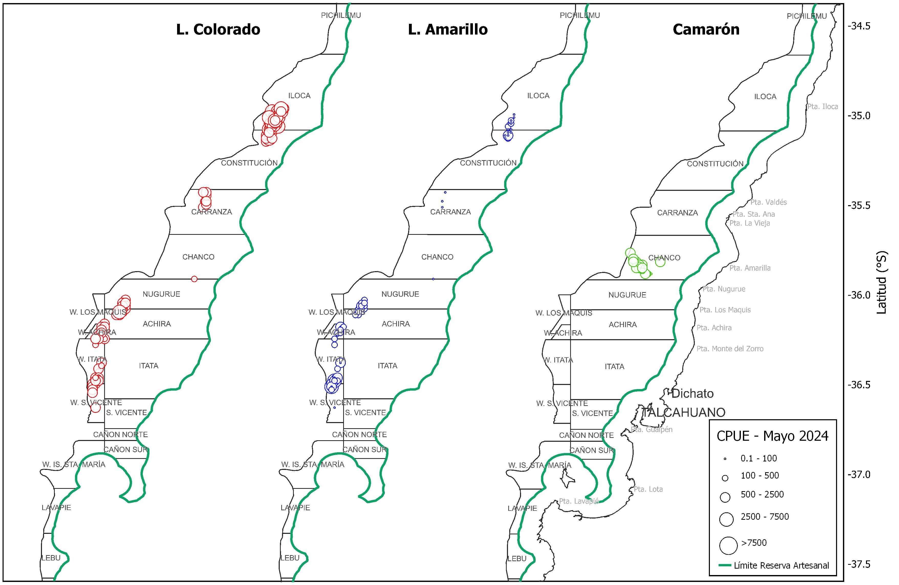
```

#####  *Figura 5. Distribución del rendimiento de pesca (kg/ha) de langostino colorado, langostino amarillo y camarón nailon en mayo de 2024.*

```{r echo=FALSE, out.width="50%",fig.align = 'center'}
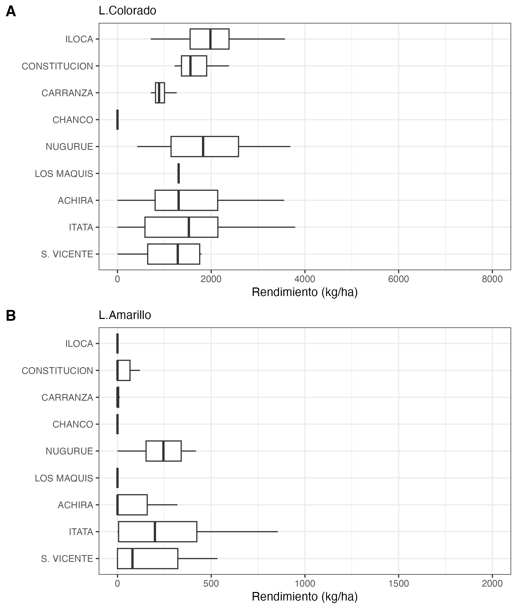
```

#####  *Figura 6. Rendimiento de pesca (captura por hora de arrastre) de langostino colorado (A) y langostino amarillo (B), en los caladeros visitados de en la unidad de pesquería sur, mayo de 2024.*

# Aspectos biológicos
Los indicadores biológicos dicen relación con la talla promedio de machos y hembras, la proporción sexual, la estructura de tallas, el estado de madurez de las hembras ovígeras y la proporción de hembras ovígeras. Los datos fueron obtenidos a partir de muestreos aleatorios diarios de ejemplares capturados en zonas de pesca visitadas por la flota. El tamaño mínimo de muestra fue de 300 ejemplares, a los que se les midió la longitud del cefalotórax utilizando un pie de metro (0,01 mm de precisión). Los ejemplares además fueron pesados (0,01 gramos), indicándose si se trataba de ejemplares completos o incompletos. Se determinó el sexo, y en el caso de las hembras se registraron las hembras portadoras de huevos (ovígeras) y el estado de madurez de los huevos según escala de 4 puntos de Palma y Arana (1997).

## Proporción sexual y talla promedio

En las capturas de mayo 2024, el langostino colorado presentó una proporción sexual favorable a las hembras con un aporte de 61%, en langostino amarillo no se realizó muestreo biológico este mes, por lo que no se pudo realizar el análisis biológico, y en cuanto a camarón nailon la proporción sexual fue favorable a las hembras en un 60% al igual que en el mes de marzo (Fig. 7).

En cuanto a la talla media se capturó ejemplares de langostino colorado con una talla promedio entre 28 y 46 mm longitud cefalotórax (LC) con una talla mayor en machos. Al comparar las tallas medias por años de captura en langostino colorado se observa que las tallas tienden a comenzar altas durante marzo, sin embargo durante este año se presentan tallas menores y sin diferenciación entre sexos, escenario que cambia durante abril, mes en donde aumentan las tallas y se diferencian entre sexos y continúan al alza en mayo, registrándose en promedio las mayores tallas en ambos sexos,  no observadas desde el año 2017 (Fig. 8).
En camarón nailon las hembras presentaron una mayor talla media en torno a los 28 mm LC, y los machos 25 mm, tallas menores a las que se presentaron en marzo del presente año.

##### *Tabla 2. Proporción sexual y talla promedio de langostino colorado, langostino amarillo y camarón nailon en las capturas de la UPS, 2024*

|   |**Mes**|**Sexo**|**n**|**LC(mm)**|**DE(mm)**|**Mínimo(mm)**|**Máximo(mm)**|
|----|---|----|-|------|------|----------|----------|
|**L.colorado**|marzo|hembra|606|33,4|2,42|27,4|40,3|
|         |    |macho|386|33,4|2,58|28,2|41,4|
|        |abril|hembra|2542|35,1|2,43|28,5|46,0|
|         |     |macho|1928|37,1|3,17|28,8|47,2|
|         |mayo|hembras|2588|37,1|2,16|29,0|44,7|
|         |    |macho|1662|39,3|2,67|28,5|46,3|
|**L.amarillo**|marzo|hembra|55|30,8|2,72|25,4|38,5|
|         |    |macho|160|38,3|2,92|30,1|48,1|
|         |abril|hembra|30|33,2|2,59|29,8|39,0|
|         |    |macho|220|38,7|2,85|30,4|49,3|
|**C.nailon**|marzo|hembra|1540|28,2|2,74|19,9|34,9|
|      |     |macho|957|27,7|2,81|17,3|35,3|
|           |mayo|hembra|302|28,6|2,91|17,0|35,4|
|           |   |macho|198|25,1|3,54|14,9|33,3|


```{r echo=FALSE, out.width="50%",fig.align = 'center'}
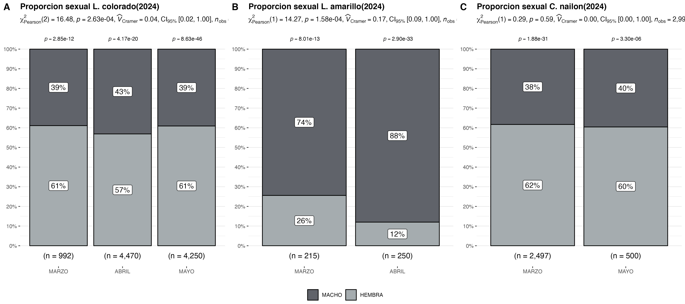
```

#####  *Figura 7. Proporción sexual de langostino colorado (A), langostino amarillo (B) y camarón nailon, en el periodo marzo a mayo 2024*

```{r echo=FALSE, out.width="50%",fig.align = 'center'}
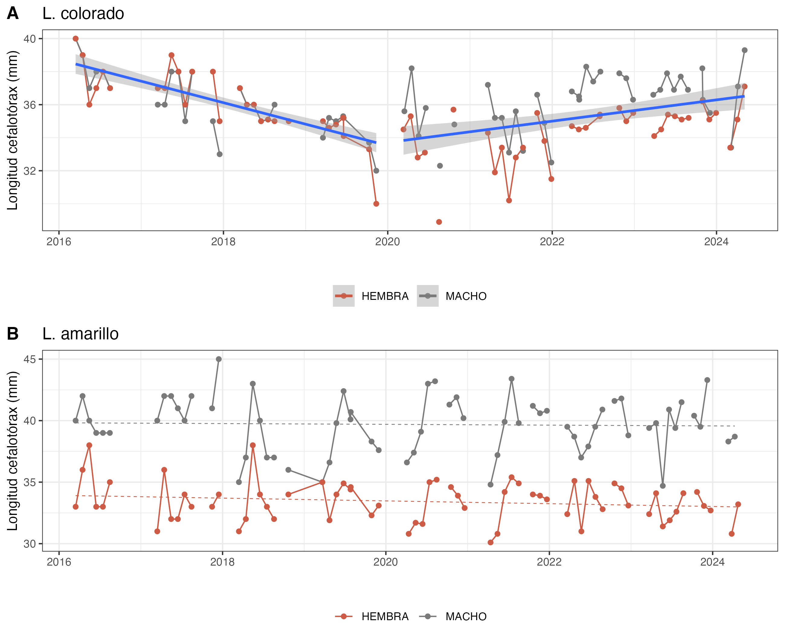
```

#####  *Figura 8. Talla promedio (LC, mm) de langostino colorado y langostino amarillo por sexo, en el periodo enero 2016 a mayo de 2024*

## Aspectos reproductivos

Las hembras de langostino colorado durante mayo de 2024 presentaron un 84% en estado ovígero, adelantando su periodo reproductivo en dos meses en relación a la temporada pasada (Fig.9, Tabla 3). En el caso de camarón nailon hubo presencia un 81% de hembras portadoras, contrario a lo que se presentó en marzo en donde el 93% no portaban huevos (Fig.9, Tabla 3). 


```{r echo=FALSE, out.width="50%",fig.align = 'center'}
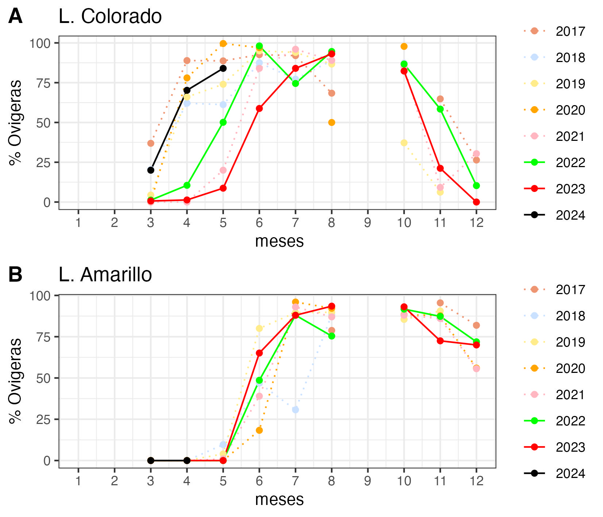
```

#####  *Figura 9. Comparación de hembras ovígeras de langostino colorado (panel superior) y langostino amarillo (panel inferior), entre los años 2017 a mayo del año 2024*

##### *Tabla 2. Porcentaje de hembras ovígeras y hembras maduras de langostino colorado, amarillo y camarón nailon UPS 2024.

|**Recurso**|**Estado**|**marzo**|**abril**|**mayo**|
|-------|------|-----|-----|---------|
|**L.colorado**|Normal|80%|27%|10%|
|          |Ovígeras|20%|70%|84%|
|          |Madura|0%|3%|6%|
|Total n°|       |606|2542|2588|
|**L.amarillo**|Normal|100%|100%|-|
|         |Ovígeras|0%|0%|-|
|         |Madura|0%|0%|-|
|Total n°|        |55|30|-|
|**C.nailon**|No portadora|93%|-|19%|
|           |Portadora|7%|-|81%|
|Total n°|  |1540|-|302|

## Composición de tallas

La comparación de tallas de langostino colorado y camarón nailon muestran diferencias significativas entre sexos (t-Student p <0,05), en el primer caso la talla media es de 37 mm en hembras y 39 mm en machos y en el segundo es mayor en hembras con 29 mm versus 25 mm en machos (Tabla 2, Fig. 10, 12). El análisis de la composición de tallas por zonas de pesca de langostino colorado mostró las tallas modales más pequeñas en los caladeros de Dichato y Tumbes, en tanto las tallas más grandes se presentaron en Iloca y Constitución (Fig. 11), no se pudo efectuar este análisis en camarón nailon debido a que las muestras provienen solo del caladero de Chanco (Fig. 11).

```{r echo=FALSE, out.width="50%",fig.align = 'center'}
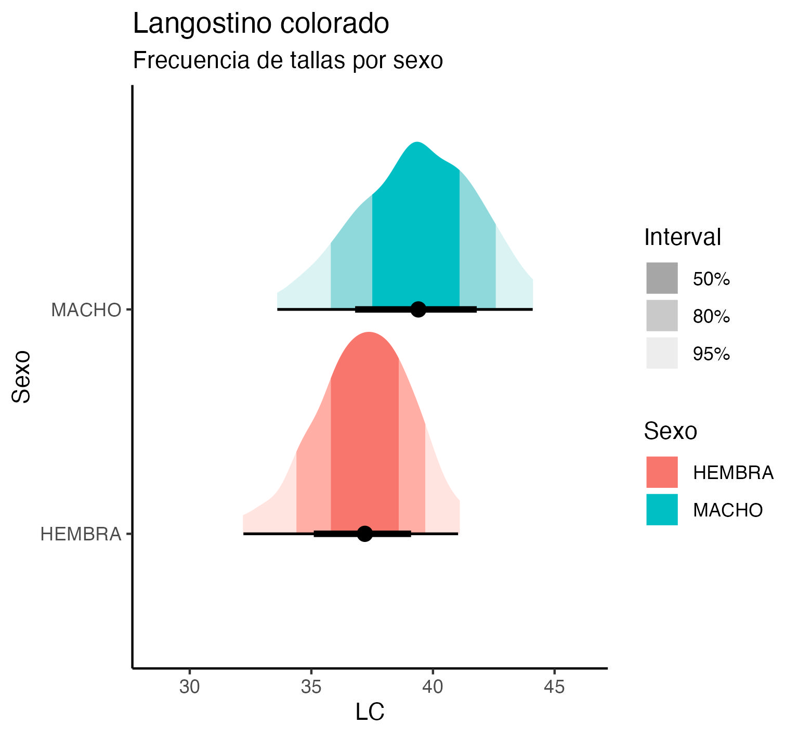
```

#####  *Figura 10. Composición de tallas de langostino colorado entre sexos, en mayo de 2024*

```{r echo=FALSE, out.width="50%",fig.align = 'center'}
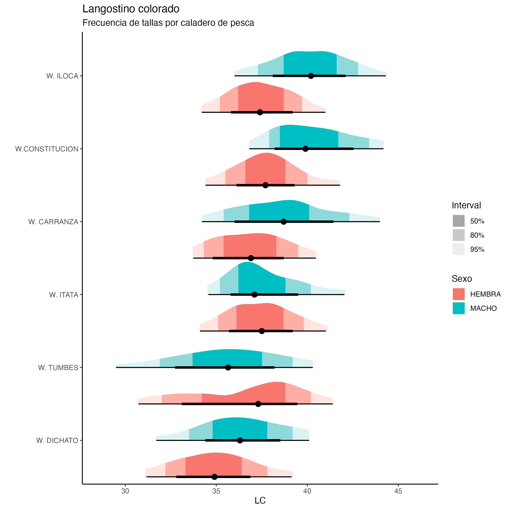
```

#####  *Figura 11. Composición de tallas de langostino colorado entre caladeros, en mayo de 2024*

```{r echo=FALSE, out.width="50%",fig.align = 'center'}
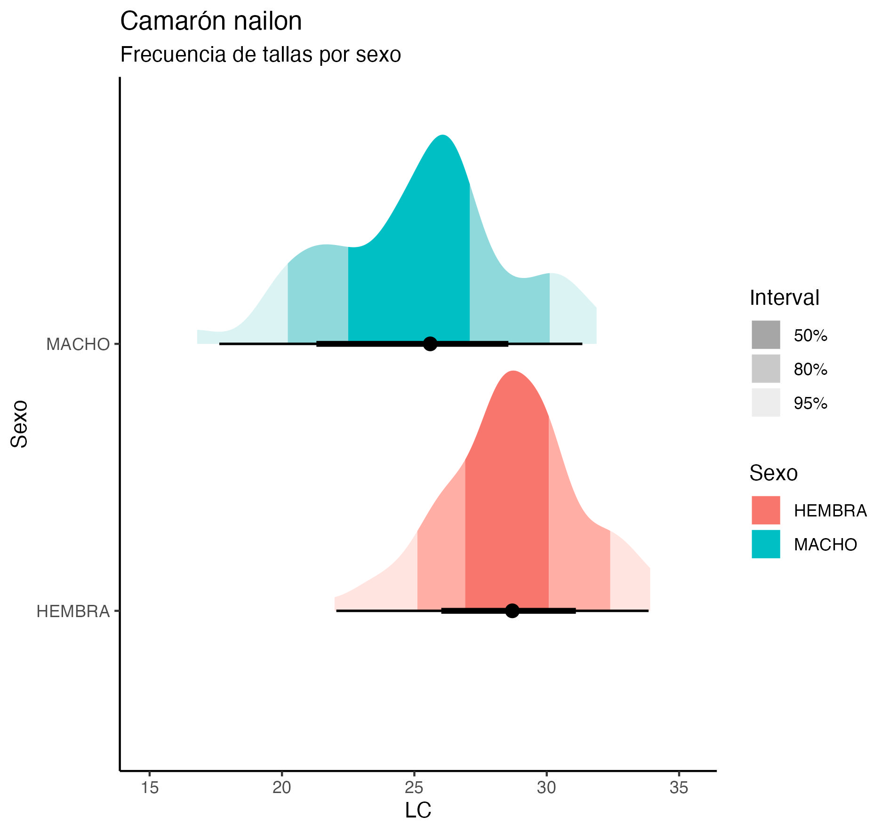
```

#####  *Figura 12. Composición de tallas de camarón nailon entre sexos, en mayo de 2024*


## Relación longitud-peso

Con el objeto de comparar la relación longitud-peso entre machos y hembras, se utilizó ejemplares que fueron pesados completos, es decir, con todas sus extremidades. El mejor modelo para la relación longitud-peso fue con una intersección fija y diferentes pendientes entre sexos, el peso esperado más alto a una talla determinada se presentó en machos en langostino colorado, y en las hembras en camarón nailon (Fig. 13).

```{r echo=FALSE, out.width="50%",fig.align = 'center'}
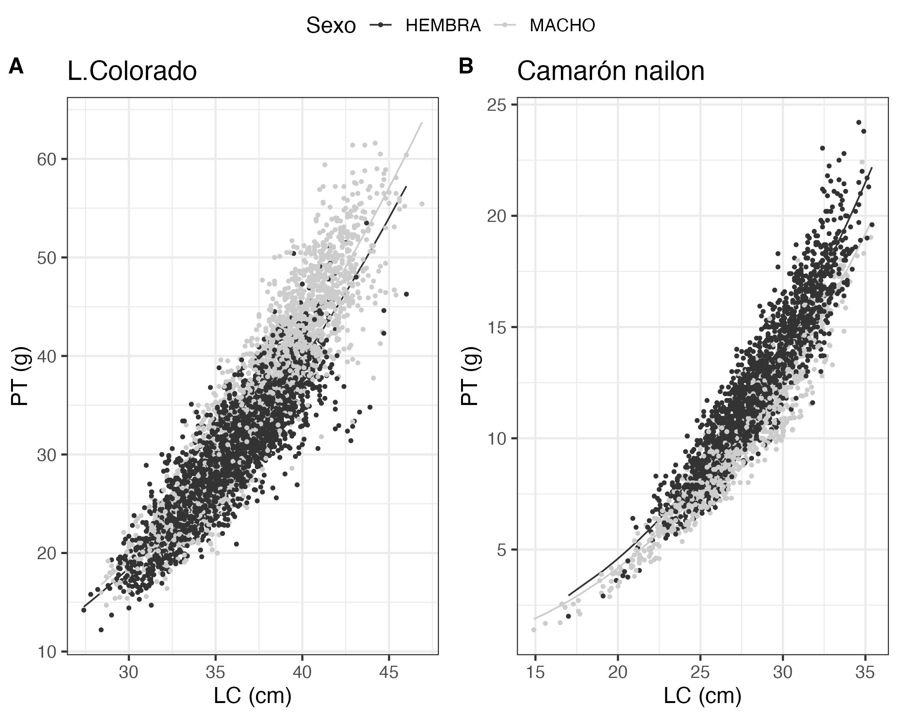
```

#####  *Figura 13. Relación longitud-peso de langostino colorado (A) y camarón nailon (B), por sexos, en los meses de marzo-mayo 2024.*


## Fauna acompañante

Las operaciones de pesca efectuadas durante el durante abril de 2024 por la flota de Camanchaca Pesca Sur, muestran la presencia del pejerrata en los caladeros de Chanco e Itata (Fig. 14), siendo la ocurrencia de esta especie, del total de las operaciones de pesca sobre langostino colorado y langostino amarillo, un 0,28% con 2513 kg. 

En cuanto a la ocurrencia de otros recursos como fauna acompañante de langostino colorado y amarillo destaca la merluza en los caladeros de Iloca, Chanco, Carranza, Achira e Itata con valores entre los 15 y 100 kg/ha y el Lenguado en el caladero de Itata y San Vicente con una captura de entre 50 y 100 kg/ha (Fig. 15).
También hay presencia de otros recursos como la Jaiba Paco y Jaiba Limón pero en menor cantidad (en termino de unidades por hora de arrastre) como se muestra en la Figura 15.

```{r echo=FALSE, out.width="50%",fig.align = 'center'}
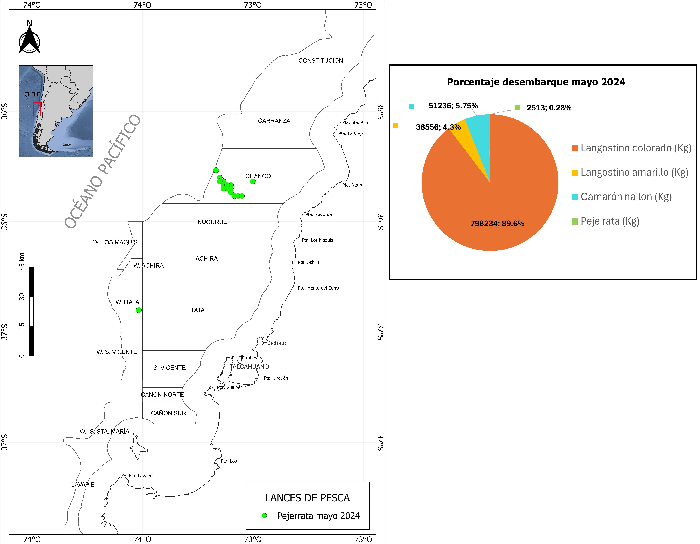
```

#####  *Figura 14. Distribución de los lances de pesca con captura de pejerrata en las capturas de  langostino colorado y langostino amarillo, y la fracción de pejerrata en las capturas totales, de mayo 2024.*


```{r echo=FALSE, out.width="50%",fig.align = 'center'}
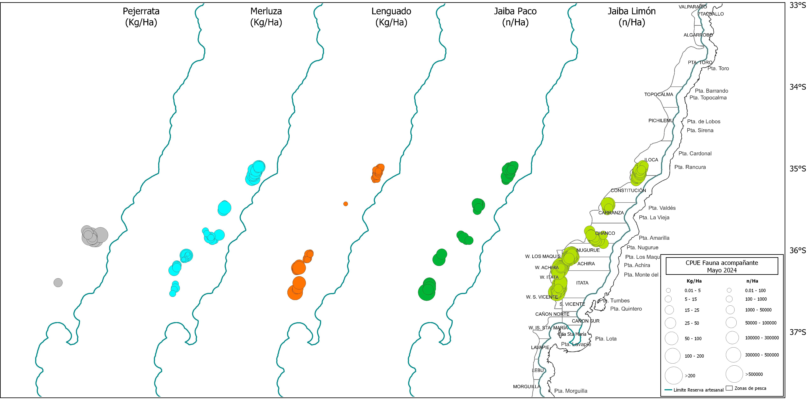
```

#####  *Figura 15. Distribución espacial y abundancia de la fauna acompañante en los lances de pesca orientados a langostinos colorado y langostinos amarillos por la flota arrastrera de Camanchaca Pesca Sur, mayo 2024*


