```{r setup, include=FALSE}
knitr::opts_chunk$set(echo = TRUE)
```

[Vuelve a página incial](https://luisacubillos.github.io/Indicadores_camanchaca/)


# Resumen

En junio, las capturas se realizaron sobre la plataforma continental y talu superior de la región del Biobío a la región de Valparaíso. La pesca fue dirigida a langostino colorado con 150 lances de pesca, lográndose una captura total de 508 ton. En tanto, langostino amarillo se presentó en 68 lances de pesca de los cuales el 98% fue en conjunto con langostino colorado alcanzando una captura total de 15 ton. 

En cuanto al rendimiento de pesca en promedio este fue mayor en langostino colorado  y se presentó en la cuadra de Algarrobo. e Iloca, en el caso de langostino amarillo su mejor rendimiento fue en el caladero de Pta. Toro. 

En cuanto a la proporción sexual, en langostino colorado fue favorable a las hembras con un aporte de 70%, de las cuales 82% se presentaron en estado ovígero. Se ratifica un adelanto de la actividad reproductiva en dos meses en relación al año anterior. A su vez los indicadores biológicos muestras un leve descenso en las tallas medias de langostino colorado en relación al mes anterior. Sin embargo las tallas promedio siguen siendo grandes, por sobre 35 mm LC.


# Aspectos Pesqueros

## Actividad pesquera

Las operaciones de pesca realizadas durante junio cubrieron los caladeros ubicados desde la región del Biobío a la región de Valparaíso, destacando los caladeros de Algarrobo, Iloca, Carranza, Nugurue, Achira e Itata (Fig. 1). 

```{r echo=FALSE, out.width="50%",fig.align = 'center'}
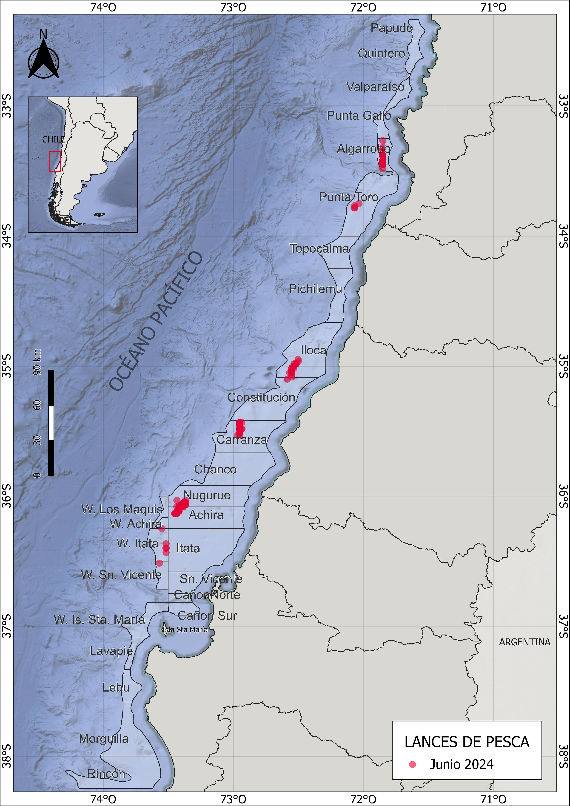
```

##### *Figura 1. Distribución espacial del total de lances de pesca realizados durante junio de 2024.*

## Captura,esfuerzo y rendimientos de pesca

En junio, los de lances de pesca estuvieron orientados a langostino colorado en el 98 % de los lances, de los cuales el 56% correspondió a captura exclusiva de esta especie y el 42% restante a capturas conjuntas con langostino amarillo, el otro 2% correspondió a la captura exclusiva de langostino amarillo (Fig. 2). En cuanto a las capturas de estas especies por zonas de pesca en todos los caladeros (exceptuando el W. de San Vicente), predominó el langostino colorado, y el langostino amarillo se presentó mayormente el W. de San Vicente y Punta Toro, en donde representó entre un 100% y un 45%  del total extraído (Fig. 3).  

```{r echo=FALSE, out.width="80%",fig.align = 'center'}
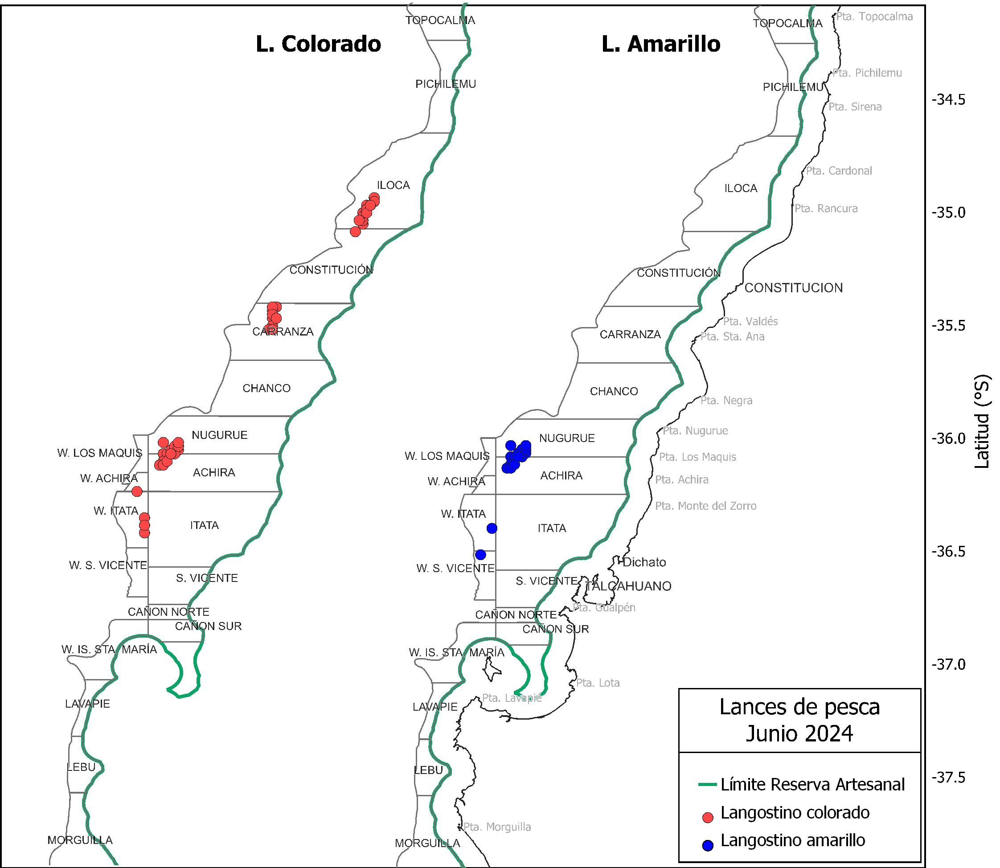
```

#####  *Figura 2. Distribución espacial de los lances de pesca orientados a langostino colorado y langostino amarillo durante junio de 2024.*

```{r echo=FALSE, out.width="70%",fig.align = 'center'}
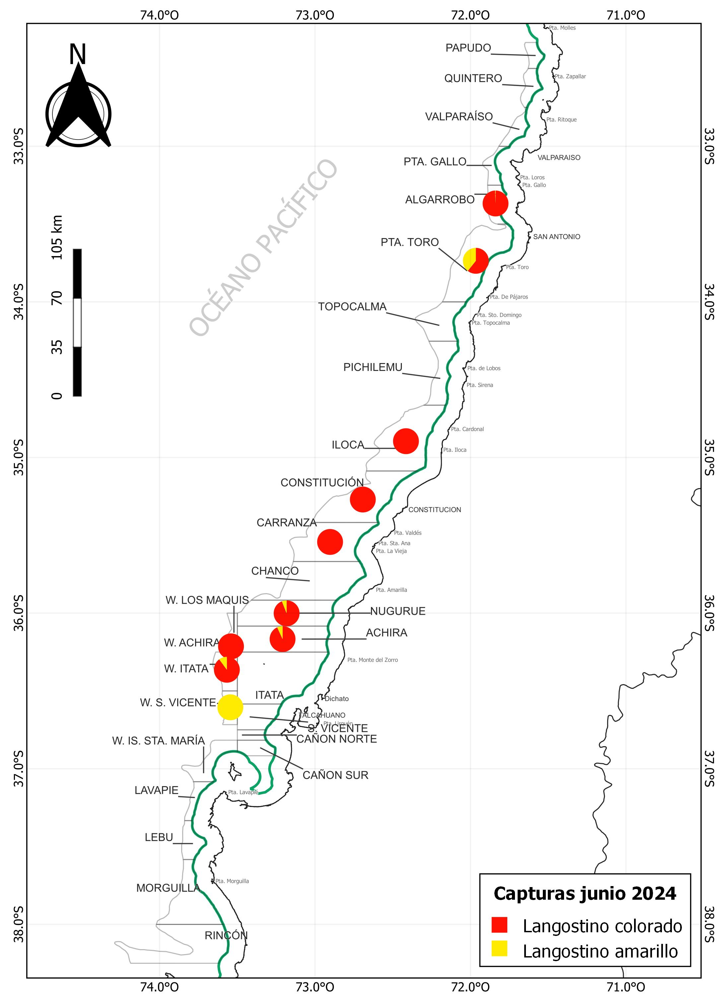
```

#####  *Figura 3. Distribución espacial de la composición de las capturas durante junio de 2024.*

Durante junio las capturas por lance de langostino colorado totalizaron 508 ton. Se logró un promedio de 3390 kg por lance de pesca, desplegando 305 horas de arrastre (ha) y un rendimiento de pesca de 1667 kg/ha (Tabla 1).
En cuanto a langostino amarillo se registró en 68 lances con una captura total de 15 ton. y un rendimiento de 227 kg/ha. (Tabla 1).


##### *Tabla 1. Indicadores operacionales de la pesquería de langostino colorado, langostino amarillo 2024.*

|**Recurso**|**Mes**|**Número de lances(n)**|**Captura(kg)**|**Captura por lances(kg/n)**|**Hora de arrastre(ha)**|**Rendimiento(kg/ha)**|**Profundidad promedio de fondo(m)**| 
|:--------:|:--------:|:-------:|:-------:|:-------:|:-------:|:------:|:--------:|
|**L.colorado**|marzo|47|107320|2283,4|53,5|2002,8|192|
|             |abril|276|719014|2605,1|382,5|1879,5|190|
|             |mayo|250|797434|3190|451|1769|168|
|             |junio|150|508506|3390|305|1667|163|
|**L.amarillo**|marzo|34|29874|878,6|37,9|787,1|191|
|              |abril|223|106812|478,9|308,5|346,1|192|
|              |mayo|101|38540|382|172|223|176|
|              |junio|68|15422|227|146|106|165|
|**Camarón**|marzo|132|143052|1083,7|353,6|404,4|343|
|           |mayo|30|51236|1708|52|994|317|

El rendimiento de pesca de langostino colorado fluctúo entre 137 y 4322 kg/ha, con una moda en 1723 kg/ha. En cambio, el esfuerzo de pesca fluctúo entre 35 y 203 minutos, con una mayor frecuencia en 2 horas (Fig. 4). En cuanto a langostino amarillo, presentó un rendimiento entre los 11 y 2024 kg/ha, y el esfuerzo tuvo una mayor frecuencia en 2 hora 12 min, similar a langostino colorado, debido a la captura conjunta de esta especie (Fig. 4). 

```{r echo=FALSE, out.width="80%",fig.align = 'center'}
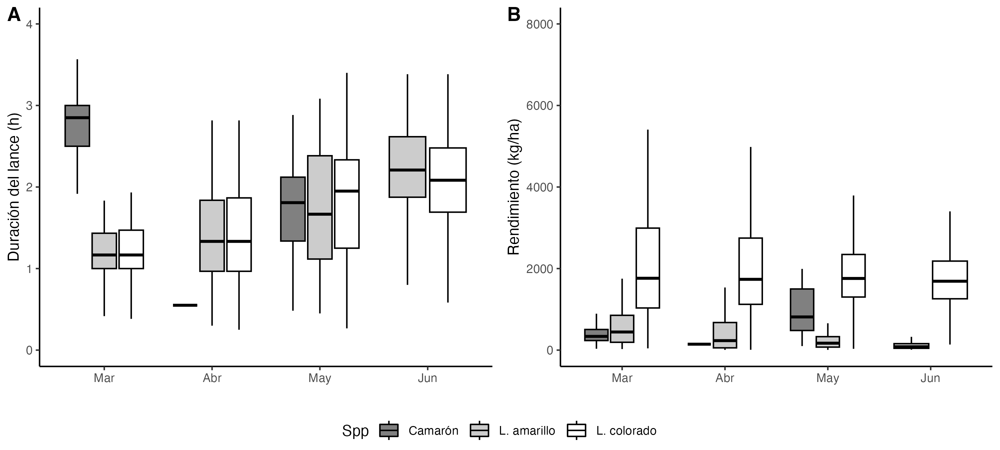
```

#####  *Figura 4. Distribución de frecuencia del esfuerzo de pesca, en términos de duración del lance en horas de arrastre (ha) (A) y del rendimiento de pesca (kg/ha) (B), de langostino colorado, langostino amarillo y camarón nailon durante el año 2024.*

En cuanto a la distribución espacial del rendimiento de pesca durante el mes de junio destacaron los caladeros de Algarrobo, Iloca, Carranza, Nugurue y Achira con capturas entre los 2500 y >7500 kg/ha (Fig. 5, 6). En el caso de langostino amarillo durante junio, se capturó en un 98% en conjunto con langostino colorado y presentó los mayores rendimientos en la cuadra de Pta. Toro con valores entre los 500-2500 kg/ha (Fig. 5, 6).

```{r echo=FALSE, out.width="80%",fig.align = 'center'}
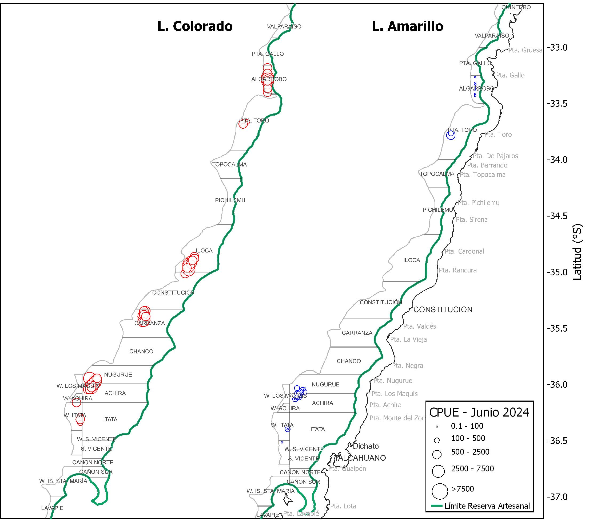
```

#####  *Figura 5. Distribución del rendimiento de pesca (kg/ha) de langostino colorado y langostino amarillo en junio de 2024.*

```{r echo=FALSE, out.width="70%",fig.align = 'center'}
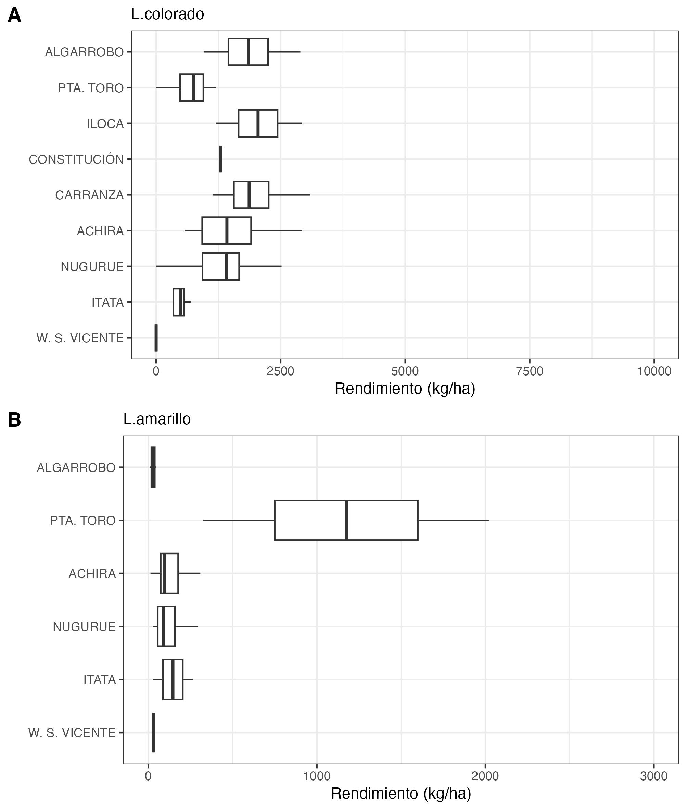
```

#####  *Figura 6. Rendimiento de pesca (captura por hora de arrastre) de langostino colorado (A) y langostino amarillo (B), en los caladeros visitados de en la unidad de pesquería sur, durante junio de 2024.*

# Aspectos biológicos

Los indicadores biológicos dicen relación con la talla promedio de machos y hembras, la proporción sexual, la estructura de tallas, el estado de madurez de las hembras ovígeras y la proporción de hembras ovígeras. Los datos fueron obtenidos a partir de muestreos aleatorios diarios de ejemplares capturados en zonas de pesca visitadas por la flota. El tamaño mínimo de muestra fue de 300 ejemplares, a los que se les midió la longitud del cefalotórax utilizando un pie de metro (0,01 mm de precisión). Los ejemplares además fueron pesados (0,01 gramos), indicándose si se trataba de ejemplares completos o incompletos. Se determinó el sexo, y en el caso de las hembras se registraron las hembras portadoras de huevos (ovígeras) y el estado de desarrollo de los huevos según escala de 4 puntos.

## Proporción sexual y talla promedio

En las capturas de junio 2024, el langostino colorado presentó una proporción sexual favorable a las hembras con un aporte de 70%, en langostino amarillo no se realizó muestreo biológico este mes, por lo que no se pudo realizar el análisis biológico (Fig. 7, Tabla 2).

En cuanto a la talla media se capturó ejemplares de langostino colorado con una talla promedio entre 27 y 45 mm longitud cefalotórax (LC) con una talla mayor en machos (pero solo en 1 mm). Al comparar las tallas medias por años de captura en langostino colorado se observa que las tallas tienden a comenzar altas durante marzo, sin embargo durante este año se presentan tallas menores y sin diferenciación entre sexos, escenario que cambia durante abril, mes en donde aumentan las tallas y se diferencian entre sexos y continúan al alza en mayo, registrándose en promedio las mayores tallas en ambos sexos, no observadas desde el año 2017, tallas que si bien declinan en ambos durante junio continuan con la tendencia al alza (Fig. 8).


##### *Tabla 2. Proporción sexual y talla promedio de langostino colorado, langostino amarillo y camarón nailon en las capturas de la UPS, 2024.*

|   |**Mes**|**Sexo**|**n**|**LC(mm)**|**DE(mm)**|**Mínimo(mm)**|**Máximo(mm)**|
|----|---|----|-|------|------|----------|----------|
|**L.colorado**|marzo|hembra|606|33,4|2,42|27,4|40,3|
|         |    |macho|386|33,4|2,58|28,2|41,4|
|        |abril|hembra|2542|35,1|2,43|28,5|46,0|
|         |     |macho|1928|37,1|3,17|28,8|47,2|
|         |mayo|hembras|2588|37,1|2,16|29,0|44,7|
|         |    |macho|1662|39,3|2,67|28,5|46,3|
|         |junio|hembras|2611|36,2|2,34|28,5|43,0|
|         |     |macho|1139|36,8|3,14|27,0|44,8|
|**L.amarillo**|marzo|hembra|55|30,8|2,72|25,4|38,5|
|         |    |macho|160|38,3|2,92|30,1|48,1|
|         |abril|hembra|30|33,2|2,59|29,8|39,0|
|         |    |macho|220|38,7|2,85|30,4|49,3|
|**C.nailon**|marzo|hembra|1540|28,2|2,74|19,9|34,9|
|      |     |macho|957|27,7|2,81|17,3|35,3|
|           |mayo|hembra|302|28,6|2,91|17,0|35,4|
|           |   |macho|198|25,1|3,54|14,9|33,3|


```{r echo=FALSE, out.width="90%",fig.align = 'center'}
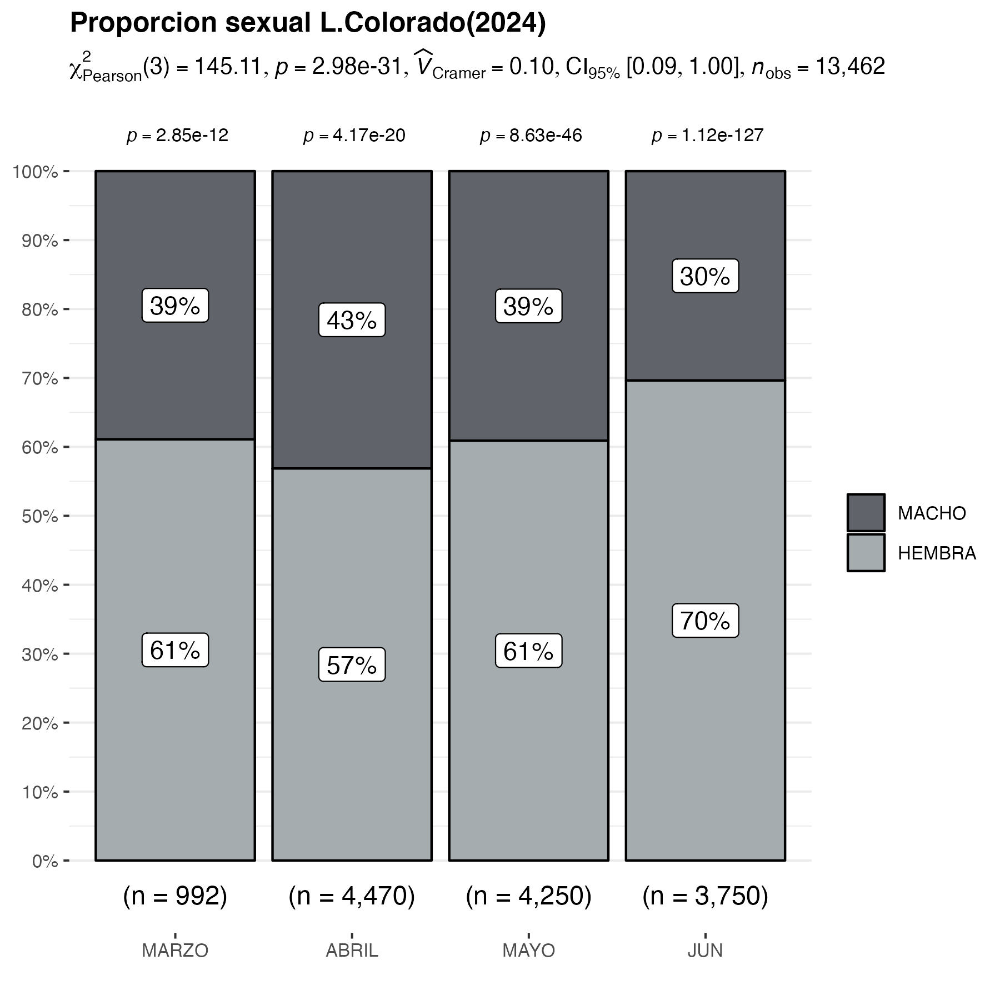
```

#####  *Figura 7. Proporción sexual de langostino colorado en el periodo marzo a junio 2024.*

```{r echo=FALSE, out.width="90%",fig.align = 'center'}
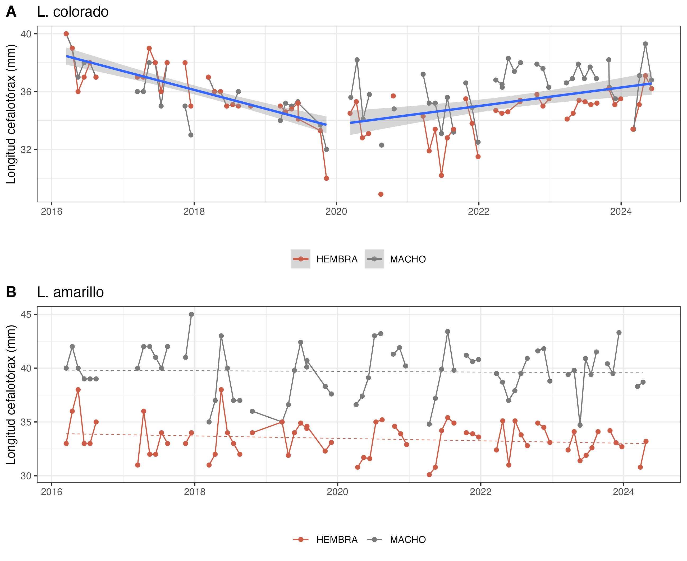
```

#####  *Figura 8. Talla promedio (LC, mm) de langostino colorado y langostino amarillo por sexo, en el periodo enero 2016 a junio de 2024.*

## Aspectos reproductivos

Las hembras de langostino colorado durante junio de 2024 presentaron un 82% en estado ovígero, respondiendo al adelanto de su periodo reproductivo en dos meses en relación a la temporada pasada (Fig.9, Tabla 3). 

```{r echo=FALSE, out.width="90%",fig.align = 'center'}
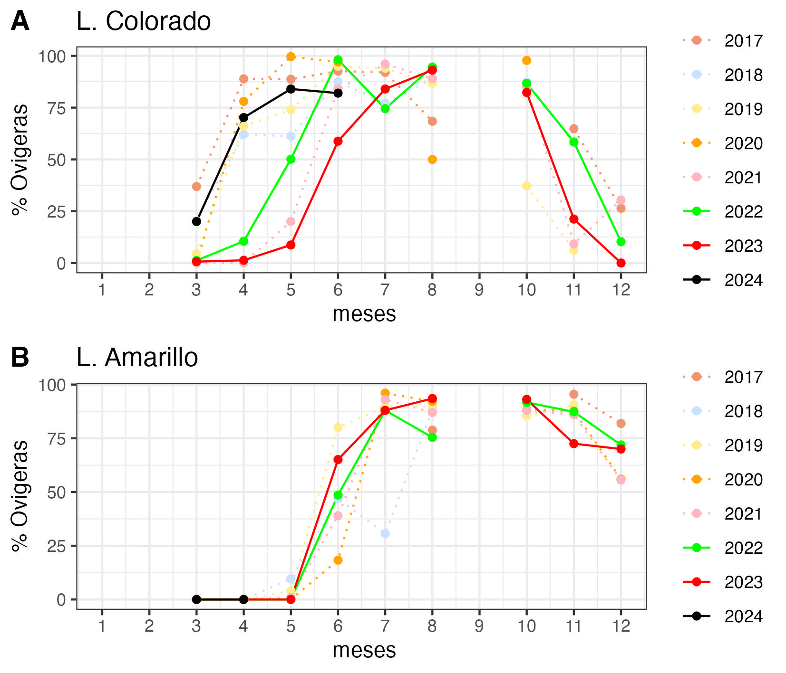
```

#####  *Figura 9. Comparación de hembras ovígeras de langostino colorado (panel superior) y langostino amarillo (panel inferior), entre los años 2017 a junio del año 2024.*

##### *Tabla 3. Porcentaje de hembras ovígeras y hembras maduras de langostino colorado, amarillo y camarón nailon UPS 2024.

|**Recurso**|**Estado**|**marzo**|**abril**|**mayo**|**junio**|
|-------|------|-----|-----|---------|----------|
|**L.colorado**|Normal|80%|27%|10%|9%|
|          |Ovígeras|20%|70%|84%|82%|
|          |Madura|0%|3%|6%|9%|
|Total n°|       |606|2542|2588|2611|
|**L.amarillo**|Normal|100%|100%|-|-|
|         |Ovígeras|0%|0%|-|-|
|         |Madura|0%|0%|-|-|
|Total n°|        |55|30|-|-|
|**C.nailon**|No portadora|93%|-|19%|-|
|           |Portadora|7%|-|81%|-|
|Total n°|  |1540|-|302|-|

## Composición de tallas

La comparación de tallas de langostino colorado no presenta diferencias significativas entre sexos (t-Student p >0,05), en el la talla media es de 36,2 mm en hembras y 36,8 mm en machos  (Tabla 2, Fig. 10). El análisis de la composición de tallas por zonas de pesca de langostino colorado mostró las tallas modales más pequeñas en los caladeros de Tumbes, Achira, Los Maquis y Carranza, y las tallas más grandes se presentaron en Iloca y Algarrobo (Fig. 11).

```{r echo=FALSE, out.width="70%",fig.align = 'center'}
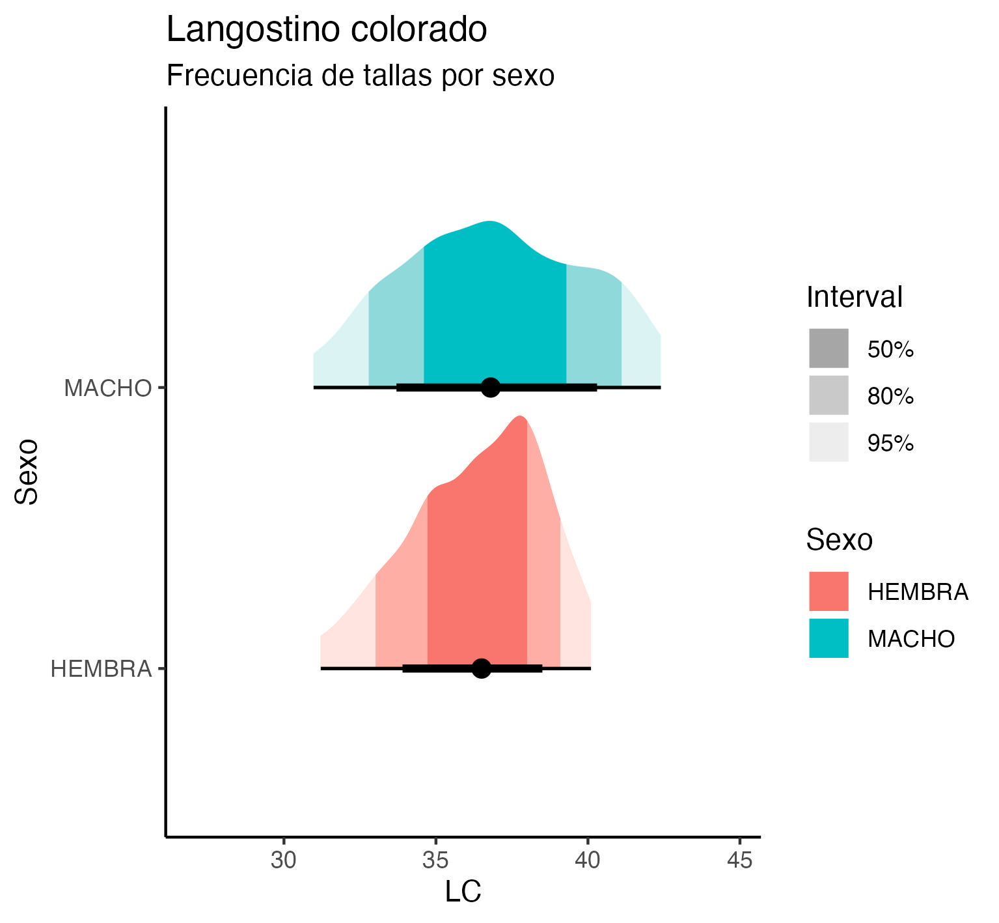
```

#####  *Figura 10. Composición de tallas de langostino colorado entre sexos, en junio de 2024.*

```{r echo=FALSE, out.width="70%",fig.align = 'center'}
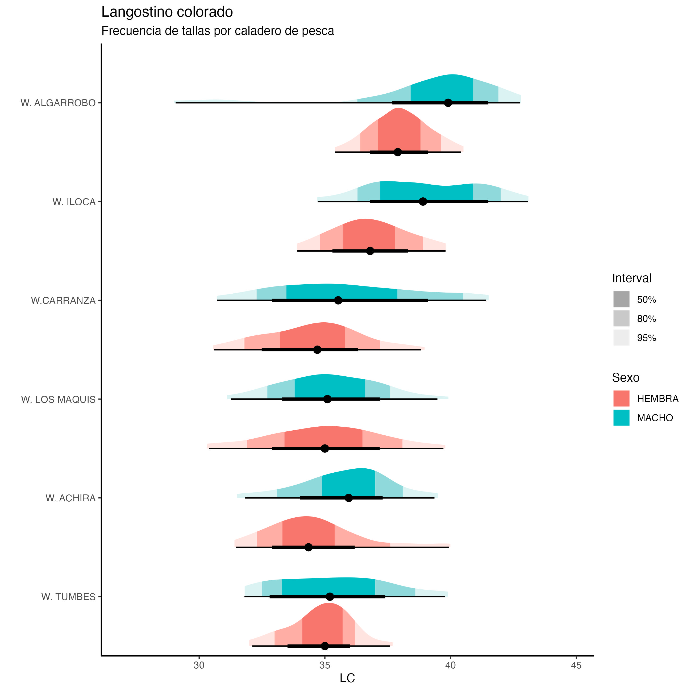
```

#####  *Figura 11. Composición de tallas de langostino colorado entre caladeros, en junio de 2024.*


## Relación longitud-peso

Con el objeto de comparar la relación longitud-peso entre machos y hembras, se utilizó ejemplares que fueron pesados completos, es decir, con todas sus extremidades. El mejor modelo para la relación longitud-peso fue con una intersección fija y diferentes pendientes entre sexos, el peso esperado más alto a una talla determinada se presentó en machos de langostino colorado (Fig. 12).

```{r echo=FALSE, out.width="70%",fig.align = 'center'}
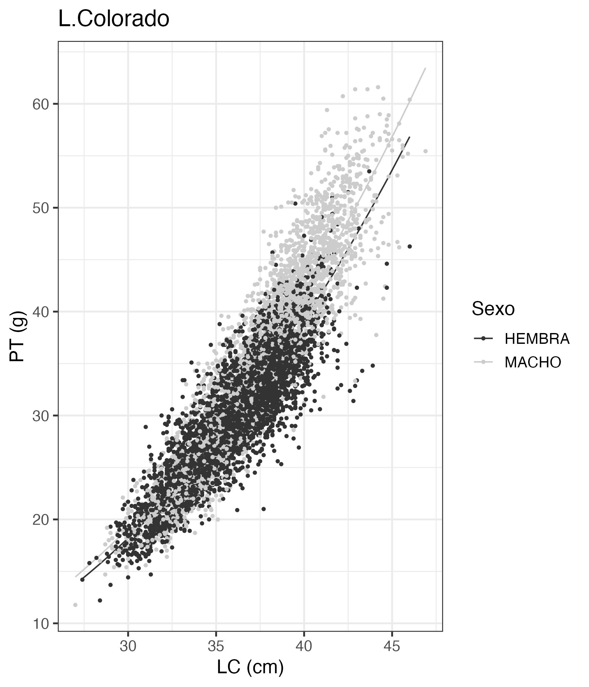
```

#####  *Figura 12. Relación longitud-peso de langostino colorado, en los meses de marzo-junio 2024.*


## Fauna acompañante

Las operaciones de pesca efectuadas durante el durante junio de 2024 por la flota de Camanchaca Pesca Sur, muestran la presencia del pejerrata en los caladeros de Chanco, Nugurue, Itata y San Vicente (Fig. 13), siendo la ocurrencia de esta especie, del total de las operaciones de pesca sobre langostino colorado y langostino amarillo, un 0,37% con 9678 kg. a la fecha. 

En cuanto a la ocurrencia de otros recursos como fauna acompañante de langostino colorado y amarillo destaca la merluza en los caladeros de Algarrobo, Iloca, Carranza e Itata con valores entre los 15 y 100 kg/ha y el Lenguado en el caladero de Algarrobo, Iloca y Achira con una captura de entre 50 y 100 kg/ha (Fig. 14).

También hay presencia de otros recursos como la  Jaiba Paco y Jaiba Limón pero en menor cantidad (en termino de unidades por hora de arrastre) como se muestra en la Figura 14.

```{r echo=FALSE, out.width="90%",fig.align = 'center'}
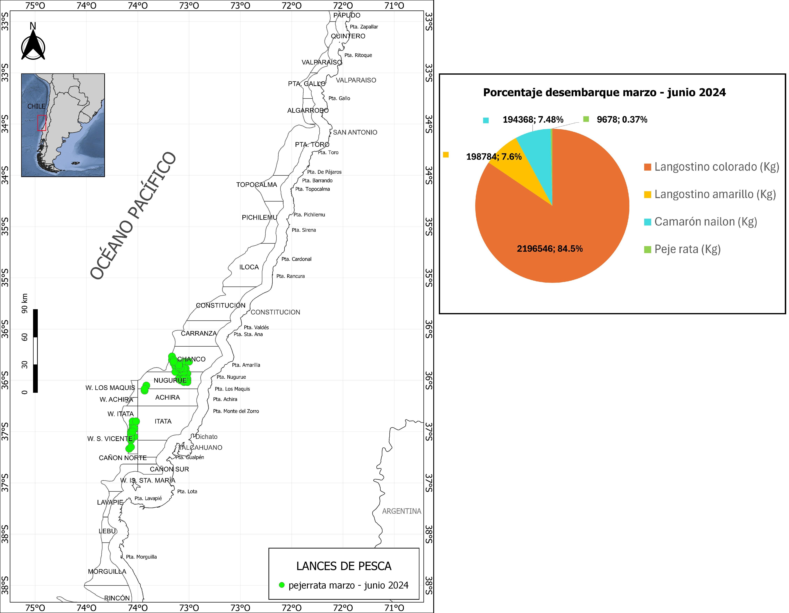
```

#####  *Figura 13. Distribución de los lances de pesca con captura de pejerrata en las capturas de  langostino colorado y langostino amarillo, y la fracción de pejerrata en las capturas totales, de junio 2024.*


```{r echo=FALSE, out.width="90%",fig.align = 'center'}
knitr::include_graphics("Figuras/Fauna_Acompañante_junio_2024_v1-1.jpeg")
```

#####  *Figura 14. Distribución espacial y abundancia de la fauna acompañante en los lances de pesca orientados a langostinos colorado y langostinos amarillos por la flota arrastrera de Camanchaca Pesca Sur, junio 2024*


