\newpage

# 1 Resumen

Durante marzo de 2025, las operaciones de pesca se realizaron entre las regiones del Biobío y Valparaíso, destacándose los caladeros del oeste de Papudo, Algarrobo, Punta Toro y Carranza. El esfuerzo pesquero estuvo principalmente dirigido al langostino colorado (57 % de los lances), seguido por capturas mixtas junto a langostino amarillo y camarón nailon (28 %), mientras que el camarón nailon fue capturado exclusivamente en el 15 % de los lances.

Las capturas totales fueron lideradas por el langostino colorado con 417 toneladas y un rendimiento promedio de 2.027 kg/ha. El langostino amarillo sumó 81 toneladas con un rendimiento de 553 kg/ha, y el camarón nailon alcanzó 30,9 toneladas con 361 kg/ha.

En términos biológicos, predominó la proporción de hembras en langostino colorado y camarón nailon (55 % en ambos casos), mientras que en langostino amarillo prevalecieron los machos (66 %).  Las tallas medias de langostino colorado destacaron por comenzar con calibres altos sobre los 37 mm longitud del cefalotórax (LC), valor superior a los registrados en el comienzo de la temporada de pesca de los anteriores.

En aspectos reproductivos, el langostino colorado presentó un 16 % de hembras ovígeras, similar al año anterior, mientras que langostino amarillo no registró hembras ovígeras y el camarón nailon tuvo un 9 % de hembras ovígeras.

Finalmente, destacó la presencia del pejerrata como fauna acompañante, representando aproximadamente un 3 % de las capturas totales, además de la presencia habitual de merluza, lenguado y jaibas en menores cantidades.

\newpage

# 2 Aspectos Pesqueros

## 2.1 Actividad pesquera


Las operaciones de pesca realizadas durante marzo cubrieron los caladeros ubicados desde la región del Bío-Bío a la región de Valparaiso, destacando los caladeros del weste de Papudo, Algarrobo, Punta Toro y Carranza (Fig. 1). 

```{r echo=FALSE, fig.width=4,fig.height=5,out.width="65%", fig.cap="Distribución espacial del total de lances de pesca realizados durante marzo de 2025",fig.align="center" }
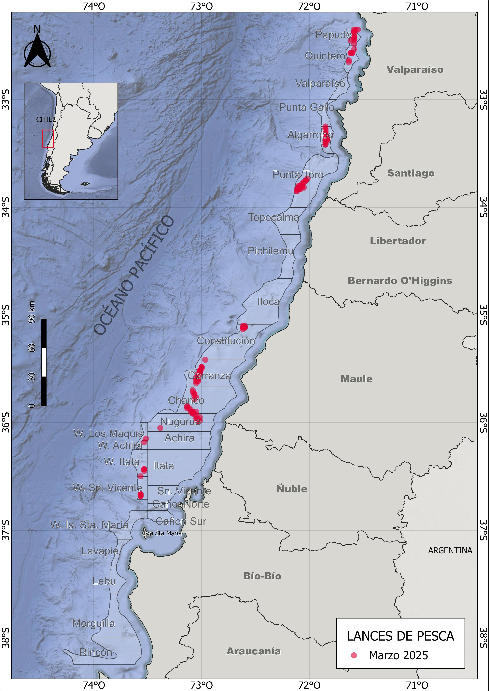
```

\newpage
## 2.2 Captura,esfuerzo y rendimientos de pesca

Durante marzo de 2025, la actividad pesquera se concentró mayoritariamente en el langostino colorado, con un 57 % de los lances dirigidos exclusivamente a esta especie. Un 28 % de los lances incluyó capturas mixtas de langostino colorado, langostino amarillo y camarón nailon, mientras que el 15 % restante estuvo orientado exclusivamente al camarón nailon (Fig. 2). 


```{r echo=FALSE, fig.width=3,fig.height=3,out.width="90%",fig.cap=" Distribución espacial de los lances de pesca orientados a langostino colorado, langostino amarillo y camarón nailon durante marzo de 2025",fig.align="center"}
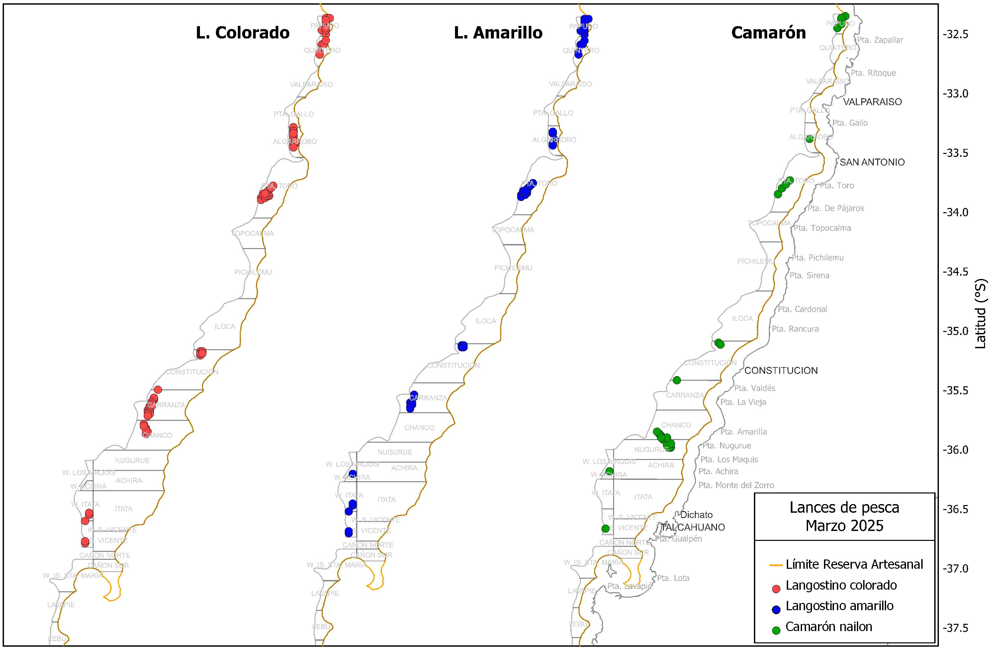
```


Las capturas por lance de langostino colorado oscilaron entre 90 y 7008 kg, alcanzando un total de 417 toneladas. El promedio fue de 2765 kg por lance, con un esfuerzo total de 206 horas de arrastre (ha) y un rendimiento de pesca de 2027 kg/ha (Tabla 1).

En el caso del langostino amarillo, se registraron 100 lances que sumaron un total de 80 toneladas, con un rendimiento de 553 kg/ha. Por su parte, el camarón nailon fue capturado en 42 lances, totalizando 30862 kg.

\newpage

##### *Tabla 1. Indicadores operacionales de la pesquería de langostino colorado, langostino amarillo y camarón nailon, marzo 2025.*

|**Recurso**|**Mes**|**N° de lances(n)**|**Cap. (kg)**|**Cap.lances (kg/n)**|**h arrast.(ha)**|**Rend. (kg/ha)**|**Prof.de fondo(m)**| 
|--------|-------|--------|-------|---------|-------|------|-------|
|**L.colorado**|marzo|151|417487|2765|206|2027|220|
|**L.amarillo**|marzo|100|80936|809|146|553|225|
|**Camarón**|marzo|42|30862|735|85|361|307|

El rendimiento de pesca del langostino colorado varió entre 67 y 7367 kg/ha, con una moda de 2139 kg/ha. El esfuerzo fluctuó entre 15 y 206 minutos, concentrándose principalmente en los 72 minutos (Fig. 3).

Para el langostino amarillo, el rendimiento osciló entre 30 y 4444 kg/ha, con un esfuerzo predominante de 80 minutos. El camarón nailon presentó un rendimiento medio de 251 kg/ha, con esfuerzos en torno a 2 horas y 5 minutos.

```{r echo=FALSE,fig.width=4,fig.height=5,out.width="80%",fig.cap="Distribución de frecuencia del esfuerzo de pesca (en horas de arrastre, A) y del rendimiento (en kg/ha, B), para langostino colorado, langostino amarillo y camarón nailon durante marzo de 2025",fig.align="center"}
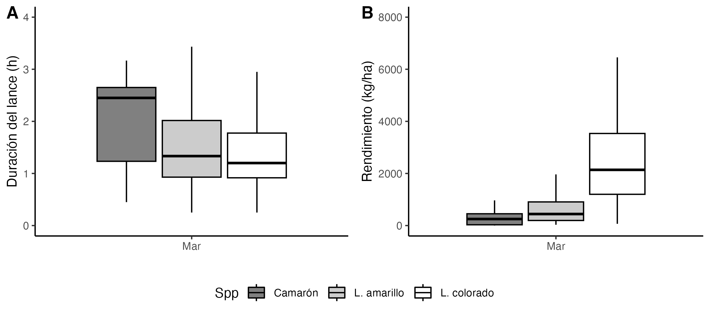
```


En cuanto a la distribución espacial del rendimiento de pesca durante el mes de marzo se destacaron los caladeros de San Vicente y Constitución con de alto rendimiento de langostino colorado con medias sobre los 4000 kg/ha (Fig. 4). En el caso del langostino amarillo, cuya captura se produjo mayoritariamente en conjunto con langostino colorado, los mayores rendimientos se registraron en las cuadras de Constitución y Punta Toro, con valores sobre los 1.000 kg/ha (Fig. 4). Por su parte, el camarón nailon mostró rendimientos más elevados en los caladeros de Achira y Nugurue, con cifras que oscilaron entre los 300 y 750 kg/ha (Fig. 5).

```{r echo=FALSE,fig.width=4,fig.height=5,out.width="110%",fig.cap="Distribución del rendimiento de pesca (kg/ha) de langostino colorado, langostino amarillo y camarón nailon en marzo de 2025",fig.align="center"}
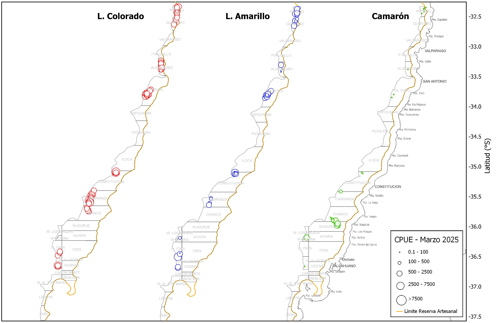
```


```{r echo=FALSE,fig.width=4,fig.height=5,out.width="80%",fig.cap="Rendimiento de pesca (captura por hora de arrastre) anual de langostino colorado (A), langostino amarillo (B) y camarón nailon (C), en los caladeros visitados de en la unidad de pesquería sur, marzo de 2025",fig.align="center"}
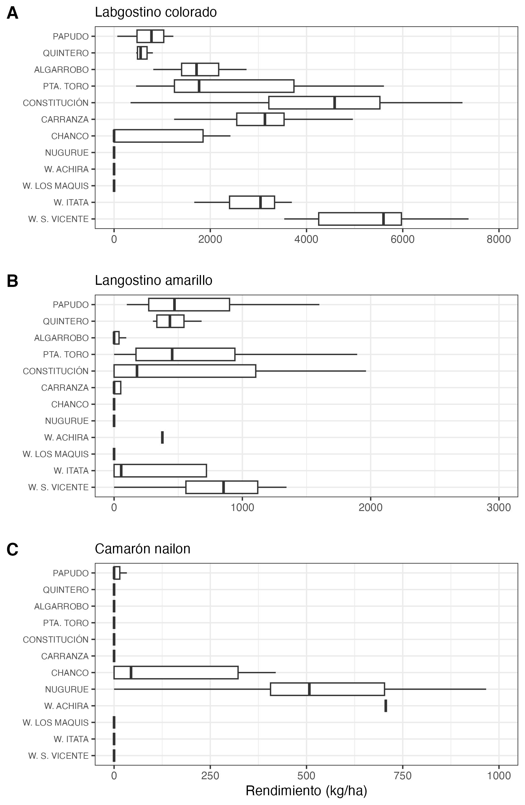
```

\newpage
# 3 Aspectos biológicos

Los indicadores biológicos incluyen la talla promedio por sexo, proporción sexual, estructura de tallas, estado de madurez de las hembras ovígeras y su proporción en las capturas. Los datos fueron obtenidos a partir de muestreos diarios aleatorios realizados sobre ejemplares capturados en las zonas visitadas por la flota. Se estableció un tamaño mínimo de muestra de 300 ejemplares, midiendo la longitud del cefalótorax con una precisión de 0,01 mm mediante un pie de metro. Además, los individuos fueron pesados (precisión 0,01 g), y se registró si estaban completos o incompletos. Se determinó el sexo de cada ejemplar y, en el caso de las hembras, se consignó la presencia de huevos (estado ovígero) y el grado de madurez de los mismos, según la escala de 4 puntos propuesta por Palma y Arana (1997).


## 3.1 Proporción sexual y talla promedio

Durante las capturas de marzo de 2025, el langostino colorado presentó una proporción sexual levemente favorable a las hembras (55 %), mientras que en langostino amarillo la relación fue más desigual, con un 66 % de machos. En el caso del camarón nailon, las hembras representaron el 55 % del total (Fig. 6).

En cuanto a las tallas promedio, el langostino colorado registró longitudes cefalotorácicas entre 24,6 y 46,4 mm, con promedios similares entre sexos (38,2 mm en hembras y 37,9 mm en machos). En comparación con años anteriores, las tallas medias de este año se ubicaron sobre los 37 mm LC, destacando como especialmente altas (Fig. 7).

En langostino amarillo, los machos alcanzaron tallas promedio de 39,7 mm LC, superiores a las de las hembras (33,3 mm LC). Al comparar con años anteriores, ambos sexos muestran un inicio de temporada con tallas superiores a 2024 y comparables a las de 2023 (Tabla 2, Fig. 7).

En el caso del camarón nailon, las tallas medias se situaron en torno a los 29 mm LC, sin diferencias marcadas entre sexos (Tabla 2).

\newpage

##### *Tabla 2. Proporción sexual y talla promedio de langostino colorado, langostino amarillo y camarón nailon en las capturas de la UPS, 2025*

|   |Mes|Sexo|n|LC(mm)|DE(mm)|Min.(mm)|Max.(mm)|
|----|---|----|-|------|------|----------|----------|
|**L.colorado**|marzo|hembra|1590|38,2|2,66|24.6|44,7|
|         |    |macho|1316|37,9|4,09|25,6|46,4|
|**L.amarillo**|marzo|hembra|85|33,3|2,61|29,3|40,3|
|         |    |macho|165|39,7|2,82|30,5|46,7|
|**Camarón**|marzo|hembra|164|29,7|2,33|24,8|35,6|
|      |     |macho|86|29,4|1,39|26,5|32,6|


```{r echo=FALSE,fig.width=4,fig.height=5,out.width="70%",fig.cap="Proporción sexual de langostino colorado (A), langostino amarillo (B) y camarón nailon durante marzo de 2025",fig.align="center"}
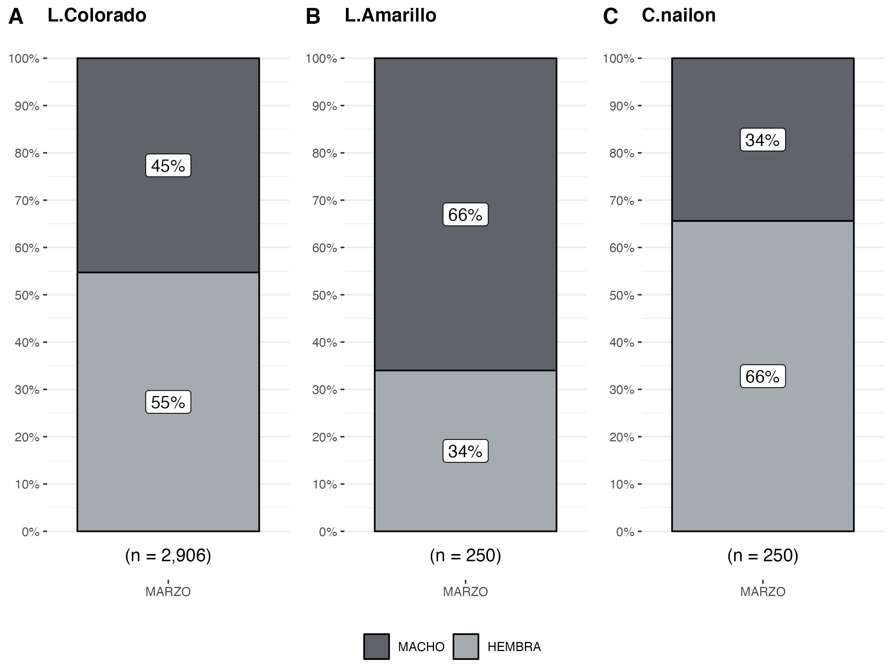
```

\newpage


```{r echo=FALSE,fig.width=4,fig.height=5,out.width="90%",fig.cap="Talla promedio (LC, mm) de langostino colorado y langostino amarillo por sexo, en el periodo enero 2016 a marzo de 2025",fig.align="center"}
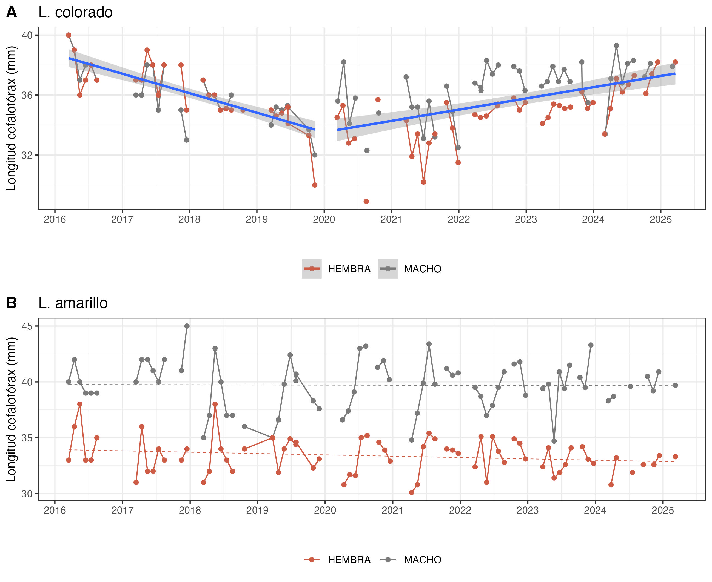
```

\newpage

## 3.2 Aspectos reproductivos

Durante marzo de 2025, el 16 % de las hembras de langostino colorado se encontraron en estado ovígero, proporción similar a la registrada en el año anterior (Fig. 8, Tabla 3). En langostino amarillo no se observó presencia de hembras ovígeras, manteniéndose la tendencia observada desde 2017. En el caso del camarón nailon, el 9 % de las hembras presentaron huevos, predominando las hembras inmaduras (Tabla 3).

```{r echo=FALSE, fig.width=4,fig.height=5,out.width="50%",fig.cap="Hembras ovígeras de langostino colorado y langostino amarillo durante marzo 2025, en comparacion con la media registrada entre los años 2017 a 2023 (línea verde)",fig.align="center"}
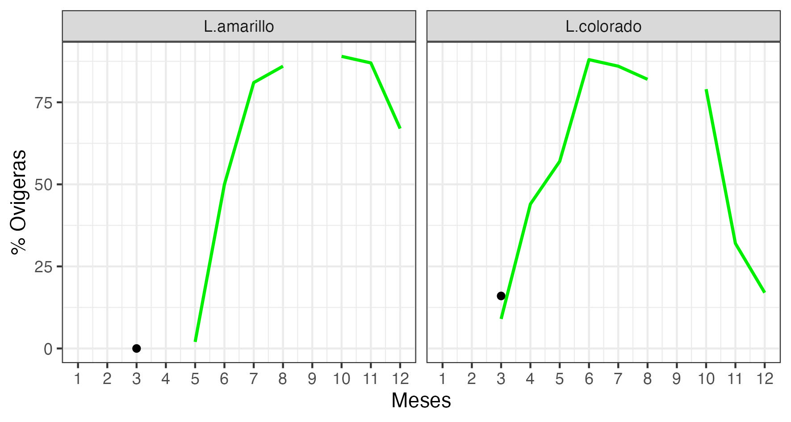
```

##### *Tabla 2. Porcentaje de hembras ovígeras y hembras maduras de langostino colorado y amarillo UPS 2025, y de hembras potadoras e inmaduras de camarón nailon*

| **Recurso**    | **Estado**   | **mar.** |
|----------------|------------ |--------|
| **L.colorado** | Normal       | 83%   |    
|                | Ovígeras     | 16%       |
|                | Madura       | 1%        | 
| Total n°       |              | 1590       | 
| **L.amarillo** | Normal       | 100%      | 
|                | Ovígeras     | 0%        | 
|                | Madura       | 0%        |
| Total n°       |              | 85        |
| **C.nailon**   |Inmadura      | 91%      | 
|                | Portadora    | 9%      | 
| Total n°       |              | 164        |

\newpage

## 3.3. Composición de tallas

El análisis de tallas de langostino colorado y camarón nailon no evidenció diferencias significativas entre sexos (prueba t de Student, p > 0,05). La talla media para langostino colorado fue de 38 mm LC, mientras que para camarón nailon fue de 29 mm (Tabla 2, Fig. 9, 11). En cambio, langostino amarillo sí presentó diferencias significativas, con machos de mayor talla (39 mm) en comparación con las hembras (33 mm LC) (Tabla 2, Fig. 10).

En cuanto a la composición de tallas por zona de pesca, langostino colorado mostró las tallas modales más pequeñas en el caladero de Papudo, mientras que las tallas más grandes se registraron al oeste de Iloca (Fig. 12). Para langostino amarillo y camarón nailon no fue posible realizar este análisis debido a que el muestreo biológico se efectuó sólo en un caladero: Tumbes para langostino amarillo y Chanco para camarón nailon (Fig. 10, 11).

```{r echo=FALSE, fig.width=4,fig.height=5,out.width="70%",fig.cap=" Composición de tallas de langostino colorado entre sexos, en marzo de 2025",fig.align="center"}
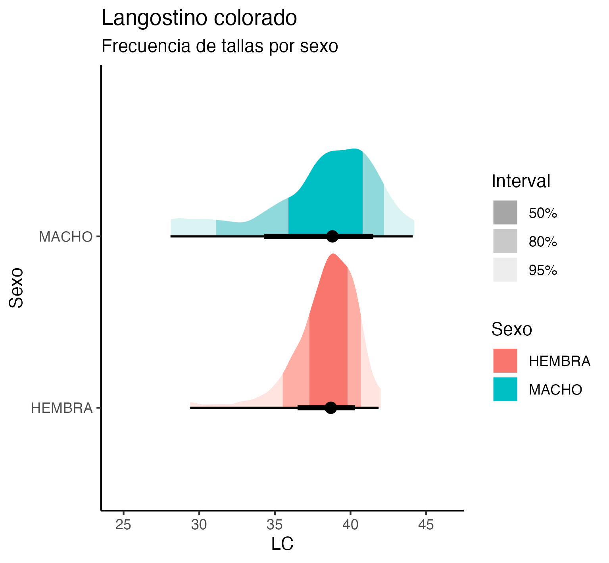
```


```{r echo=FALSE, fig.width=4,fig.height=5,out.width="70%",fig.cap=" Composición de tallas de langostino amarillo entre sexos, en marzo de 2025",fig.align="center"}
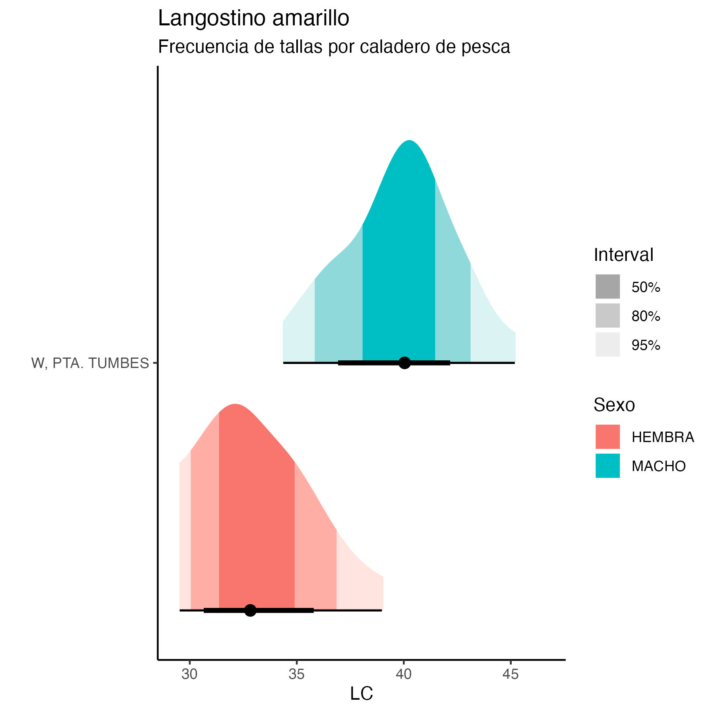
```


```{r echo=FALSE, fig.width=4,fig.height=5,out.width="70%",fig.cap=" Composición de tallas de camarón nailon entre sexos, en marzo de 2025",fig.align="center"}
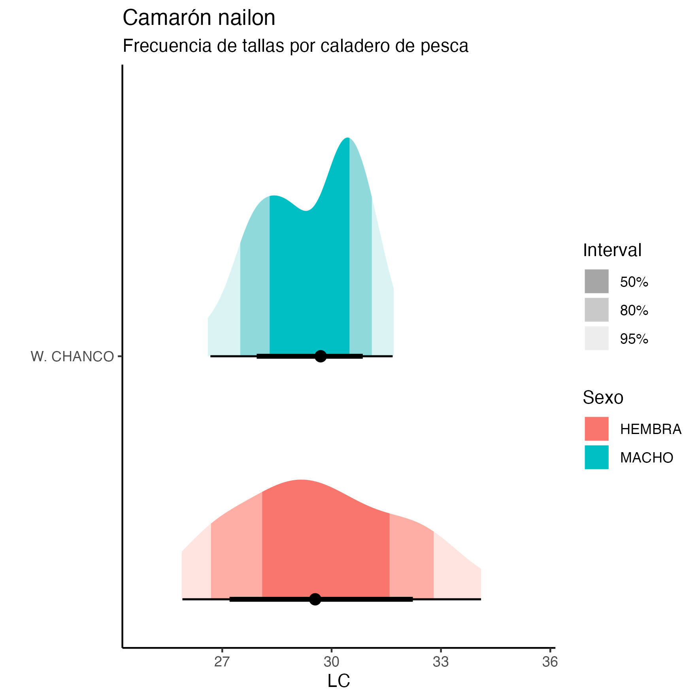
```


```{r echo=FALSE, fig.width=4,fig.height=5,out.width="80%",fig.cap="Composición de tallas de langostino colorado en la UPS por zonas de pesca en marzo de 2025",fig.align="center"}
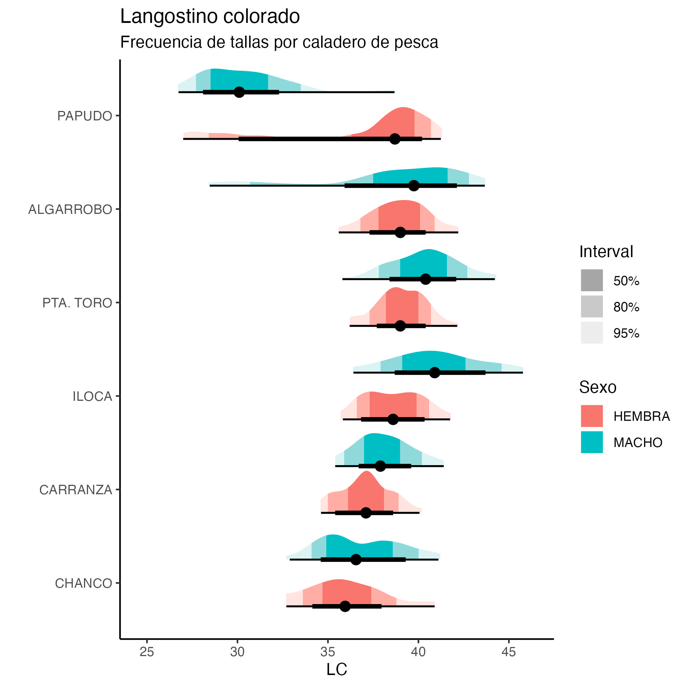
```


\newpage
## 3.4 Fauna acompañante

Las operaciones de pesca realizadas durante marzo de 2025 por la flota de Camanchaca Pesca Sur evidenciaron la presencia de pejerrata, como fauna acompañante, en zonas como Carranza, Chanco, Nugurue, oeste de Achira, oeste de Itata y oeste de San Vicente (Fig. 13). Esta especie representó un 2,94 % del total de las capturas alcanzando un volumen de 16046 kg. 

En cuanto a la ocurrencia de otros recursos como fauna acompañante destaca la merluza y lenguado en la totalidad de caladeros visitados con valores entre los 15 y 100 kg/ha (Fig. 14).
Tambien hay presencia de otros recursos como la Jaiba Paco y Jaiba Limón pero en menor cantidad (en termino de unidades por hora de arrastre) como se muestra en la Figura 14.

```{r echo=FALSE, fig.width=4,fig.height=5,out.width="80%",fig.cap=" Distribución de los lances de pesca con captura de pejerrata en las capturas de camarón nailon, langostino colorado y langostino amarillo, y la fracción de pejerrata en las capturas totales, desde marzo  año 2025",fig.align="center"}
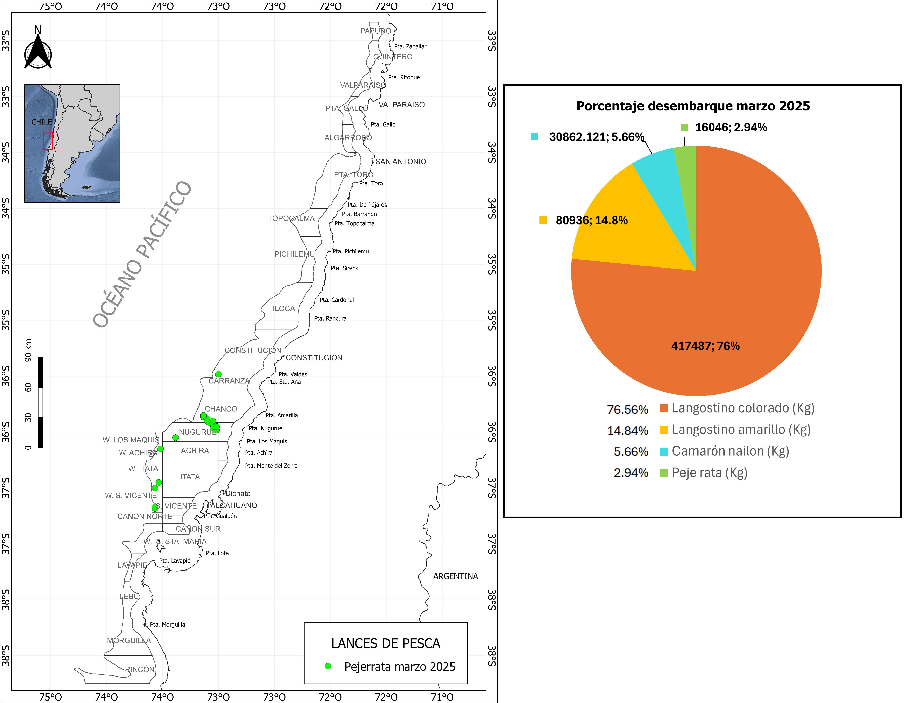
```


```{r echo=FALSE, fig.width=4,fig.height=5,out.width="110%",fig.cap=" Distribución espacial y abundancia de la fauna acompañante en los lances de pesca orientados a langostinos colorado y langostinos amarillos por la flota arrastrera de Camanchaca Pesca Sur, marzo de 2025",fig.align="center"}
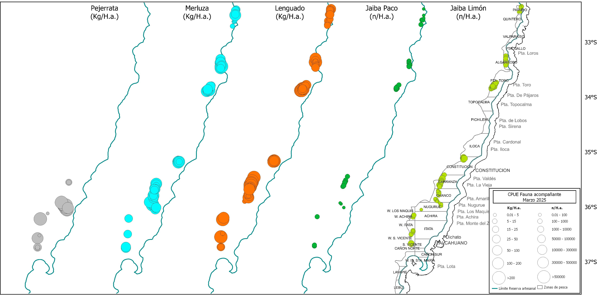
```


