\newpage

# 1 Resumen

Durante abril de 2025, las operaciones de pesca se realizaron entre las regiones del Biobío y el Maule, destacando los caladeros de Nugurue, Itata, San Vicente, Iloca y Constitución. El esfuerzo pesquero se orientó principalmente al langostino colorado, con un 98 % de los lances. De estos, el 72 % correspondió a capturas mixtas con langostino amarillo, el 26 % fueron lances exclusivos de langostino colorado, y el 2 % restante incluyó mezclas con camarón nailon.

Las capturas totales fueron lideradas por el langostino colorado con 805 toneladas y un rendimiento promedio de 2202 kg/ha. El langostino amarillo sumó 89 toneladas con un rendimiento de 328 kg/ha, y el camarón nailon alcanzó 1 tonelada siendo capturado solo como fauna acompañante.

En términos biológicos, el langostino colorado mostró una proporción sexual levemente inclinada hacia los machos (53 %). De manera similar, en el langostino amarillo predominaron los machos, que representaron el 78 % del total.

Las tallas medias del langostino colorado fueron especialmente altas al inicio del mes, superando los 37,5 mm longitud del caparazón (LC), valor superior a lo registrado en temporadas anteriores. Sin embargo, se observó un descenso a 35 mm LC en hembras y 37 mm LC en machos.

En términos reproductivos, el langostino colorado presentó un 76 % de hembras ovígeras, proporción similar a la del año anterior. Por su parte, el langostino amarillo mostró un 2 % de hembras ovígeras, modificando la tendencia histórica en que estas solían aparecer recién en junio.

Finalmente, destacó la presencia del pejerrata como fauna acompañante, representando aproximadamente un 0,44 % de las capturas totales, además de la alta presencia  de merluza y lenguado con valores entre los 50 y 200 kg/ha.

\newpage

# 2 Aspectos Pesqueros

## 2.1 Actividad pesquera


Las operaciones de pesca realizadas durante marzo cubrieron los caladeros ubicados desde la región del Bío-Bío a la región de Maule, destacando los caladeros de Nugurue, Itata y San Vicente (Fig. 1). 

```{r echo=FALSE, fig.width=4,fig.height=5,out.width="65%", fig.cap="Distribución espacial del total de lances de pesca realizados durante abril de 2025",fig.align="center" }
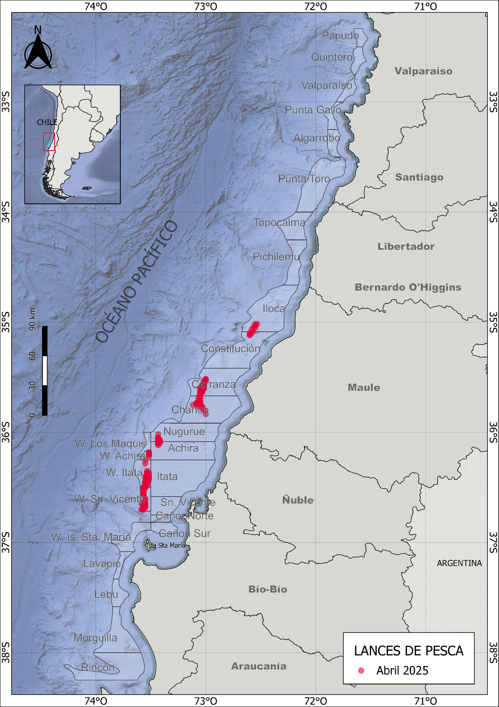
```

\newpage
## 2.2 Captura,esfuerzo y rendimientos de pesca

Durante abril de 2025, la actividad pesquera se centró principalmente en el langostino colorado. El 26 % de los lances se dirigió exclusivamente a esta especie, otro 72 % correspondió a capturas mixtas de langostino colorado y langostino amarillo, mientras que el 2 % restante incluyó capturas conjuntas de ambas especies con camarón nailon (Fig. 2). 


```{r echo=FALSE, fig.width=3,fig.height=3,out.width="90%",fig.cap=" Distribución espacial de los lances de pesca orientados a langostino colorado, langostino amarillo y camarón nailon durante abril de 2025",fig.align="center"}
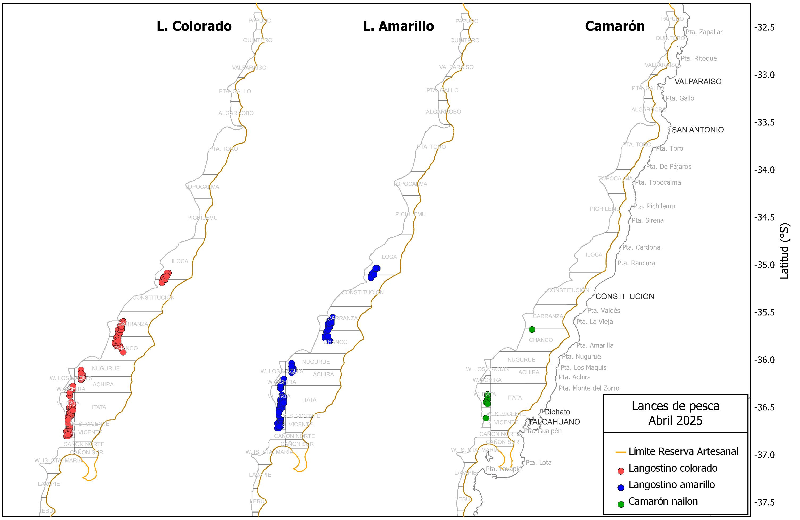
```


Las capturas por lance de langostino colorado alcanzaron un total de 805 toneladas. El promedio fue de 3017 kg por lance, con un esfuerzo total de 366 horas de arrastre (ha) y un rendimiento de pesca de 2202 kg/ha (Tabla 1).En el caso del langostino amarillo, se registraron 200 lances que sumaron un total de 89 toneladas, con un rendimiento de 328 kg/ha (Tabla 1). 

\newpage

##### *Tabla 1. Indicadores operacionales de la pesquería de langostino colorado, langostino amarillo y camarón nailon, abril 2025.*

|**Recurso**|**Mes**|**N° de lances(n)**|**Cap. (kg)**|**Cap.lances (kg/n)**|**h arrast.(ha)**|**Rend. (kg/ha)**|**Prof.de fondo(m)**| 
|--------|-------|--------|-------|---------|-------|------|-------|
|**L.colorado**|marzo|178|492941|2769|233|2118|220|
|              |abril|267|805486|3017|366|2202|210|
|**L.amarillo**|marzo|124|102458|826|172|596|225|
|              |abril|200|89582|448|273|328|215|
|**Camarón**|marzo|44|30862|702|87|352|301|
|           |abril|7|1048|149|7|153|223|

El rendimiento de pesca del langostino colorado varió entre 31 y 15012 kg/ha, con una moda de 1984 kg/ha. El esfuerzo por lance fluctuó entre 7 y 183 minutos, concentrándose mayoritariamente en torno a 1 hora y 20 minutos (Fig. 3). En el caso del langostino amarillo, el rendimiento osciló entre 11 y 3038 kg/ha, con un esfuerzo predominante cercano a los 81 minutos. (Fig. 3). 

```{r echo=FALSE,fig.width=4,fig.height=5,out.width="80%",fig.cap="Distribución de frecuencia del esfuerzo de pesca (en horas de arrastre, A) y del rendimiento (en kg/ha, B), para langostino colorado y langostino amarillo durante abril de 2025",fig.align="center"}
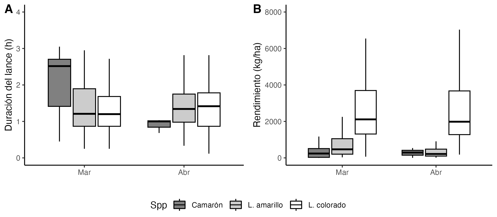
```


En cuanto a la distribución espacial del rendimiento durante abril, se destacaron los caladeros de oeste de Itata, Nugurue, Carranza y Chanco, con valores promedio entre 2000 y 2500 kg/ha para langostino colorado (Fig. 4 y 5). Para langostino amarillo, los mayores rendimientos se registraron en Iloca, Constitución y San Vicente, con medias cercanas a 500 kg/ha.


```{r echo=FALSE,fig.width=4,fig.height=5,out.width="110%",fig.cap="Distribución del rendimiento de pesca (kg/ha) de langostino colorado, langostino amarillo  en abril de 2025",fig.align="center"}
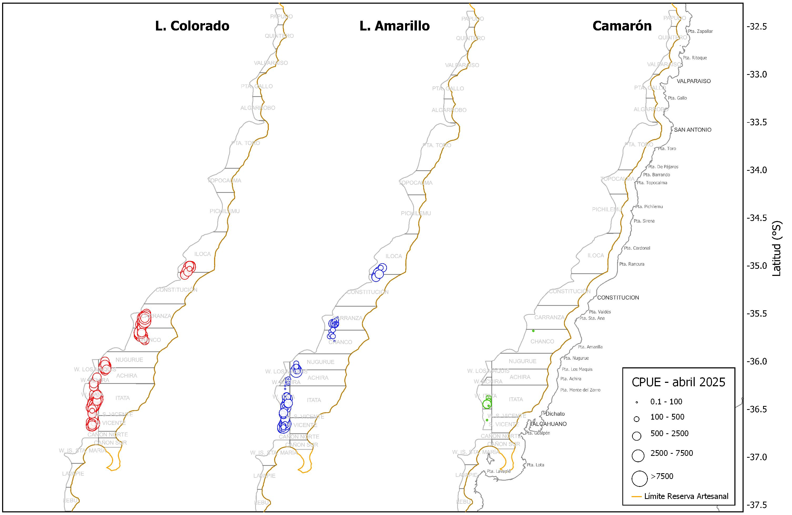
```


```{r echo=FALSE,fig.width=4,fig.height=5,out.width="80%",fig.cap="Rendimiento de pesca (captura por hora de arrastre) anual de langostino colorado (A) y langostino amarillo (B) , en los caladeros visitados de en la unidad de pesquería sur, abril de 2025",fig.align="center"}
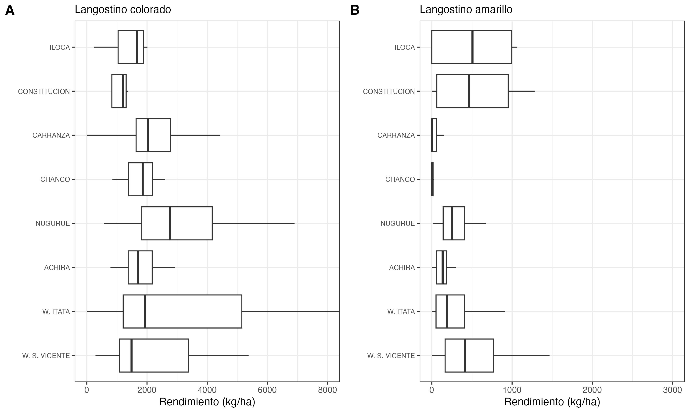
```

\newpage
# 3 Aspectos biológicos

Los indicadores biológicos incluyen la talla promedio por sexo, proporción sexual, estructura de tallas, estado de madurez de las hembras ovígeras y su proporción en las capturas. Los datos fueron obtenidos a partir de muestreos diarios aleatorios realizados sobre ejemplares capturados en las zonas visitadas por la flota. Se estableció un tamaño mínimo de muestra de 300 ejemplares, midiendo la longitud del cefalótorax con una precisión de 0,01 mm mediante un pie de metro. Además, los individuos fueron pesados (precisión 0,01 g), y se registró si estaban completos o incompletos. Se determinó el sexo de cada ejemplar y, en el caso de las hembras, se consignó la presencia de huevos (estado ovígero) y el grado de madurez de los mismos, según la escala de 4 puntos propuesta por Palma y Arana (1997).


## 3.1 Proporción sexual y talla promedio

Durante las capturas de abril de 2025, el langostino colorado mostró una proporción sexual levemente inclinada hacia los machos, quienes representaron el 53 % del total. En el caso del langostino amarillo, la dominancia masculina fue más marcada, con un 78 % de machos en la muestra (Fig. 6).

En cuanto a las tallas promedio, el langostino colorado presentó longitudes cefalotorácicas entre 22 y 44 mm, con medias de 37,1 mm en machos y 35,2 mm en hembras. En comparación con temporadas anteriores, las tallas medias al inicio de este año fueron particularmente altas, superando los 37 mm LC. Sin embargo, durante este mes se observó un descenso marcado en las hembras (Fig. 7). En langostino amarillo, los machos alcanzaron tallas promedio de 37,4 mm LC, superiores a las de las hembras (31,2 mm LC) (Tabla 2, Fig. 7).


##### *Tabla 2. Proporción sexual y talla promedio de langostino colorado, langostino amarillo y camarón nailon en las capturas de la UPS, 2025*

|   |Mes|Sexo|n|LC(mm)|DE(mm)|Min.(mm)|Max.(mm)|
|----|---|----|-|------|------|----------|----------|
|**L.colorado**|marzo|hembra|1590|38,2|2,66|24.6|44,7|
|               |    |macho|1316|37,9|4,09|25,6|46,4|
|               |abril|hembra|2037|35,2|2,33|22,3|42,6|
|               |     |macho|2337|37,1|2,36|29,3|44,3|
|**L.amarillo**|marzo|hembra|85|33,3|2,61|29,3|40,3|
|             |    |macho|165|39,7|2,82|30,5|46,7|
|             |abril|hembra|297|31,4|2,58|19,6|44,6|
|             |     |macho|1043|37,4|4,38|17,7|51,9|
|**Camarón**|marzo|hembra|164|29,7|2,33|24,8|35,6|
|           |     |macho|86|29,4|1,39|26,5|32,6|


```{r echo=FALSE,fig.width=4,fig.height=5,out.width="70%",fig.cap="Proporción sexual de langostino colorado (A) y langostino amarillo (B) durante abril de 2025",fig.align="center"}
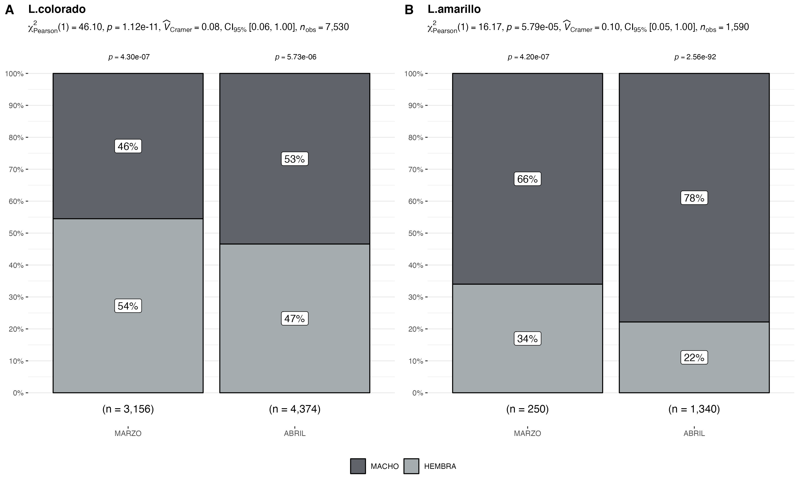
```

\newpage


```{r echo=FALSE,fig.width=4,fig.height=5,out.width="90%",fig.cap="Talla promedio (LC, mm) de langostino colorado y langostino amarillo por sexo, en el periodo enero 2016 a abril de 2025",fig.align="center"}
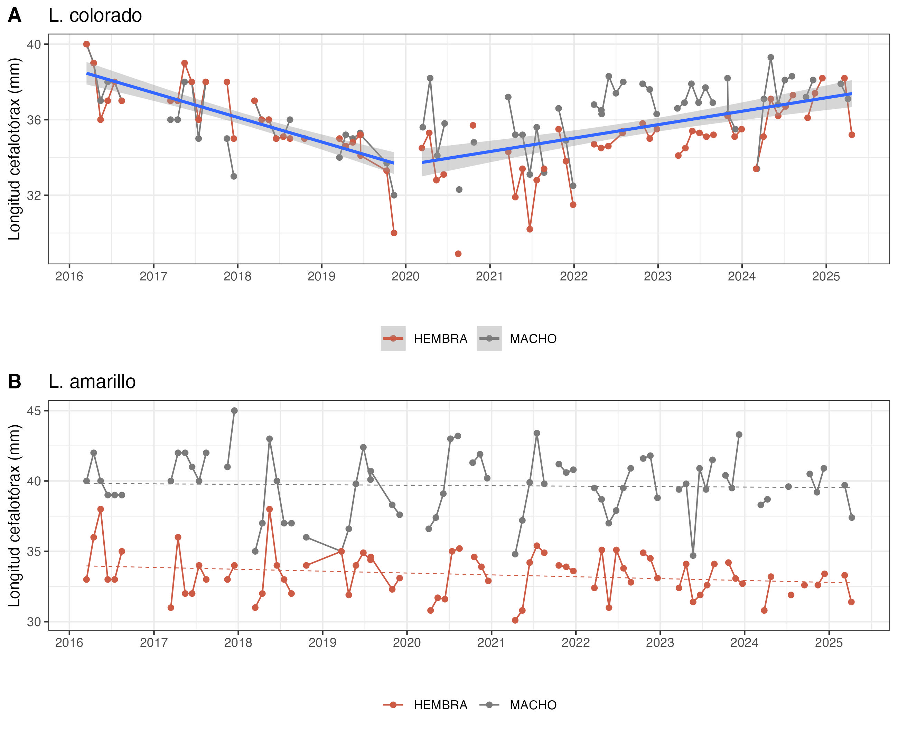
```

\newpage

## 3.2 Aspectos reproductivos

Durante mayo de 2025, el 76 % de las hembras de langostino colorado se encontraron en estado ovígero, proporción similar a la observada en el mismo período del año anterior (Fig. 8, Tabla 3). En el caso del langostino amarillo, se registró un 2 % de hembras ovígeras, lo que marca un cambio respecto a la tendencia histórica, en la que su presencia solía comenzar recién en junio (Tabla 3).

```{r echo=FALSE, fig.width=4,fig.height=5,out.width="50%",fig.cap="Hembras ovígeras de langostino colorado y langostino amarillo durante abril 2025, en comparacion con la media registrada entre los años 2017 a 2023 (línea verde)",fig.align="center"}
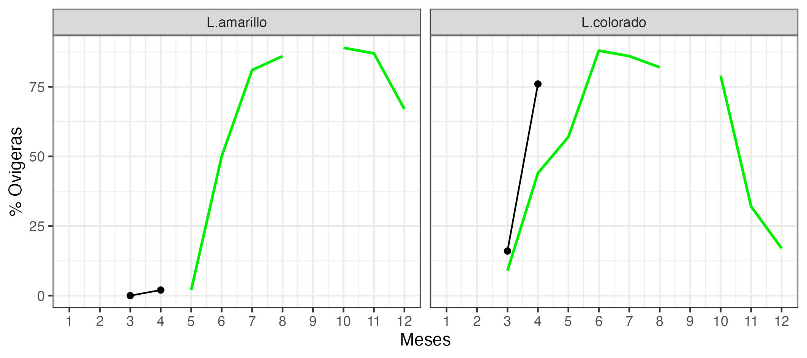
```

##### *Tabla 3. Porcentaje de hembras ovígeras y hembras maduras de langostino colorado y amarillo UPS 2025.*

| **Recurso**    | **Estado**   | **mar.** |**abr.**|
|----------------|------------ |--------|--------|
| **L.colorado** | Normal       | 83%   | 21%|  
|                | Ovígeras     | 16%       |76%|
|                | Madura       | 1%        |3%| 
| Total n°       |              | 1590       |2037|
| **L.amarillo** | Normal       | 100%      | 98%|
|                | Ovígeras     | 0%        | 2%|
|                | Madura       | 0%        |0%|
| Total n°       |              | 85        |297|


\newpage

## 3.3. Composición de tallas

El análisis de tallas del langostino colorado y del langostino amarillo evidenció diferencias significativas entre sexos (prueba t de Student, p < 0.05). En el caso del langostino colorado, los machos alcanzaron una talla media de 37 mm LC, superior a la de las hembras, que fue de 35 mm LC (Fig. 9). Por su parte, en el langostino amarillo, las hembras registraron una talla media de 31 mm LC, mientras que los machos alcanzaron los 37 mm LC (Tabla 2, Fig. 10).

En cuanto a la composición de tallas por zona de pesca, el langostino colorado presentó las tallas modales más pequeñas en el caladero de Tumbes, mientras que las más grandes se registraron en los sectores ubicados al oeste de Iloca y Constitución (Fig. 11). En el caso del langostino amarillo, las tallas mostraron una distribución similar entre las distintas zonas, destacando el oeste de Itata en los machos por presentar un mayor rango de tallas (Fig. 12).

```{r echo=FALSE, fig.width=4,fig.height=5,out.width="70%",fig.cap=" Composición de tallas de langostino colorado entre sexos, en abril de 2025",fig.align="center"}
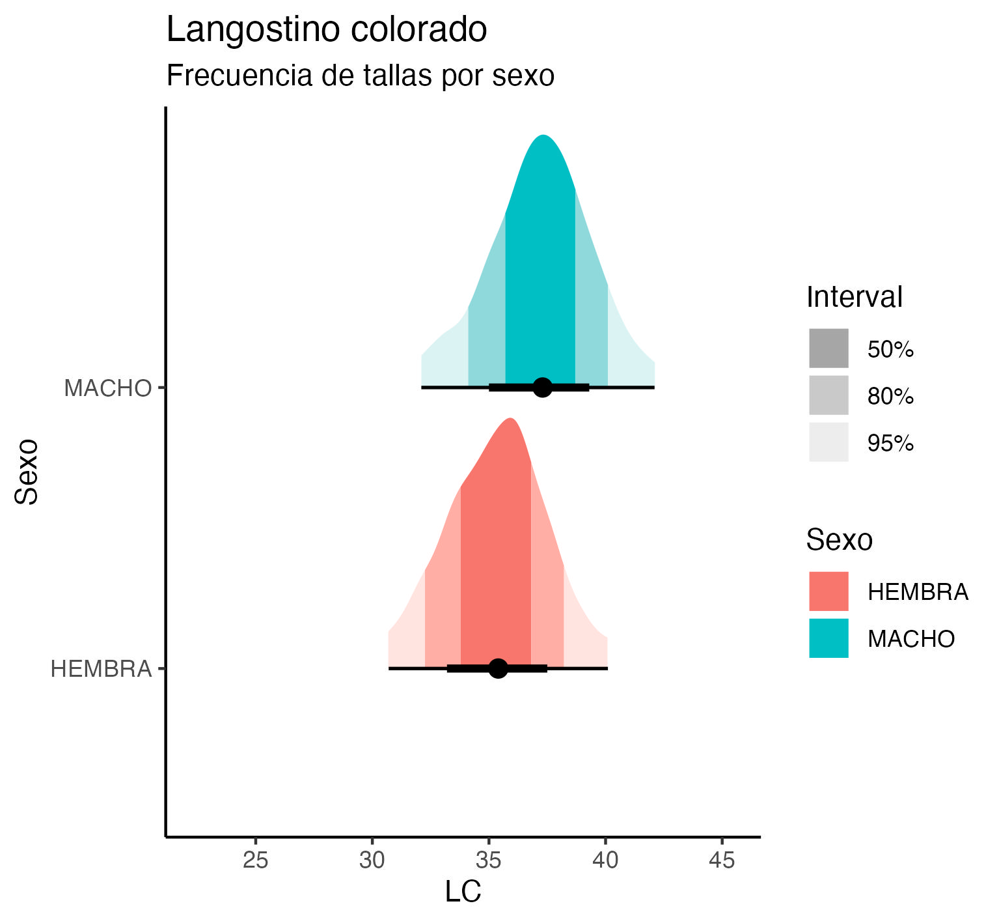
```


```{r echo=FALSE, fig.width=4,fig.height=5,out.width="70%",fig.cap=" Composición de tallas de langostino amarillo entre sexos, en abril de 2025",fig.align="center"}
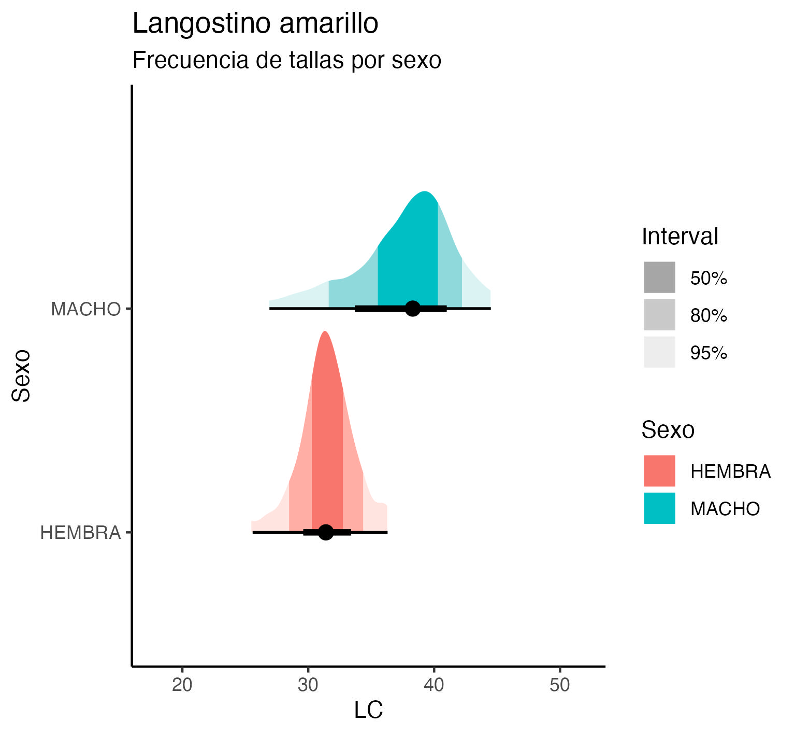
```


```{r echo=FALSE, fig.width=4,fig.height=5,out.width="70%",fig.cap="Composición de tallas de langostino colorado en la UPS por zonas de pesca en abril de 2025",fig.align="center"}
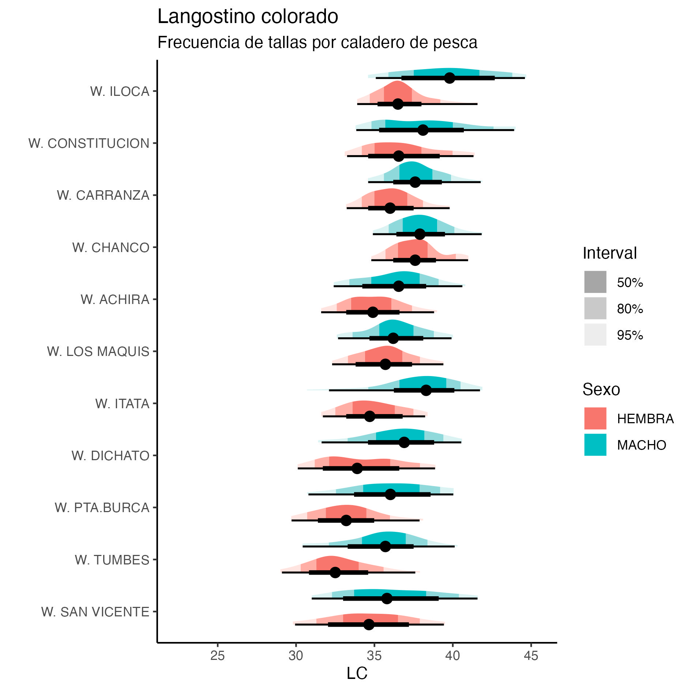
```


```{r echo=FALSE, fig.width=4,fig.height=5,out.width="80%",fig.cap="Composición de tallas de langostino amarillo en la UPS por zonas de pesca en abril de 2025",fig.align="center"}
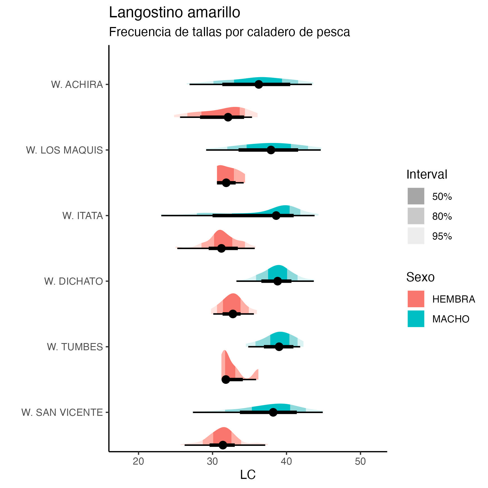
```


\newpage
## 3.4 Fauna acompañante

Las operaciones de pesca realizadas durante abril de 2025 por la flota de Crustaceos Pesca Sur evidenciaron la presencia de pejerrata, como fauna acompañante, en las zonas de Carranza, Achira, Itata, oeste de San Vicente y el Cañon norte (Fig. 13). Esta especie representó solo el 0.44 % del total de las capturas alcanzando un volumen de 4 toneladas. 

En cuanto a la ocurrencia de otros recursos como fauna acompañante destaca la alta presencia de  merluza y lenguado en la totalidad de caladeros visitados con valores entre los 50 y 200 kg/ha (Fig. 14).
Tambien hay presencia de otros recursos como la Jaiba Paco y Jaiba Limón pero en menor cantidad (en termino de unidades por hora de arrastre) como se muestra en la Figura 14.

```{r echo=FALSE, fig.width=4,fig.height=5,out.width="80%",fig.cap=" Distribución de los lances de pesca con captura de pejerrata en las capturas de camarón nailon, langostino colorado y langostino amarillo, y la fracción de pejerrata en las capturas totales, de abril año 2025",fig.align="center"}
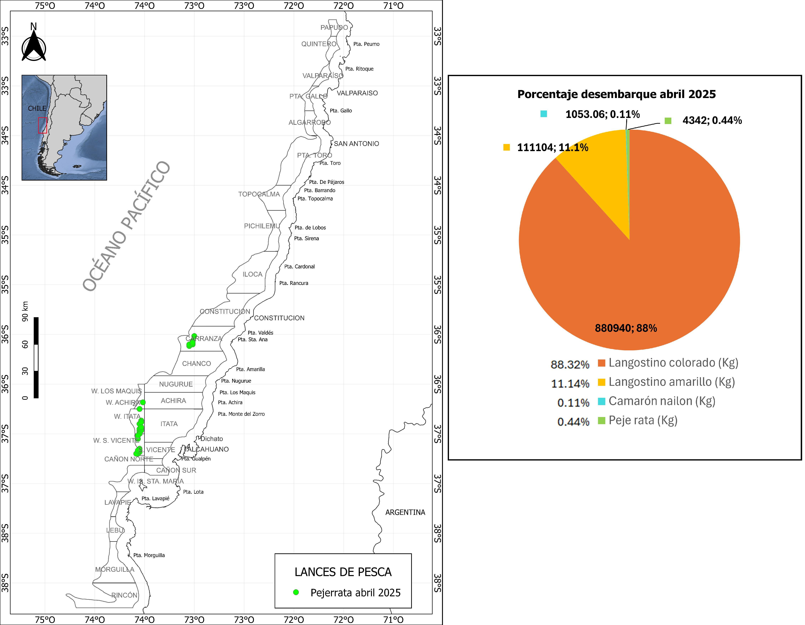
```


```{r echo=FALSE, fig.width=4,fig.height=5,out.width="110%",fig.cap=" Distribución espacial y abundancia de la fauna acompañante en los lances de pesca orientados a langostinos colorado y langostinos amarillos por la flota arrastrera de Crustaceos Pesca Sur, abril de 2025",fig.align="center"}
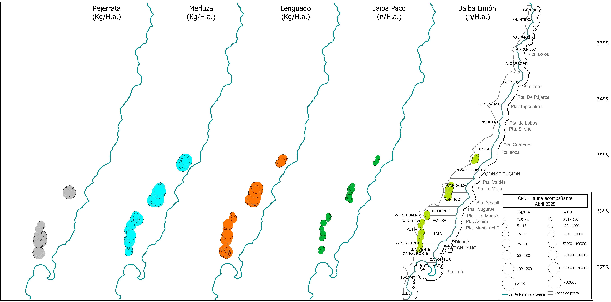
```


