\newpage

# 1 Resumen

Durante junio de 2025, las operaciones de pesca se realizaron entre las regiones del Biobío y el Maule, destacándose los caladeros de Iloca, Constitución, Carranza, Chanco, Nugurue y Achira. El esfuerzo pesquero estuvo principalmente dirigido al langostino colorado (95 % de los lances) de los cuales el 20 % correspondio a capturas mixtas junto a langostino amarillo y el 75% fue exclusivo de langostino colorado, el otro 3% correspondio a una captura exclusiva de camarón nailon.

Las capturas totales fueron lideradas por el langostino colorado con 722 toneladas y un rendimiento promedio de 1571 kg/ha. El camarón nailon sumó 18 toneladas con un rendimiento de 933 kg/ha, y el langostino amarillo alcanzó 5 toneladas.

En términos biológicos, predominó la proporción de hembras en langostino colorado  (67 %), mientras que en langostino amarillo prevalecieron los machos (97 %).  Las tallas medias de langostino colorado destacaron por comenzar con calibres altos sobre los 37,5 mm longitud del caparazón (LC), valor superior a los registrados en el comienzo de la temporada de pesca de los anteriores, y descender desde mayo para  continuar con esa tendencia durante junio a tallas medias de 34 mm LC en hembras y a 36 mm LC en machos

En términos reproductivos, el langostino colorado presentó un 85 % de hembras ovígeras, proporción similar a la del año anterior, lo que reafirma el adelanto del ciclo reproductivo. Por su parte, el langostino amarillo mostró un 40 % de hembras ovígeras, patrón  observado en temporadas previas.

Finalmente, destacó la presencia del pejerrata como fauna acompañante, representando aproximadamente un 0,34 % de las capturas totales, además de la alta presencia  de merluza y lenguado con valores entre los 25 y 100 kg/ha.

\newpage

# 2 Aspectos Pesqueros

## 2.1 Actividad pesquera


Las operaciones de pesca realizadas durante junio cubrieron los caladeros ubicados desde la región del Bío-Bío a la región de Maule, destacando los caladeros del oeste Iloca, Constitución, Carranza, Achira y el oeste de la isla Sta. María (Fig. 1). 

```{r echo=FALSE, fig.width=4,fig.height=5,out.width="65%", fig.cap="Distribución espacial del total de lances de pesca realizados durante junio de 2025",fig.align="center" }
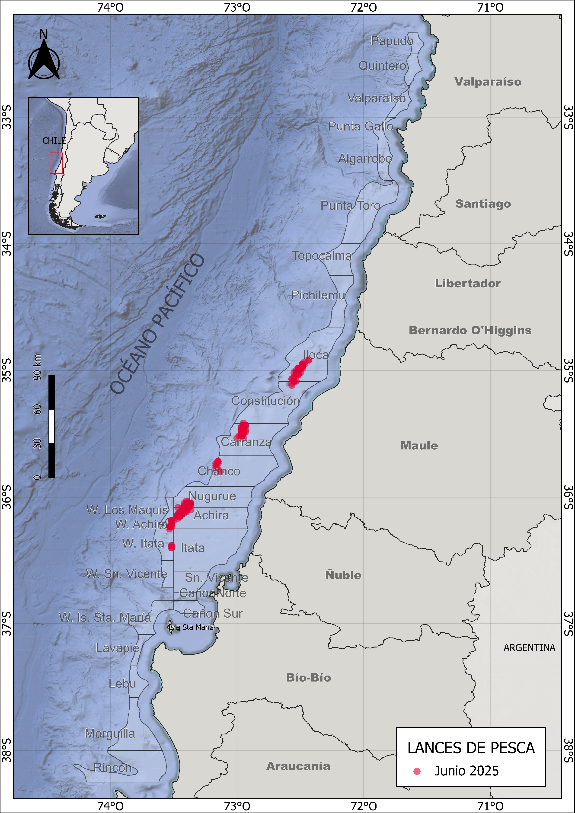
```

\newpage
## 2.2 Captura,esfuerzo y rendimientos de pesca

Durante junio de 2025, la actividad pesquera se centró principalmente en el langostino colorado. El 75 % de los lances se dirigió exclusivamente a esta especie, mientras que el 20 % correspondió a capturas mixtas de langostino colorado y langostino amarillo. Por su parte, el 3 % de los lances se orientó exclusivamente al camarón nailon y el 2 % restante al langostino amarillo (Fig. 2). 


```{r echo=FALSE, fig.width=3,fig.height=3,out.width="90%",fig.cap=" Distribución espacial de los lances de pesca orientados a langostino colorado, langostino amarillo y camarón nailon durante junio de 2025",fig.align="center"}
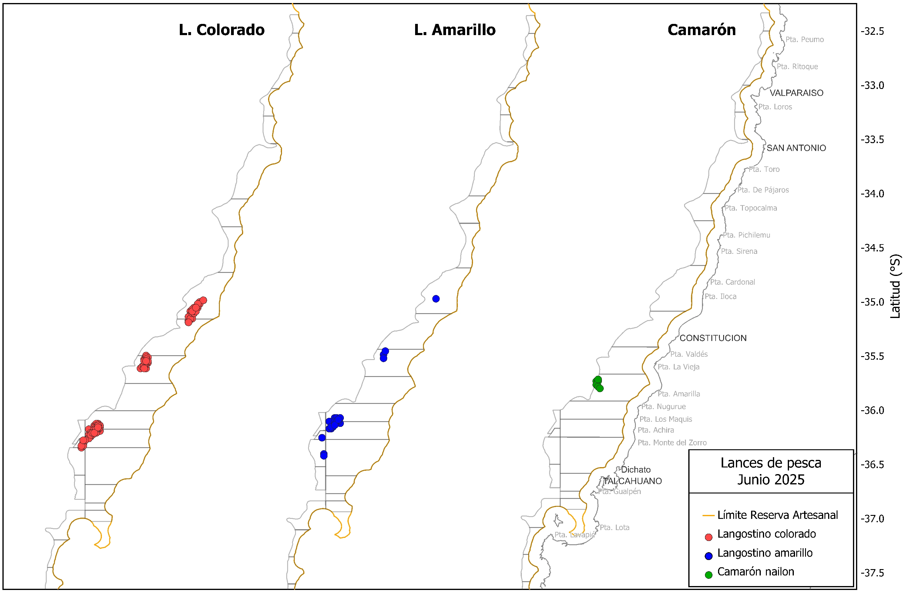
```


Las capturas por lance de langostino colorado variaron entre 330 y 7680 kg, alcanzando un total de 722 toneladas. El promedio por lance fue de 3523 kg, con un esfuerzo total de 460 horas de arrastre (ha) y un rendimiento de pesca de 1571 kg/ha (Tabla 1). En el caso del langostino amarillo, se registraron 47 lances que sumaron un total de 5 toneladas, con un rendimiento promedio de 55 kg/ha. Por su parte, el camarón nailon fue capturado en solo 8 lances, pero alcanzó una captura total de 18 toneladas y un rendimiento de 933 kg/ha (Tabla 1). 

\newpage

##### *Tabla 1. Indicadores operacionales de la pesquería de langostino colorado, langostino amarillo y camarón nailon, mayo 2025.*

|**Recurso**|**Mes**|**N° de lances(n)**|**Cap. (kg)**|**Cap.lances (kg/n)**|**h arrast.(ha)**|**Rend. (kg/ha)**|**Prof.de fondo(m)**| 
|--------|-------|--------|-------|---------|-------|------|-------|
|**L.colorado**|marzo|178|492941|2769|233|2118|220|
|              |abril|267|805486|3017|366|2202|210|
|              |mayo|254|792701|3121|513|1546|177|
|              |junio|205|722214|3523|460|1571|163|
|**L.amarillo**|marzo|124|102458|826|172|596|225|
|              |abril|200|89582|448|273|328|215|
|              |mayo|138|55002|399|280|197|167|
|              |junio|47|5796|123|104|55|156| 
|**Camarón**|marzo|44|30862|702|87|352|301|
|           |abril|7|1048|149|7|153|223|
|           |mayo|8|128|16|13|10|188|
|           |junio|8|18080|2260|19|933|315|

El rendimiento de pesca del langostino colorado osciló entre 431 y 16200 kg/ha, con una moda de 1650 kg/ha. El esfuerzo por lance varió entre 12 y 244 minutos, concentrándose mayoritariamente en torno a 2 horas y 20 minutos (Fig. 3). En el caso del langostino amarillo, el rendimiento fluctuó entre 6 y 324 kg/ha, con un esfuerzo predominante cercano a 2 horas y 11 minutos. Por su parte, el camarón nailon alcanzó un rendimiento máximo de 2293 kg/ha, concentrando su esfuerzo principalmente en torno a 2 horas y 41 minutos (Fig. 3).

```{r echo=FALSE,fig.width=4,fig.height=5,out.width="80%",fig.cap="Distribución de frecuencia del esfuerzo de pesca (en horas de arrastre, A) y del rendimiento (en kg/ha, B), para langostino colorado y langostino amarillo durante junio de 2025",fig.align="center"}
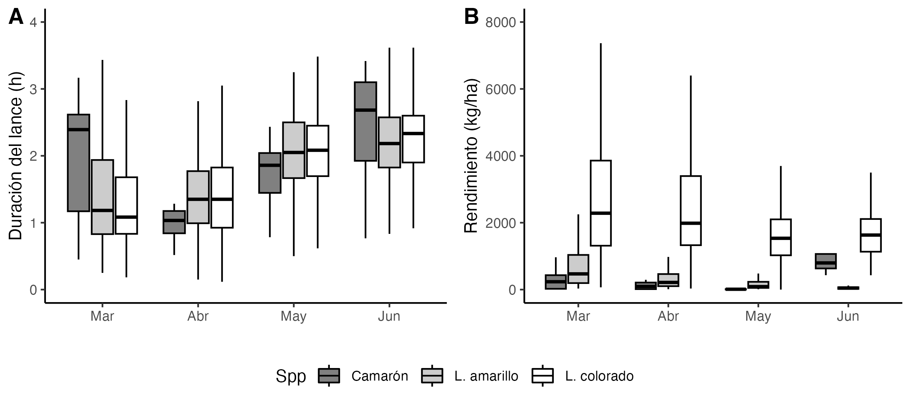
```


En cuanto a la distribución espacial del rendimiento de pesca durante junio, destacaron los caladeros de Iloca y Carranza por sus altos rendimientos de langostino colorado, con promedios entre 2000 y 2200 kg/ha (Fig. 4 y 5). En el caso del camarón nailon, las capturas se concentraron exclusivamente en el caladero de Chanco, con rendimientos entre 600 y 1100 kg/ha. Para el langostino amarillo, los mayores rendimientos se observaron al del oeste de Itata, con valores entre 250 y 350 kg/ha (Fig. 4 y 5).

```{r echo=FALSE,fig.width=4,fig.height=5,out.width="110%",fig.cap="Distribución del rendimiento de pesca (kg/ha) de langostino colorado, langostino amarillo y camarón nailon en junio de 2025",fig.align="center"}
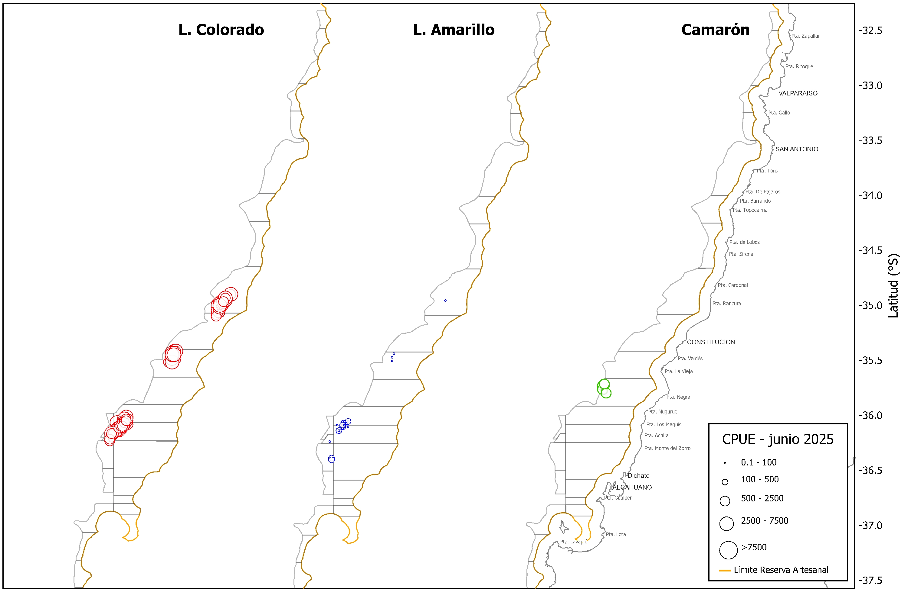
```


```{r echo=FALSE,fig.width=4,fig.height=5,out.width="100%",fig.cap="Rendimiento de pesca (captura por hora de arrastre) anual de langostino colorado (A), langostino amarillo (B) y camarón nailon (C), en los caladeros visitados de en la unidad de pesquería sur, junio de 2025",fig.align="center"}
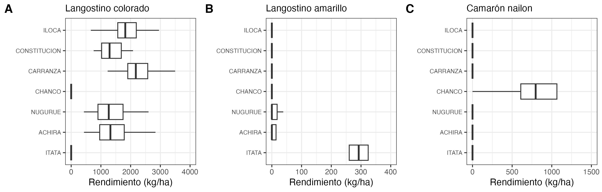
```

\newpage
# 3 Aspectos biológicos

Los indicadores biológicos incluyen la talla promedio por sexo, proporción sexual, estructura de tallas, estado de madurez de las hembras ovígeras y su proporción en las capturas. Los datos fueron obtenidos a partir de muestreos diarios aleatorios realizados sobre ejemplares capturados en las zonas visitadas por la flota. Se estableció un tamaño mínimo de muestra de 300 ejemplares, midiendo la longitud del cefalótorax con una precisión de 0,01 mm mediante un pie de metro. Además, los individuos fueron pesados (precisión 0,01 g), y se registró si estaban completos o incompletos. Se determinó el sexo de cada ejemplar y, en el caso de las hembras, se consignó la presencia de huevos (estado ovígero) y el grado de madurez de los mismos, según la escala de 4 puntos propuesta por Palma y Arana (1997).


## 3.1 Proporción sexual y talla promedio

Durante las capturas de junio de 2025, el langostino colorado presentó una proporción sexual favorable a las hembras, con un 67% del total. En contraste, en el langostino amarillo predominó la presencia de machos, alcanzando un 97% (Fig. 6,7).

En cuanto a las tallas promedio, el langostino colorado presentó longitudes cefalotorácicas entre 28 y 47 mm, con promedios de 36,7 mm en machos y 34,6 mm en hembras. En comparación con temporadas anteriores, las tallas medias al inicio de este año fueron particularmente altas, superando los 37 mm LC; sin embargo, durante junio se observó un descenso marcado en ambos sexos (Fig. 8). En el caso del langostino amarillo, los machos alcanzaron una talla promedio de 37,9 mm LC, superior a la registrada en hembras, que fue de 33,1 mm LC (Tabla 2, Fig. 8). Por su parte, en el camarón nailon, las hembras destacaron por presentar las mayores tallas promedio, con 27,3 mm LC, frente a los 25 mm observados en los machos.


##### *Tabla 2. Proporción sexual y talla promedio de langostino colorado, langostino amarillo y camarón nailon en las capturas de la UPS, 2025*

|   |Mes|Sexo|n|LC(mm)|DE(mm)|Min.(mm)|Max.(mm)|
|----|---|----|-|------|------|----------|----------|
|**L.colorado**|marzo|hembra|1590|38,2|2,66|24.6|44,7|
|               |    |macho|1316|37,9|4,09|25,6|46,4|
|               |abril|hembra|2037|35,2|2,33|22,3|42,6|
|               |     |macho|2337|37,1|2,36|29,3|44,3|
|               |mayo|hembra|2422|35,3|1,91|29,4|43,7|
|               |     |macho|1402|37,3|2,31|29,5|45,8|
|               |junio|hembra|2516|34,6|2,19,28,2|43,2|
|               |     |macho|1234|36,7|2,92|29,5|46,2|
|**L.amarillo**|marzo|hembra|85|33,3|2,61|29,3|40,3|
|             |    |macho|165|39,7|2,82|30,5|46,7|
|             |abril|hembra|297|31,4|2,58|19,6|44,6|
|             |     |macho|1043|37,4|4,38|17,7|51,9|
|             |mayo|hembra|282|35,4|2,84|25,6|43,5|
|             |    |macho|682|40,2|4,43|25,2|50,8|
|             |junio|hembra|5|33,1|2,62|31,3|36,3|
|             |     |macho|190|37,9|3,91|27,4|49,4|
|**Camarón**|marzo|hembra|164|29,7|2,33|24,8|35,6|
|           |     |macho|86|29,4|1,39|26,5|32,6|
|           |junio|hembra|206|27,3|2,15|23,0|34,9|
|           |     |macho|44|25,4|2,13|22,5|34,0|


```{r echo=FALSE,fig.width=4,fig.height=5,out.width="70%",fig.cap="Proporción sexual de langostino colorado (A) y langostino amarillo (B) durante junio de 2025",fig.align="center"}
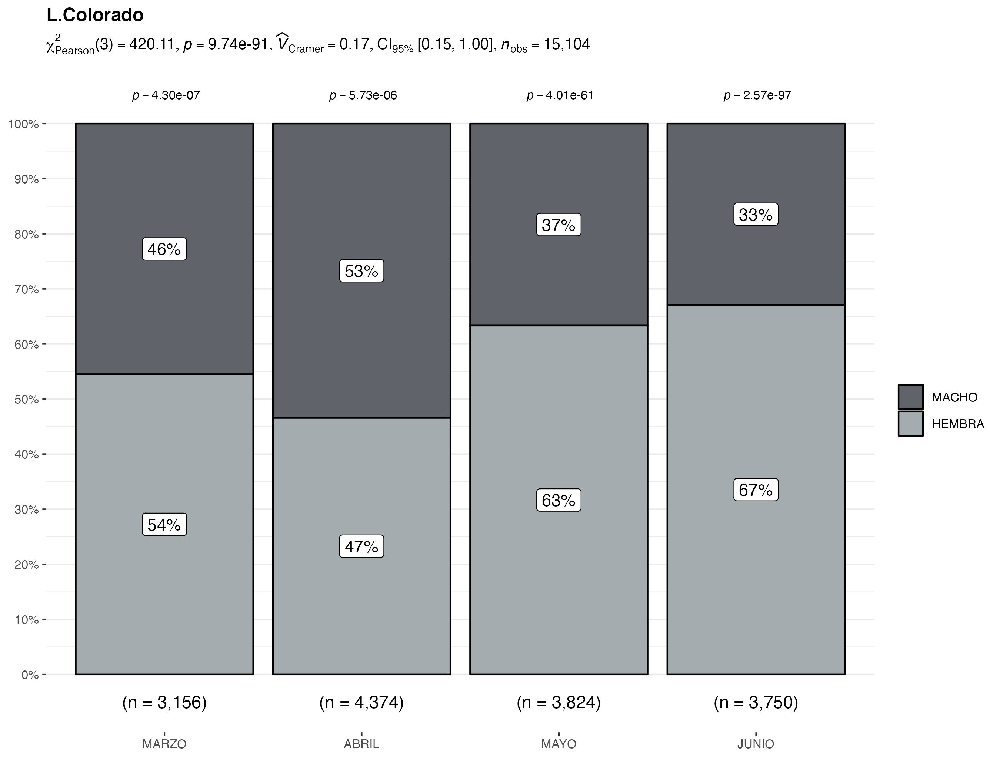
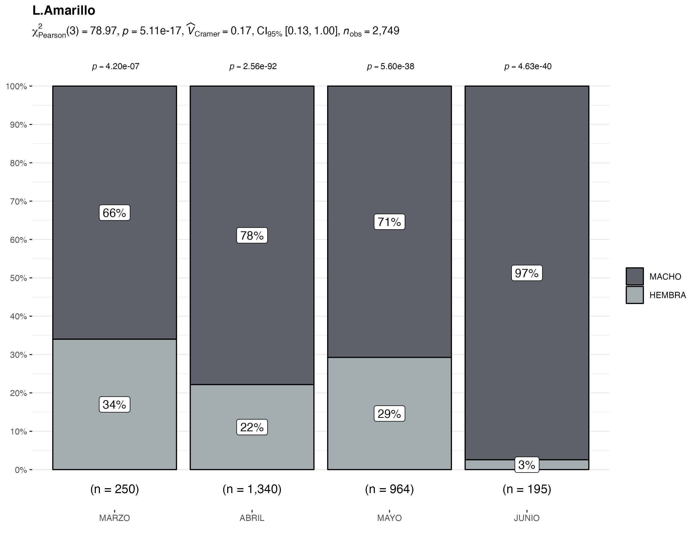

```

\newpage


```{r echo=FALSE,fig.width=4,fig.height=5,out.width="90%",fig.cap="Talla promedio (LC, mm) de langostino colorado y langostino amarillo por sexo, en el periodo enero 2016 a junio de 2025",fig.align="center"}
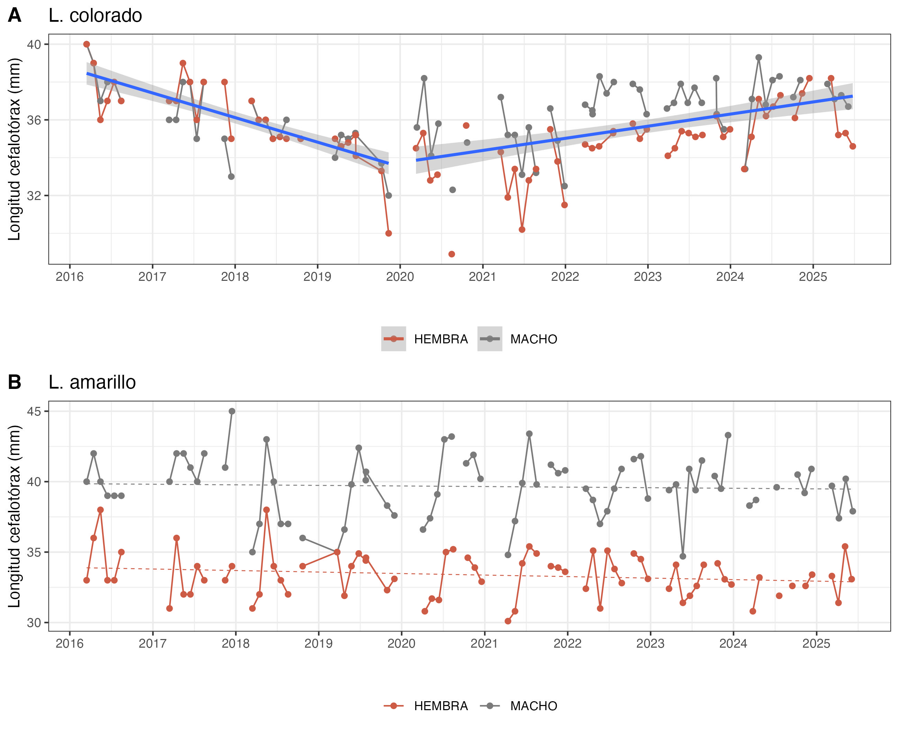
```

\newpage

## 3.2 Aspectos reproductivos

Durante junio de 2025, el 85 % de las hembras de langostino colorado se encontraron en estado ovígero, una proporción similar a la observada en el mismo período del año anterior (Fig. 9, Tabla 3). En el caso del langostino amarillo, el 40 % de las hembras registradas se encontraban ovígeras, manteniéndose en línea con el patrón histórico observado para esta especie en dicho mes (Tabla 3).

```{r echo=FALSE, fig.width=4,fig.height=5,out.width="50%",fig.cap="Hembras ovígeras de langostino colorado y langostino amarillo durante junio 2025, en comparacion con la media registrada entre los años 2017 a 2023 (línea verde)",fig.align="center"}
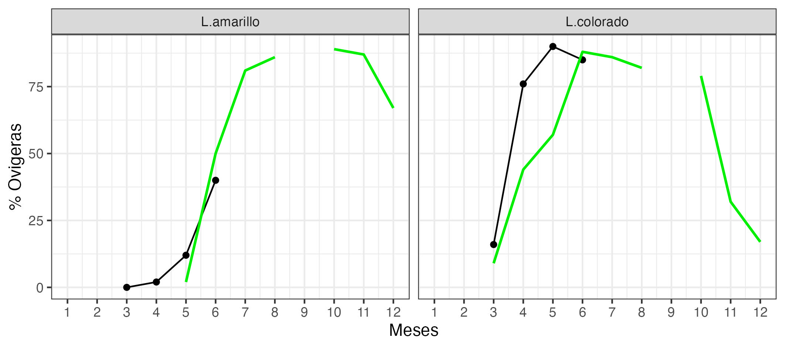
```

##### *Tabla 3. Porcentaje de hembras ovígeras y hembras maduras de langostino colorado y amarillo UPS 2025.*

| **Recurso**    | **Estado**   | **mar.** |**abr.**|**may.**|**jun.**|
|----------------|------------ |--------|--------|--------|--------|
| **L.colorado** | Normal       | 83%   | 21%|7%|  8%|
|                | Ovígeras     | 16%       |76%|90%|85%|
|                | Madura       | 1%        |3%| 3%|7%|
| Total n°       |              | 1590       |2037|2422|2566|
| **L.amarillo** | Normal       | 100%      | 98%|7%|60%|
|                | Ovígeras     | 0%        | 2%|12%|40%|
|                | Madura       | 0%        |0%|1%|0%|
| Total n°       |              | 85        |297|282|5|


\newpage

## 3.3. Composición de tallas

El análisis de tallas del langostino colorado, langostino amarillo y camarón nailon mostró diferencias significativas entre sexos (prueba t de Student, p < 0,05). En el langostino colorado, los machos alcanzaron una talla media de 37 mm LC, mayor que la de las hembras, que fue de 35 mm LC (Fig. 10). De manera similar, en el langostino amarillo los machos presentaron un promedio de 37 mm LC, mientras que las hembras alcanzaron 33 mm LC (Tabla 2, Fig. 11). En cambio, en el camarón nailon las hembras registraron las mayores tallas promedio, superando a los machos (Tabla 2, Fig. 12).

En cuanto a la composición de tallas por zona de pesca, el langostino colorado presentó las tallas modales más pequeñas en el caladero de Los Maquis, mientras que las tallas más grandes se registraron en las zonas al oeste de Iloca y Carranza (Fig. 13). Para el langostino amarillo y el camarón nailon no fue posible realizar este análisis por caladero, debido al escaso número de hembras muestreadas en el caso del langostino amarillo, y a que las muestras biológicas de camarón nailon provinieron únicamente del caladero de Chanco.

```{r echo=FALSE, fig.width=4,fig.height=5,out.width="70%",fig.cap=" Composición de tallas de langostino colorado entre sexos, en junio de 2025",fig.align="center"}
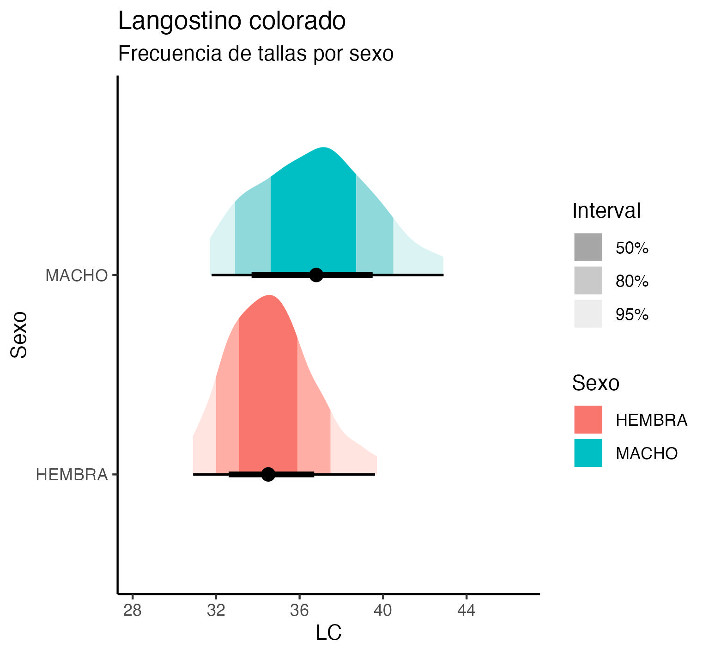
```


```{r echo=FALSE, fig.width=4,fig.height=5,out.width="70%",fig.cap=" Composición de tallas de langostino amarillo entre sexos, en junio de 2025",fig.align="center"}
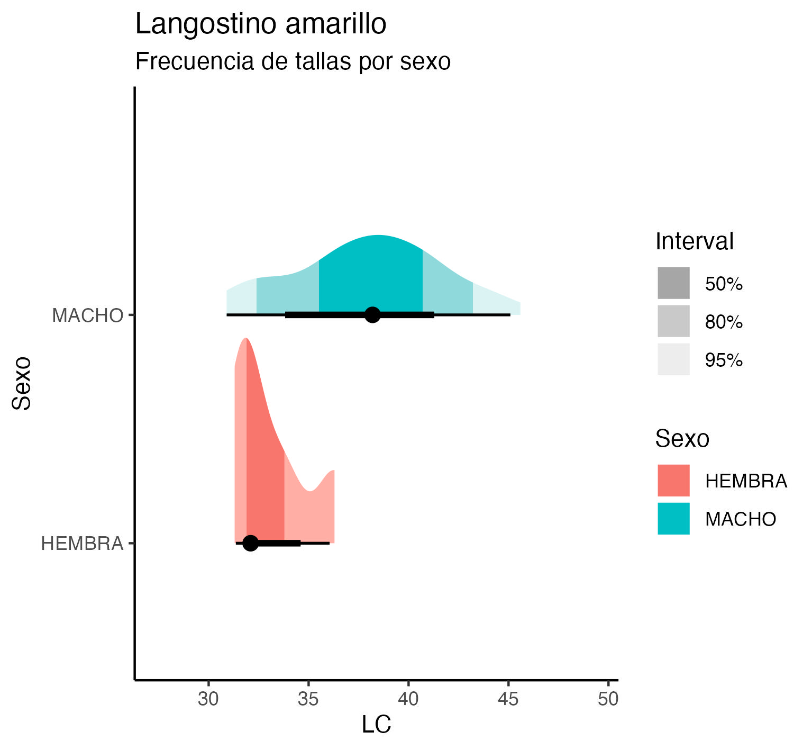
```

```{r echo=FALSE, fig.width=4,fig.height=5,out.width="80%",fig.cap="Composición de tallas de camarón nailon entre sexos, en junio de 2025",fig.align="center"}
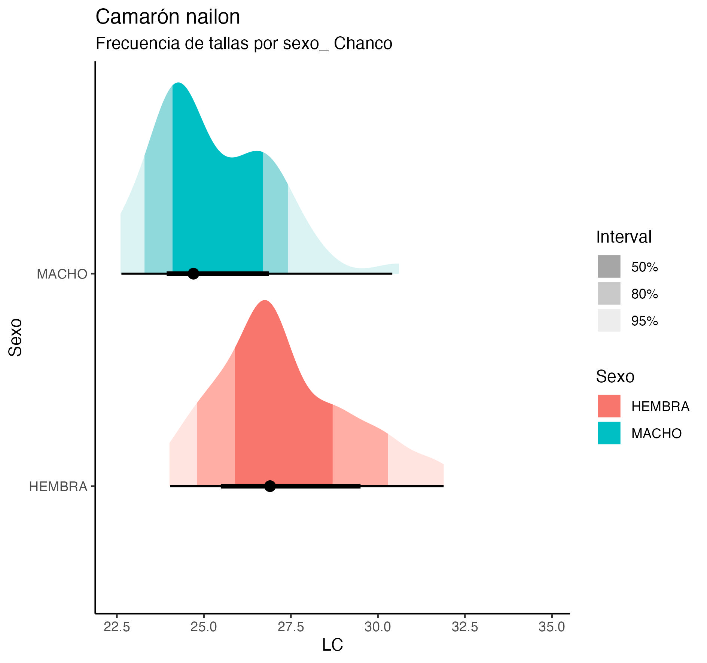
```


```{r echo=FALSE, fig.width=4,fig.height=5,out.width="70%",fig.cap="Composición de tallas de langostino colorado en la UPS por zonas de pesca en junio de 2025",fig.align="center"}
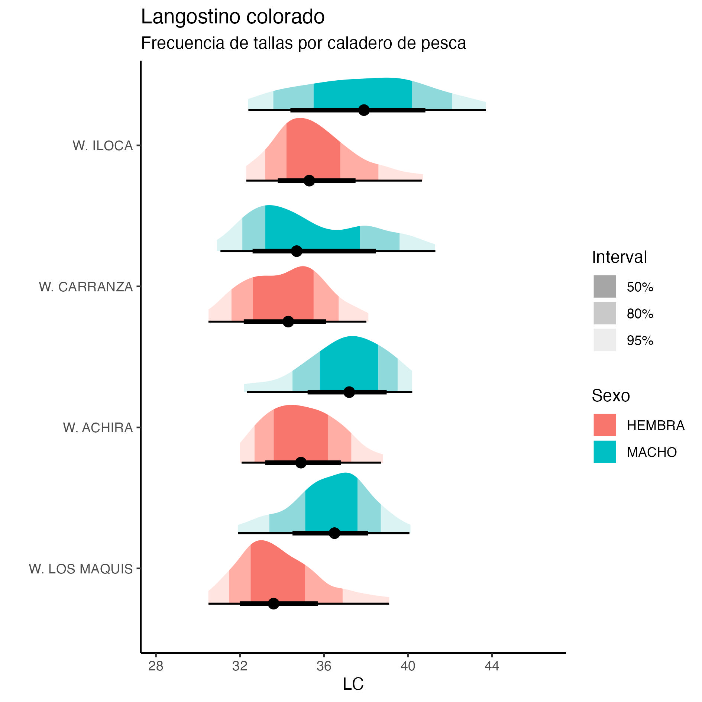
```


\newpage
## 3.4 Fauna acompañante

Las operaciones de pesca realizadas durante junio de 2025 por la flota de Crustaceos Pesca Sur evidenciaron la presencia de pejerrata, como fauna acompañante, en el caladero de Chanco (Fig. 14). Esta especie representó solo el 0.34 % del total de las capturas alcanzando un volumen de 2 toneladas. 

En cuanto a la ocurrencia de otros recursos como fauna acompañante destaca la alta presencia de  merluza y lenguado en la totalidad de caladeros visitados con valores entre los 50 y 100 kg/ha (Fig. 15).
Tambien hay presencia de otros recursos como la Jaiba Paco y Jaiba Limón pero en menor cantidad (en termino de unidades por hora de arrastre) como se muestra en la Figura 15.

```{r echo=FALSE, fig.width=4,fig.height=5,out.width="80%",fig.cap=" Distribución de los lances de pesca con captura de pejerrata en las capturas de camarón nailon, langostino colorado y langostino amarillo, y la fracción de pejerrata en las capturas totales, de junio año 2025",fig.align="center"}
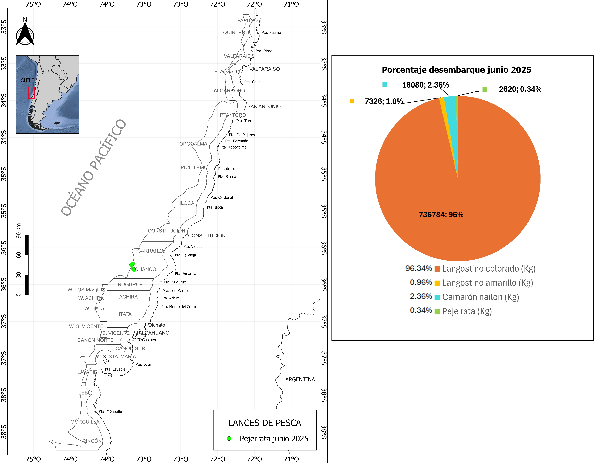
```


```{r echo=FALSE, fig.width=4,fig.height=5,out.width="110%",fig.cap=" Distribución espacial y abundancia de la fauna acompañante en los lances de pesca orientados a langostinos colorado y langostinos amarillos por la flota arrastrera de Camanchaca Pesca Sur, junio de 2025",fig.align="center"}
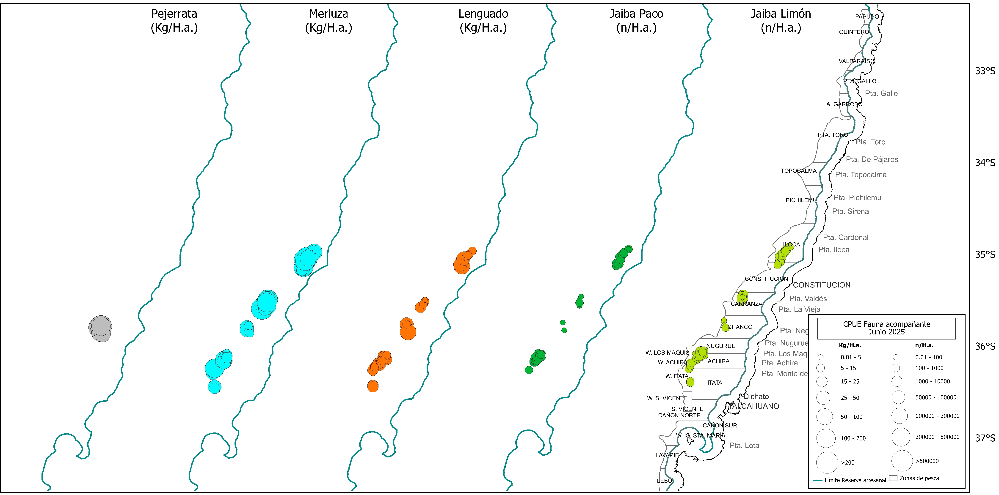
```


