\newpage

# 1 Resumen

Durante julio de 2025, la flota arrastrera de Camanchaca Pesca Sur operó entre las regiones de Ñuble y Valparaíso, concentrando sus actividades en los caladeros de Punta Toro, Iloca y Carranza. La pesquería se dirigió principalmente al langostino colorado, con la mayor parte de los lances orientados exclusivamente a este recurso y el resto distribuido en capturas mixtas con langostino amarillo y, en menor medida, camarón nailon. El langostino colorado alcanzó las mayores capturas y rendimientos, mientras que el langostino amarillo mostró rendimientos intermedios y el camarón nailon una participación acotada en las capturas totales. 

En términos biológicos, ambas especies de langostino presentaron proporciones sexuales favorables a las hembras y tallas medias altas, destacando en langostino colorado longitudes cefalotorácicas cercanas a 37–39 mm de longitud del caparazón (LC) y en langostino amarillo machos en torno a 41 mm LC. El porcentaje de hembras ovígeras fue elevado en ambas especies (sobre 85 %), consistente con un período de máxima actividad reproductiva. La fauna acompañante se caracterizó por una alta presencia de merluza y lenguado en la mayoría de los caladeros y por registros puntuales de pejerrata y jaibas en bajas proporciones.

\newpage

# 2 Aspectos Pesqueros

## 2.1 Actividad pesquera


Las operaciones de pesca realizadas durante julio cubrieron los caladeros ubicados desde la región del Ñuble a la región de Valparaíso, destacando los caladeros de Punta Toro, Iloca y Carranza (Fig. 1). 

```{r echo=FALSE, fig.width=4,fig.height=5,out.width="65%", fig.cap="Distribución espacial del total de lances de pesca realizados durante julio de 2025",fig.align="center" }
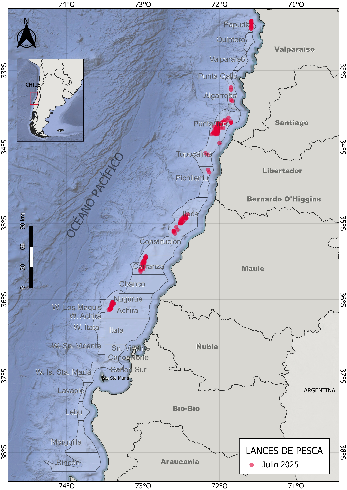
```

\newpage
## 2.2 Captura,esfuerzo y rendimientos de pesca

Durante julio de 2025, la actividad pesquera se concentró principalmente en el langostino colorado. El 57 % de los lances se dirigió exclusivamente a esta especie, el 35 % correspondió a capturas mixtas de langostino colorado y langostino amarillo, y un 3 % registró capturas conjuntas de ambas especies de langostino junto con camarón nailon (Fig. 2). 


```{r echo=FALSE, fig.width=3,fig.height=3,out.width="90%",fig.cap=" Distribución espacial de los lances de pesca orientados a langostino colorado, langostino amarillo y camarón nailon durante julio de 2025",fig.align="center"}
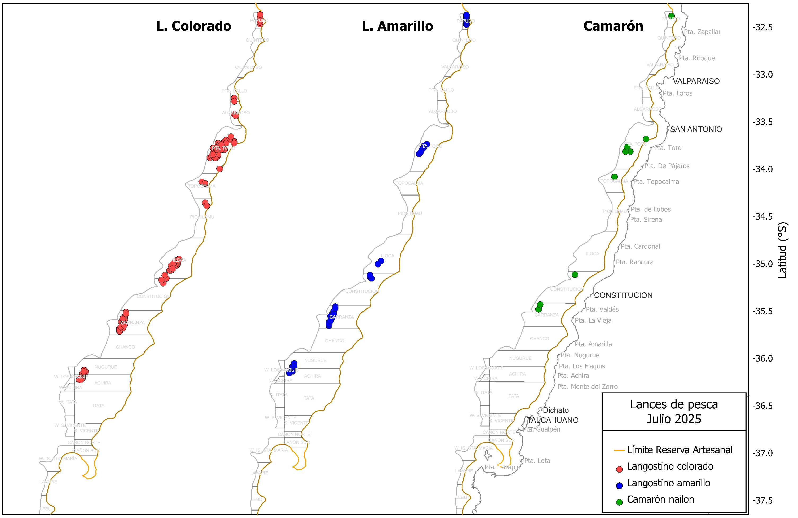
```


Las capturas por lance de langostino colorado variaron entre 32 y 8240 kg, alcanzando un total de 781 toneladas. El promedio por lance fue de 3600 kg, con un esfuerzo total de 503 horas de arrastre (ha) y un rendimiento de pesca de 1551 kg/ha (Tabla 1). En el caso del langostino amarillo, se registraron 75 lances que sumaron un total de 112 toneladas, con un rendimiento promedio de 693 kg/ha. Por su parte, el camarón nailon fue capturado en solo 12 lances, alcanzando una captura total de 315 toneladas y un rendimiento de 14 kg/ha (Tabla 1). 

\newpage

##### *Tabla 1. Indicadores operacionales de la pesquería de langostino colorado, langostino amarillo y camarón nailon, año 2025.*

|**Recurso**|**Mes**|**N° de lances(n)**|**Cap. (kg)**|**Cap.lances (kg/n)**|**h arrast.(ha)**|**Rend. (kg/ha)**|**Prof.de fondo(m)**| 
|--------|-------|--------|-------|---------|-------|------|-------|
|**L.colorado**|marzo|178|492941|2769|233|2118|220|
|              |abril|267|805486|3017|366|2202|210|
|              |mayo|254|792701|3121|513|1546|177|
|              |junio|205|722214|3523|460|1571|163|
|              |julio|210|736028|3504|487|1510|157|
|**L.amarillo**|marzo|124|102458|826|172|596|225|
|              |abril|200|89582|448|273|328|215|
|              |mayo|138|55002|399|280|197|167|
|              |junio|47|5796|123|104|55|156| 
|              |julio|75|112455|1499|167|693|178|
|**Camarón**|marzo|44|30862|702|87|352|301|
|           |abril|7|1048|149|7|153|223|
|           |mayo|8|128|16|13|10|188|
|           |junio|8|18080|2260|19|933|315|
|           |julio|12|315|26|22|14|178|

El rendimiento de pesca del langostino colorado osciló entre 17 y 5520 kg/ha, con una moda de 1562 kg/ha. El esfuerzo por lance varió entre 14 y 1441 minutos, concentrándose mayoritariamente en torno a 2 horas y 20 minutos (Fig. 3). En el caso del langostino amarillo, el rendimiento fluctuó entre 6 y 3261 kg/ha, con un esfuerzo predominante cercano a 2 horas y 13 minutos. Por su parte, el camarón nailon alcanzó un rendimiento máximo de 80 kg/ha, concentrando su esfuerzo principalmente en torno a 2 horas y 26 minutos (Fig. 3).

```{r echo=FALSE,fig.width=4,fig.height=5,out.width="80%",fig.cap="Distribución de frecuencia del esfuerzo de pesca (en horas de arrastre, A) y del rendimiento (en kg/ha, B), para langostino colorado y langostino amarillo durante el año 2025",fig.align="center"}
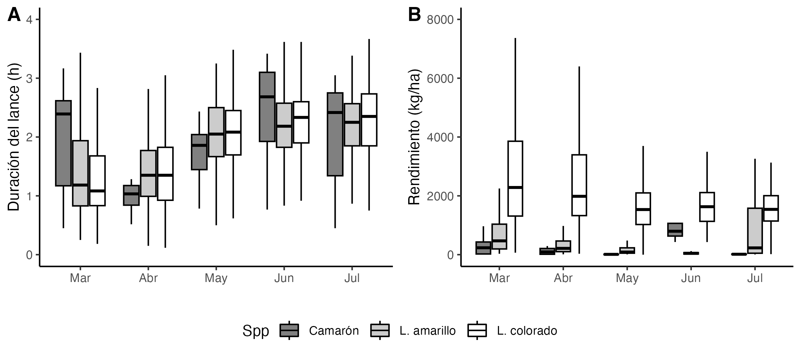
```


En cuanto a la distribución espacial del rendimiento de pesca durante julio, destacaron los caladeros de Iloca y Carranza por sus altos rendimientos de langostino colorado, con promedios entre 1500 y 2500 kg/ha (Fig. 4 y 5). En el caso del camarón nailon, las capturas se concentraron exclusivamente en el caladero de Topocalma, con rendimientos entre 25 y 60 kg/ha. Para el langostino amarillo, los mayores rendimientos se observaron en Papudo y Constitución, con valores entre 500 y 2500 kg/ha (Fig. 4 y 5).

```{r echo=FALSE,fig.width=4,fig.height=5,out.width="110%",fig.cap="Distribución del rendimiento de pesca (kg/ha) de langostino colorado, langostino amarillo y camarón nailon en julio de 2025",fig.align="center"}
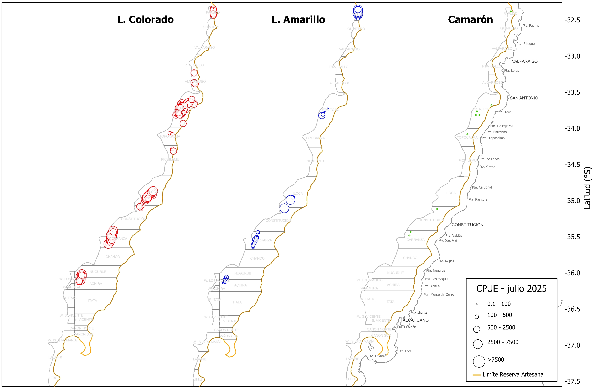
```


```{r echo=FALSE,fig.width=4,fig.height=5,out.width="100%",fig.cap="Rendimiento de pesca (captura por hora de arrastre) anual de langostino colorado (A), langostino amarillo (B) y camarón nailon (C), en los caladeros visitados de en la unidad de pesquería sur, julio de 2025",fig.align="center"}
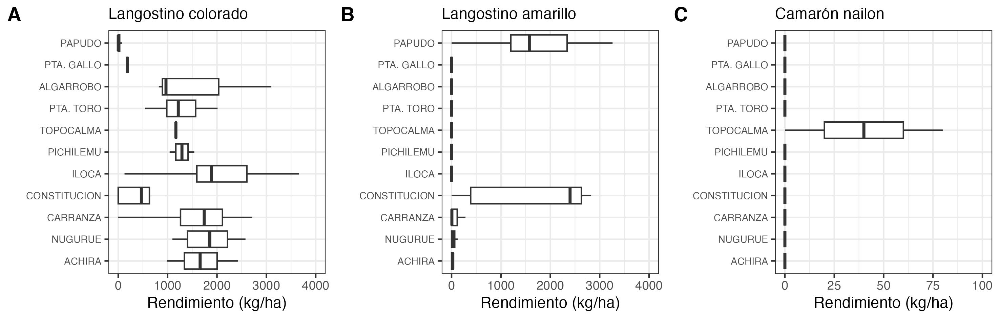
```

\newpage
# 3 Aspectos biológicos

Los indicadores biológicos incluyen la talla promedio por sexo, proporción sexual, estructura de tallas, estado de madurez de las hembras ovígeras y su proporción en las capturas. Los datos fueron obtenidos a partir de muestreos diarios aleatorios realizados sobre ejemplares capturados en las zonas visitadas por la flota. Se estableció un tamaño mínimo de muestra de 300 ejemplares, midiendo la longitud del cefalótorax con una precisión de 0,01 mm mediante un pie de metro. Además, los individuos fueron pesados (precisión 0,01 g), y se registró si estaban completos o incompletos. Se determinó el sexo de cada ejemplar y, en el caso de las hembras, se consignó la presencia de huevos (estado ovígero) y el grado de madurez de los mismos, según la escala de 4 puntos propuesta por Palma y Arana (1997).


## 3.1 Proporción sexual y talla promedio

Durante las capturas de julio de 2025, el langostino colorado al igual que el langostino amarillo presentaron una  proporción sexual favorable a las hembras, con un 68% y 57% respectivamente (Fig. 6).

En cuanto a las tallas promedio, el langostino colorado presentó longitudes cefalotorácicas entre 28 y 47 mm, con promedios de 38,5 mm en machos y 36,9 mm en hembras. En relación con temporadas anteriores, las tallas medias al inicio de este año fueron inusualmente altas, con valores superiores a 37 mm LC. Posteriormente, en junio se observó una reducción evidente en ambos sexos, seguida de un nuevo incremento de las tallas durante julio (Fig. 7). En el caso del langostino amarillo, los machos alcanzaron una talla promedio de 41,1 mm LC, superior a la registrada en hembras, que fue de 34,4 mm LC (Tabla 2, Fig. 7). 


##### *Tabla 2. Proporción sexual y talla promedio de langostino colorado, langostino amarillo y camarón nailon en las capturas de la UPS, 2025*

|   |Mes|Sexo|n|LC(mm)|DE(mm)|Min.(mm)|Max.(mm)|
|----|---|----|-|------|------|----------|----------|
|**L.colorado**|marzo|hembra|1590|38,2|2,66|24.6|44,7|
|               |    |macho|1316|37,9|4,09|25,6|46,4|
|               |abril|hembra|2037|35,2|2,33|22,3|42,6|
|               |     |macho|2337|37,1|2,36|29,3|44,3|
|               |mayo|hembra|2422|35,3|1,91|29,4|43,7|
|               |     |macho|1402|37,3|2,31|29,5|45,8|
|               |junio|hembra|2516|34,6|2,19|28,2|43,2|
|               |     |macho|1234|36,7|2,92|29,5|46,2|
|               |julio|hembra|3725|36,9|2,19|30,4|44,5|
|               |     |macho|1720|38,5|2,80|28,8|46,5|
|**L.amarillo**|marzo|hembra|85|33,3|2,61|29,3|40,3|
|             |    |macho|165|39,7|2,82|30,5|46,7|
|             |abril|hembra|297|31,4|2,58|19,6|44,6|
|             |     |macho|1043|37,4|4,38|17,7|51,9|
|             |mayo|hembra|282|35,4|2,84|25,6|43,5|
|             |    |macho|682|40,2|4,43|25,2|50,8|
|             |junio|hembra|5|33,1|2,62|31,3|36,3|
|             |     |macho|190|37,9|3,91|27,4|49,4|
|             |julio|hembra|756|34,4|2,21|29,3|42,5|
|             |     |macho|575|41,1|2,95|30,4|48,6|
|**Camarón**|marzo|hembra|164|29,7|2,33|24,8|35,6|
|           |     |macho|86|29,4|1,39|26,5|32,6|
|           |junio|hembra|206|27,3|2,15|23,0|34,9|
|           |     |macho|44|25,4|2,13|22,5|34,0|


```{r echo=FALSE,fig.width=4,fig.height=5,out.width="70%",fig.cap="Proporción sexual de langostino colorado (A) y langostino amarillo (B) durante julio de 2025",fig.align="center"}
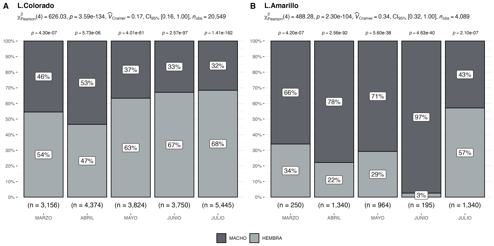

```

\newpage


```{r echo=FALSE,fig.width=4,fig.height=5,out.width="90%",fig.cap="Talla promedio (LC, mm) de langostino colorado y langostino amarillo por sexo, en el periodo enero 2016 a julio de 2025",fig.align="center"}
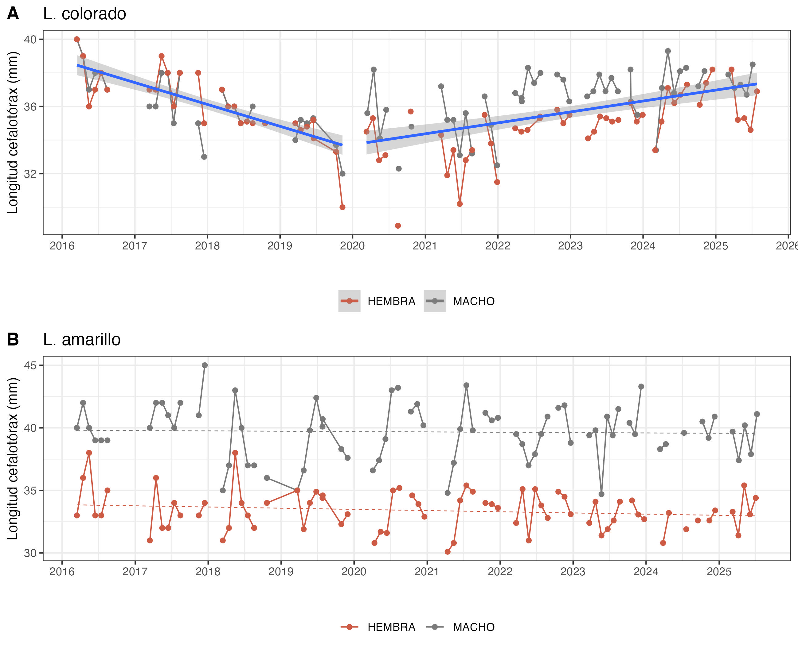
```

\newpage

## 3.2 Aspectos reproductivos

Durante julio de 2025, el 93 % de las hembras de langostino colorado se encontraron en estado ovígero, una proporción similar a la observada en el mismo período del año anterior (Fig. 8, Tabla 3). En el caso del langostino amarillo, el 88 % de las hembras registradas se encontraban ovígeras, manteniéndose en línea con el patrón histórico observado para esta especie en dicho mes (Tabla 3).

```{r echo=FALSE, fig.width=4,fig.height=5,out.width="70%",fig.cap="Hembras ovígeras de langostino colorado y langostino amarillo durante el año 2025, en comparacion con la media registrada entre los años 2017 a 2023 (línea verde)",fig.align="center"}
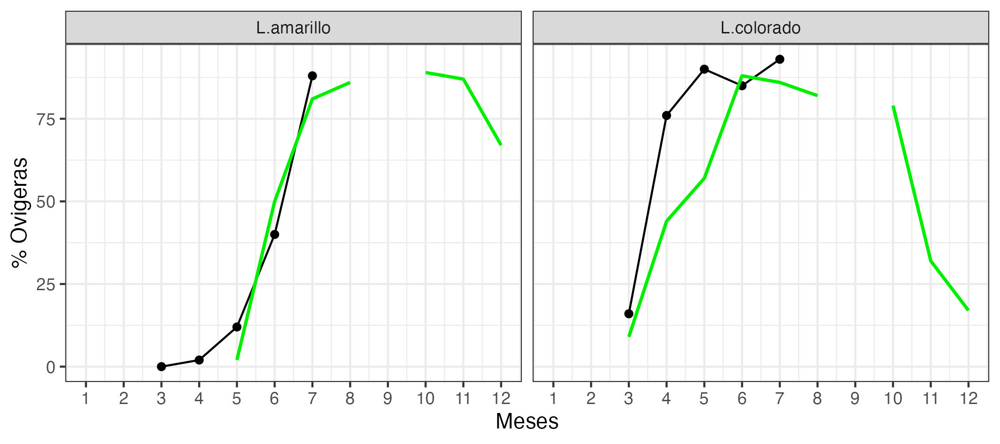
```

##### *Tabla 3. Porcentaje de hembras ovígeras y hembras maduras de langostino colorado y amarillo UPS 2025.*

| **Recurso**    | **Estado**   | **mar.** |**abr.**|**may.**|**jun.**|**jul.**|
|----------------|------------ |--------|--------|--------|--------|--------|
| **L.colorado** | Normal       | 83%   | 21%|7%|  8%|3%|
|                | Ovígeras     | 16%       |76%|90%|85%|93%|
|                | Madura       | 1%        |3%| 3%|7%|4%|
| Total n°       |              | 1590       |2037|2422|2566|3725|
| **L.amarillo** | Normal       | 100%      | 98%|7%|60%|2%|
|                | Ovígeras     | 0%        | 2%|12%|40%|88%|
|                | Madura       | 0%        |0%|1%|0%|10%|
| Total n°       |              | 85        |297|282|5|765|


\newpage

## 3.3. Composición de tallas

El análisis de tallas del langostino colorado, langostino amarillo y camarón nailon mostró diferencias significativas entre sexos (prueba t de Student, p < 0,05). En el langostino colorado, los machos alcanzaron una talla media de 38 mm LC, mayor que la de las hembras, que fue de 36 mm LC (Fig. 9). De manera similar, en el langostino amarillo los machos presentaron un promedio de 41 mm LC, mientras que las hembras alcanzaron 34 mm LC (Tabla 2, Fig. 10). 

En cuanto a la composición de tallas por zona de pesca, el langostino colorado presentó las tallas modales más pequeñas en el caladero de Achira, mientras que las tallas más grandes se registraron en las zonas al oeste de Iloca y Carranza (Fig. 11). Para el langostino amarillo, los caladeros de Punta Toro y Papudo destacaron por presentar las mayores tallas en machos, mientras que en el caso de las hembras las tallas más altas se observaron en Papudo (Fi.12).

```{r echo=FALSE, fig.width=4,fig.height=5,out.width="70%",fig.cap=" Composición de tallas de langostino colorado entre sexos, en julio de 2025",fig.align="center"}
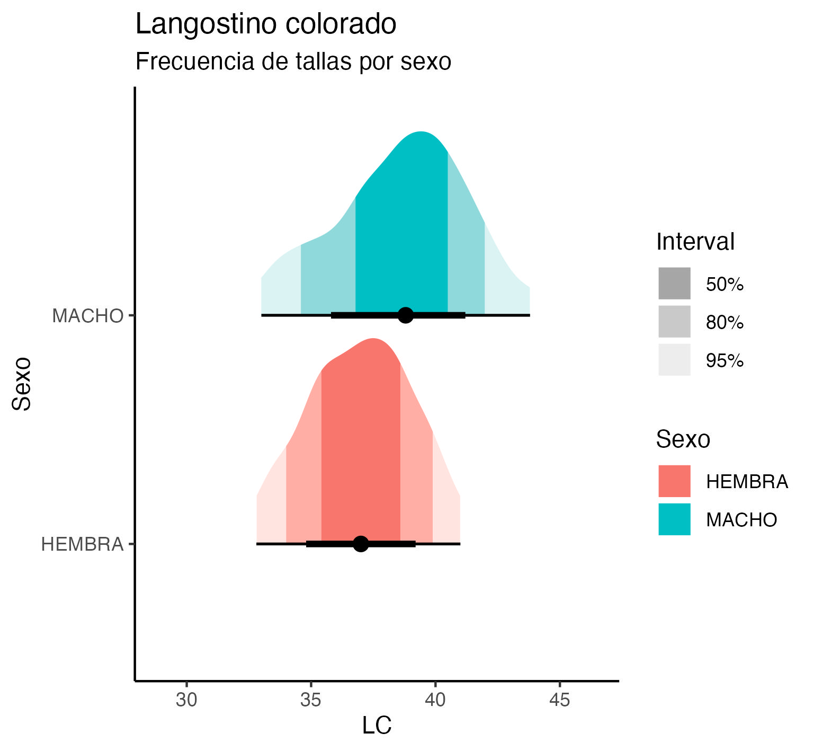
```


```{r echo=FALSE, fig.width=4,fig.height=5,out.width="70%",fig.cap=" Composición de tallas de langostino amarillo entre sexos, en julio de 2025",fig.align="center"}
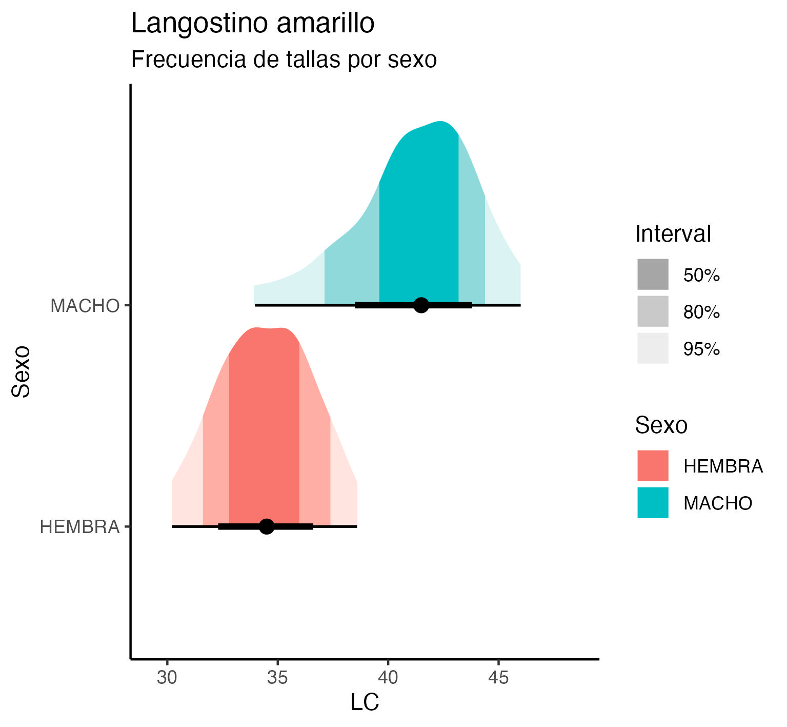
```


```{r echo=FALSE, fig.width=4,fig.height=5,out.width="70%",fig.cap="Composición de tallas de langostino colorado en la UPS por zonas de pesca en julio de 2025",fig.align="center"}
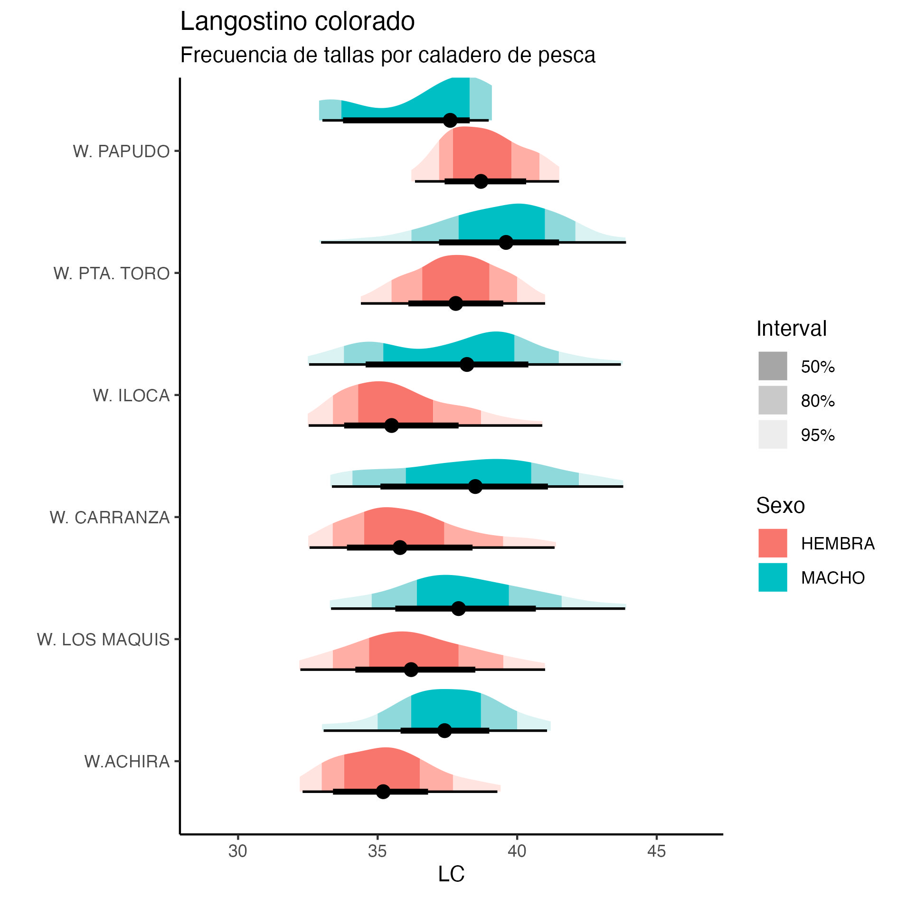
```

```{r echo=FALSE, fig.width=4,fig.height=5,out.width="70%",fig.cap="Composición de tallas de langostino amarillo en la UPS por zonas de pesca en julio de 2025",fig.align="center"}
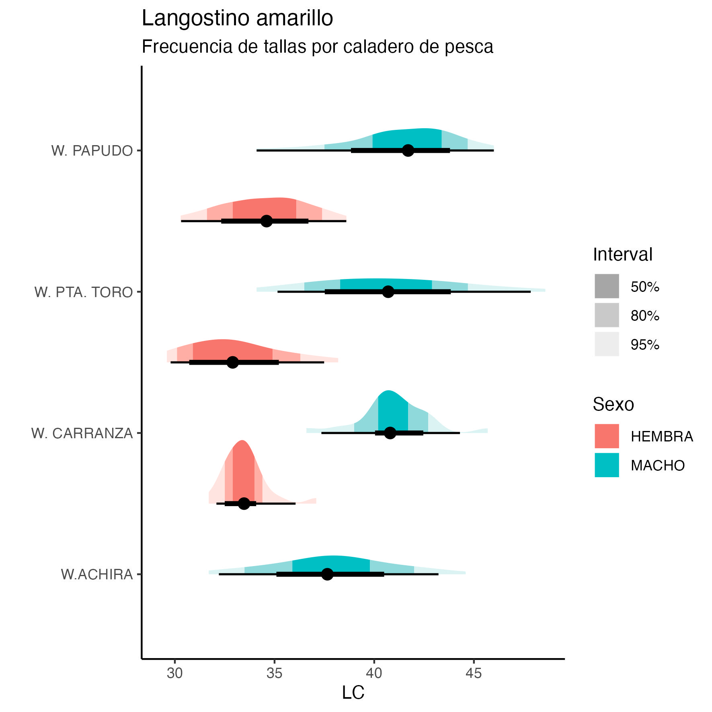
```


\newpage
## 3.4 Fauna acompañante

Las operaciones de pesca realizadas durante julio de 2025 por la flota de Crustaceos Pesca Sur evidenciaron la presencia de pejerrata, como fauna acompañante, en el caladero de Achira (Fig. 13). Esta especie representó solo el 0.01 % del total de las capturas alcanzando un volumen de 60 kg. 

En cuanto a la ocurrencia de otros recursos como fauna acompañante destaca la alta presencia de  merluza y lenguado en la totalidad de caladeros visitados con valores entre los 50 y 100 kg/ha (Fig. 14).
Tambien hay presencia de otros recursos como la Jaiba Paco y Jaiba Limón pero en menor cantidad (en termino de unidades por hora de arrastre) como se muestra en la Figura 14.

```{r echo=FALSE, fig.width=4,fig.height=5,out.width="80%",fig.cap=" Distribución de los lances de pesca con captura de pejerrata en las capturas de camarón nailon, langostino colorado y langostino amarillo, y la fracción de pejerrata en las capturas totales, de julio año 2025",fig.align="center"}
knitr::include_graphics("Fig_julio_2025/pejerrata_julio.jpeg")
```

```{r echo=FALSE, fig.width=4,fig.height=5,out.width="100%",fig.cap=" Distribución espacial y abundancia de la fauna acompañante en los lances de pesca orientados a langostinos colorado y langostinos amarillos por la flota arrastrera de Camanchaca Pesca Sur, julio de 2025",fig.align="center"}
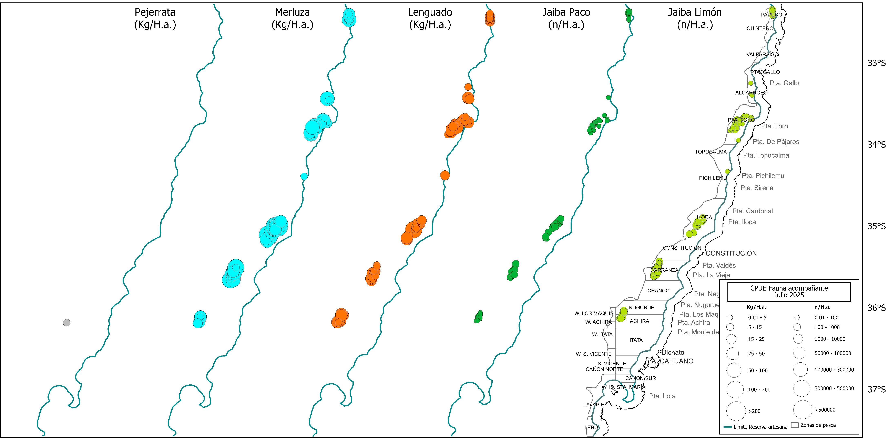
```


