\newpage

# 1 Resumen

Durante agosto de 2025, la flota arrastrera de Camanchaca Pesca Sur operó entre las regiones del Biobío y Valparaíso, concentrando su actividad en los caladeros de Algarrobo, Pichilemu y Chanco. La pesquería se dirigió principalmente al langostino colorado, con un 79 % de los lances orientados exclusivamente a este recurso, mientras que en menor proporción el esfuerzo se orientó al camarón nailon y al langostino amarillo, tanto en lances exclusivos como mixtos. El langostino colorado alcanzó capturas totales cercanas a 632 toneladas y rendimientos promedio del orden de 214 kg/ha, con los mayores valores en Algarrobo y Carranza; el camarón nailon se concentró en Chanco y el langostino amarillo presentó los mayores rendimientos en isla Santa María. 

En términos biológicos, predominó la presencia de hembras en langostino colorado y camarón nailon, con tallas medias en torno a 37 mm de longitud del caparazón (LC) y 27,5 mm LC, respectivamente. Para langostino colorado se observó una alta proporción de hembras ovígeras (≈78 %), consistente con un ciclo reproductivo adelantado respecto del promedio histórico. La fauna acompañante estuvo dominada por merluza, lenguado y, en menor proporción, pejerrata y jaibas.

\newpage

# 2 Aspectos Pesqueros

## 2.1 Actividad pesquera


Las operaciones de pesca realizadas durante agosto cubrieron los caladeros ubicados desde la región del Bío-Bío a la región de Valparaíso, destacando los caladeros del Algarrobo, Pichilemu y Chanco (Fig. 1). 

```{r echo=FALSE, fig.width=4,fig.height=5,out.width="65%", fig.cap="Distribución espacial del total de lances de pesca realizados durante agosto de 2025",fig.align="center" }
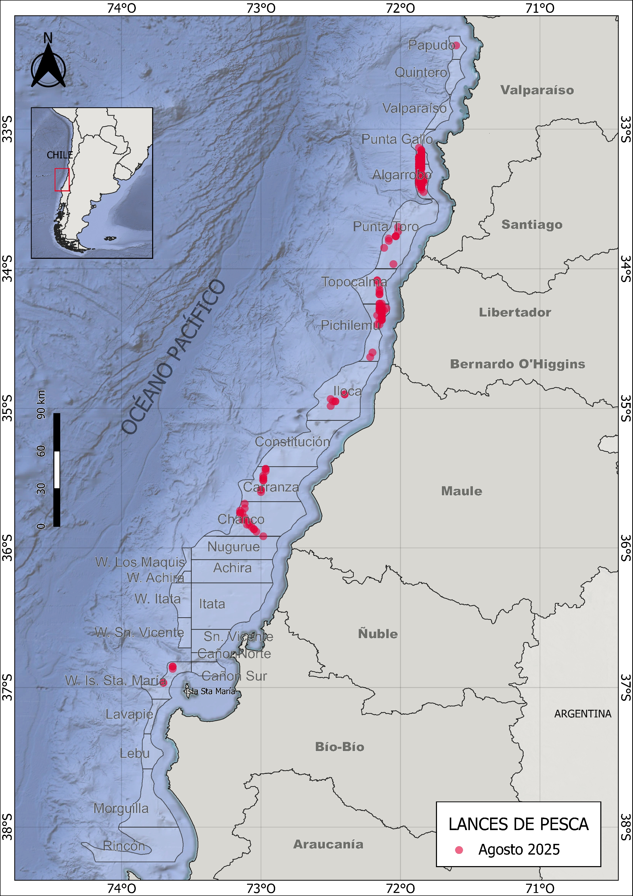
```

\newpage
## 2.2 Captura,esfuerzo y rendimientos de pesca

Durante agosto de 2025, la actividad pesquera se centró principalmente en el langostino colorado. El 79 % de los lances se dirigió exclusivamente al langostino colorado, mientras que un 10 % correspondió a capturas exclusivas de camarón nailon. Otro 10 % se orientó a capturas mixtas de langostino colorado y langostino amarillo, y el 1,5 % restante a capturas exclusivas de langostino amarillo (Fig. 2). 


```{r echo=FALSE, fig.width=3,fig.height=3,out.width="90%",fig.cap=" Distribución espacial de los lances de pesca orientados a langostino colorado, langostino amarillo y camarón nailon durante agosto de 2025",fig.align="center"}
knitr::include_graphics("Fig_agosto_2025/lances_especie_agosto.jpeg")
```

Las capturas por lance de langostino colorado variaron entre 0 y 10 ton, alcanzando un total de 631 toneladas. El promedio por lance fue de 3530 kg/lance, con un esfuerzo total de 294 horas de arrastre (ha) y un rendimiento de pesca de 214 kg/ha (Tabla 1). En el caso del langostino amarillo, se registraron 19 lances que sumaron un total de 22 toneladas, con un rendimiento promedio de 663 kg/ha. Por su parte, el camarón nailon fue capturado en 47 lances, alcanzando una captura total de 41 toneladas y un rendimiento de 337 kg/ha (Tabla 1). 

\newpage

##### *Tabla 1. Indicadores operacionales de la pesquería de langostino colorado, langostino amarillo y camarón nailon, año 2025.*

|**Recurso**|**Mes**|**N° de lances(n)**|**Cap. (kg)**|**Cap.lances (kg/n)**|**h arrast.(ha)**|**Rend. (kg/ha)**|**Prof.de fondo(m)**| 
|--------|-------|--------|-------|---------|-------|------|-------|
|**L.colorado**|marzo|178|492941|2769|233|2118|220|
|              |abril|267|805486|3017|366|2202|210|
|              |mayo|254|792701|3121|513|1546|177|
|              |junio|205|722214|3523|460|1571|163|
|              |julio|210|736028|3504|487|1510|157|
|              |agosto|179|631958|3530|294|214|192|
|**L.amarillo**|marzo|124|102458|826|172|596|225|
|              |abril|200|89582|448|273|328|215|
|              |mayo|138|55002|399|280|197|167|
|              |junio|47|5796|123|104|55|156| 
|              |julio|75|112455|1499|167|693|178|
|              |agosto|19|22212|1169|33|663|193|
|**Camarón**|marzo|44|30862|702|87|352|301|
|           |abril|7|1048|149|7|153|223|
|           |mayo|8|128|16|13|10|188|
|           |junio|8|18080|2260|19|933|315|
|           |julio|12|315|26|22|14|178|
|           |agosto|47|41462|882|123|337|278|

El rendimiento de pesca del langostino colorado osciló entre 14 y 12891 kg/ha, con una moda de 1955 kg/ha. El esfuerzo por lance varió entre 0 y 200 minutos, concentrándose mayoritariamente en torno a 1 horas y 35 minutos (Fig. 3). En el caso del langostino amarillo, el rendimiento fluctuó entre 6 y 663 kg/ha, con un esfuerzo predominante cercano a 1 horas y 50 minutos. Por su parte, el camarón nailon alcanzó un rendimiento máximo de 337 kg/ha, concentrando su esfuerzo principalmente en torno a 2 horas y 30 minutos (Fig. 3).

```{r echo=FALSE,fig.width=4,fig.height=5,out.width="80%",fig.cap="Distribución de frecuencia del esfuerzo de pesca (en horas de arrastre, A) y del rendimiento (en kg/ha, B), para langostino colorado y langostino amarillo durante agosto de 2025",fig.align="center"}
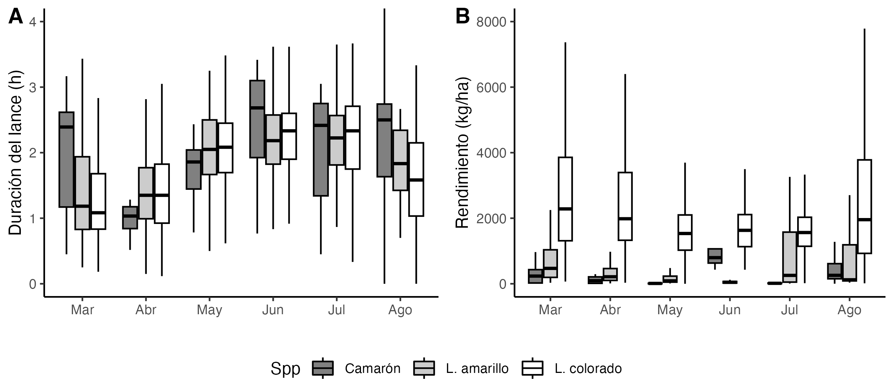
```


En cuanto a la distribución espacial del rendimiento de pesca durante agosto, destacaron los caladeros de Algarrobo y Carranza por sus altos rendimientos de langostino colorado, con promedios entre 1500 y 5000 kg/ha (Fig. 4 y 5). En el caso del camarón nailon, las capturas se concentraron exclusivamente en el caladero de Chanco, con rendimientos entre 200 y 700 kg/ha. Para el langostino amarillo, los mayores rendimientos se observaron en la isla Sta. María, con valores entre 2000 y 5000 kg/ha (Fig. 4 y 5).

```{r echo=FALSE,fig.width=4,fig.height=5,out.width="110%",fig.cap="Distribución del rendimiento de pesca (kg/ha) de langostino colorado, langostino amarillo y camarón nailon en agosto de 2025",fig.align="center"}
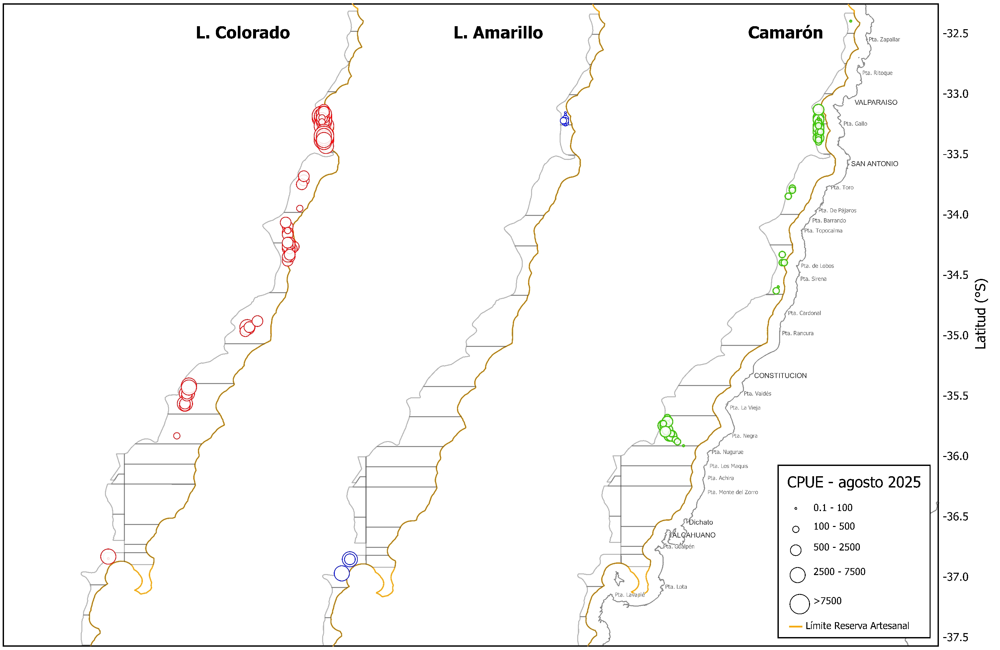
```


```{r echo=FALSE,fig.width=4,fig.height=5,out.width="100%",fig.cap="Rendimiento de pesca (captura por hora de arrastre) anual de langostino colorado (A), langostino amarillo (B) y camarón nailon (C), en los caladeros visitados de en la unidad de pesquería sur, agosto de 2025",fig.align="center"}
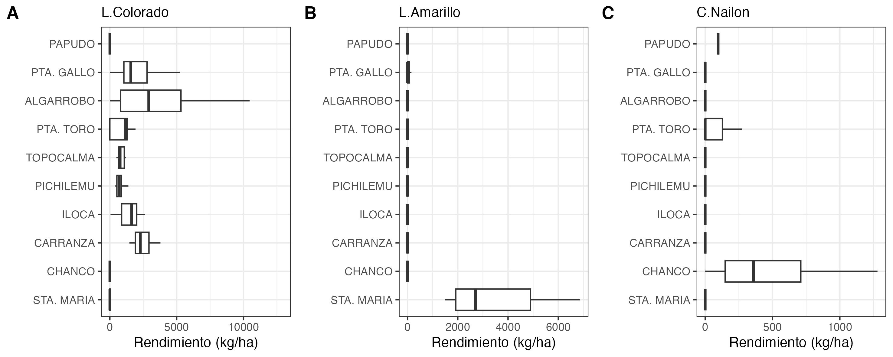
```

\newpage
# 3 Aspectos biológicos

Los indicadores biológicos incluyen la talla promedio por sexo, proporción sexual, estructura de tallas, estado de madurez de las hembras ovígeras y su proporción en las capturas. Los datos fueron obtenidos a partir de muestreos diarios aleatorios realizados sobre ejemplares capturados en las zonas visitadas por la flota. Se estableció un tamaño mínimo de muestra de 300 ejemplares, midiendo la longitud del cefalótorax con una precisión de 0,01 mm mediante un pie de metro. Además, los individuos fueron pesados (precisión 0,01 g), y se registró si estaban completos o incompletos. Se determinó el sexo de cada ejemplar y, en el caso de las hembras, se consignó la presencia de huevos (estado ovígero) y el grado de madurez de los mismos, según la escala de 4 puntos propuesta por Palma y Arana (1997).


## 3.1 Proporción sexual y talla promedio

Durante las capturas de agosto de 2025, el langostino colorado y camarón nailon presentó una proporción sexual favorable a las hembras, con 77% y 81% respectivamente (Fig. 6,7).

En cuanto a las tallas promedio, el langostino colorado presentó longitudes cefalotorácicas entre 23 y 48 mm, con promedios de 37,3 mm en machos y 36,4 mm en hembras. En comparación con temporadas anteriores, las tallas medias registradas a comienzos de este año fueron particularmente altas, superando los 37 mm LC. Posteriormente, disminuyeron en junio, volvieron a incrementarse en julio y se mantuvieron sobre los 36 mm LC durante agosto (Fig. 7). En el caso del camarón nailon, las hembras presentaron las mayores tallas promedio (27,5 mm LC), frente a los 24 mm LC observados en los machos. Para el langostino amarillo no se contó con muestreo biológico durante agosto, por lo que no fue posible realizar este análisis.


##### *Tabla 2. Proporción sexual y talla promedio de langostino colorado, langostino amarillo y camarón nailon en las capturas de la UPS, año 2025*

|   |Mes|Sexo|n|LC(mm)|DE(mm)|Min.(mm)|Max.(mm)|
|----|---|----|-|------|------|----------|----------|
|**L.colorado**|marzo|hembra|1590|38,2|2,66|24.6|44,7|
|               |    |macho|1316|37,9|4,09|25,6|46,4|
|               |abril|hembra|2037|35,2|2,33|22,3|42,6|
|               |     |macho|2337|37,1|2,36|29,3|44,3|
|               |mayo|hembra|2422|35,3|1,91|29,4|43,7|
|               |     |macho|1402|37,3|2,31|29,5|45,8|
|               |junio|hembra|2516|34,6|2,19,28,2|43,2|
|               |     |macho|1234|36,7|2,92|29,5|46,2|
|               |julio|hembra|3725|36,9|2,19|30,4|44,5|
|               |     |macho|1720|38,5|2,80|28,8|46,5|
|               |agosto|hembra|4006|37,3|2,53|24,0|43,6|
|               |     |macho|1193|36,4|4,46|23,7|48,7|
|**L.amarillo**|marzo|hembra|85|33,3|2,61|29,3|40,3|
|             |    |macho|165|39,7|2,82|30,5|46,7|
|             |abril|hembra|297|31,4|2,58|19,6|44,6|
|             |     |macho|1043|37,4|4,38|17,7|51,9|
|             |mayo|hembra|282|35,4|2,84|25,6|43,5|
|             |    |macho|682|40,2|4,43|25,2|50,8|
|             |junio|hembra|5|33,1|2,62|31,3|36,3|
|             |     |macho|190|37,9|3,91|27,4|49,4|
|             |julio|hembra|756|34,4|2,21|29,3|42,5|
|             |     |macho|575|41,1|2,95|30,4|48,6|
|**Camarón**|marzo|hembra|164|29,7|2,33|24,8|35,6|
|           |     |macho|86|29,4|1,39|26,5|32,6|
|           |junio|hembra|206|27,3|2,15|23,0|34,9|
|           |     |macho|44|25,4|2,13|22,5|34,0|
|           |agosto|hembra|811|27,5|3,58|16,6|36,4|
|           |     |macho|189|24,3|4,11|15,4|39,0|


```{r echo=FALSE,fig.width=4,fig.height=5,out.width="70%",fig.cap="Proporción sexual de langostino colorado (A) y langostino amarillo (B) durante agosto de 2025",fig.align="center"}
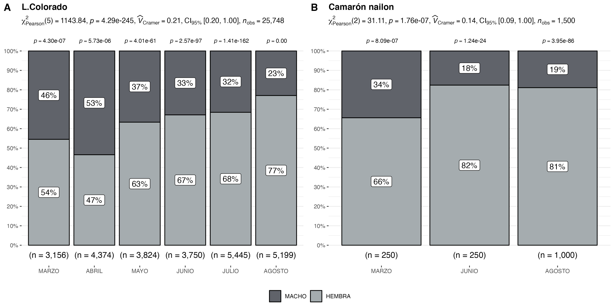

```

\newpage


```{r echo=FALSE,fig.width=4,fig.height=5,out.width="90%",fig.cap="Talla promedio (LC, mm) de langostino colorado y langostino amarillo por sexo, en el periodo enero 2016 a agosto de 2025",fig.align="center"}
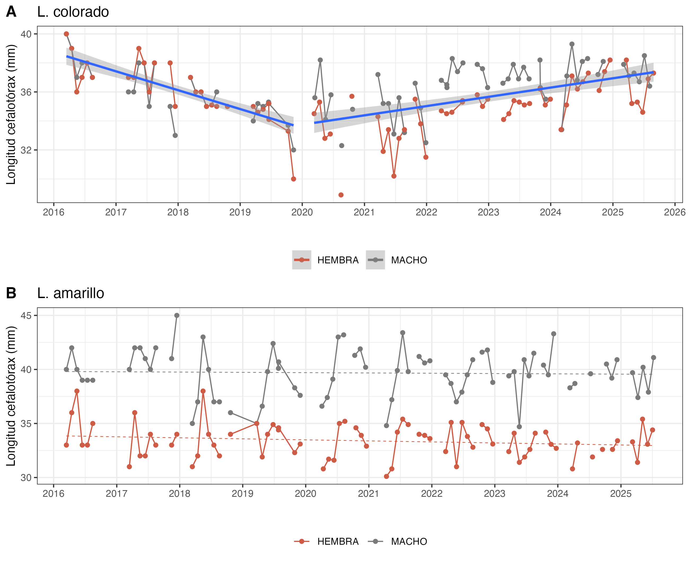
```

\newpage

## 3.2 Aspectos reproductivos

Durante agosto de 2025, el 77 % de las hembras de langostino colorado se encontraron en estado ovígero, una proporción similar a la observada en el mismo período del año anterior (Fig. 8, Tabla 3)

```{r echo=FALSE, fig.width=4,fig.height=5,out.width="80%",fig.cap="Hembras ovígeras de langostino colorado y langostino amarillo durante el año 2025, en comparacion con la media registrada entre los años 2017 a 2023 (línea verde)",fig.align="center"}
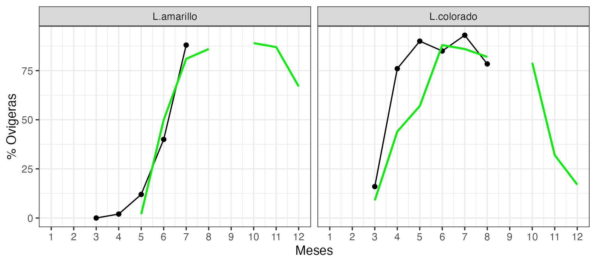
```

##### *Tabla 3. Porcentaje de hembras ovígeras y hembras maduras de langostino colorado y amarillo UPS 2025.*

| **Recurso**    | **Estado**   | **mar.** |**abr.**|**may.**|**jun.**|**jul.**|**ago.**|
|----------------|------------ |--------|--------|--------|--------|--------|--------|
| **L.colorado** | Normal       | 83%   | 21%|7%|  8%|3%|7%|
|                | Ovígeras     | 16%       |76%|90%|85%|93%|78%|
|                | Madura       | 1%        |3%| 3%|7%|4%|15%|
| Total n°       |              | 1590       |2037|2422|2566|3725|4006|
| **L.amarillo** | Normal       | 100%      | 98%|7%|60%|2%|-|
|                | Ovígeras     | 0%        | 2%|12%|40%|88%|-|
|                | Madura       | 0%        |0%|1%|0%|10%|-|
| Total n°       |              | 85        |297|282|5|765|-|


\newpage

## 3.3. Composición de tallas

El análisis de tallas del langostino colorado no mostró diferencias significativas entre sexos (prueba t de Student, p > 0,05). En el langostino colorado, los machos alcanzaron una talla media de 36,4 mm LC, y las hembras, que fue de 37,3 mm LC (Fig. 9). En cambio, en el camarón nailon las hembras registraron las mayores tallas promedio, superando a los machos (Tabla 2, Fig. 10).

En cuanto a la composición de tallas por zona de pesca, el langostino colorado presentó las tallas modales más pequeñas en Carranza, mientras que las tallas más grandes se registraron en las zonas Quintero y Pichilemu (Fig. 11). Para camarón nailon Chanco destacó con las mayores tallas y Punta Gallo con las menores en torno a 23 mm LC en machos y a 26 mm LC en hembras (Fig. 12).

```{r echo=FALSE, fig.width=4,fig.height=5,out.width="70%",fig.cap=" Composición de tallas de langostino colorado entre sexos, en agosto de 2025",fig.align="center"}
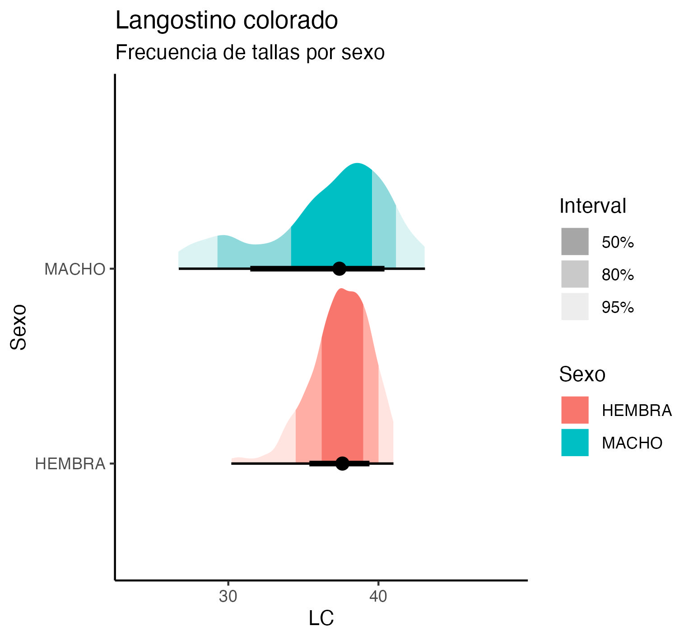
```


```{r echo=FALSE, fig.width=4,fig.height=5,out.width="70%",fig.cap=" Composición de tallas de camarón nailon entre sexos, en agosto de 2025",fig.align="center"}
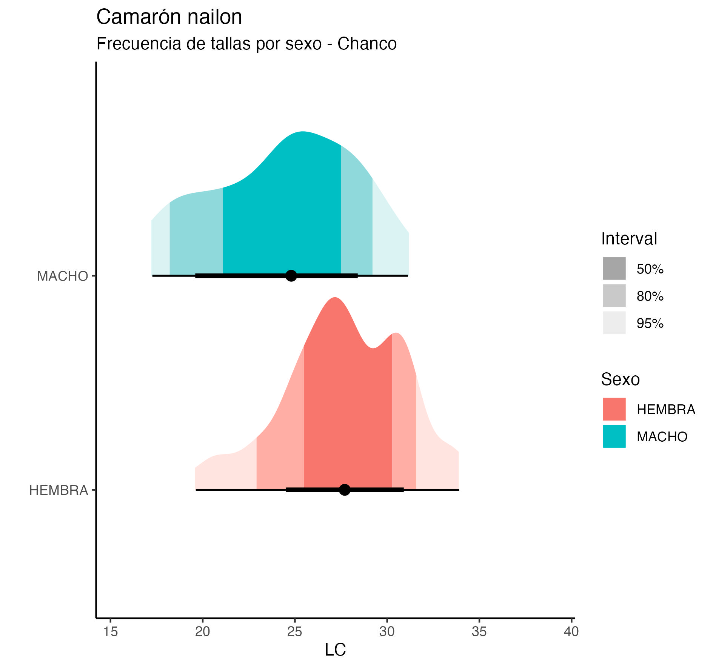
```


```{r echo=FALSE, fig.width=4,fig.height=5,out.width="70%",fig.cap="Composición de tallas de langostino colorado en la UPS por zonas de pesca en agosto de 2025",fig.align="center"}
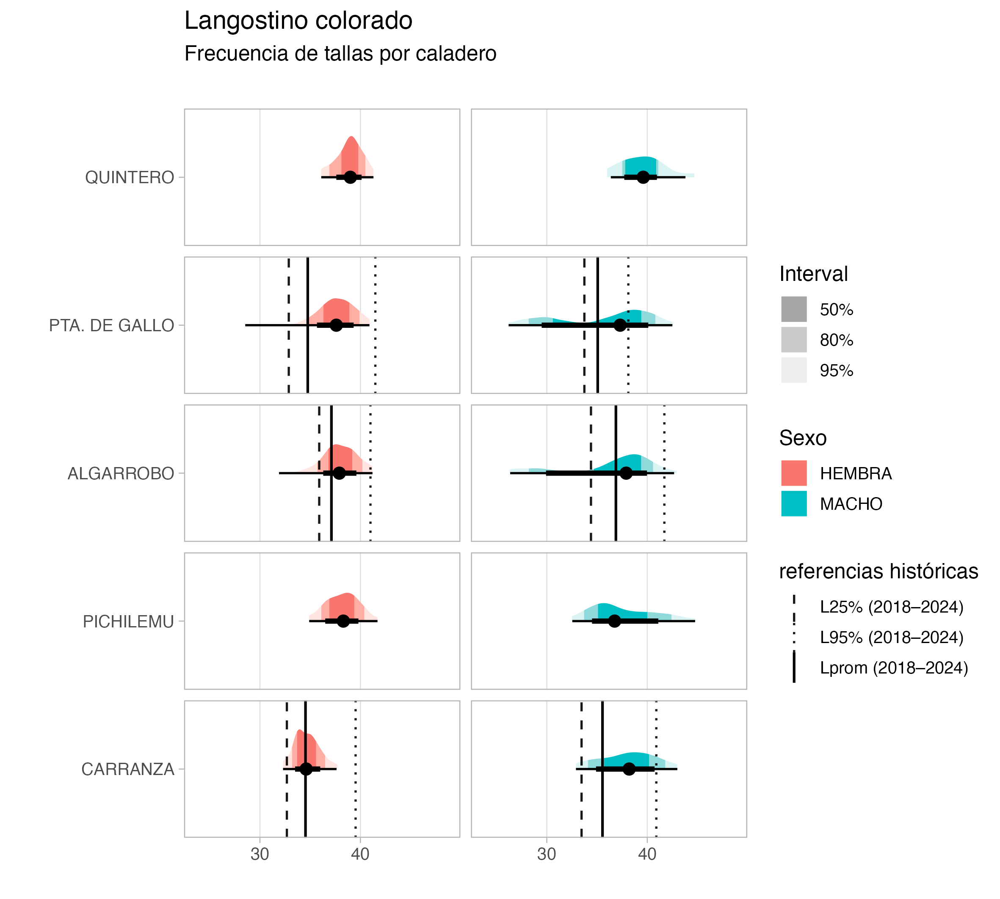
```

```{r echo=FALSE, fig.width=4,fig.height=5,out.width="70%",fig.cap="Composición de tallas de camarón nailon en la UPS por zonas de pesca en agosto de 2025",fig.align="center"}
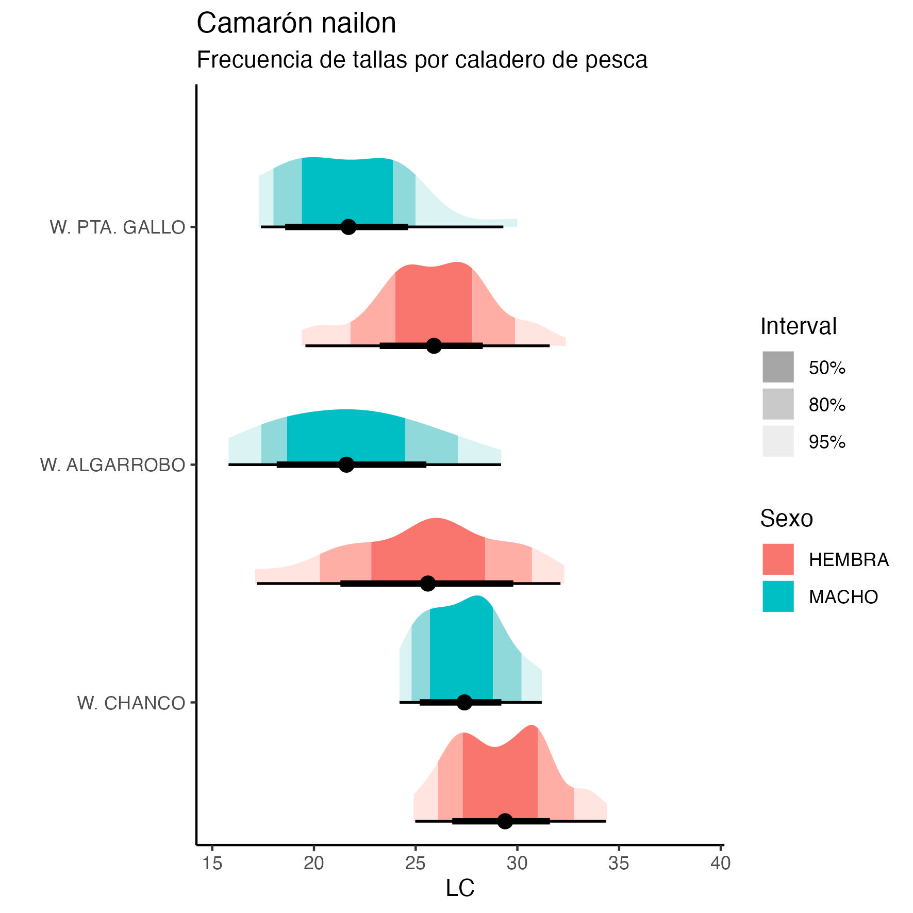
```


\newpage
## 3.4 Fauna acompañante

Las operaciones de pesca realizadas durante agosto de 2025 por la flota de Crustaceos Pesca Sur evidenciaron la presencia de pejerrata, como fauna acompañante, en los caladeros de Punta Gallo, Algarrobo, Pichilemu, Iloca y Chanco (Fig. 13). Esta especie representó solo el 0.50 % del total de las capturas alcanzando un volumen de 3 toneladas. 

En cuanto a la ocurrencia de otros recursos como fauna acompañante destaca la alta presencia de  merluza y lenguado en la totalidad de caladeros visitados con valores entre los 50 y 200 kg/ha (Fig. 14).
Tambien hay presencia de otros recursos como la Jaiba Paco y Jaiba Limón pero en menor cantidad (en termino de unidades por hora de arrastre) como se muestra en la Figura 14.

```{r echo=FALSE, fig.width=4,fig.height=5,out.width="80%",fig.cap=" Distribución de los lances de pesca con captura de pejerrata en las capturas de camarón nailon, langostino colorado y langostino amarillo, y la fracción de pejerrata en las capturas totales, de junio año 2025",fig.align="center"}
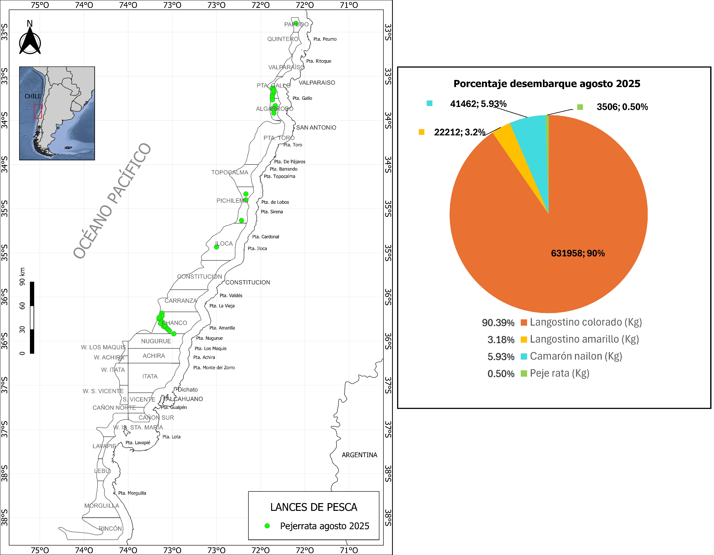
```


```{r echo=FALSE, fig.width=4,fig.height=5,out.width="110%",fig.cap=" Distribución espacial y abundancia de la fauna acompañante en los lances de pesca orientados a langostinos colorado y langostinos amarillos por la flota arrastrera de Camanchaca Pesca Sur, junio de 2025",fig.align="center"}
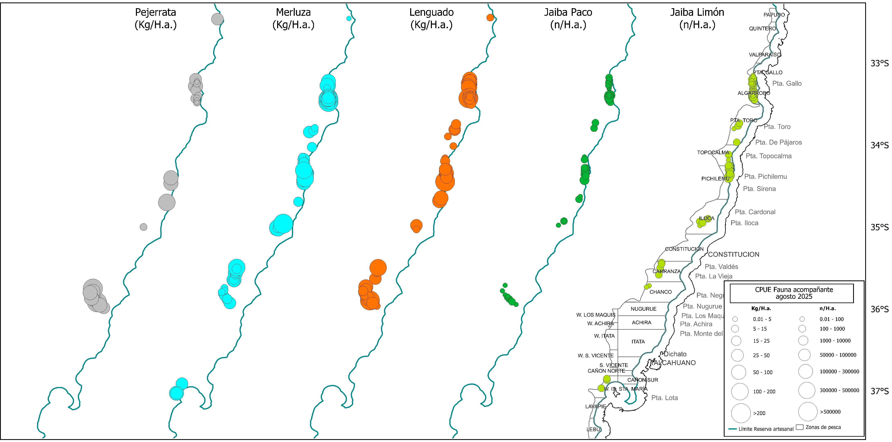
```


