\newpage

# 1 Resumen

Durante octubre de 2025, la flota arrastrera de Crustáceos Pesca Sur operó entre las regiones de Biobío y Valparaíso, concentrando su actividad en los caladeros de Papudo, Algarrobo, Punta Toro, Topocalma, Carranza y Achira. La pesquería se orientó principalmente al langostino colorado y al langostino amarillo: el 41% de los lances fue exclusivo para langostino colorado, el 34% para langostino amarillo, el 11% para camarón nailon y el 14% restante correspondió a lances mixtos. Las capturas totales alcanzaron 333 t de langostino colorado, 345 t de langostino amarillo y 15 t de camarón nailon, con rendimientos promedio de 1179, 1224 y 242 kg/ha, respectivamente. Los mayores rendimientos de langostino colorado se registraron en Punta Toro, Achira y la isla Santa María, mientras que esta última concentró también los rendimientos más altos de langostino amarillo; el camarón nailon se capturó principalmente en Algarrobo, Topocalma y Pichilemu.

Desde el punto de vista biológico, la proporción sexual fue favorable a las hembras en langostino colorado (80%) y camarón nailon (61%), mientras que en langostino amarillo predominaron los machos (55%). En langostino colorado y camarón nailon las hembras presentaron mayores tallas promedio que los machos, a diferencia del langostino amarillo, donde los machos alcanzaron tallas medias cercanas a 41 mm LC frente a 35 mm LC en hembras. La fracción de hembras ovígeras se mantuvo elevada en ambos langostinos (75% en langostino colorado y 85% en langostino amarillo), lo que indica un período reproductivo activo. La fauna acompañante estuvo dominada por merluza y lenguado, con densidades entre 50 y 200 kg/ha, además de la presencia de pejerrata (0,76% de las capturas totales), jaiba paco y jaiba limón en menores abundancias.

\newpage

# 2 Aspectos Pesqueros

## 2.1 Actividad pesquera


Las operaciones de pesca realizadas durante octubre cubrieron los caladeros ubicados desde la región del Biobío a la región de Valparaíso, destacando los caladeros del Papudo, Algarrobo, Punta Toro, Topocalma, Carranza y Achira (Fig. 1). 

```{r echo=FALSE, fig.width=4,fig.height=5,out.width="65%", fig.cap="Distribución espacial del total de lances de pesca realizados durante octubre de 2025",fig.align="center" }
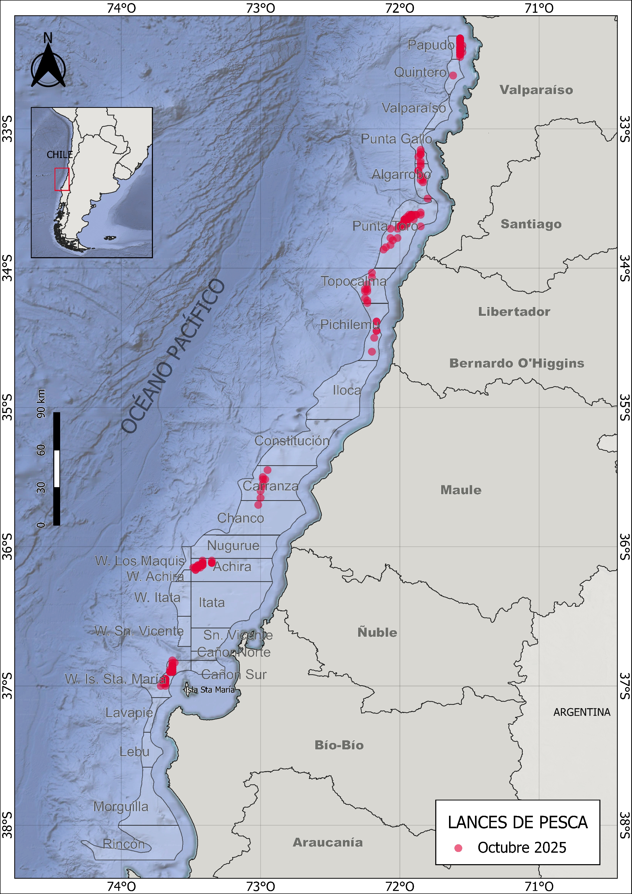
```

\newpage
## 2.2 Captura,esfuerzo y rendimientos de pesca

Durante octubre de 2025, la actividad pesquera se centró principalmente en el langostino colorado. El 41 % de los lances se dirigió exclusivamente al langostino colorado, mientras que un 34 % correspondió a capturas exclusivas de langostino amarillo. Otro 11 % se orientó a capturas de camarón nailon, y el 14 % restante a capturas mixtas de las tres especies (Fig. 2). 


```{r echo=FALSE, fig.width=3,fig.height=3,out.width="90%",fig.cap=" Distribución espacial de los lances de pesca orientados a langostino colorado, langostino amarillo y camarón nailon durante octubre de 2025",fig.align="center"}
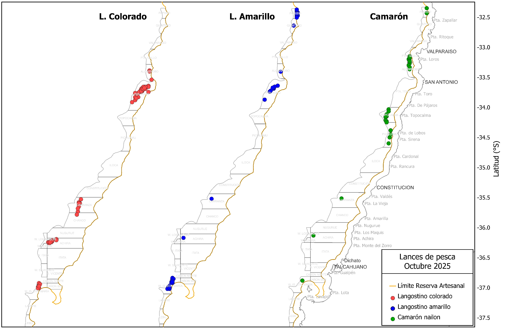
```

Las capturas por lance de langostino colorado variaron entre 43 y 5 t, alcanzando un total de 333 toneladas. El promedio por lance fue de 2330 kg/lance, con un esfuerzo total de 282 horas de arrastre (ha) y un rendimiento de pesca de 1179 kg/ha (Tabla 1). En el caso del langostino amarillo, se registraron 126 lances que sumaron un total de 345 toneladas, con un rendimiento promedio de 1224 kg/ha. Por su parte, el camarón nailon fue capturado en 33 lances, alcanzando una captura total de 15 toneladas y un rendimiento de 242 kg/ha (Tabla 1). 

\newpage

##### *Tabla 1. Indicadores operacionales de la pesquería de langostino colorado, langostino amarillo y camarón nailon, año 2025.*

|**Recurso**|**Mes**|**N° de lances(n)**|**Cap. (kg)**|**Cap.lances (kg/n)**|**h arrast.(ha)**|**Rend. (kg/ha)**|**Prof.de fondo(m)**| 
|--------|-------|--------|-------|---------|-------|------|-------|
|**L.colorado**|marzo|178|492941|2769|233|2118|220|
|              |abril|267|805486|3017|366|2202|210|
|              |mayo|254|792701|3121|513|1546|177|
|              |junio|205|722214|3523|460|1571|163|
|              |julio|210|736028|3504|487|1510|157|
|              |agosto|179|631958|3530|294|214|192|
|              |octubre|143|333252|2330|282|1179|145|
|**L.amarillo**|marzo|124|102458|826|172|596|225|
|              |abril|200|89582|448|273|328|215|
|              |mayo|138|55002|399|280|197|167|
|              |junio|47|5796|123|104|55|156| 
|              |julio|75|112455|1499|167|693|178|
|              |agosto|19|22212|1169|33|663|193|
|              |octubre|126|345378|2741|281|1224|157|
|**Camarón**|marzo|44|30862|702|87|352|301|
|           |abril|7|1048|149|7|153|223|
|           |mayo|8|128|16|13|10|188|
|           |junio|8|18080|2260|19|933|315|
|           |julio|12|315|26|22|14|178|
|           |agosto|47|41462|882|123|337|278|
|           |octubre|33|15833|479|65|242|247|

El rendimiento de pesca del langostino colorado osciló entre 32 y 3692 kg/ha, con una moda de 1091 kg/ha. El esfuerzo por lance varió entre 22 y 208 minutos, concentrándose mayoritariamente en torno a 2 horas (Fig. 3). En el caso del langostino amarillo, el rendimiento fluctuó entre 5 y 4354 kg/ha, con un esfuerzo predominante cercano a 2 horas y 10 minutos. Por su parte, el camarón nailon alcanzó un rendimiento máximo de 670 kg/ha, concentrando su esfuerzo principalmente en torno a 2 horas y 7 minutos (Fig. 3).

```{r echo=FALSE,fig.width=4,fig.height=5,out.width="80%",fig.cap="Distribución de frecuencia del esfuerzo de pesca (en horas de arrastre, A) y del rendimiento (en kg/ha, B), para langostino colorado y langostino amarillo durante octubre de 2025",fig.align="center"}
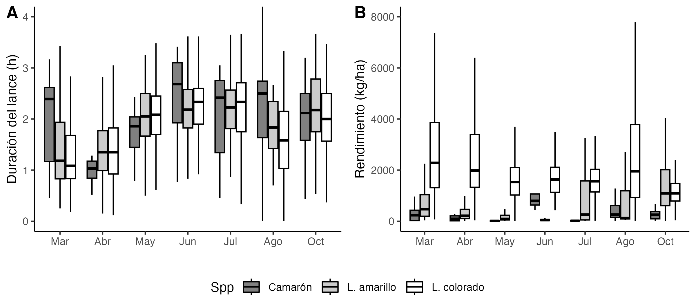
```


En cuanto a la distribución espacial del rendimiento de pesca durante octubre, destacaron los caladeros de Punta Toro, Achira y la isla Sta. María por sus altos rendimientos de langostino colorado, con promedios entre 500 y 2500 kg/ha (Fig. 4). En el caso del camarón nailon, las capturas se concentraron mayoritariamente en los caladeros de Algarrobo, Topocalma y Pichilemu con rendimientos entre 100 y 500 kg/ha. Para el langostino amarillo, los mayores rendimientos se observaron en la isla Sta. María, con valores entre 500 y 2500 kg/ha (Fig. 4).

```{r echo=FALSE,fig.width=4,fig.height=5,out.width="110%",fig.cap="Distribución del rendimiento de pesca (kg/ha) de langostino colorado, langostino amarillo y camarón nailon en octubre de 2025",fig.align="center"}
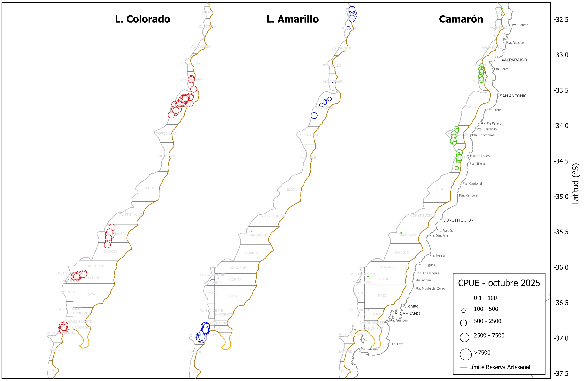
```


\newpage
# 3 Aspectos biológicos

Los indicadores biológicos incluyen la talla promedio por sexo, proporción sexual, estructura de tallas, estado de madurez de las hembras ovígeras y su proporción en las capturas. Los datos fueron obtenidos a partir de muestreos diarios aleatorios realizados sobre ejemplares capturados en las zonas visitadas por la flota. Se estableció un tamaño mínimo de muestra de 300 ejemplares, midiendo la longitud del cefalótorax con una precisión de 0,01 mm mediante un pie de metro. Además, los individuos fueron pesados (precisión 0,01 g), y se registró si estaban completos o incompletos. Se determinó el sexo de cada ejemplar y, en el caso de las hembras, se consignó la presencia de huevos (estado ovígero) y el grado de madurez de los mismos, según la escala de 4 puntos propuesta por Palma y Arana (1997).


## 3.1 Proporción sexual y talla promedio

Durante las capturas efectuadas en octubre de 2025, la proporción sexual fue favorable a las hembras en langostino colorado y camarón nailon, alcanzando 80% y 61%, respectivamente. En contraste, en langostino amarillo predominaron los machos, con una participación de 55% (Fig. 5).

En cuanto a las tallas, el langostino colorado presentó longitudes cefalotorácicas entre 20 y 37 mm LC, con promedios de 27,1 mm en machos y 29,1 mm en hembras. En comparación con temporadas anteriores, las tallas medias registradas a comienzos de este año fueron particularmente altas, superando los 37 mm LC; posteriormente disminuyeron en junio, volvieron a incrementarse en julio y agosto y, en octubre si bien descendieron continuaron estando por sobre los 36 mm LC (Fig. 6). En el caso del langostino amarillo, las hembras presentaron las menores tallas promedio (34,6 mm LC), frente a los 40,6 mm LC observados en los machos y no se presentaron grandes cambios en relación a la tendiencia anual de tallas medias observada desde el años 2016 (Fig. 6). Para el camarón nailon, las hembras alcanzaron mayores tallas medias, con un promedio de 29 mm LC, en comparación con los machos, que presentaron promedios en torno a 27,1 mm LC.

\newpage

##### *Tabla 2. Proporción sexual y talla promedio de langostino colorado, langostino amarillo y camarón nailon en las capturas de la UPS, año 2025*

|   |Mes|Sexo|n|LC(mm)|DE(mm)|Min.(mm)|Max.(mm)|
|----|---|----|-|------|------|----------|----------|
|**L.colorado**|marzo|hembra|1590|38,2|2,66|24.6|44,7|
|               |    |macho|1316|37,9|4,09|25,6|46,4|
|               |abril|hembra|2037|35,2|2,33|22,3|42,6|
|               |     |macho|2337|37,1|2,36|29,3|44,3|
|               |mayo|hembra|2422|35,3|1,91|29,4|43,7|
|               |     |macho|1402|37,3|2,31|29,5|45,8|
|               |junio|hembra|2516|34,6|2,19|28,2|43,2|
|               |     |macho|1234|36,7|2,92|29,5|46,2|
|               |julio|hembra|3725|36,9|2,19|30,4|44,5|
|               |     |macho|1720|38,5|2,80|28,8|46,5|
|               |agosto|hembra|4006|37,3|2,53|24,0|43,6|
|               |     |macho|1193|36,4|4,46|23,7|48,7|
|               |octubre|hembra|1966|36,2|2,40|27,5|44,7|
|               |     |macho|484|37,1|2,67|30,2|43,9|
|**L.amarillo**|marzo|hembra|85|33,3|2,61|29,3|40,3|
|             |    |macho|165|39,7|2,82|30,5|46,7|
|             |abril|hembra|297|31,4|2,58|19,6|44,6|
|             |     |macho|1043|37,4|4,38|17,7|51,9|
|             |mayo|hembra|282|35,4|2,84|25,6|43,5|
|             |    |macho|682|40,2|4,43|25,2|50,8|
|             |junio|hembra|5|33,1|2,62|31,3|36,3|
|             |     |macho|190|37,9|3,91|27,4|49,4|
|             |julio|hembra|756|34,4|2,21|29,3|42,5|
|             |     |macho|575|41,1|2,95|30,4|48,6|
|             |octubre|hembra|1316|34,6|3,05|22,5|44,3|
|             |     |macho|1641|40,6|4,85|21,2|55,1|
|**Camarón**|marzo|hembra|164|29,7|2,33|24,8|35,6|
|           |     |macho|86|29,4|1,39|26,5|32,6|
|           |junio|hembra|206|27,3|2,15|23,0|34,9|
|           |     |macho|44|25,4|2,13|22,5|34,0|
|           |agosto|hembra|811|27,5|3,58|16,6|36,4|
|           |     |macho|189|24,3|4,11|15,4|39,0|
|           |octubre|hembra|304|29,0|2,75|23,5|37,7|
|           |     |macho|196|27,1|2,78|20,4|35,7|

```{r echo=FALSE,fig.width=4,fig.height=5,out.width="70%",fig.cap="Proporción sexual de langostino colorado (A), langostino amarillo (B) y camarón nailon (C) durante el año de 2025",fig.align="center"}
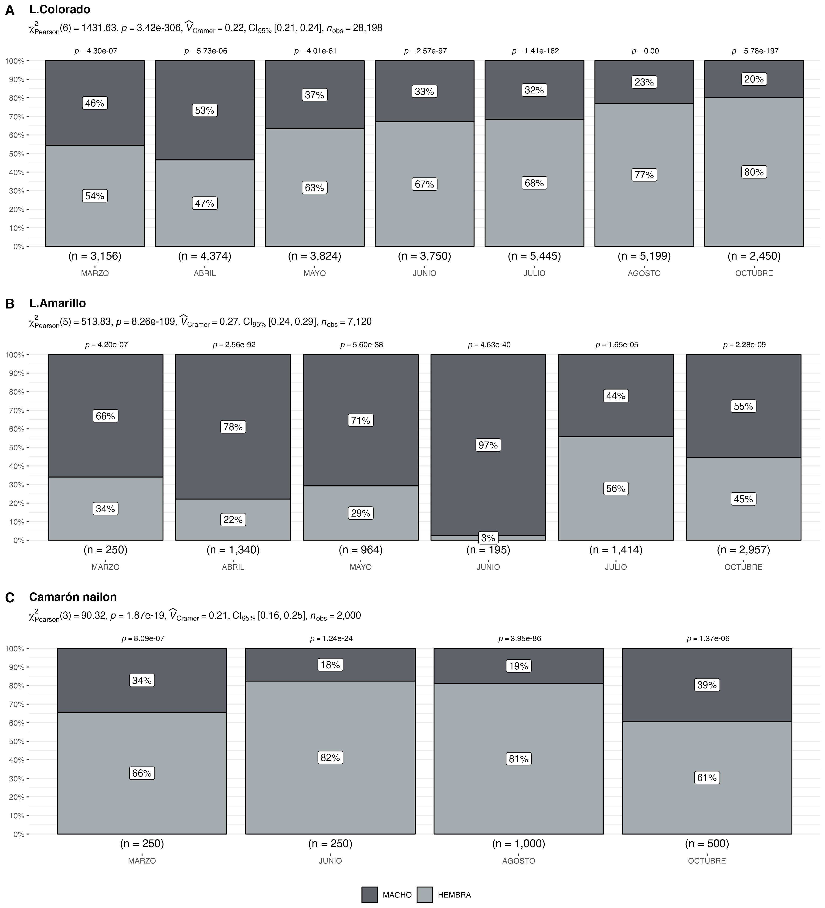

```

\newpage


```{r echo=FALSE,fig.width=4,fig.height=5,out.width="90%",fig.cap="Talla promedio (LC, mm) de langostino colorado y langostino amarillo por sexo, en el periodo enero 2016 a octubre de 2025",fig.align="center"}
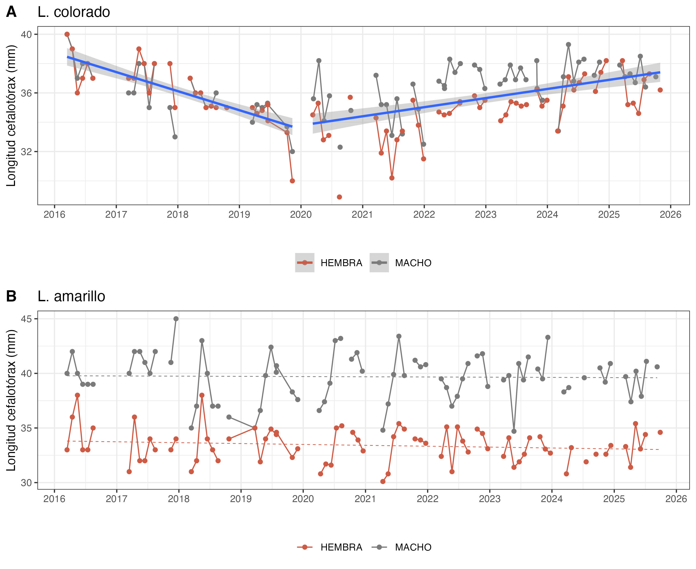
```

\newpage

## 3.2 Aspectos reproductivos

Durante octubre de 2025, el 75% de las hembras de langostino colorado se encontraron en estado ovígero, proporción similar a la registrada en el mismo período del año anterior. En el caso del langostino amarillo, las hembras ovígeras también se mantuvieron en niveles elevados, en torno al 85% (Fig. 7, Tabla 3)

```{r echo=FALSE, fig.width=4,fig.height=5,out.width="80%",fig.cap="Hembras ovígeras de langostino colorado y langostino amarillo durante el año 2025, en comparacion con la media registrada entre los años 2017 a 2023 (línea verde)",fig.align="center"}
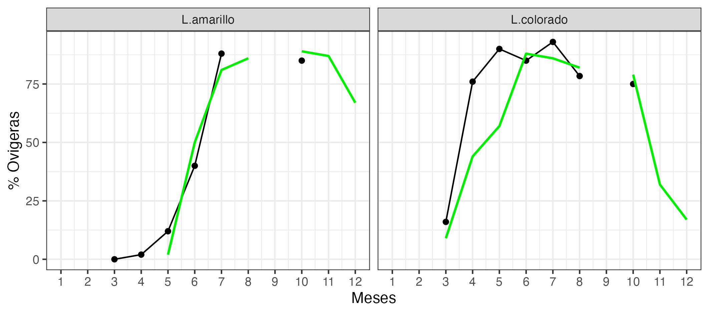
```

##### *Tabla 3. Porcentaje de hembras ovígeras y hembras maduras de langostino colorado y amarillo UPS 2025.*

| **Recurso**    | **Estado**   | **mar.** |**abr.**|**may.**|**jun.**|**jul.**|**ago.**|**oct.**|
|----------------|------------ |--------|--------|--------|--------|--------|--------|--------|
| **L.colorado** | Normal       | 83%   | 21%|7%|  8%|3%|7%|15%|
|                | Ovígeras     | 16%       |76%|90%|85%|93%|78%|75%|
|                | Madura       | 1%        |3%| 3%|7%|4%|15%|10%|
| Total n°       |              | 1590       |2037|2422|2566|3725|4006|1966|
| **L.amarillo** | Normal       | 100%      | 98%|7%|60%|2%|-|4%|
|                | Ovígeras     | 0%        | 2%|12%|40%|88%|-|85%|
|                | Madura       | 0%        |0%|1%|0%|10%|-|11%|
| Total n°       |              | 85        |297|282|5|765|-|1316|


\newpage

## 3.3. Composición de tallas

El análisis de tallas del langostino colorado no mostró diferencias significativas entre sexos (prueba t de Student, p > 0,05). Los machos alcanzaron una talla media de 37 mm LC y las hembras de 36 mm LC (Fig. 8). En el camarón nailon, en cambio, las hembras registraron las mayores tallas promedio, superando a los machos (Tabla 2, Fig. 8). Para el langostino amarillo, fueron los machos quienes presentaron las mayores tallas, con promedios en torno a 41 mm LC, en comparación con las hembras, que alcanzaron tallas medias cercanas a 34 mm LC (Tabla 2, Fig. 8).

Respecto de la composición de tallas por zona de pesca, en langostino colorado las tallas modales más pequeñas se observaron en Achira y en la isla Santa María, mientras que las mayores se registraron en Santo Domingo y Punta Toro (Fig. 9). En langostino amarillo, la isla Santa María destacó por exhibir el rango de tallas más amplio, desde 25 hasta 40 mm LC en hembras y hasta 35 mm LC en machos (Fig. 10). En camarón nailon, en tanto, Quintay concentró los ejemplares de mayor talla, mientras que Pichilemu presentó los menores promedios, en torno a 25 mm LC en machos y 27 mm LC en hembras (Fig. 11).

```{r echo=FALSE, fig.width=4,fig.height=5,out.width="90%",fig.cap=" Composición de tallas de langostino colorado (A), langostino amarillo (B) y camarón nailon (C) entre sexos, en octubre de 2025",fig.align="center"}
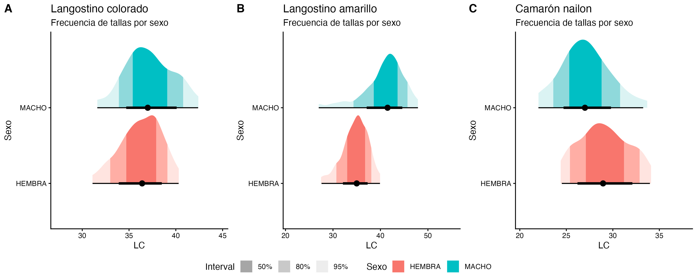
```


```{r echo=FALSE, fig.width=4,fig.height=5,out.width="90%",fig.cap="Composición de tallas de langostino colorado en la UPS por zonas de pesca en octubre de 2025",fig.align="center"}
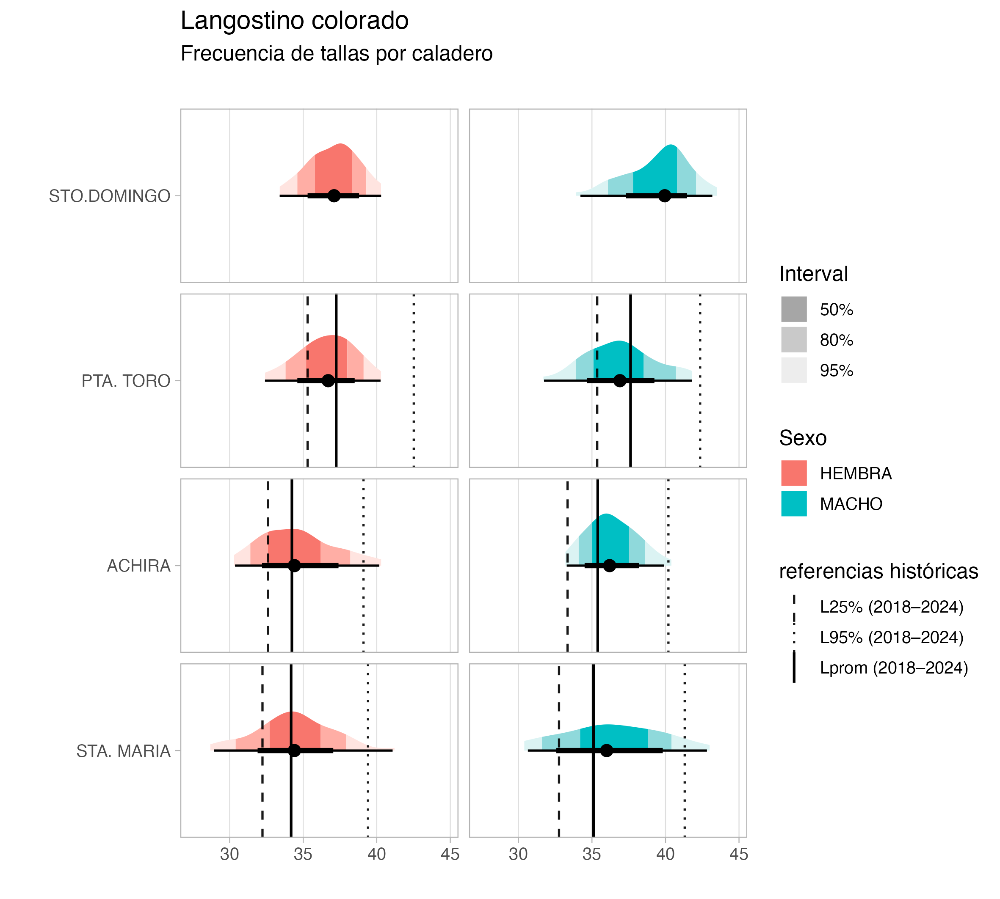
```

```{r echo=FALSE, fig.width=4,fig.height=5,out.width="90%",fig.cap="Composición de tallas de langostino amarillo en la UPS por zonas de pesca en octubre de 2025",fig.align="center"}
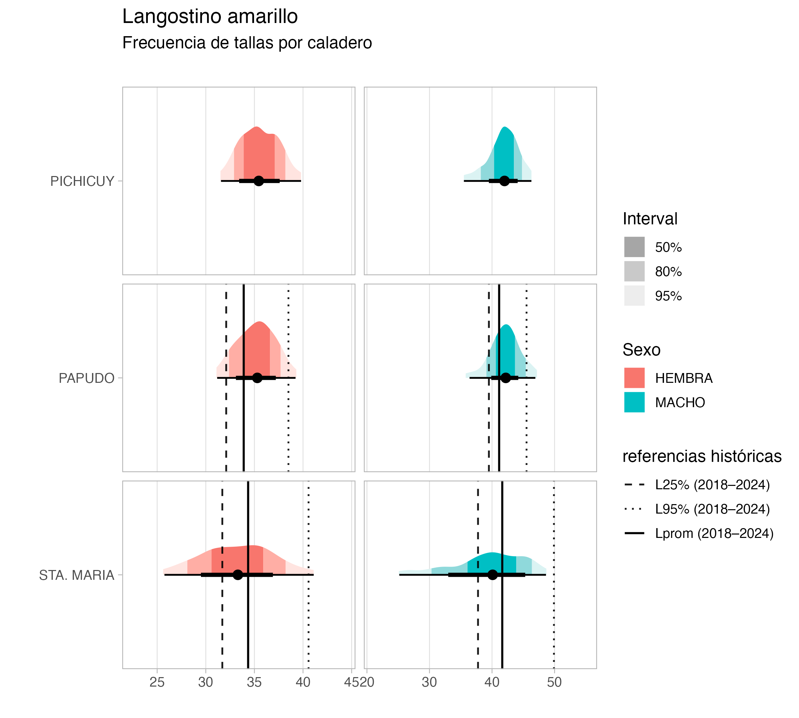
```

```{r echo=FALSE, fig.width=4,fig.height=5,out.width="90%",fig.cap="Composición de tallas de camarón nailon en la UPS por zonas de pesca en octubre de 2025",fig.align="center"}
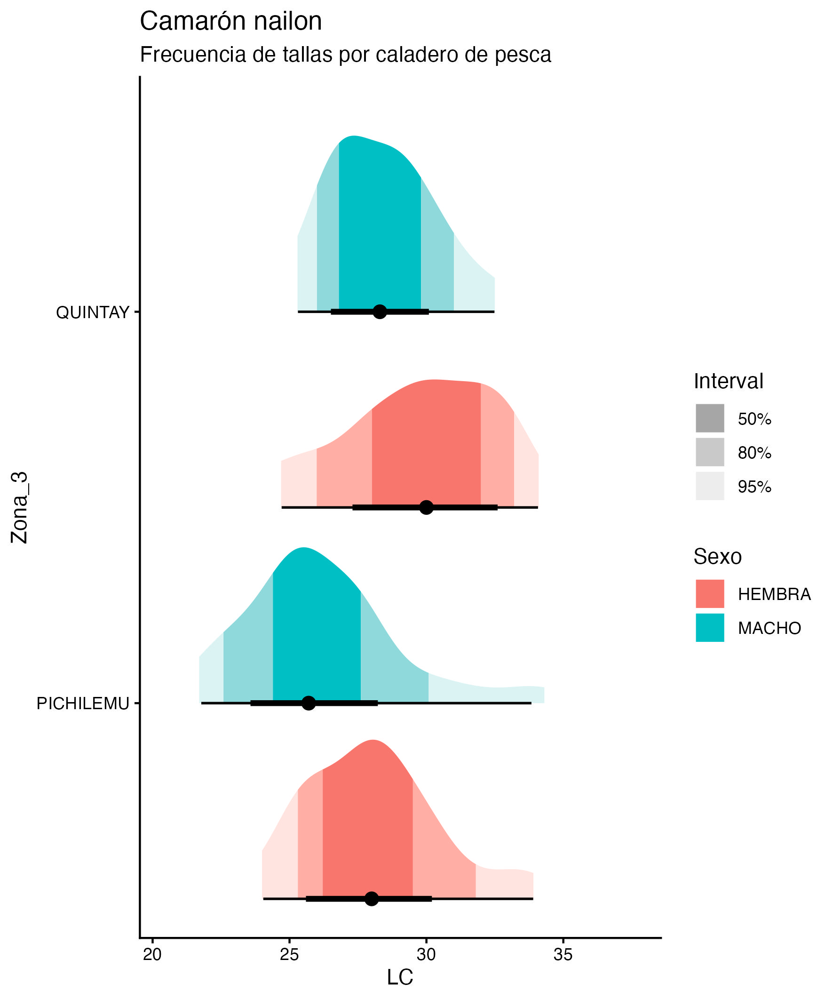
```


\newpage
## 3.4 Fauna acompañante

Las operaciones de pesca realizadas durante octubre de 2025 por la flota de Crustáceos Pesca Sur evidenciaron la presencia de pejerrata, como fauna acompañante, en los caladeros de Punta Gallo, Algarrobo, Topocalma, Pichilemu, Carranza, Achira y el Cañón norte (Fig. 12). Esta especie representó el 0,76 % del total de las capturas alcanzando un volumen de 5 t. 

En cuanto a la fauna acompañante, destacó la alta presencia de merluza y lenguado en la totalidad de los caladeros muestreados, con densidades entre 50 y 200 kg/ha (Fig. 13). También se registró la presencia de otros recursos, como jaiba paco y jaiba limón, aunque en menores abundancias (en términos de unidades por hora de arrastre), tal como se observa en la Figura 13.

```{r echo=FALSE, fig.width=4,fig.height=5,out.width="80%",fig.cap=" Distribución de los lances de pesca con captura de pejerrata en las capturas de camarón nailon, langostino colorado y langostino amarillo, y la fracción de pejerrata en las capturas totales, de octubre año 2025",fig.align="center"}
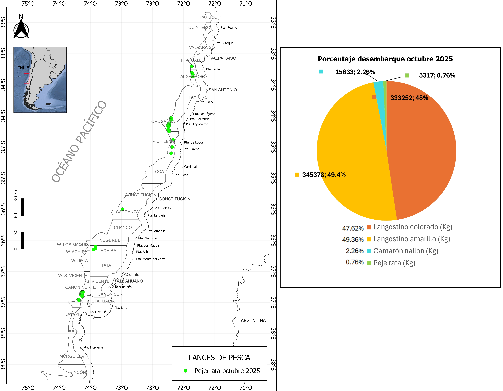
```


```{r echo=FALSE, fig.width=4,fig.height=5,out.width="110%",fig.cap=" Distribución espacial y abundancia de la fauna acompañante en los lances de pesca orientados a langostinos colorado y langostinos amarillos por la flota arrastrera de Camanchaca Pesca Sur, octubre de 2025",fig.align="center"}
knitr::include_graphics("Fig_octubre_2025/fauna_Acomp_octubre.jpeg")
```


