\newpage

# 1 Resumen

En noviembre de 2025, la actividad pesquera se concentró en el camarón nailon (77 % de los lances), seguida por el langostino amarillo (17 %) y, en menor medida, por lances mixtos y dirigidos al langostino colorado (6 %). En consonancia, el camarón nailon registró 268 lances y 260 t, con rendimientos de hasta 3182 kg/ha. El langostino amarillo sumó 72 lances y 137 t, con rendimientos entre 10 y 4121 kg/ha; y el langostino colorado acumuló 41 t, con capturas por lance entre 16 kg y 5 t, un promedio de 1715 kg/lance, 39 ha de esfuerzo y un rendimiento medio de 1050 kg/ha. Espacialmente, destacaron Iloca, Constitución y Chanco (500–1000 kg/ha); para el langostino amarillo, la mayor concentración se observó en isla Santa María, Punta Toro y Papudo (500–1500 kg/ha), mientras que en langostino colorado sobresalió Punta Toro (1400–2000 kg/ha). En tallas, el camarón nailon mostró hembras mayores (30 mm LC) que machos (27 mm LC); en langostino amarillo ocurrió lo inverso (machos ~42 mm LC; hembras ~34 mm LC); y en langostino colorado no hubo diferencias significativas entre sexos (promedios ~37 mm LC), con una trayectoria intra-anual de máximos a comienzos de año, descenso en junio, recuperación en julio-agosto, leve baja en octubre y nuevo aumento en noviembre. Reproductivamente, las hembras ovígeras alcanzaron 52 % en camarón nailon, 79 % en langostino amarillo y 30 % en langostino colorado. En cuanto a fauna acompañante, predominó el pejerrata (≈7,4 %; ~35 t), con presencia frecuente de merluza y lenguado (~50–200 kg/ha) y, en menor abundancia, jaiba paco y jaiba limón.


\newpage

# 2 Aspectos Pesqueros

## 2.1 Actividad pesquera


Las operaciones de pesca realizadas en noviembre abarcaron caladeros desde la región del Biobío hasta la región de Valparaíso, con especial concentración de actividad en Papudo, Punta Toro, Iloca, Chanco y la isla Santa María (Fig. 1). 

```{r echo=FALSE, fig.width=4,fig.height=5,out.width="65%", fig.cap="Distribución espacial del total de lances de pesca realizados durante noviembre de 2025",fig.align="center" }
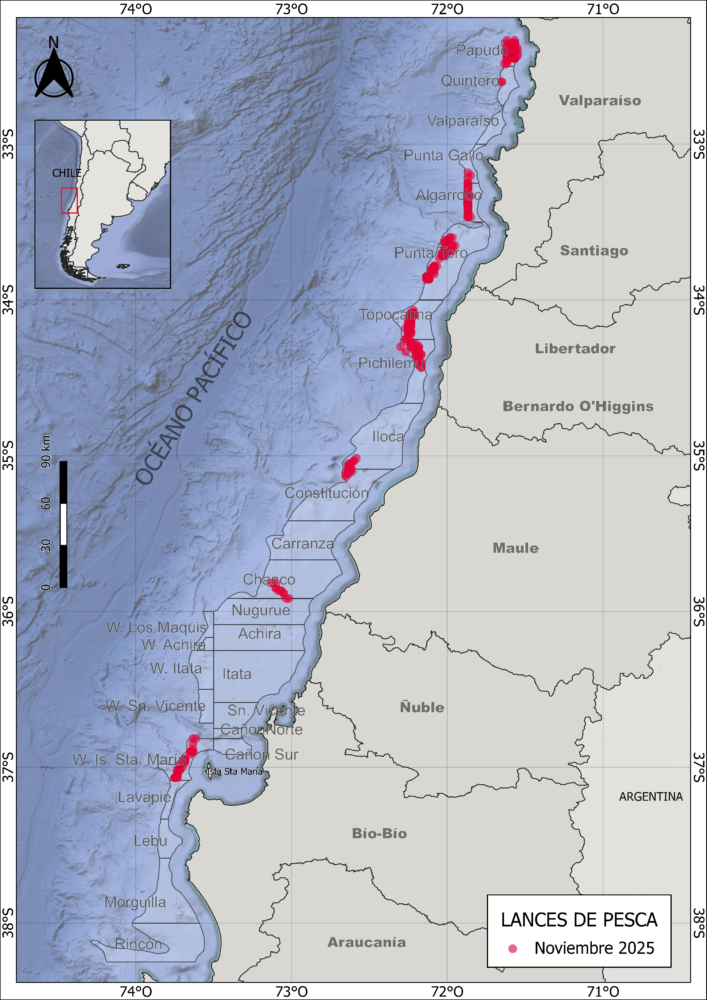
```

\newpage
## 2.2 Captura,esfuerzo y rendimientos de pesca

Durante noviembre de 2025, la actividad pesquera se concentró principalmente en el camarón nailon el 77 % de los lances se dirigió exclusivamente a esta especie, mientras que un 17 % correspondió a capturas exclusivas de langostino amarillo. El 6 % restante se distribuyó entre lances con capturas mixtas y lances dirigidos exclusivamente al langostino colorado (Fig. 2). 

```{r echo=FALSE, fig.width=3,fig.height=3,out.width="90%",fig.cap=" Distribución espacial de los lances de pesca orientados a langostino colorado, langostino amarillo y camarón nailon durante noviembre de 2025",fig.align="center"}
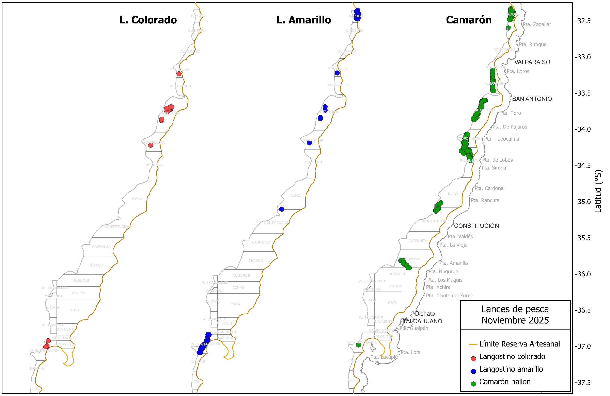
```

En consonancia con esta distribución del esfuerzo, el camarón nailon registró 268 lances, con 260 t de captura total y un rendimiento medio de 477 kg/ha (Tabla 1). El langostino amarillo sumó 72 lances y 137 t, con un rendimiento promedio de 1002 kg/ha (Tabla 1). Finalmente, el langostino colorado acumuló 411 t; las capturas por lance variaron entre 16 kg y 5 t, con un promedio de 1715 kg/lance, un esfuerzo de 39 ha (horas de arrastre) y un rendimiento de 1050 kg/ha (Tabla 1).

\newpage

##### *Tabla 1. Indicadores operacionales de la pesquería de langostino colorado, langostino amarillo y camarón nailon, año 2025.*

|**Recurso**|**Mes**|**N° de lances(n)**|**Cap. (kg)**|**Cap.lances (kg/n)**|**h arrast.(ha)**|**Rend. (kg/ha)**|**Prof.de fondo(m)**| 
|--------|-------|--------|-------|---------|-------|------|-------|
|**L.colorado**|marzo|178|492941|2769|233|2118|220|
|              |abril|267|805486|3017|366|2202|210|
|              |mayo|254|792701|3121|513|1546|177|
|              |junio|205|722214|3523|460|1571|163|
|              |julio|210|736028|3504|487|1510|157|
|              |agosto|179|631958|3530|294|214|192|
|              |octubre|143|333252|2330|282|1179|145|
|              |noviembre|24|41176|1715|39|1050|156|
|**L.amarillo**|marzo|124|102458|826|172|596|225|
|              |abril|200|89582|448|273|328|215|
|              |mayo|138|55002|399|280|197|167|
|              |junio|47|5796|123|104|55|156| 
|              |julio|75|112455|1499|167|693|178|
|              |agosto|19|22212|1169|33|663|193|
|              |octubre|126|345378|2741|281|1224|157|
|              |noviembre|72|137634|1911|137|1002|169|
|**Camarón**|marzo|44|30862|702|87|352|301|
|           |abril|7|1048|149|7|153|223|
|           |mayo|8|128|16|13|10|188|
|           |junio|8|18080|2260|19|933|315|
|           |julio|12|315|26|22|14|178|
|           |agosto|47|41462|882|123|337|278|
|           |octubre|33|15833|479|65|242|247|
|           |noviembre|268|260578|972|545|477|289|

En noviembre, el camarón nailon alcanzó rendimientos de hasta 3182 kg/ha, con el esfuerzo de arrastre concentrado en torno a 2 horas (Fig. 3). En el langostino amarillo, el rendimiento fluctúo entre 10 y 4121 kg/ha, bajo un patrón de esfuerzo similar (Fig. 3). Por su parte, el langostino colorado registró rendimientos entre 20 y 3498 kg/ha, con moda de 1193 kg/ha y un esfuerzo por lance de 22 a 208 min, mayoritariamente cercano a 2 horas (Fig. 3).

```{r echo=FALSE,fig.width=4,fig.height=5,out.width="80%",fig.cap="Distribución de frecuencia del esfuerzo de pesca (en horas de arrastre, A) y del rendimiento (en kg/ha, B), para langostino colorado y langostino amarillo durante noviembre de 2025",fig.align="center"}
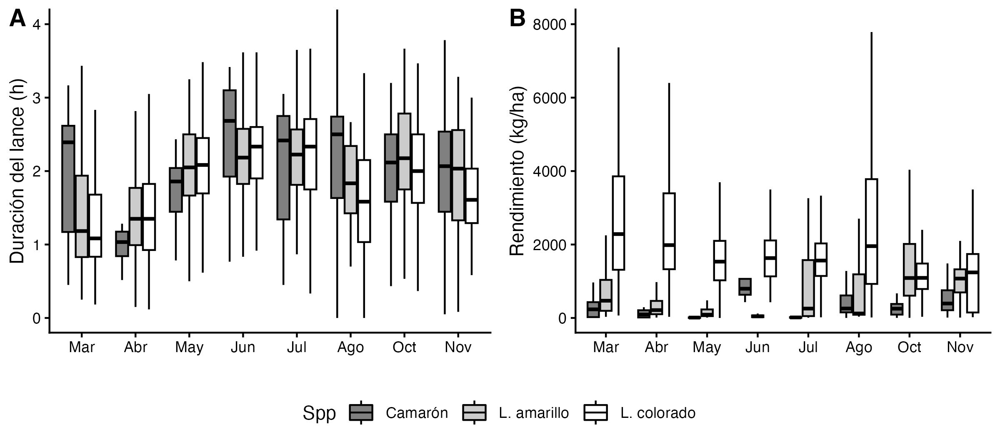
```


En noviembre, la distribución espacial del rendimiento de pesca mostró caladeros destacados en Iloca, Constitución y Chanco, con promedios entre 500 y 1000 kg/ha (Fig. 4). En el caso del langostino amarillo, las capturas se concentraron principalmente en la isla Santa María, Punta Toro y Papudo, con rendimientos entre 500 y 1500 kg/ha. Para el langostino colorado, los mayores rendimientos se registraron en Punta Toro, con valores entre 1400 y 2000 kg/ha (Fig. 4).


```{r echo=FALSE,fig.width=4,fig.height=5,out.width="110%",fig.cap="Distribución del rendimiento de pesca (kg/ha) de langostino colorado, langostino amarillo y camarón nailon en noviembre de 2025",fig.align="center"}
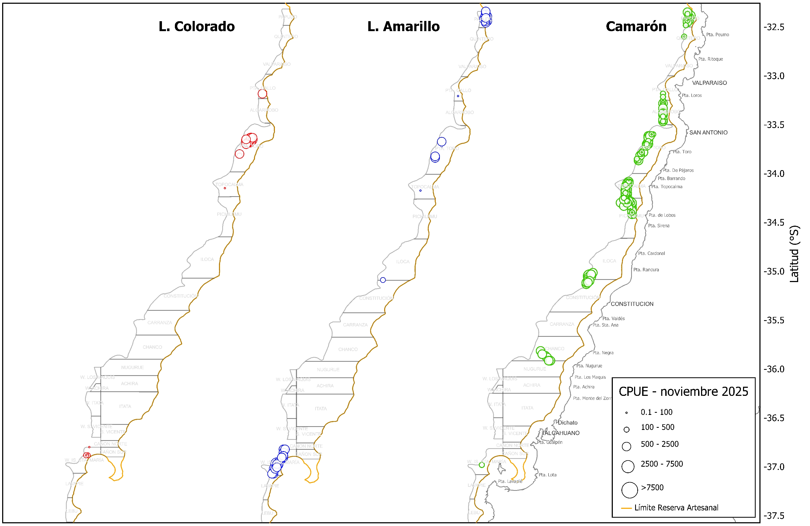
```


\newpage
# 3 Aspectos biológicos

Los indicadores biológicos incluyen la talla promedio por sexo, proporción sexual, estructura de tallas, estado de madurez de las hembras ovígeras y su proporción en las capturas. Los datos fueron obtenidos a partir de muestreos diarios aleatorios realizados sobre ejemplares capturados en las zonas visitadas por la flota. Se estableció un tamaño mínimo de muestra de 300 ejemplares, midiendo la longitud del cefalótorax con una precisión de 0,01 mm mediante un pie de metro. Además, los individuos fueron pesados (precisión 0,01 g), y se registró si estaban completos o incompletos. Se determinó el sexo de cada ejemplar y, en el caso de las hembras, se consignó la presencia de huevos (estado ovígero) y el grado de madurez de los mismos, según la escala de 4 puntos propuesta por Palma y Arana (1997).


## 3.1 Proporción sexual y talla promedio

Durante las capturas efectuadas en noviembre de 2025, la proporción sexual fue favorable a las hembras en camarón nailon y langostino colorado, alcanzando 60% y 64%, respectivamente. En contraste, en langostino amarillo predominaron los machos, con una participación de 56% (Fig. 5).

En noviembre, el camarón nailon presentó tallas medias mayores en las hembras que en los machos, con promedios de 30 y 27 mm LC, respectivamente (Fig. 6). En el caso del langostino amarillo, las hembras registraron las menores tallas promedio (33,8 mm LC), en contraste con los 42 mm LC observados en los machos; estas tallas son coherentes con la tendencia anual de tallas medias observada desde 2016, sin cambios marcados en 2025 (Fig. 6). Por su parte, el langostino colorado presentó longitudes cefalotorácicas entre 30 y 45 mm LC, con promedios cercanos a 37 mm LC en ambos sexos. En comparación con temporadas anteriores, las tallas medias registradas a comienzos de este año fueron particularmente altas (superiores a 37 mm LC), disminuyeron en junio, volvieron a incrementarse en julio y agosto y, aunque descendieron en octubre, se mantuvieron por sobre los 36 mm LC, aumentando nuevamente en noviembre (Fig. 6).

\newpage

##### *Tabla 2. Proporción sexual y talla promedio de langostino colorado, langostino amarillo y camarón nailon en las capturas de la UPS, año 2025*

|   |Mes|Sexo|n|LC(mm)|DE(mm)|Min.(mm)|Max.(mm)|
|----|---|----|-|------|------|----------|----------|
|**L.colorado**|marzo|hembra|1590|38,2|2,66|24.6|44,7|
|               |    |macho|1316|37,9|4,09|25,6|46,4|
|               |abril|hembra|2037|35,2|2,33|22,3|42,6|
|               |     |macho|2337|37,1|2,36|29,3|44,3|
|               |mayo|hembra|2422|35,3|1,91|29,4|43,7|
|               |     |macho|1402|37,3|2,31|29,5|45,8|
|               |junio|hembra|2516|34,6|2,19|28,2|43,2|
|               |     |macho|1234|36,7|2,92|29,5|46,2|
|               |julio|hembra|3725|36,9|2,19|30,4|44,5|
|               |     |macho|1720|38,5|2,80|28,8|46,5|
|               |agosto|hembra|4006|37,3|2,53|24,0|43,6|
|               |     |macho|1193|36,4|4,46|23,7|48,7|
|               |octubre|hembra|1966|36,2|2,40|27,5|44,7|
|               |     |macho|484|37,1|2,67|30,2|43,9|
|               |noviembre|hembra|367|36,9|2,61|30,7|45,0|
|               |         |macho|208|37,4|2,35|31,3|43,2|
|**L.amarillo**|marzo|hembra|85|33,3|2,61|29,3|40,3|
|             |    |macho|165|39,7|2,82|30,5|46,7|
|             |abril|hembra|297|31,4|2,58|19,6|44,6|
|             |     |macho|1043|37,4|4,38|17,7|51,9|
|             |mayo|hembra|282|35,4|2,84|25,6|43,5|
|             |    |macho|682|40,2|4,43|25,2|50,8|
|             |junio|hembra|5|33,1|2,62|31,3|36,3|
|             |     |macho|190|37,9|3,91|27,4|49,4|
|             |julio|hembra|756|34,4|2,21|29,3|42,5|
|             |     |macho|575|41,1|2,95|30,4|48,6|
|             |octubre|hembra|1316|34,6|3,05|22,5|44,3|
|             |     |macho|1641|40,6|4,85|21,2|55,1|
|             |noviembre|hembra|633|33,8|2,71|23,8|47,0|
|             |         |macho|800|42,0|4,56|24,2|52,9|
|**Camarón**|marzo|hembra|164|29,7|2,33|24,8|35,6|
|           |     |macho|86|29,4|1,39|26,5|32,6|
|           |junio|hembra|206|27,3|2,15|23,0|34,9|
|           |     |macho|44|25,4|2,13|22,5|34,0|
|           |agosto|hembra|811|27,5|3,58|16,6|36,4|
|           |     |macho|189|24,3|4,11|15,4|39,0|
|           |octubre|hembra|304|29,0|2,75|23,5|37,7|
|           |     |macho|196|27,1|2,78|20,4|35,7|
|           |noviembre|hembra|2555|29,8|2,49|19,9|37,1|
|           |         |macho|1695|27,5|3,06|16,2|36,3|

```{r echo=FALSE,fig.width=4,fig.height=5,out.width="70%",fig.cap="Proporción sexual de langostino colorado (A), langostino amarillo (B) y camarón nailon (C) durante el año de 2025",fig.align="center"}
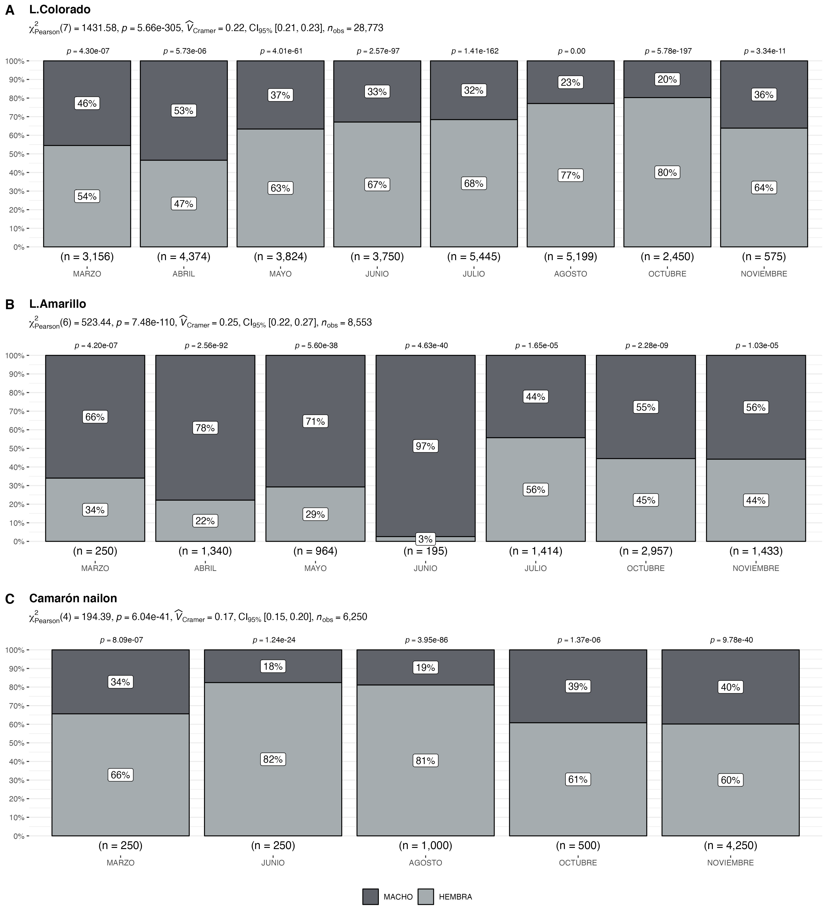

```

\newpage


```{r echo=FALSE,fig.width=4,fig.height=5,out.width="90%",fig.cap="Talla promedio (LC, mm) de langostino colorado y langostino amarillo por sexo, en el periodo enero 2016 a noviembre de 2025",fig.align="center"}
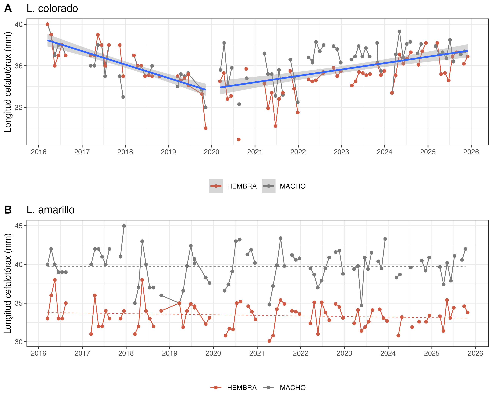
```

\newpage

## 3.2 Aspectos reproductivos

Durante noviembre de 2025, el 30 % de las hembras de langostino colorado se encontraban en estado ovígero, proporción similar a la registrada en el mismo período del año anterior. En el langostino amarillo, la proporción de hembras ovígeras se mantuvo elevada, en torno al 79 % (Fig. 7, Tabla 3). En camarón nailon, en tanto, se observó un 52 % de hembras portadoras de huevos.


```{r echo=FALSE, fig.width=4,fig.height=5,out.width="80%",fig.cap="Hembras ovígeras de langostino colorado y langostino amarillo durante el año 2025, en comparación con la media registrada entre los años 2017 a 2023 (línea verde)",fig.align="center"}
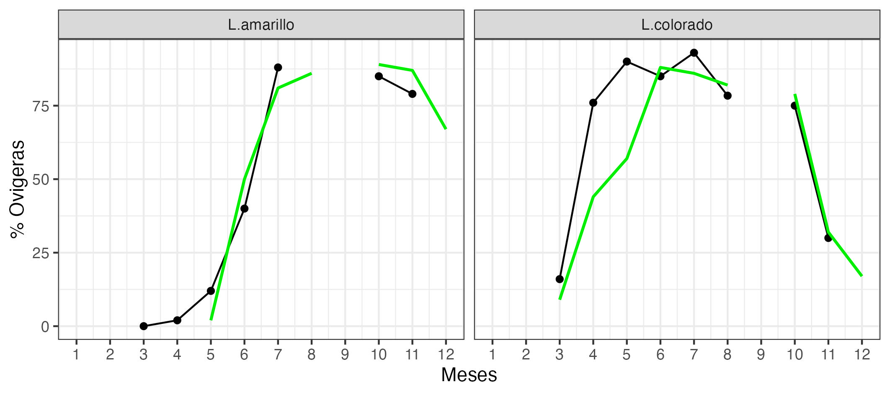
```

##### *Tabla 3. Porcentaje de hembras ovígeras y hembras maduras de langostino colorado y amarillo UPS 2025.*

| **Recurso**    | **Estado**   | **mar.** |**abr.**|**may.**|**jun.**|**jul.**|**ago.**|**oct.**|**nov.**|
|----------------|------------ |--------|--------|--------|--------|--------|--------|--------|--------|
| **L.colorado** | Normal       | 83%   | 21%|7%|  8%|3%|7%|15%|63%|
|                | Ovígeras     | 16%       |76%|90%|85%|93%|78%|75%|30%|
|                | Madura       | 1%        |3%| 3%|7%|4%|15%|10%|7%|
| Total n°       |              | 1590       |2037|2422|2566|3725|4006|1966|367|
| **L.amarillo** | Normal       | 100%      | 98%|7%|60%|2%|-|4%|12%|
|                | Ovígeras     | 0%        | 2%|12%|40%|88%|-|85%|79%|
|                | Madura       | 0%        |0%|1%|0%|10%|-|11%|9%|
| Total n°       |              | 85        |297|282|5|765|-|1316|633|


\newpage

## 3.3. Composición de tallas

En noviembre de 2025, el camarón nailon mostró diferencias claras entre sexos: las hembras alcanzaron las mayores tallas promedio, en torno a 30 mm LC, frente a los 27 mm LC observados en los machos (Tabla 2, Fig. 8). En el langostino amarillo se observó un patrón inverso, con machos de mayor tamaño, con promedios cercanos a 42 mm LC, en comparación con las hembras, que registraron tallas medias en torno a 34 mm LC (Tabla 2, Fig. 8), y en el caso del langostino colorado, el análisis de tallas no evidenció diferencias significativas entre sexos (prueba t de Student, p > 0,05).

Respecto de la composición de tallas por zona de pesca, en camarón nailon se observó una distribución relativamente homogénea en siete de los nueve caladeros analizados. No obstante, Pichicuy y Papudo concentraron los rangos de tallas más amplios, siendo Papudo el caladero que registró las menores tallas medias en ambos sexos (Fig. 11). En el langostino amarillo se dispuso de muestras biológicas únicamente en Papudo y en la isla Santa María, destacando esta última por exhibir el rango de tallas más amplio (Fig. 10). En el caso del langostino colorado, las muestras se obtuvieron solo en los caladeros de Santo Domingo y Papudo, sobresaliendo este último por presentar las mayores tallas modales, superiores a la media histórica registrada para esa zona (Fig. 9).

```{r echo=FALSE, fig.width=4,fig.height=5,out.width="90%",fig.cap=" Composición de tallas de langostino colorado (A), langostino amarillo (B) y camarón nailon (C) entre sexos, en noviembre de 2025",fig.align="center"}
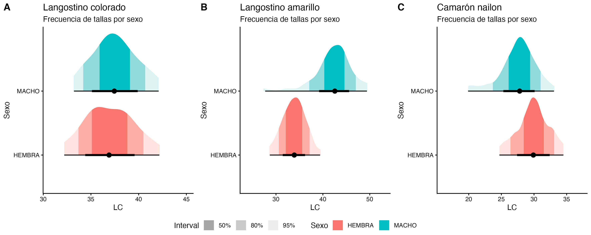
```


```{r echo=FALSE, fig.width=4,fig.height=5,out.width="90%",fig.cap="Composición de tallas de langostino colorado en la UPS por zonas de pesca en noviembre de 2025",fig.align="center"}
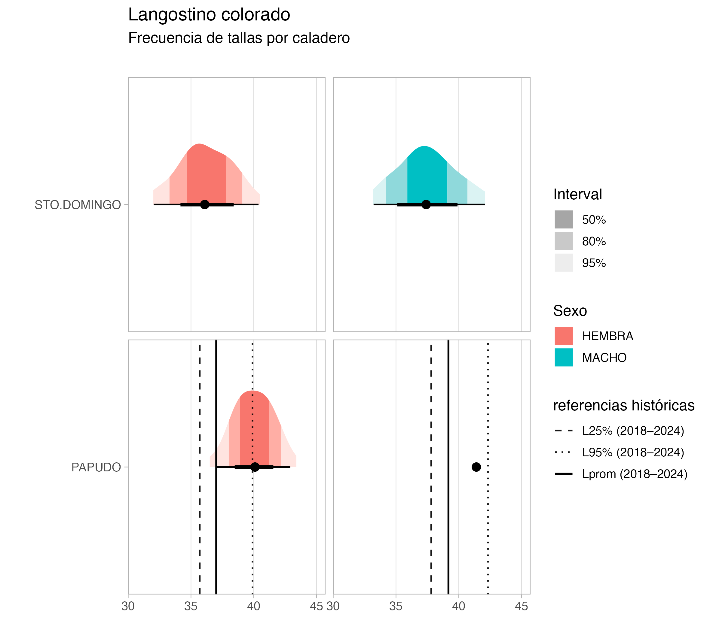
```

```{r echo=FALSE, fig.width=4,fig.height=5,out.width="90%",fig.cap="Composición de tallas de langostino amarillo en la UPS por zonas de pesca en noviembre de 2025",fig.align="center"}
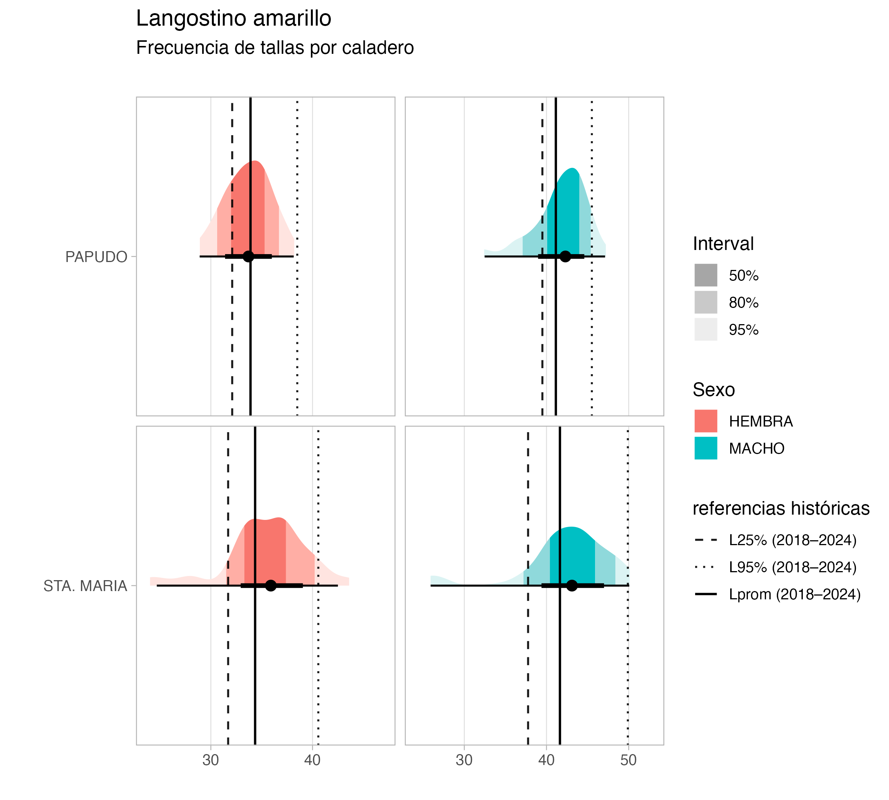
```

```{r echo=FALSE, fig.width=4,fig.height=5,out.width="90%",fig.cap="Composición de tallas de camarón nailon en la UPS por zonas de pesca en noviembre de 2025",fig.align="center"}
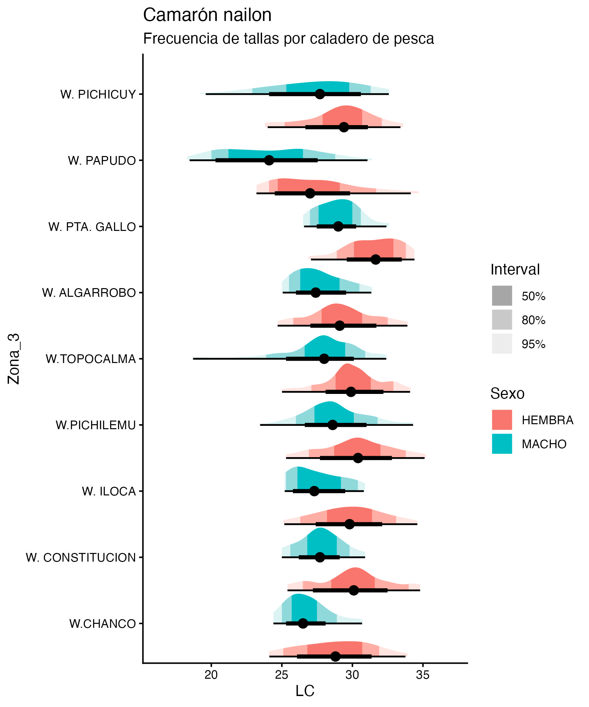
```


\newpage
## 3.4 Fauna acompañante

Las operaciones de pesca realizadas durante noviembre de 2025 por la flota de Crustáceos Pesca Sur evidenciaron la presencia de pejerrata, como fauna acompañante, en la mayoría de los caladeros que se visitaron (Fig. 12). Esta especie representó el 7,4 % del total de las capturas alcanzando un volumen de 35 t. 

En cuanto a la fauna acompañante, destacó la alta presencia de merluza y lenguado en la totalidad de los caladeros muestreados, con densidades entre 50 y 200 kg/ha (Fig. 13). También se registró la presencia de otros recursos, como jaiba paco y jaiba limón, aunque en menores abundancias (en términos de unidades por hora de arrastre), tal como se observa en la Figura 13.

```{r echo=FALSE, fig.width=4,fig.height=5,out.width="80%",fig.cap=" Distribución de los lances de pesca con captura de pejerrata en las capturas de camarón nailon, langostino colorado y langostino amarillo, y la fracción de pejerrata en las capturas totales, de noviembre año 2025",fig.align="center"}
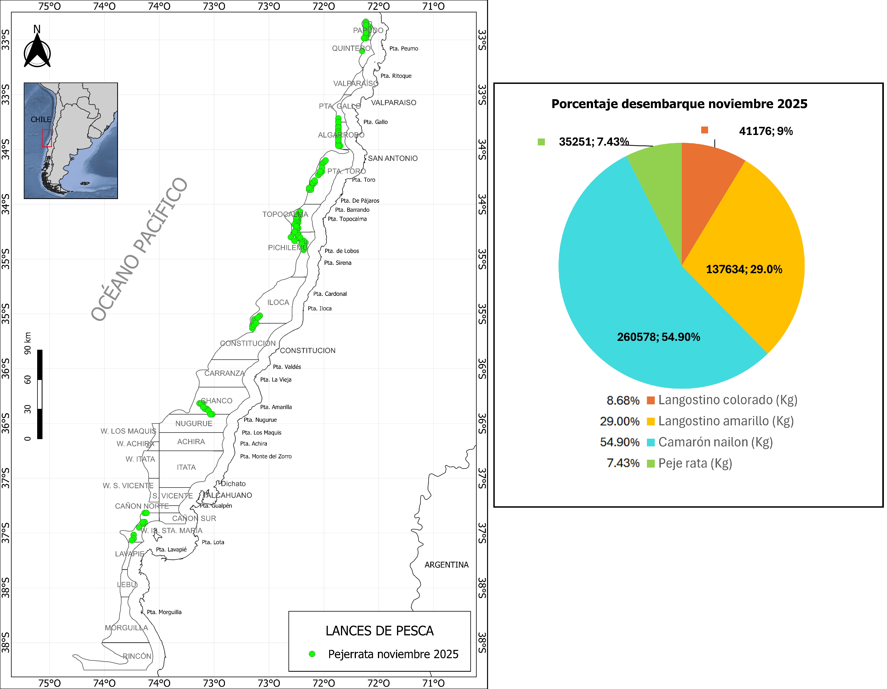
```


```{r echo=FALSE, fig.width=4,fig.height=5,out.width="110%",fig.cap=" Distribución espacial y abundancia de la fauna acompañante en los lances de pesca orientados a langostinos colorado y langostinos amarillos por la flota arrastrera de Camanchaca Pesca Sur, noviembre de 2025",fig.align="center"}
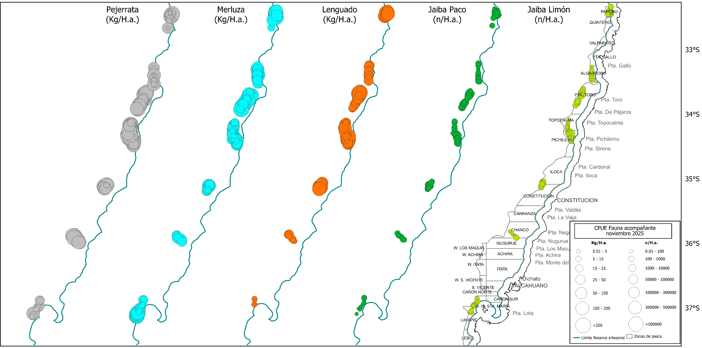
```


