\newpage

# 1 Resumen

Durante marzo de 2026, la actividad pesquera se desarrolló entre las regiones del Biobío y del Libertador General Bernardo O’Higgins, con operaciones concentradas principalmente en los caladeros de Pichilemu, Chanco, Itata y San Vicente. La dinámica de pesca estuvo dominada por lances con captura mixta de langostino colorado y langostino amarillo (42 % del total), seguidos por lances exclusivos de langostino colorado (28 %) y de camarón nailon (27 %), mientras que el 3 % restante correspondió a lances con presencia simultánea de los tres recursos. 

El langostino colorado lideró ampliamente las capturas del período, con 351 toneladas y un rendimiento promedio de 2907 kg/ha. Le siguió el camarón nailon, con 98 toneladas y un rendimiento de 1138 kg/ha, mientras que el langostino amarillo alcanzó 42 toneladas y 877 kg/ha. En términos espaciales, los mayores rendimientos de langostino colorado se registraron en San Vicente, Itata y Constitución, con valores medios del orden de 4500 a 5000 kg/ha; en langostino amarillo, los mejores rendimientos se observaron en San Vicente, y en camarón nailon destacaron las capturas obtenidas en el caladero de Chanco.  

Desde el punto de vista biológico, tanto el langostino colorado como el langostino amarillo presentaron una proporción sexual sesgada hacia los machos, con participaciones de 66 % y 75 %, respectivamente, mientras que en camarón nailon predominaron las hembras, con un 66 % de la captura. En cuanto a la estructura de tallas, el langostino colorado mantuvo promedios cercanos a 36 mm LC, consistentes con la tendencia reciente hacia ejemplares de mayor tamaño. En contraste, el langostino amarillo mostró un inicio de temporada con tallas medias históricamente bajas dentro de la serie reciente, comparables a las observadas en 2021. Por su parte, el camarón nailon presentó tallas medias en torno a 29 mm LC, sin diferencias marcadas entre sexos. 

En materia reproductiva, el 4 % de las hembras de langostino colorado se encontró en estado ovígero, proporción similar a la registrada el año anterior, mientras que en langostino amarillo no se observaron hembras ovígeras, manteniéndose la tendencia descrita desde 2017. En camarón nailon, el 4 % de las hembras presentó huevos, con predominio de ejemplares inmaduros. Adicionalmente, la composición espacial de tallas mostró en langostino colorado menores tallas modales en San Vicente y mayores en Pichilemu, mientras que en langostino amarillo las tallas más altas se observaron en Tumbes. 

Finalmente, en la fauna acompañante destacó la presencia de pejerrata en la zona de Chanco, recurso que representó el 5,3 % de las capturas totales, equivalente a 27 toneladas. También se registró la presencia de merluza y lenguado en los caladeros visitados, además de jaiba paco y jaiba limón en menores cantidades. 
\newpage

# 2 Aspectos Pesqueros

## 2.1 Actividad pesquera


Las operaciones de pesca realizadas durante marzo cubrieron los caladeros ubicados desde la región del Bío-Bío a la región del Libertador Bernardo O’Higgins, destacando los caladeros de Pichilemu, Chanco, Itata y San Vicente (Fig. 1). 

```{r echo=FALSE, fig.width=4,fig.height=5,out.width="65%", fig.cap="Distribución espacial del total de lances de pesca realizados durante marzo de 2026",fig.align="center" }
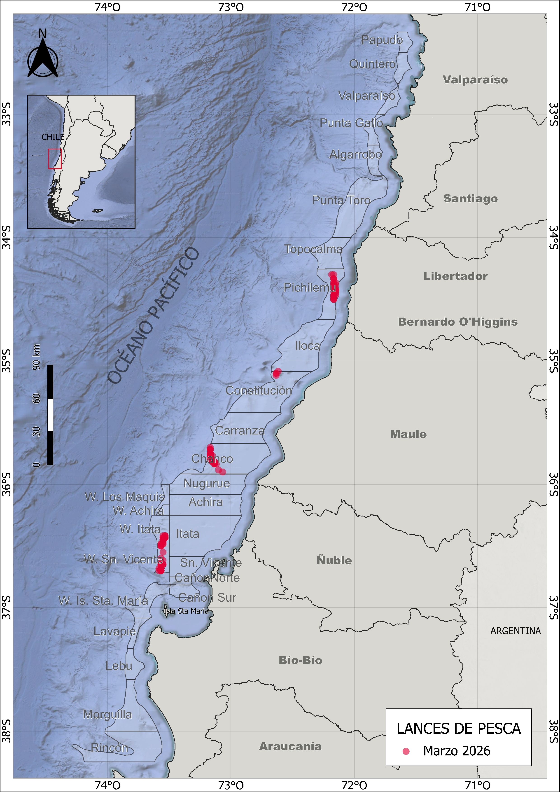
```

\newpage
## 2.2 Captura, esfuerzo y rendimientos de pesca

Durante marzo de 2026, la actividad pesquera se concentró principalmente en lances con captura mixta de langostino colorado y langostino amarillo, los que representaron el 42 % del total. En segundo lugar, el 28 % de los lances estuvo dirigido exclusivamente a langostino colorado, mientras que el 27 % correspondió a lances exclusivos de camarón nailon. El 3 % restante incluyó la presencia simultánea de los tres recursos (Fig. 2).


```{r echo=FALSE, fig.width=3,fig.height=3,out.width="90%",fig.cap=" Distribución espacial de los lances de pesca orientados a langostino colorado, langostino amarillo y camarón nailon durante marzo de 2026",fig.align="center"}
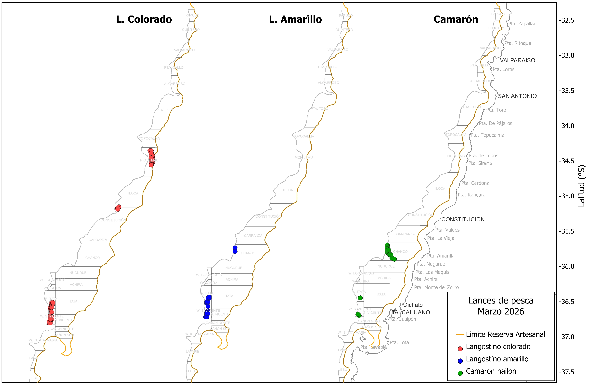
```


Las capturas por lance de langostino colorado oscilaron entre 360 y 4800 kg, totalizando 351 toneladas. El promedio por lance fue de 2567 kg, con un esfuerzo total de 121 horas de arrastre (ha) y un rendimiento de pesca de 2907 kg/ha (Tabla 1). En el caso del langostino amarillo, se registraron 83 lances, con una captura total de 42 toneladas y un rendimiento de 877 kg/ha. Por su parte, el camarón nailon estuvo presente en 57 lances, acumulando un total de 98 toneladas.

\newpage

##### *Tabla 1. Indicadores operacionales de la pesquería de langostino colorado, langostino amarillo y camarón nailon, marzo 2026.*

|**Recurso**|**Mes**|**N° de lances(n)**|**Cap. (kg)**|**Cap.lances (kg/n)**|**h arrast.(ha)**|**Rend. (kg/ha)**|**Prof.de fondo(m)**| 
|--------|-------|--------|-------|---------|-------|------|-------|
|**L.colorado**|marzo|137|351754|2567|121|2907|249|
|**L.amarillo**|marzo|83|42789|515|49|877|264|
|**Camarón**|marzo|57|98820|1733|87|1138|324|


El rendimiento de pesca del langostino colorado varió entre 490 y 16045 kg/ha, con una moda de 3974 kg/ha. Por su parte, el esfuerzo por lance fluctuó entre 10 y 220 minutos, concentrándose principalmente en torno a los 52 minutos (Fig. 3). En el caso del langostino amarillo, el rendimiento osciló entre 7 y 4517 kg/ha, mientras que el esfuerzo se concentró mayoritariamente en lances de 35 minutos. Por su parte, el camarón nailon presentó un rendimiento medio de 1330 kg/ha, con esfuerzos cercanos a 1 hora y 31 minutos.

```{r echo=FALSE,fig.width=4,fig.height=5,out.width="80%",fig.cap="Distribución de frecuencia del esfuerzo de pesca (en horas de arrastre, A) y del rendimiento (en kg/ha, B), para langostino colorado, langostino amarillo y camarón nailon durante marzo de 2026",fig.align="center"}
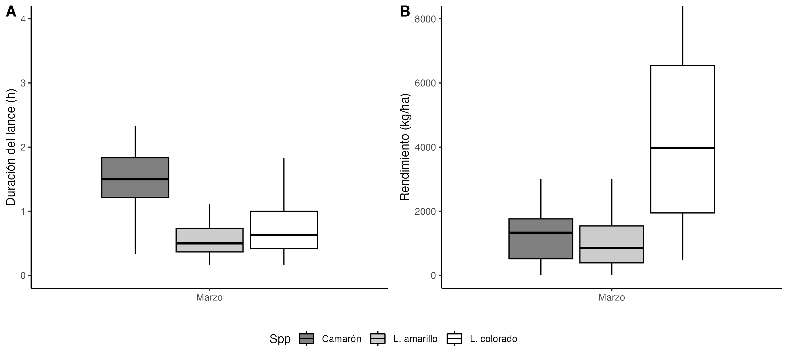
```


Durante marzo, los mayores rendimientos de langostino colorado se registraron en los caladeros de San Vicente, Itata y Constitución, con valores medios del orden de 4500 a 5000 kg/ha (Fig. 4). La captura de langostino amarillo, que se obtuvo en conjunto con langostino colorado, mostró su mejor desempeño en San Vicente, con rendimientos entre 500 y 1500 kg/ha (Fig. 4). En tanto, el camarón nailon presentó sus valores más altos en el caladero de Chanco, donde los rendimientos fluctuaron entre 600 y 1773 kg/ha (Fig. 5).

```{r echo=FALSE,fig.width=4,fig.height=5,out.width="110%",fig.cap="Distribución del rendimiento de pesca (kg/ha) de langostino colorado, langostino amarillo y camarón nailon en marzo de 2026",fig.align="center"}
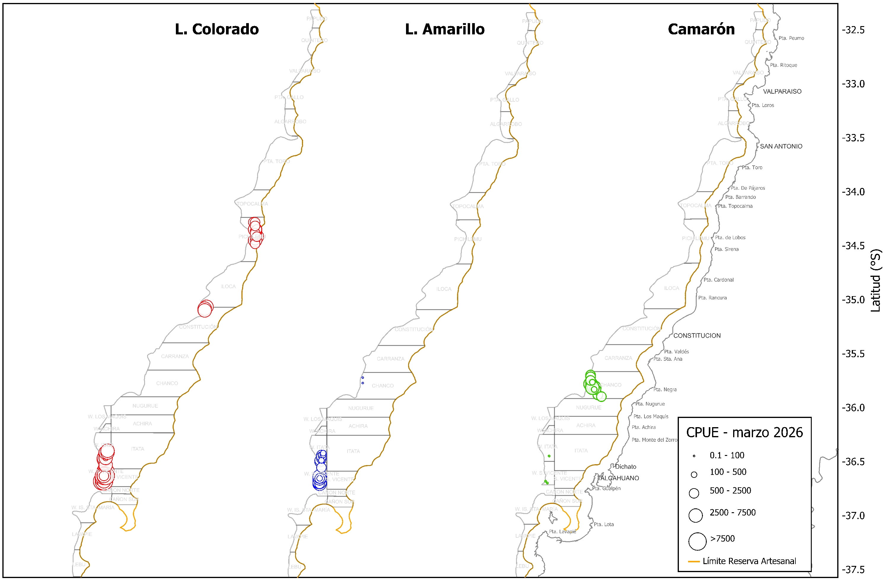
```


```{r echo=FALSE,fig.width=4,fig.height=5,out.width="80%",fig.cap="Rendimiento de pesca (captura por hora de arrastre) de langostino colorado (A), langostino amarillo (B) y camarón nailon (C), en marzo de 2026",fig.align="center"}
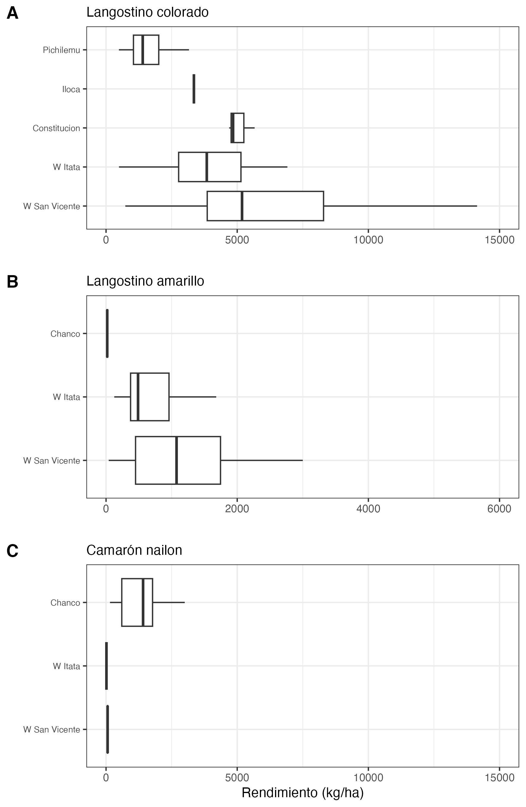
```

\newpage
# 3 Aspectos biológicos

Los indicadores biológicos incluyen la talla promedio por sexo, proporción sexual, estructura de tallas, estado de madurez de las hembras ovígeras y su proporción en las capturas. Los datos fueron obtenidos a partir de muestreos diarios aleatorios realizados sobre ejemplares capturados en las zonas visitadas por la flota. Se estableció un tamaño mínimo de muestra de 300 ejemplares, midiendo la longitud del cefalótorax con una precisión de 0,01 mm mediante un pie de metro. Además, los individuos fueron pesados (precisión 0,01 g), y se registró si estaban completos o incompletos. Se determinó el sexo de cada ejemplar y, en el caso de las hembras, se consignó la presencia de huevos (estado ovígero) y el grado de madurez de los mismos, según la escala de 4 puntos propuesta por Palma y Arana (1997).


## 3.1 Proporción sexual y talla promedio

Durante las capturas de marzo de 2026, el langostino colorado y el langostino amarillo presentaron una proporción sexual favorable a los machos, los que representaron el 66 % y el 75 % del total, respectivamente. En contraste, en el camarón nailon predominaron las hembras, con una participación en la captura de 66 % (Fig. 6).

En términos de talla media, el langostino colorado presentó longitudes cefalotorácicas entre 29,8 y 46,5 mm, con valores promedio similares entre sexos: 35,9 mm LC en hembras y 37,0 mm LC en machos. En perspectiva histórica, las tallas medias observadas este año mantienen la tendencia hacia ejemplares de mayor tamaño, con promedios en torno o superiores a 36 mm LC (Fig. 7).

En langostino amarillo, los machos alcanzaron una talla media de 36,1 mm LC, superior a la registrada en hembras, que fue de 29,3 mm LC. Al comparar estos resultados con años anteriores, ambos sexos muestran un inicio de temporada con tallas bajas, similares a las observadas al comienzo de la temporada 2021 (Tabla 2, Fig. 7).

Por su parte, en el camarón nailon las tallas medias se situaron en torno a 29 mm LC, sin diferencias marcadas entre sexos (Tabla 2).
\newpage

##### *Tabla 2. Proporción sexual y talla promedio de langostino colorado, langostino amarillo y camarón nailon en las capturas de la UPS, 2026*

|   |Mes|Sexo|n|LC(mm)|DE(mm)|Min.(mm)|Max.(mm)|
|----|---|----|-|------|------|----------|----------|
|**L.colorado**|marzo|hembra|813|35,9|2,44|29,8|43,7|
|         |    |macho|1595|37,0|2,34|29,9|46,5|
|**L.amarillo**|marzo|hembra|246|29,3|3,77|20,7|41,8|
|         |    |macho|732|36,1|6,45|20,2|51,6|
|**Camarón**|marzo|hembra|1163|29,9|2,31|24,3|36,9|
|      |     |macho|587|28,7|1,36|25,0|33,2|


```{r echo=FALSE,fig.width=4,fig.height=5,out.width="70%",fig.cap="Proporción sexual de langostino colorado (A), langostino amarillo (B) y camarón nailon durante marzo de 2026",fig.align="center"}
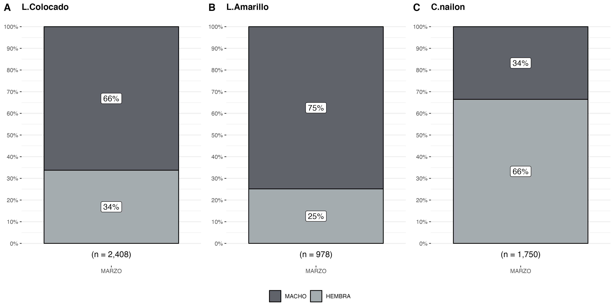
```

\newpage


```{r echo=FALSE,fig.width=4,fig.height=5,out.width="90%",fig.cap="Talla promedio (LC, mm) de langostino colorado y langostino amarillo por sexo, en el periodo enero 2016 a marzo de 2026",fig.align="center"}
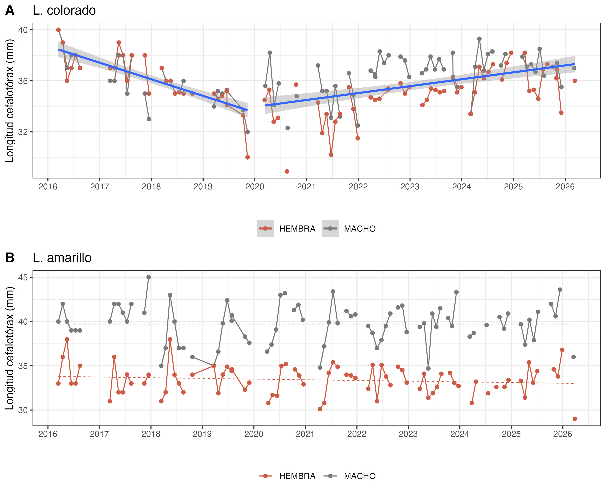
```

\newpage

## 3.2 Aspectos reproductivos

Durante marzo de 2026, el 4 % de las hembras de langostino colorado se encontró en estado ovígero, proporción similar a la registrada el año anterior (Fig. 8, Tabla 3). En el langostino amarillo no se observó presencia de hembras ovígeras, manteniéndose la tendencia descrita desde 2017. En camarón nailon, en tanto, el 4 % de las hembras presentó huevos, con predominio de ejemplares inmaduros (Tabla 3).

```{r echo=FALSE, fig.width=4,fig.height=5,out.width="50%",fig.cap="Hembras ovígeras de langostino colorado y langostino amarillo durante marzo 2026, en comparación con la media registrada entre los años 2017 a 2024 (línea verde)",fig.align="center"}
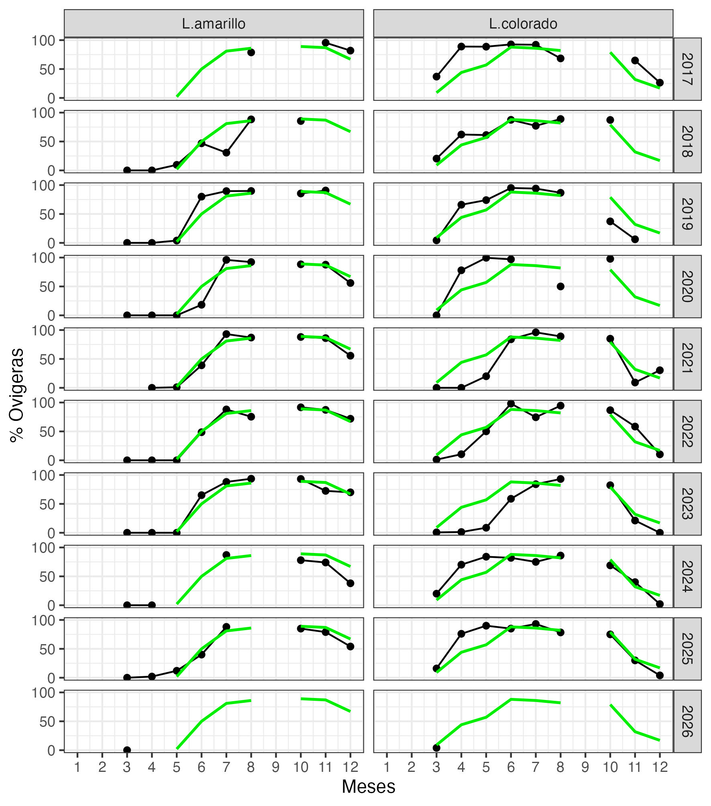
```

##### *Tabla 3. Porcentaje de hembras ovígeras y hembras maduras de langostino colorado y amarillo UPS 2026, y de hembras potadoras e inmaduras de camarón nailon*

| **Recurso**    | **Estado**   | **mar.** |
|----------------|------------ |--------|
| **L.colorado** | Normal       | 95%   |
|                | Ovígeras     | 4%       |
|                | Madura       | 1%        |
| Total n°       |              | 813       |
| **L.amarillo** | Normal       | 100%      | 
|                | Ovígeras     | 0%        | 
|                | Madura       | 0%        |
| Total n°       |              | 246       |
| **C.nailon** | Inmadura      | 96%      | 
|                | Madura       | 4%        |
| Total n°       |              | 1221       |

\newpage

## 3.3. Composición de tallas

El análisis de tallas no evidenció diferencias significativas entre sexos en langostino colorado ni en camarón nailon (prueba t de Student, p > 0,05). Las tallas medias fueron de 36 mm LC en langostino colorado y de 29 mm LC en camarón nailon (Tabla 2, Fig. 9 y 11). En contraste, el langostino amarillo sí presentó diferencias significativas entre sexos, con machos de mayor talla media (36 mm LC) que las hembras (29 mm LC) (Tabla 2, Fig. 10).

En relación con la composición de tallas por zona de pesca, el langostino colorado presentó las tallas modales más pequeñas en el caladero de San Vicente, mientras que las mayores se registraron en Pichilemu (Fig. 12). En langostino amarillo, las tallas más altas se observaron en Tumbes (Fig. 13). Para camarón nailon no fue posible realizar este análisis, debido a que el muestreo biológico se efectuó exclusivamente en el caladero de Chanco (Fig. 11).

```{r echo=FALSE, fig.width=4,fig.height=5,out.width="70%",fig.cap=" Composición de tallas de langostino colorado entre sexos, en marzo de 2026",fig.align="center"}
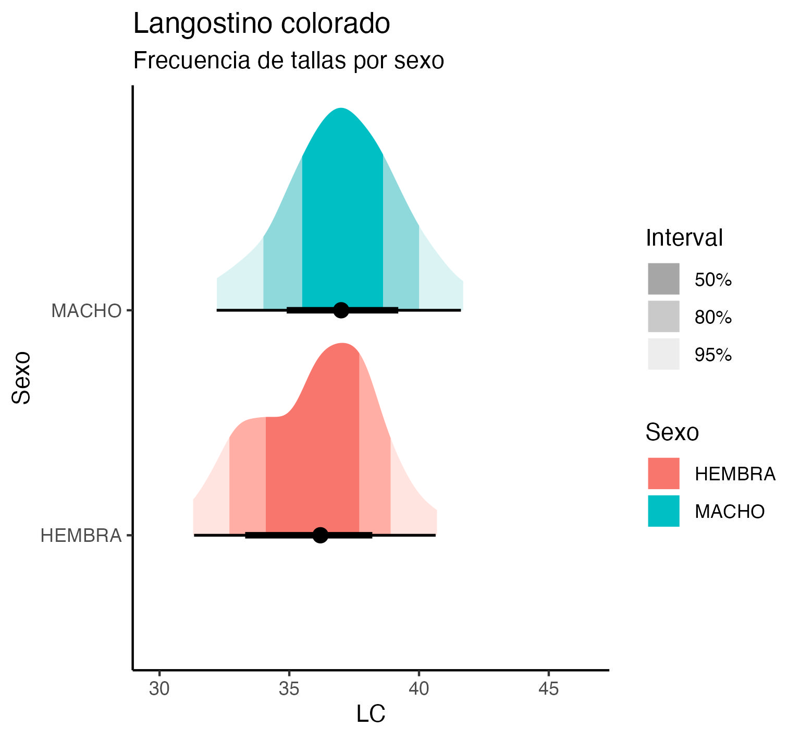
```


```{r echo=FALSE, fig.width=4,fig.height=5,out.width="70%",fig.cap=" Composición de tallas de langostino amarillo entre sexos, en marzo de 2026",fig.align="center"}
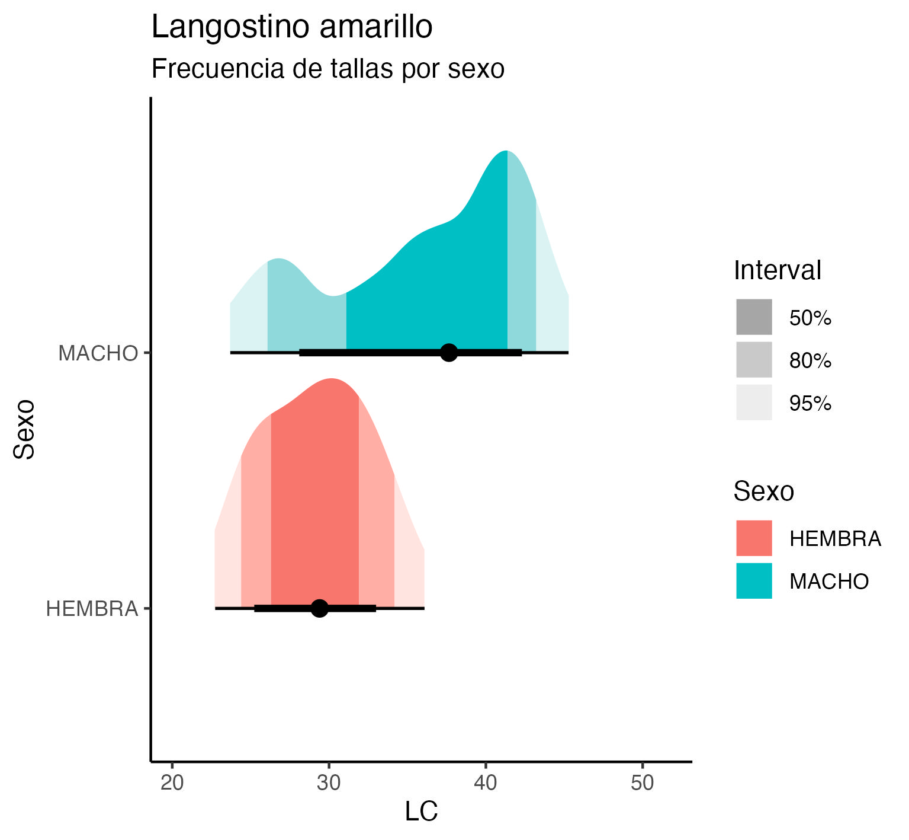
```


```{r echo=FALSE, fig.width=4,fig.height=5,out.width="70%",fig.cap=" Composición de tallas de camarón nailon entre sexos, en marzo de 2026",fig.align="center"}
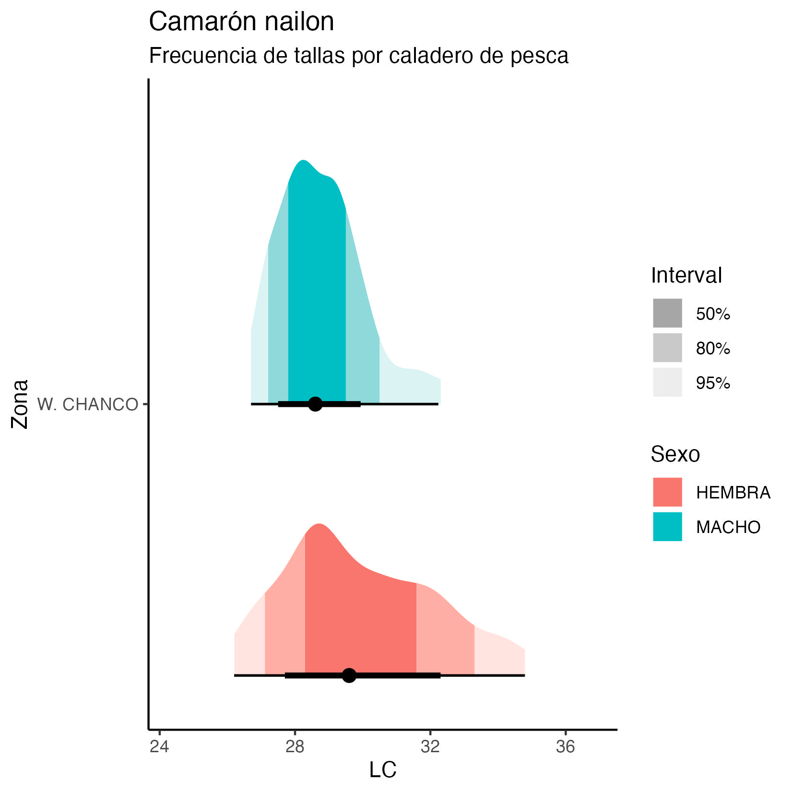
```


```{r echo=FALSE, fig.width=4,fig.height=5,out.width="80%",fig.cap="Composición de tallas de langostino colorado en la UPS por zonas de pesca en marzo de 2026",fig.align="center"}
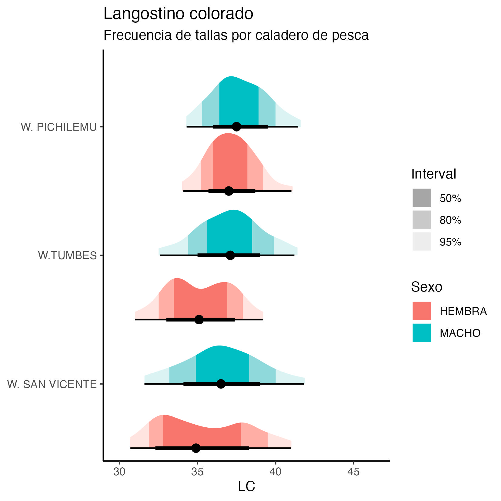
```


```{r echo=FALSE, fig.width=4,fig.height=5,out.width="80%",fig.cap="Composición de tallas de langostino amarillo en la UPS por zonas de pesca en marzo de 2026",fig.align="center"}
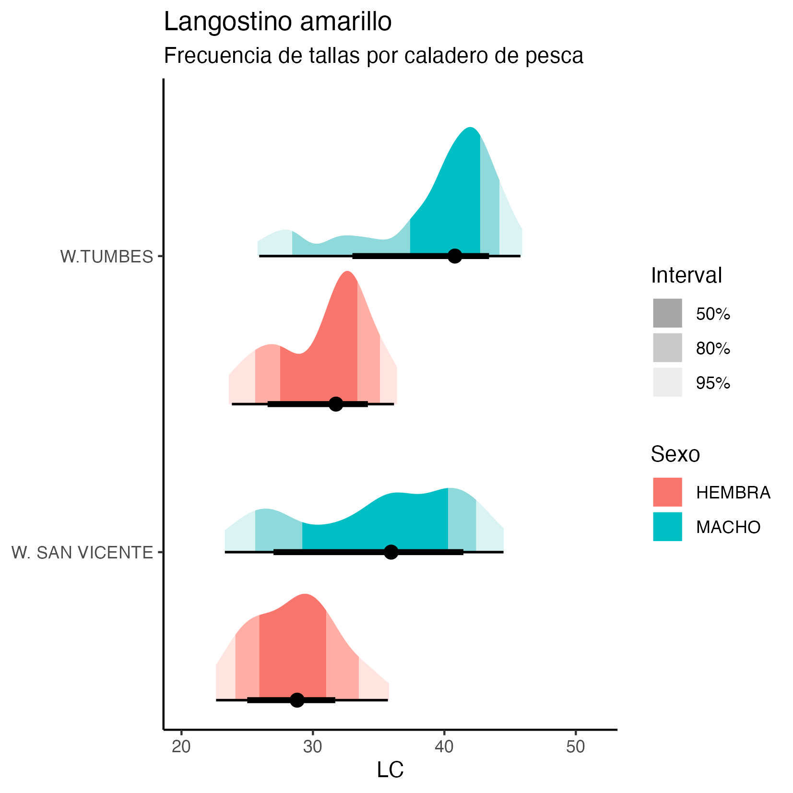
```


\newpage
## 3.4 Fauna acompañante

Las operaciones de pesca realizadas durante marzo de 2026 por la flota de CrustaSur evidenciaron la presencia de pejerrata, como fauna acompañante, en la zona Chanco (Fig. 14). Esta especie representó un 5,3 % del total de las capturas alcanzando un volumen de 27 toneladas. 

En cuanto a la ocurrencia de otros recursos como fauna acompañante destaca la merluza y lenguado en la totalidad de caladeros visitados con valores entre los 15 y 100 kg/ha (Fig. 15).
También hay presencia de otros recursos como la jaiba paco y jaiba limón pero en menor cantidad (en términos de unidades por hora de arrastre) como se muestra en la Figura 15.

```{r echo=FALSE, fig.width=4,fig.height=5,out.width="80%",fig.cap=" Distribución de los lances de pesca con captura de pejerrata en las capturas de camarón nailon, langostino colorado y langostino amarillo, y la fracción de pejerrata en las capturas totales, desde marzo  año 2026",fig.align="center"}
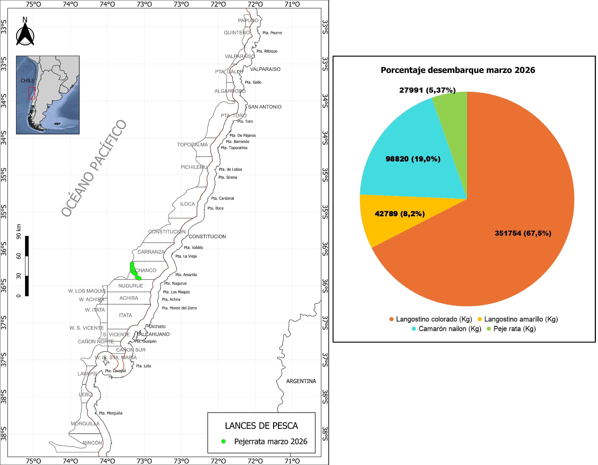
```


```{r echo=FALSE, fig.width=4,fig.height=5,out.width="110%",fig.cap=" Distribución espacial y abundancia de la fauna acompañante en los lances de pesca orientados a langostinos colorado y langostinos amarillos por la flota arrastrera de CrustaSur, marzo de 2026",fig.align="center"}
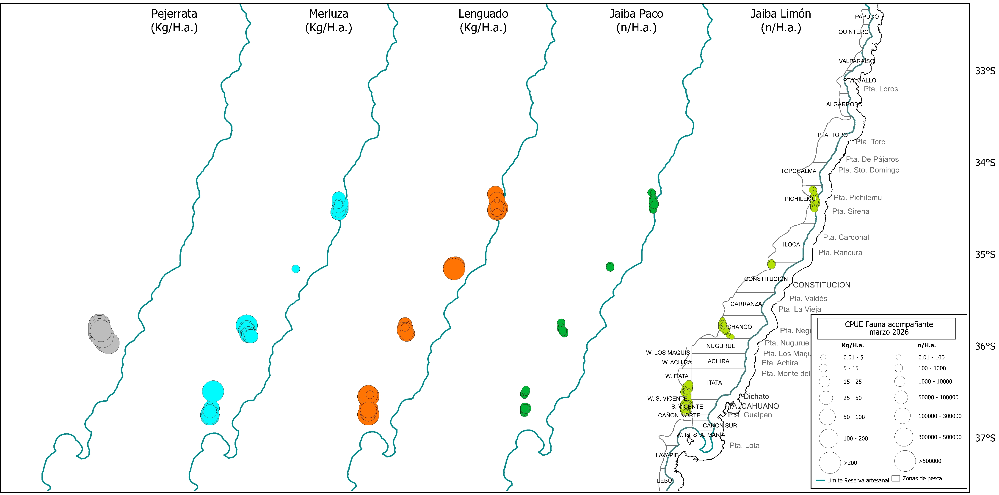
```


