\newpage


## 1 Resumen

Durante abril de 2026, la actividad pesquera de la flota de CrustaSur se desarrolló entre las regiones del Biobío y del Libertador General Bernardo O’Higgins, abarcando principalmente los caladeros de San Vicente, Itata, Chanco, Carranza, Iloca y Pichilemu. La operación estuvo dominada por lances con captura exclusiva de langostino colorado y por lances mixtos de langostino colorado y langostino amarillo, mientras que el camarón nailon se concentró en caladeros específicos, principalmente Chanco e Itata. En términos operacionales, el langostino colorado registró la mayor captura mensual, con 384 toneladas y un rendimiento promedio de 1281 kg/ha., seguido por langostino amarillo, con 48 toneladas y 352 kg/ha., y camarón nailon, con 46 toneladas y 693 kg/ha.

Desde el punto de vista biológico, el langostino colorado y el camarón nailon presentaron una proporción sexual favorable a las hembras, mientras que en langostino amarillo predominaron los machos. Las tallas medias de langostino colorado se mantuvieron en torno a 36–38 mm LC, con valores relativamente similares entre sexos. En langostino amarillo se observó un repunte de las tallas respecto de marzo, especialmente en machos, que alcanzaron una talla media de 40,0 mm LC, mientras que las hembras registraron 31,7 mm LC. En camarón nailon, las hembras presentaron una talla media cercana a 30 mm LC, superior a la registrada en machos.

En relación con los aspectos reproductivos, el 20 % de las hembras de langostino colorado se encontró en condición ovígera, proporción similar a la registrada durante el año anterior. En langostino amarillo no se observó presencia de hembras ovígeras, manteniéndose la tendencia descrita desde 2017. En camarón nailon, el 27 % de las hembras correspondió a ejemplares maduros o portadores, mientras que predominó la fracción inmadura.

La composición de tallas mostró diferencias entre recursos y zonas de pesca. En langostino colorado, las tallas modales más pequeñas se registraron en San Vicente, mientras que las mayores se observaron en Pichilemu. En langostino amarillo, las tallas fueron relativamente similares entre San Vicente e Itata, manteniendo el repunte observado durante abril. En camarón nailon, las mayores tallas se observaron en Chanco, especialmente en hembras. Finalmente, la fauna acompañante estuvo representada principalmente por pejerrata, merluza, lenguado, jaiba paco y jaiba limón, con baja participación relativa respecto de las capturas objetivo.

 
\newpage

# 2 Aspectos Pesqueros

## 2.1 Actividad pesquera

La distribución espacial de los lances muestra una operación concentrada en sectores costeros discretos, asociados a caladeros históricamente relevantes para la pesquería de crustáceos demersales. Durante abril de 2026, la actividad se desarrolló desde la región del Biobío hasta la región del Libertador General Bernardo O’Higgins, destacando los caladeros de Pichilemu, Iloca, Carranza, Chanco e Itata (Fig. 1). 

```{r echo=FALSE, fig.width=4,fig.height=5,out.width="65%", fig.cap="Distribución espacial del total de lances de pesca realizados durante abril de 2026",fig.align="center" }
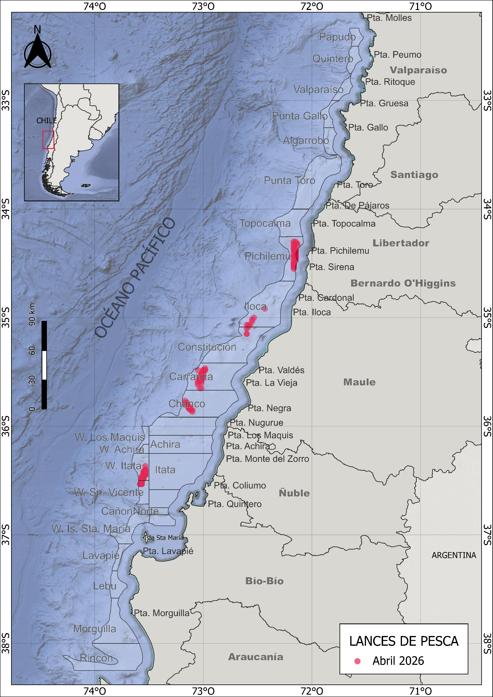
```

\newpage
## 2.2 Captura, esfuerzo y rendimientos de pesca

Durante abril de 2026, la actividad pesquera se concentró principalmente en lances con captura exclusiva de langostino colorado, los que representaron el 41 % del total, y en lances con captura mixta de langostino colorado y langostino amarillo, que representaron el 37 %. En segundo lugar, el 13 % de los lances estuvo orientado exclusivamente a camarón nailon. El porcentaje restante correspondió a lances con presencia simultánea de los tres recursos u otras combinaciones de menor frecuencia (Fig. 2). En cuanto a las capturas de estas especies por caladero, en la mayoría predominó el langostino colorado. El langostino amarillo presentó mayor participación relativa en Iloca, mientras que en Chanco la captura estuvo compuesta exclusivamente por camarón nailon.


```{r echo=FALSE, fig.width=3,fig.height=3,out.width="90%",fig.cap=" Distribución espacial de los lances de pesca orientados a langostino colorado, langostino amarillo y camarón nailon durante abril de 2026",fig.align="center"}
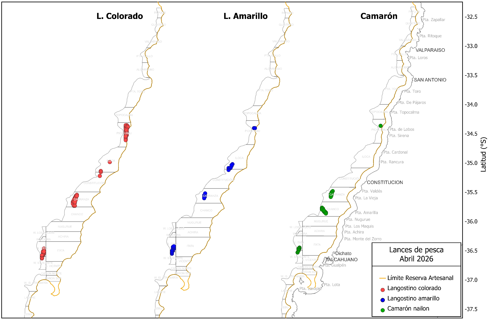
```


Respecto de marzo, los tres recursos presentaron una disminución en el rendimiento promedio, particularmente langostino colorado y langostino amarillo. En langostino colorado, las capturas alcanzaron 384 toneladas, con un promedio de 2372 kg por lance, un esfuerzo total de 230 horas de arrastre y un rendimiento de pesca de 1281 kg/ha (Tabla 1). Para langostino amarillo, se registraron 86 lances, una captura total de 48 toneladas y un rendimiento promedio de 352 kg/ha. En tanto, el camarón nailon estuvo presente en 37 lances, acumulando 46 toneladas de captura total.

\newpage

##### *Tabla 1. Indicadores operacionales de la pesquería de langostino colorado, langostino amarillo y camarón nailon, año 2026.*

|**Recurso**|**Mes**|**N° de lances(n)**|**Cap. (kg)**|**Cap.lances (kg/n)**|**h arrast.(ha)**|**Rend. (kg/ha)**|**Prof.de fondo(m)**| 
|--------|-------|--------|-------|---------|-------|------|-------|
|**L.colorado**|marzo|137|351754|2567|121|2907|249|
|              |abril|162|384280|2372|230|1281|224|
|**L.amarillo**|marzo|83|42789|515|49|877|264|
|              |abril|86|48702|566|138|352|238|
|**Camarón**|marzo|57|98820|1733|87|1138|324|
|           |abril|37|46825|1265|67|693|283|


El rendimiento de pesca del langostino colorado varió entre 150 y 4224 kg/ha, con una moda de 1318 kg/ha. Por su parte, el esfuerzo por lance fluctuó entre 20 y 238 minutos, concentrándose principalmente en torno a 1 hora 50 minutos (Fig. 3). En el caso del langostino amarillo, el rendimiento osciló entre 9 y 1416 kg/ha, mientras que el esfuerzo se concentró mayoritariamente en lances de 1 hora 30 minutos. Por su parte, el camarón nailon presentó un rendimiento medio de 693 kg/ha, con esfuerzos cercanos a 2 horas.

```{r echo=FALSE,fig.width=4,fig.height=5,out.width="80%",fig.cap="Distribución de frecuencia del esfuerzo de pesca (en horas de arrastre, A) y del rendimiento (en kg/ha, B), para langostino colorado, langostino amarillo y camarón nailon durante abril de 2026",fig.align="center"}
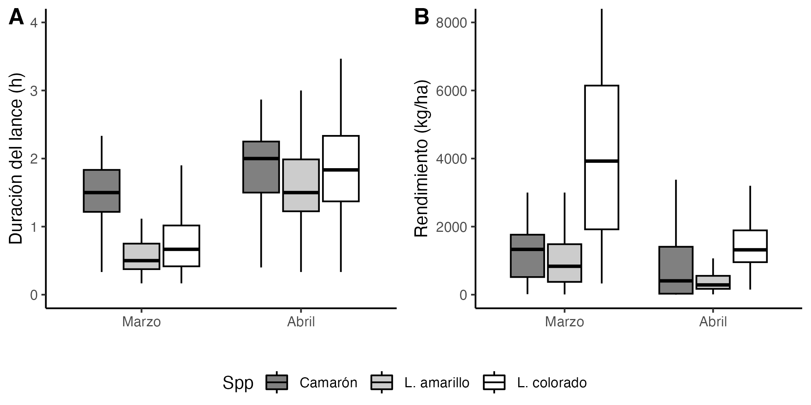
```


Durante abril, los mayores rendimientos de langostino colorado se registraron en los caladeros de Iloca, Carranza e Itata, con valores medios del orden de 1300 a 1500 kg/ha (Fig. 4,5). La captura de langostino amarillo mostró su mejor desempeño en Iloca y Constitución, con rendimientos de 1000 kg/ha (Fig. 4,5). En tanto, el camarón nailon presentó sus valores más altos en el caladero de Itata, donde los rendimientos fluctuaron entre 2000 y 4000 kg/ha (Fig. 4,5).

```{r echo=FALSE,fig.width=4,fig.height=5,out.width="80%",fig.cap="Rendimiento de pesca (captura por hora de arrastre) de langostino colorado (A), langostino amarillo (B) y camarón nailon (C), en abril de 2026",fig.align="center"}
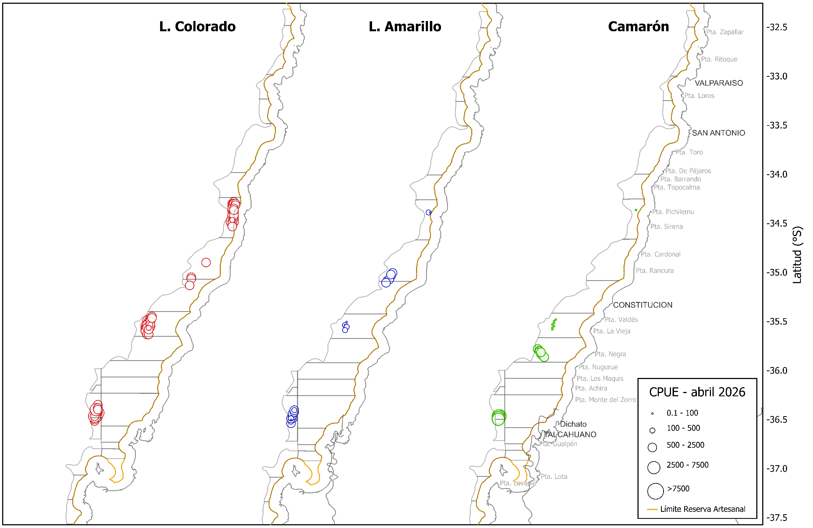
```


```{r echo=FALSE,fig.width=4,fig.height=5,out.width="110%",fig.cap="Distribución del rendimiento de pesca (kg/ha) de langostino colorado, langostino amarillo y camarón nailon en abril de 2026",fig.align="center"}
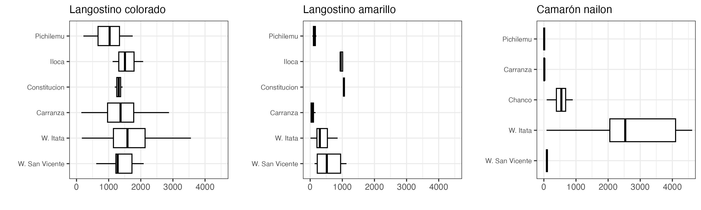
```


\newpage
# 3 Aspectos biológicos

Los indicadores biológicos considerados incluyeron la talla promedio por sexo, proporción sexual, estructura de tallas, condición reproductiva de las hembras y proporción de hembras ovígeras o maduras en las capturas. La información provino de muestreos diarios aleatorios realizados sobre ejemplares capturados en las zonas visitadas por la flota. Para cada recurso se estableció un tamaño mínimo de muestra de 300 ejemplares. La longitud cefalotorácica fue medida con pie de metro de precisión 0,01 mm, registrándose además el peso individual, la condición del ejemplar, el sexo y, en hembras, la presencia de huevos y su grado de madurez según la escala de Palma y Arana (1997).


## 3.1 Proporción sexual y talla promedio

En las capturas de abril de 2026, el langostino colorado y camarón nailon presentaron una proporción sexual favorable a las hembras, las que representaron el 51 % y el 70 % del total, respectivamente. En contraste, en el langostino amarillo predominaron los machos, representando el 68 % de los ejemplares muestreados (Fig. 6).

En términos de talla media, el langostino colorado presentó longitudes cefalotorácicas entre 30 y 46 mm, con valores promedio similares entre sexos: 36,2 mm LC en hembras y 37,7 mm LC en machos. En perspectiva histórica, las tallas medias observadas durante 2026 se mantienen en el rango alto de la serie reciente, con promedios en torno o superiores a 36 mm LC (Fig. 7).

En langostino amarillo, los machos alcanzaron una talla media de 40 mm LC, superior a la registrada en hembras, que fue de 31 mm LC. Al comparar estos resultados con años anteriores, en ambos sexos se observa un repunte de las tallas en relación al mes de marzo, situándose en tallas similares a las observadas desde el año 2022 (Tabla 2, Fig. 7).

Por su parte, en el camarón nailon las tallas medias se situaron en torno a 30 mm LC en hembras y 28 mm LC en machos (Tabla 2).
\newpage

##### *Tabla 2. Proporción sexual y talla promedio de langostino colorado, langostino amarillo y camarón nailon en las capturas de la UPS, 2026*

|   |Mes|Sexo|n|LC(mm)|DE(mm)|Min.(mm)|Max.(mm)|
|----|---|----|-|------|------|----------|----------|
|**L.colorado**|marzo|hembra|813|35,9|2,44|29,8|43,7|
|         |    |macho|1595|37,0|2,34|29,9|46,5|
|         |abril|hembra|1508|36,2|2,06|30,0|44,1|
|         |   |macho|1561|37,7|2,09|29,9|46,0|
|**L.amarillo**|marzo|hembra|246|29,3|3,77|20,7|41,8|
|         |    |macho|732|36,1|6,45|20,2|51,6|
|         |abril|hembra|336|31,7|3,30|20,3|40,9|
|         |     |macho|729|40,0|4,71|19,6|49,2|
|**Camarón**|marzo|hembra|1163|29,9|2,31|24,3|36,9|
|      |     |macho|587|28,7|1,36|25,0|33,2|
|      |abril|hembra|700|30,0|2,48|23,9|37,6|
|      |      |macho|300|28,4|1,47|25,1|33,4|


```{r echo=FALSE,fig.width=4,fig.height=5,out.width="70%",fig.cap="Proporción sexual de langostino colorado (A), langostino amarillo (B) y camarón nailon durante abril de 2026",fig.align="center"}
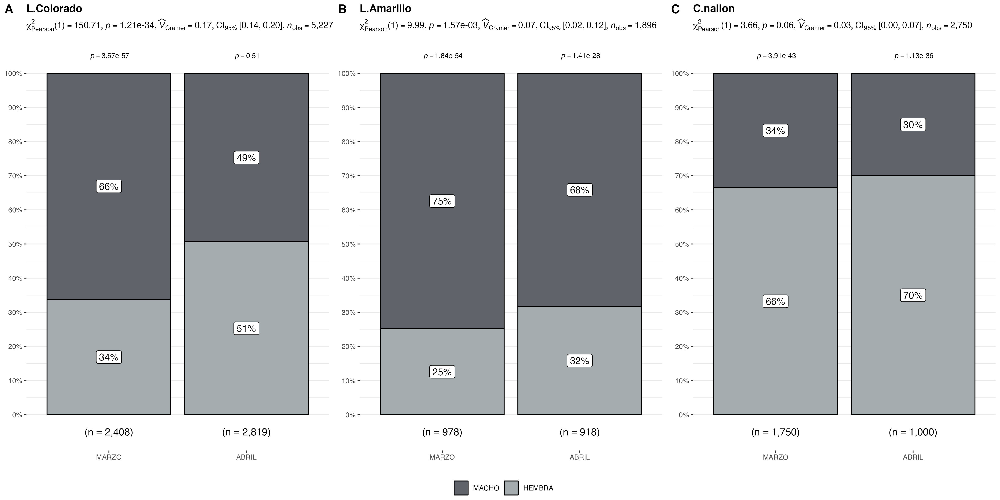
```

\newpage


```{r echo=FALSE,fig.width=4,fig.height=5,out.width="90%",fig.cap="Talla promedio (LC, mm) de langostino colorado y langostino amarillo por sexo, en el periodo enero 2016 a abril de 2026",fig.align="center"}
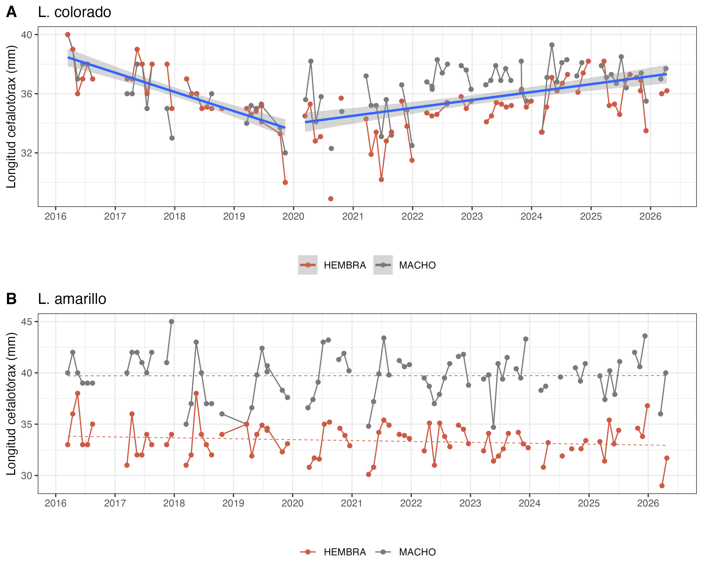
```

\newpage

## 3.2 Aspectos reproductivos

Durante abril de 2026, el 20 % de las hembras de langostino colorado se encontró en condición ovígera, proporción superior a la registrada en marzo y similar a la observada durante el año anterior. En langostino amarillo no se registraron hembras ovígeras, manteniéndose la tendencia observada desde 2017. En camarón nailon, el 27 % de las hembras correspondió a ejemplares maduros, mientras que predominó la fracción inmadura (Tabla 3, Fig. 8).

```{r echo=FALSE, fig.width=4,fig.height=5,out.width="50%",fig.cap="Hembras ovígeras de langostino colorado y langostino amarillo durante abril 2026, en comparación con la media registrada entre los años 2017 a 2024 (línea verde)",fig.align="center"}
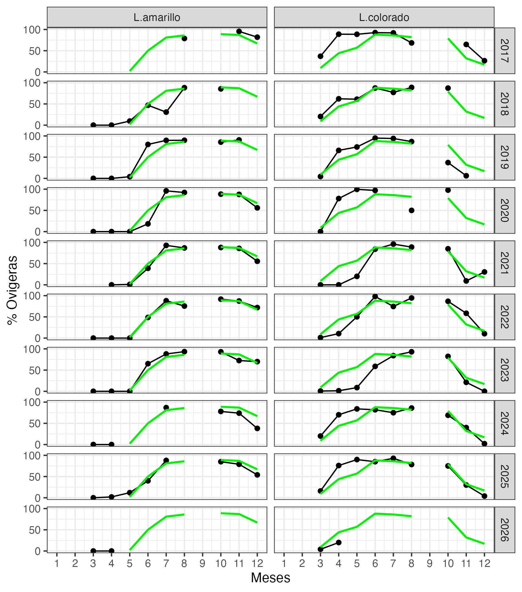
```
\newpage
##### *Tabla 3. Porcentaje de hembras ovígeras y hembras maduras de langostino colorado y amarillo UPS 2026, y de hembras portadoras e inmaduras de camarón nailon*

| **Recurso**    | **Estado**   | **mar.** |**abr.** |
|----------------|------------ |--------|--------|
| **L.colorado** | Normal       | 95%   |79%|
|                | Ovígeras     | 4%       |20%|
|                | Madura       | 1%        |1%|
| Total n°       |              | 813       |1508|
| **L.amarillo** | Normal       | 100%      | 100%|
|                | Ovígeras     | 0%        | 0%|
|                | Madura       | 0%        |0%|
| Total n°       |              | 246       |336|
| **C.nailon** | Inmadura      | 96%      | 73%|
|                | Madura       | 4%        |27%|
| Total n°       |              | 1221       |700|

\newpage

## 3.3. Composición de tallas

En langostino colorado, las tallas medias fueron similares entre sexos y no se detectaron diferencias estadísticamente significativas durante abril de 2026 (prueba t de Student, p > 0,05). En contraste, en langostino amarillo y camarón nailon sí se detectaron diferencias significativas entre sexos (prueba t de Student, p < 0,05). En langostino amarillo, los machos presentaron una mayor talla media (40,0 mm LC) que las hembras (31,7 mm LC), mientras que en camarón nailon las hembras alcanzaron tallas medias cercanas a 30,0 mm LC, superiores a las observadas en machos (28,4 mm LC) (Tabla 2; Figs. 9–11).

En relación con la composición de tallas por zona de pesca, el langostino colorado mostró distribuciones de menor talla en San Vicente, mientras que las mayores tallas se registraron en Pichilemu (Fig. 12). En langostino amarillo, las tallas fueron similares entre los caladeros analizados, San Vicente e Itata (Fig. 13). En el caso del camarón nailon, las mayores tallas se observaron en Chanco, especialmente en hembras, mientras que los machos presentaron tallas similares entre los tres caladeros considerados (Fig. 14).

```{r echo=FALSE, fig.width=4,fig.height=5,out.width="70%",fig.cap=" Composición de tallas de langostino colorado entre sexos, en abril de 2026",fig.align="center"}
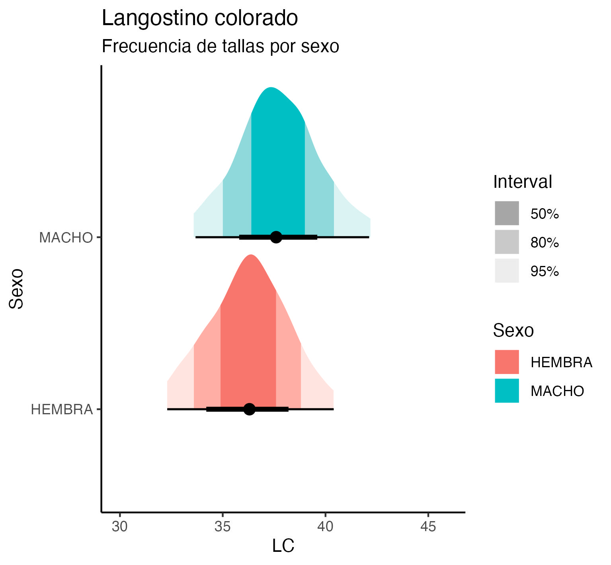
```


```{r echo=FALSE, fig.width=4,fig.height=5,out.width="70%",fig.cap=" Composición de tallas de langostino amarillo entre sexos, en abril de 2026",fig.align="center"}
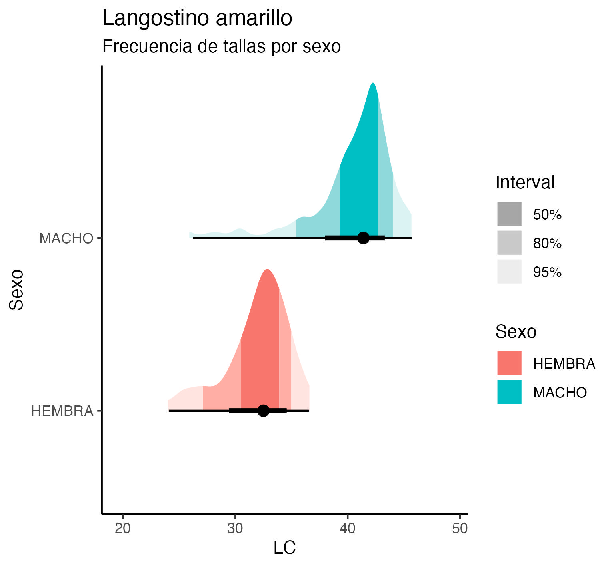
```


```{r echo=FALSE, fig.width=4,fig.height=5,out.width="70%",fig.cap=" Composición de tallas de camarón nailon entre sexos, en abril de 2026",fig.align="center"}
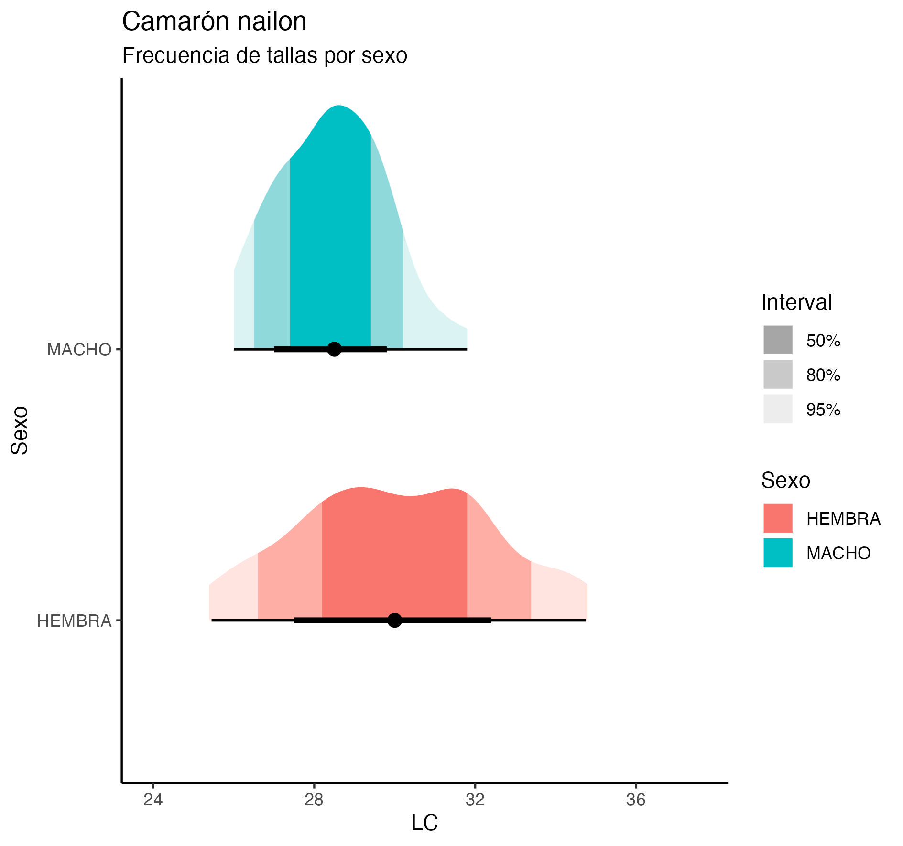
```


```{r echo=FALSE, fig.width=4,fig.height=5,out.width="80%",fig.cap="Composición de tallas de langostino colorado en la UPS por zonas de pesca en abril de 2026",fig.align="center"}
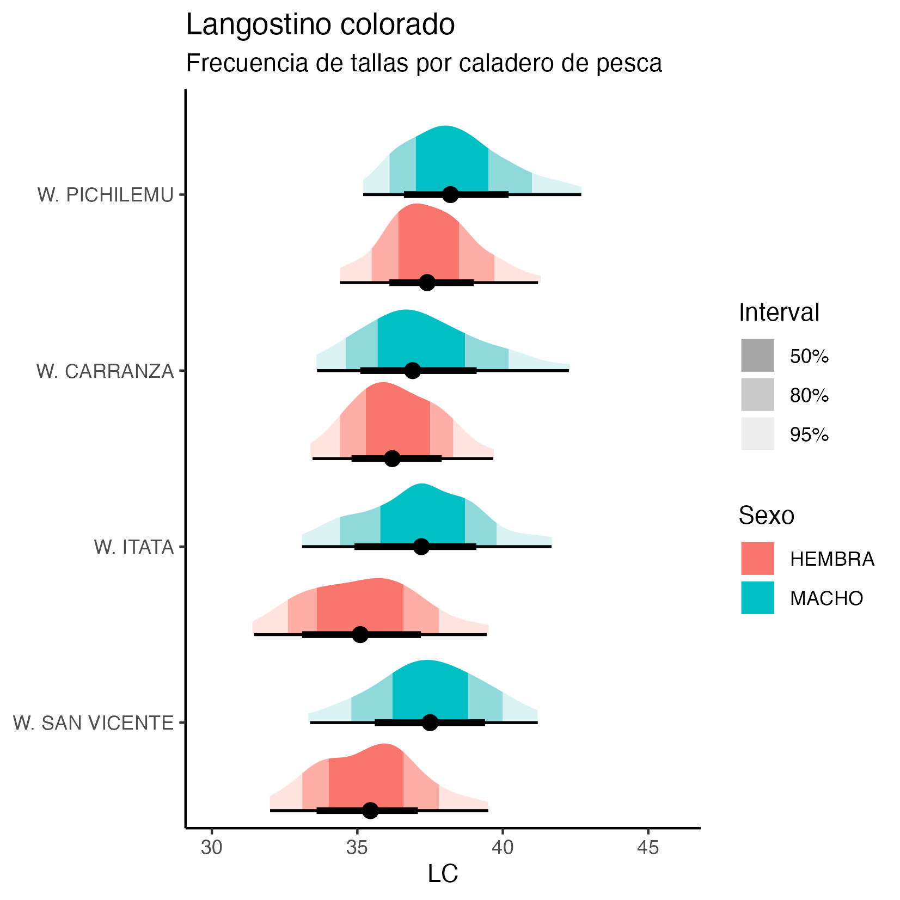
```


```{r echo=FALSE, fig.width=4,fig.height=5,out.width="80%",fig.cap="Composición de tallas de langostino amarillo en la UPS por zonas de pesca en abril de 2026",fig.align="center"}
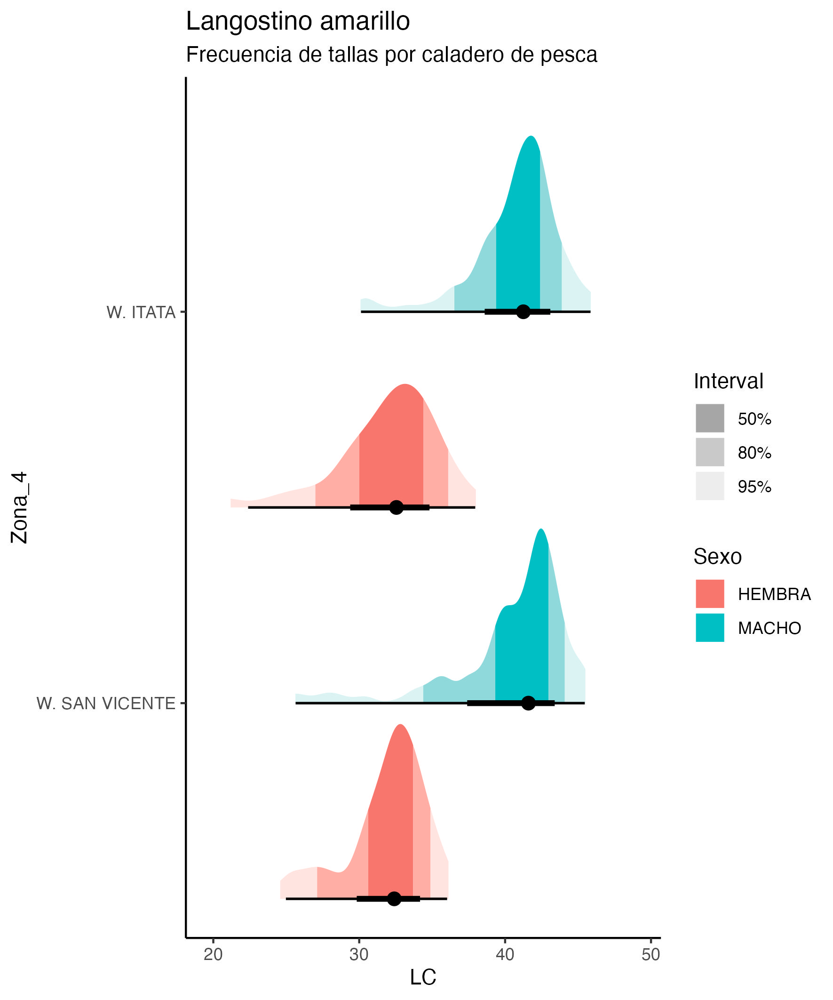
```

```{r echo=FALSE, fig.width=4,fig.height=5,out.width="80%",fig.cap="Composición de tallas de camarón nailon en la UPS por zonas de pesca en abril de 2026",fig.align="center"}
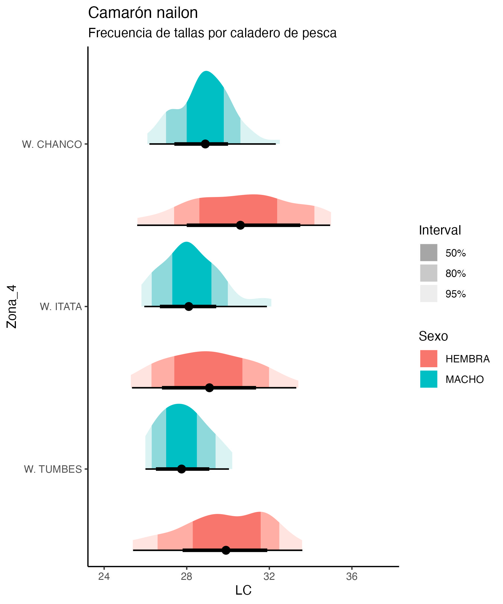
```

\newpage
## 3.4 Fauna acompañante

Durante abril de 2026, las operaciones de pesca de la flota de CrustaSur registraron presencia de pejerrata como fauna acompañante en los caladeros de Carranza, Chanco e Itata (Fig. 15). Esta especie representó el 1,9 % del total capturado, con un volumen aproximado de 9 toneladas. Entre los otros recursos registrados como fauna acompañante destacaron merluza y lenguado, presentes en varios de los caladeros visitados, con rendimientos entre 15 y 100 kg/ha. También se registró presencia de jaiba paco y jaiba limón, aunque en menor magnitud, expresada en unidades por hora de arrastre (Fig. 16).

```{r echo=FALSE, fig.width=4,fig.height=5,out.width="80%",fig.cap=" Distribución de los lances de pesca con captura de pejerrata y proporción relativa de pejerrata en las capturas totales durante abril del año 2026.",fig.align="center"}
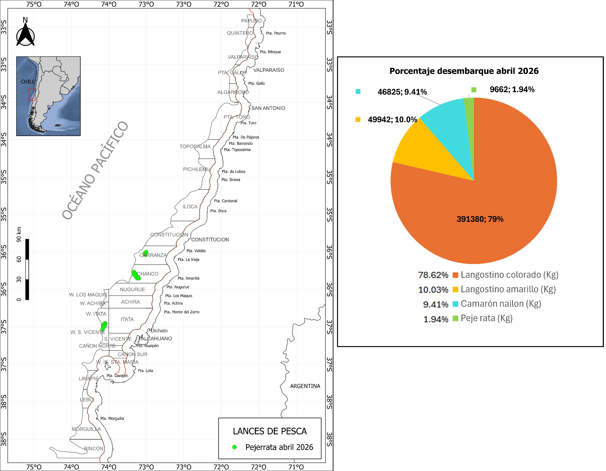
```


```{r echo=FALSE, fig.width=4,fig.height=5,out.width="110%",fig.cap=" Distribución espacial y abundancia de la fauna acompañante en los lances de pesca orientados a langostinos colorado y langostino amarillo por la flota arrastrera de CrustaSur, abril de 2026",fig.align="center"}
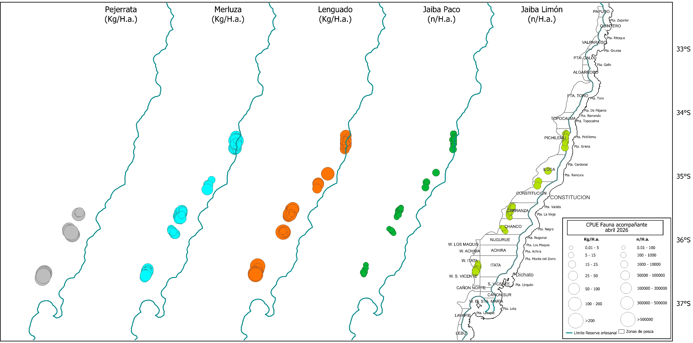
```


