\newpage

## 1 Resumen

La actividad pesquera de la flota de CrustaSur se desarrolló entre las regiones del Biobío y del Libertador General Bernardo O’Higgins, abarcando principalmente los caladeros de Itata, Achira, Los Maquis, Nogurne, Carranza, Constitución, Pichilemu y Topocalma. La operación estuvo dominada por lances con captura de langostino colorado y por lances mixtos de langostino colorado y langostino amarillo.

En términos operacionales, el langostino colorado registró la mayor captura mensual, alcanzando 552 toneladas, con un rendimiento promedio de 1666 kg/ha. Por su parte, el langostino amarillo registró 41 toneladas de captura y un rendimiento promedio de 238 kg/ha. El camarón nailon presentó una menor representación relativa dentro de la operación mensual, por lo que no se reportan indicadores operacionales específicos para este recurso en mayo.

Desde el punto de vista biológico, el langostino colorado presentó una proporción sexual favorable a las hembras, mientras que en langostino amarillo predominaron ampliamente los machos. Las tallas medias de langostino colorado se mantuvieron en torno a 35–36 mm LC, con valores levemente superiores en machos. En langostino amarillo, los machos alcanzaron una talla media de 37,3 mm LC, superior a la registrada en hembras, que fue de 32,7 mm LC.

En relación con los aspectos reproductivos, el 65 % de las hembras de langostino colorado se encontró en condición ovígera, proporción superior a la registrada en abril. En langostino amarillo no se observó presencia de hembras ovígeras, manteniéndose la tendencia descrita desde 2017.

La composición de tallas mostró diferencias entre recursos y zonas de pesca. En langostino colorado, las mayores tallas se observaron principalmente en Pichilemu e Itata, mientras que en langostino amarillo las distribuciones de talla fueron relativamente similares entre los caladeros analizados. Finalmente, la fauna acompañante estuvo representada principalmente por pejerrata, merluza, lenguado, jaiba paco y jaiba limón, con baja participación relativa respecto de las capturas objetivo.


 
\newpage

# 2 Aspectos Pesqueros

## 2.1 Actividad pesquera

La distribución espacial de los lances muestra una operación concentrada en sectores costeros discretos, asociados a caladeros históricamente relevantes para la pesquería de crustáceos demersales. Durante mayo de 2026, la actividad se desarrolló desde la región del Biobío hasta la región del Libertador General Bernardo O’Higgins, destacando los caladeros de Pichilemu, Topocalma, Constitución, Carranza, Nogurne, Achira, Los Maquis e Itata (Fig. 1).

```{r echo=FALSE, fig.width=4,fig.height=5,out.width="65%", fig.cap="Distribución espacial del total de lances de pesca realizados durante mayo de 2026",fig.align="center" }
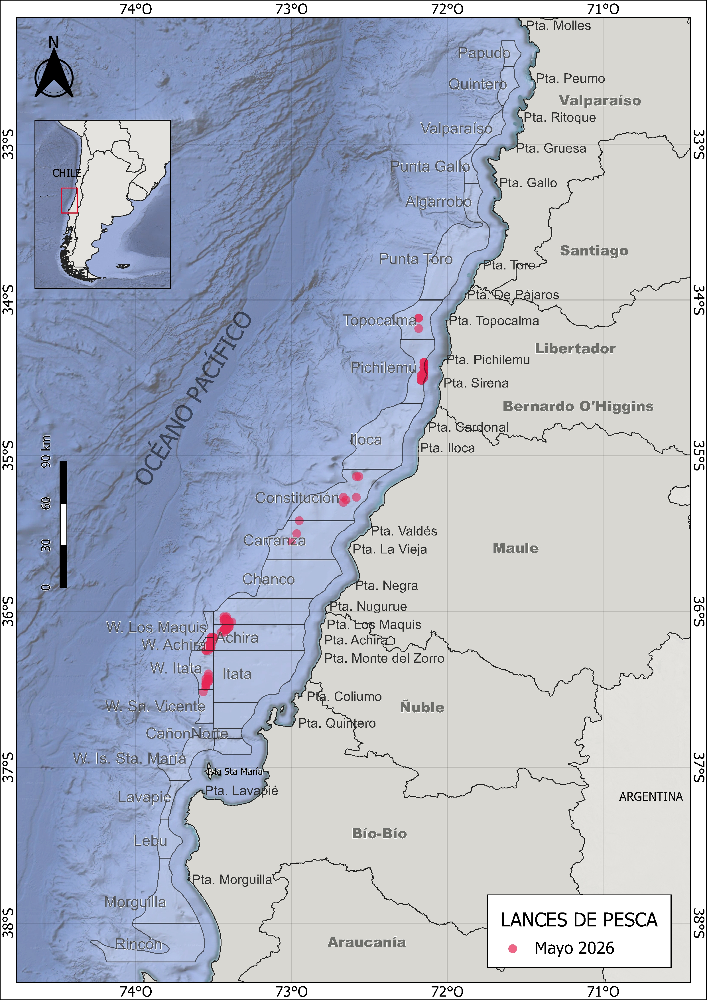
```

\newpage
## 2.2 Captura, esfuerzo y rendimientos de pesca

La actividad pesquera se concentró principalmente en lances con captura de langostino colorado y en lances mixtos de langostino colorado y langostino amarillo. En cuanto a la distribución espacial de las capturas por recurso, el langostino colorado presentó una amplia cobertura en los caladeros visitados, mientras que el langostino amarillo se registró principalmente en sectores asociados a Itata, Achira, Los Maquis, Nogurne y Constitución. El camarón nailon presentó menor representación relativa dentro de la operación mensual, concentrándose en sectores específicos de la zona centro-sur (Fig. 2).


```{r echo=FALSE, fig.width=3,fig.height=3,out.width="90%",fig.cap=" Distribución espacial de los lances de pesca orientados a langostino colorado, langostino amarillo y camarón nailon durante mayo de 2026",fig.align="center"}
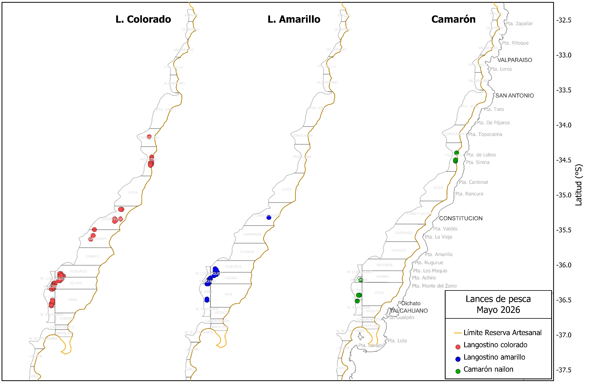
```


El langostino colorado registró la mayor captura mensual, alcanzando 552 toneladas, con un promedio de 2653 kg por lance, un esfuerzo total de 331 horas de arrastre y un rendimiento promedio de 1666 kg/ha (Tabla 1). Para langostino amarillo, se registraron 107 lances, una captura total de 41 toneladas, un promedio de 383 kg por lance, un esfuerzo total de 172 horas de arrastre y un rendimiento promedio de 238 kg/ha. 

\newpage

##### *Tabla 1. Indicadores operacionales de la pesquería de langostino colorado, langostino amarillo y camarón nailon, año 2026.*

|**Recurso**|**Mes**|**N° de lances(n)**|**Cap. (kg)**|**Cap.lances (kg/n)**|**h arrast.(ha)**|**Rend. (kg/ha)**|**Prof.de fondo(m)**| 
|--------|-------|--------|-------|---------|-------|------|-------|
|**L.colorado**|marzo|137|351754|2567|121|2907|249|
|              |abril|162|384280|2372|230|1281|224|
|               |mayo|208|552006|2653|331|1666|189|
|**L.amarillo**|marzo|83|42789|515|49|877|264|
|              |abril|86|48702|566|138|352|238|
|              |mayo|107|41075|383|172|238|186|
|**Camarón**|marzo|57|98820|1733|87|1138|324|
|           |abril|37|46825|1265|67|693|283|


El rendimiento promedio de pesca del langostino colorado fue de 1666 kg/ha, con un esfuerzo total de 331 horas de arrastre y un promedio de 2653 kg por lance. En langostino amarillo, el rendimiento promedio fue de 238 kg/ha, con un esfuerzo total de 172 horas de arrastre y un promedio de 383 kg por lance (Tabla 1; Fig. 3). Estos resultados muestran que, durante mayo, el langostino colorado concentró la mayor captura y los mayores rendimientos promedio dentro de los recursos analizados.


```{r echo=FALSE,fig.width=4,fig.height=5,out.width="80%",fig.cap="Distribución de frecuencia del esfuerzo de pesca (en horas de arrastre, A) y del rendimiento (en kg/ha, B), para langostino colorado, langostino amarillo y camarón nailon durante mayo de 2026",fig.align="center"}
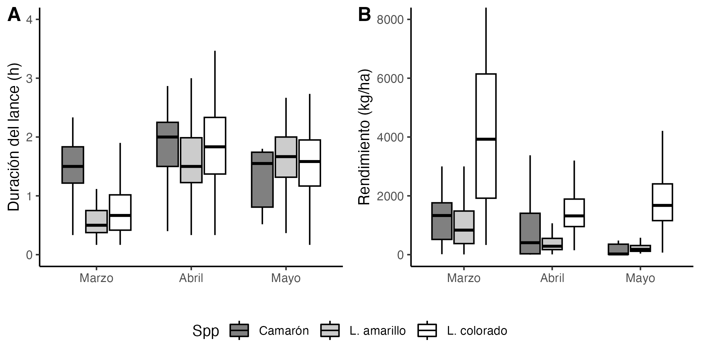
```


Los mayores rendimientos de langostino colorado se observaron principalmente en los caladeros de Itata, Achira, Los Maquis y Pichilemu, con una alta variabilidad espacial entre lances (Fig. 4,5). En langostino amarillo, los mayores rendimientos se registraron principalmente en los caladeros de Nogurne y Los Maquis, mientras que en el resto de los sectores los valores fueron comparativamente menores (Fig. 4,5).

```{r echo=FALSE,fig.width=4,fig.height=5,out.width="80%",fig.cap="Rendimiento de pesca (captura por hora de arrastre) de langostino colorado (A), langostino amarillo (B) y camarón nailon (C), en mayo de 2026",fig.align="center"}
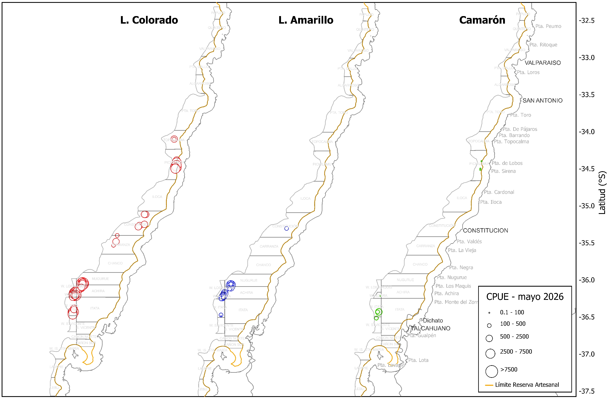
```


```{r echo=FALSE,fig.width=4,fig.height=5,out.width="110%",fig.cap="Distribución del rendimiento de pesca (kg/ha) de langostino colorado, langostino amarillo y camarón nailon en mayo de 2026",fig.align="center"}
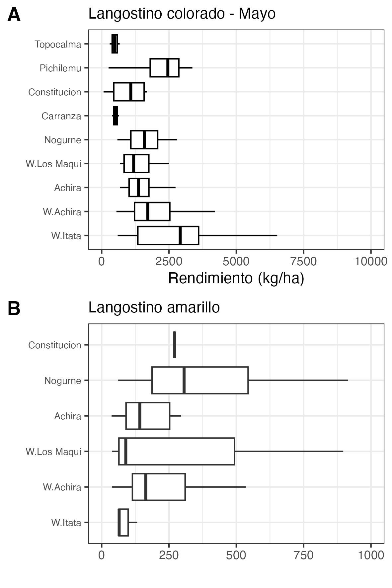
```


\newpage
# 3 Aspectos biológicos

Los indicadores biológicos considerados incluyeron la talla promedio por sexo, proporción sexual, estructura de tallas, condición reproductiva de las hembras y proporción de hembras ovígeras o maduras en las capturas. La información provino de muestreos diarios aleatorios realizados sobre ejemplares capturados en las zonas visitadas por la flota. Para cada recurso se estableció un tamaño mínimo de muestra de 300 ejemplares. La longitud cefalotorácica fue medida con pie de metro de precisión 0,01 mm, registrándose además el peso individual, la condición del ejemplar, el sexo y, en hembras, la presencia de huevos y su grado de madurez según la escala de Palma y Arana (1997).


## 3.1 Proporción sexual y talla promedio

En las capturas de mayo de 2026, el langostino colorado presentó una proporción sexual favorable a las hembras, mientras que en langostino amarillo predominaron ampliamente los machos (Fig. 6).

En términos de talla media, el langostino colorado presentó longitudes cefalotorácicas entre 27,0 y 47,4 mm, con valores promedio de 35,3 mm LC en hembras y 36,4 mm LC en machos. En perspectiva histórica, las tallas medias observadas durante 2026 se mantienen dentro del rango reciente de la serie, con promedios cercanos o superiores a 35 mm LC (Tabla 2; Fig. 7).

En langostino amarillo, los machos alcanzaron una talla media de 37,3 mm LC, superior a la registrada en hembras, que fue de 32,7 mm LC. Las tallas observadas durante mayo se mantuvieron dentro del rango registrado en la serie reciente, con una marcada diferencia entre sexos, asociada a la mayor talla promedio de los machos (Tabla 2; Fig. 7).
\newpage

##### *Tabla 2. Proporción sexual y talla promedio de langostino colorado, langostino amarillo y camarón nailon en las capturas de la UPS, 2026*

|   |Mes|Sexo|n|LC(mm)|DE(mm)|Min.(mm)|Max.(mm)|
|----|---|----|-|------|------|----------|----------|
|**L.colorado**|marzo|hembra|813|35,9|2,44|29,8|43,7|
|         |    |macho|1595|37,0|2,34|29,9|46,5|
|         |abril|hembra|1508|36,2|2,06|30,0|44,1|
|         |   |macho|1561|37,7|2,09|29,9|46,0|
|         |mayo|hembra|2374|35,3|2,26|27,0|43,4|
|         |   |macho|1219|36,4|2,53|28,9|47,4|
|**L.amarillo**|marzo|hembra|246|29,3|3,77|20,7|41,8|
|         |    |macho|732|36,1|6,45|20,2|51,6|
|         |abril|hembra|336|31,7|3,30|20,3|40,9|
|         |     |macho|729|40,0|4,71|19,6|49,2|
|         |mayo|hembra|164|32,7|2,65|26,9|41,0|
|         |     |macho|1363|37,3|4,43|25,2|48,3|
|**Camarón**|marzo|hembra|1163|29,9|2,31|24,3|36,9|
|      |     |macho|587|28,7|1,36|25,0|33,2|
|      |abril|hembra|700|30,0|2,48|23,9|37,6|
|      |      |macho|300|28,4|1,47|25,1|33,4|


```{r echo=FALSE,fig.width=4,fig.height=5,out.width="70%",fig.cap="Proporción sexual de langostino colorado (A) y langostino amarillo (B) durante mayo de 2026",fig.align="center"}
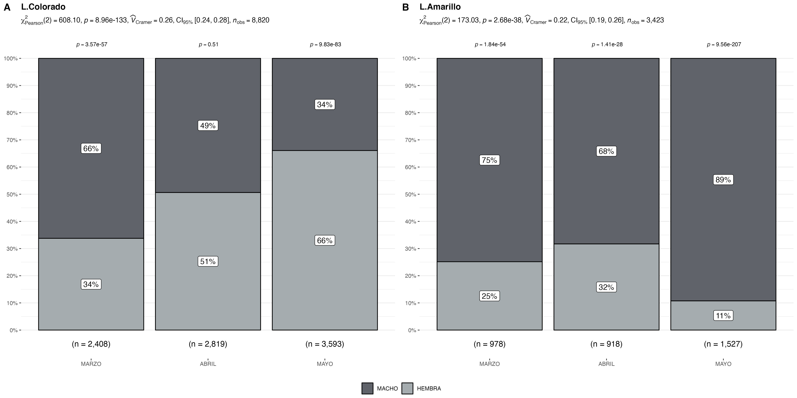
```

\newpage


```{r echo=FALSE,fig.width=4,fig.height=5,out.width="90%",fig.cap="Talla promedio (LC, mm) de langostino colorado y langostino amarillo por sexo, en el periodo enero 2016 a mayo de 2026",fig.align="center"}
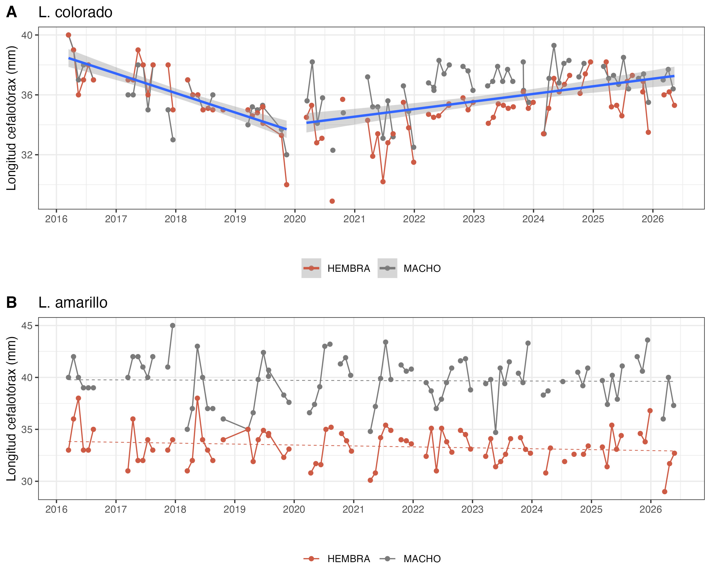
```

\newpage

## 3.2 Aspectos reproductivos

Durante mayo de 2026, el 65 % de las hembras de langostino colorado se encontró en condición ovígera, constituyendo la fracción predominante dentro de las hembras muestreadas. En langostino amarillo no se registraron hembras ovígeras ni maduras, manteniéndose el predominio de hembras en condición normal observado durante el periodo analizado (Tabla 3; Fig. 8).

Al analizar la distribución espacial de la condición ovígera en langostino colorado, se observaron diferencias entre caladeros. En mayo de 2026, los mayores porcentajes de hembras ovígeras se registraron en Pichilemu, Achira e Itata, con valores superiores al 90 %. Sin embargo, en algunos caladeros el porcentaje de hembras ovígeras fue menor respecto del histórico 2024–2025, destacando Los Maquis y Chanco, donde se registraron valores de 46,1 % y 56,7 %, respectivamente. Estos resultados sugieren una marcada variabilidad espacial en la condición reproductiva durante el periodo analizado (Fig. 9).


##### *Tabla 3. Porcentaje de hembras ovígeras y hembras maduras de langostino colorado y amarillo UPS 2026, y de hembras portadoras e inmaduras de camarón nailon*

| **Recurso**    | **Estado**   | **mar.** |**abr.** |**may.** |
|----------------|------------ |--------|--------|--------|
| **L.colorado** | Normal       | 95%   |79%|35%|
|                | Ovígeras     | 4%       |20%|65%|
|                | Madura       | 1%        |1%|0,1%
| Total n°       |              | 813       |1508|2374|
| **L.amarillo** | Normal       | 100%      | 100%|100%|
|                | Ovígeras     | 0%        | 0%|0%|
|                | Madura       | 0%        |0%|0%|
| Total n°       |              | 246       |336|164|
| **C.nailon** | Inmadura      | 96%      | 73%|-|
|                | Madura       | 4%        |27%|-|
| Total n°       |              | 1221       |700|-|
\newpage

```{r echo=FALSE, fig.width=4,fig.height=5,out.width="50%",fig.cap="Hembras ovígeras de langostino colorado y langostino amarillo durante mayo de 2026, en comparación con la media registrada entre los años 2017 a 2024 (línea verde).",fig.align="center"}
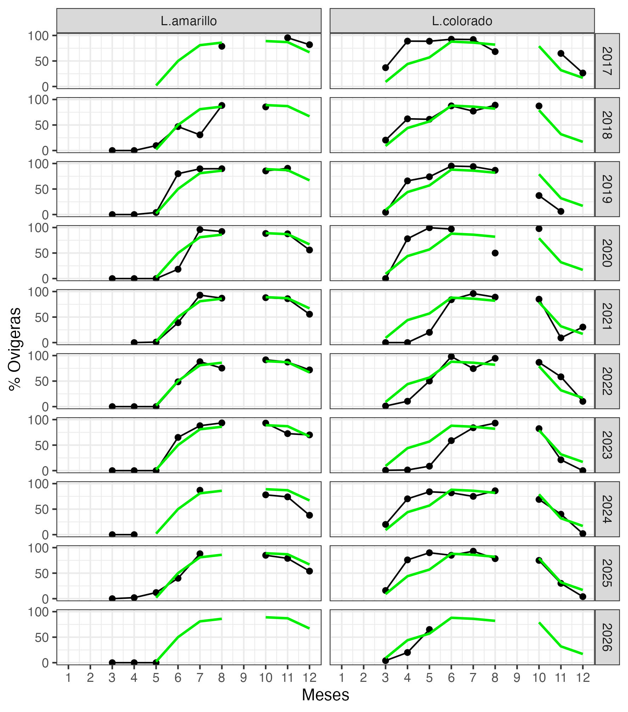
```


```{r echo=FALSE, fig.width=4,fig.height=5,out.width="50%",fig.cap="Porcentaje de hembras ovígeras de langostino colorado por caladero en mayo de 2026 y comparación con el histórico 2024–2025. El valor n corresponde al número de hembras analizadas por celda",fig.align="center"}
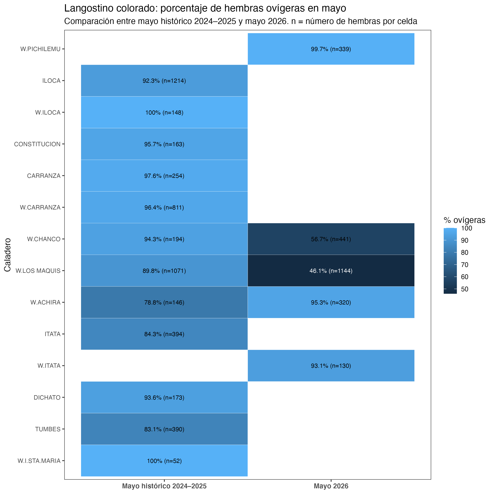
```


\newpage

## 3.3. Composición de tallas

En langostino colorado, las tallas medias fueron levemente superiores en machos respecto de hembras durante mayo de 2026. Los machos alcanzaron una talla media de 36,4 mm LC, mientras que las hembras registraron 35,3 mm LC. En langostino amarillo, se observó una diferencia más marcada entre sexos, con una talla media de 37,3 mm LC en machos y 32,7 mm LC en hembras (Tabla 2; Figs. 10–11).

En relación con la composición de tallas por zona de pesca, el langostino colorado mostró variabilidad espacial entre los caladeros analizados durante mayo, con distribuciones de talla que reflejan diferencias en la estructura de las capturas por zona (Fig. 12). En langostino amarillo, las distribuciones de talla también presentaron variación entre caladeros, aunque manteniendo el patrón general de mayores tallas en machos respecto de hembras (Fig. 13).

```{r echo=FALSE, fig.width=4,fig.height=5,out.width="70%",fig.cap=" Composición de tallas de langostino colorado entre sexos, en mayo de 2026",fig.align="center"}
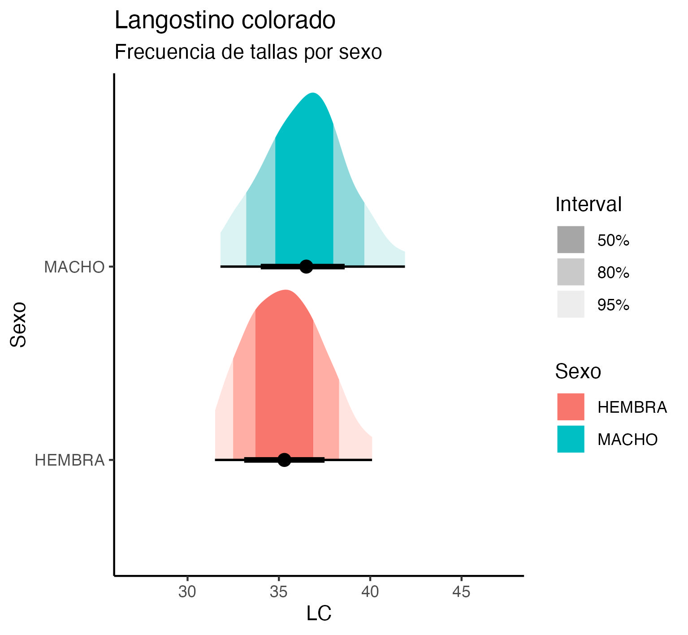
```


```{r echo=FALSE, fig.width=4,fig.height=5,out.width="70%",fig.cap=" Composición de tallas de langostino amarillo entre sexos, en mayo de 2026",fig.align="center"}
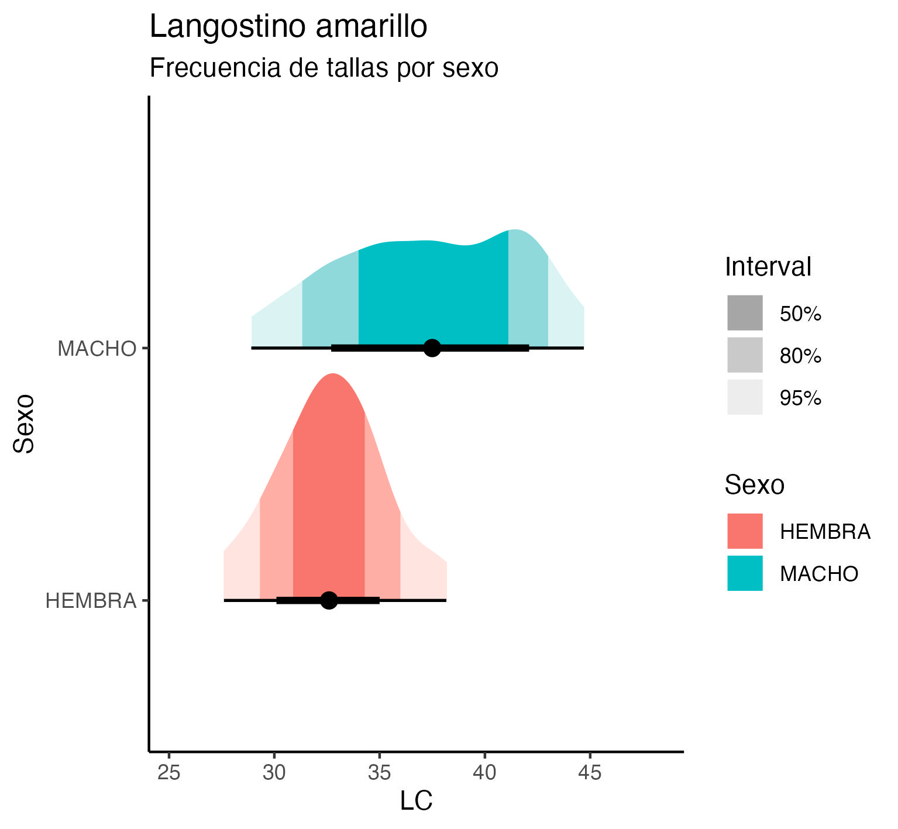
```


```{r echo=FALSE, fig.width=4,fig.height=5,out.width="80%",fig.cap="Composición de tallas de langostino colorado en la UPS por zonas de pesca en mayo de 2026",fig.align="center"}
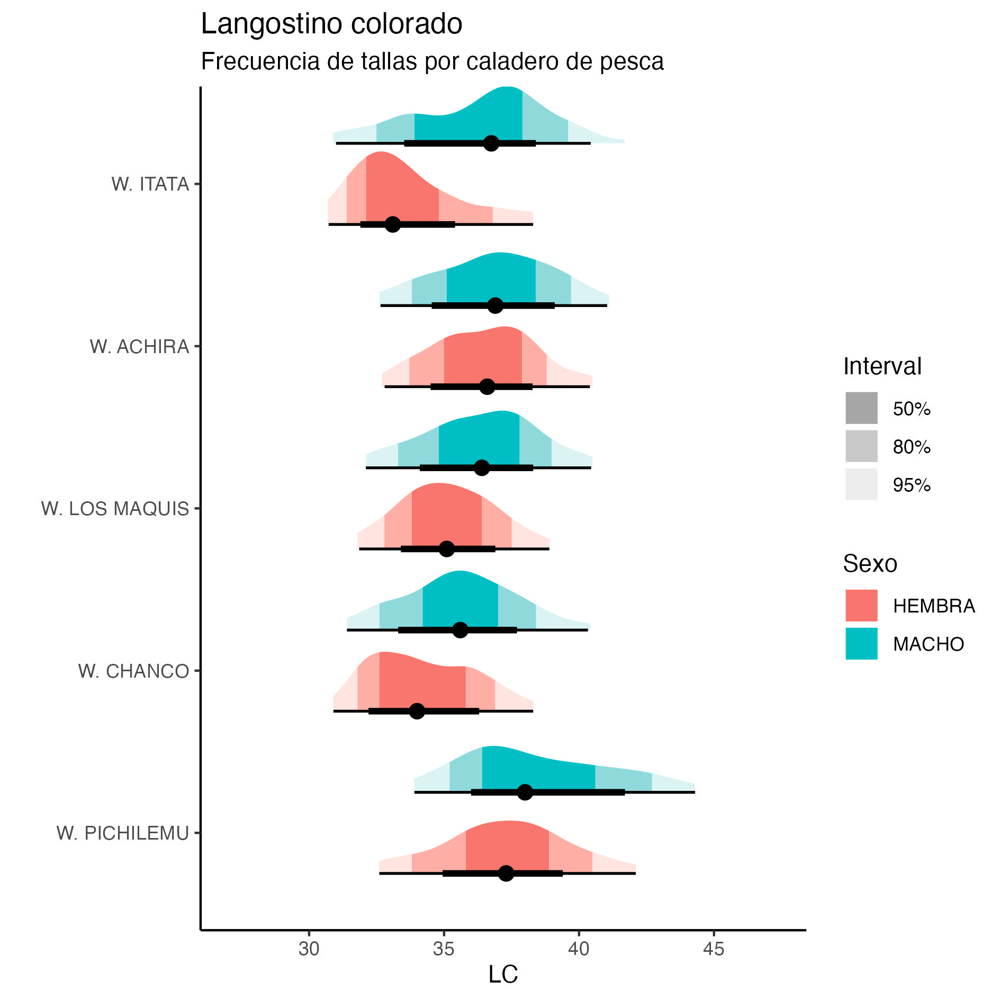
```


```{r echo=FALSE, fig.width=4,fig.height=5,out.width="80%",fig.cap="Composición de tallas de langostino amarillo en la UPS por zonas de pesca en mayo de 2026",fig.align="center"}
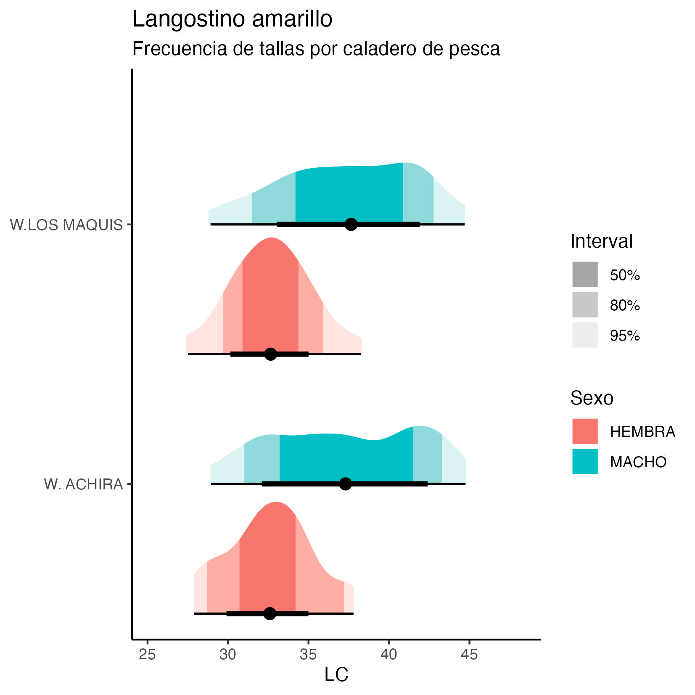
```


\newpage
## 3.4 Fauna acompañante

Durante mayo de 2026, las operaciones de pesca de la flota de CrustaSur registraron presencia de pejerrata como fauna acompañante en distintos caladeros visitados durante la operación mensual (Fig. 14). Entre los otros recursos registrados como fauna acompañante destacaron merluza, lenguado, jaiba paco y jaiba limón, aunque con baja participación relativa respecto de las capturas objetivo. La distribución espacial y abundancia de estas especies mostró variabilidad entre caladeros, asociada a la operación de la flota sobre langostino colorado y langostino amarillo durante mayo (Fig. 15).

```{r echo=FALSE, fig.width=4,fig.height=5,out.width="80%",fig.cap=" Distribución de los lances de pesca con captura de pejerrata y proporción relativa de pejerrata en las capturas totales durante mayo del año 2026.",fig.align="center"}
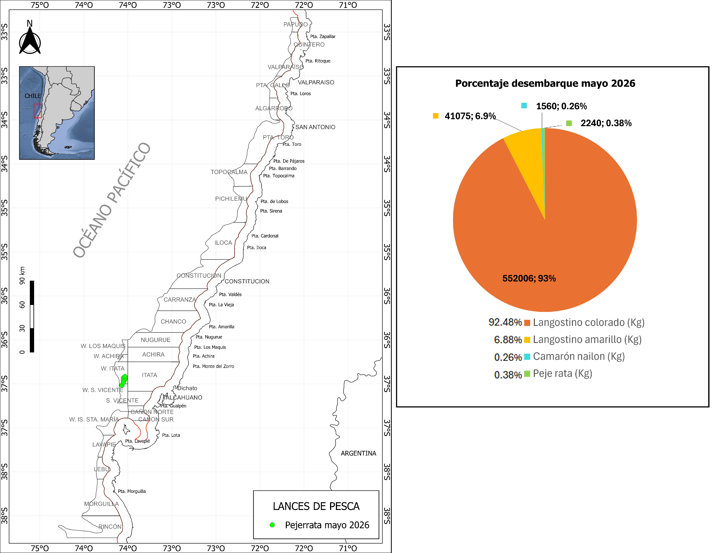
```


```{r echo=FALSE, fig.width=4,fig.height=5,out.width="110%",fig.cap=" Distribución espacial y abundancia de la fauna acompañante en los lances de pesca orientados a langostinos colorado y langostino amarillo por la flota arrastrera de CrustaSur, mayo de 2026",fig.align="center"}
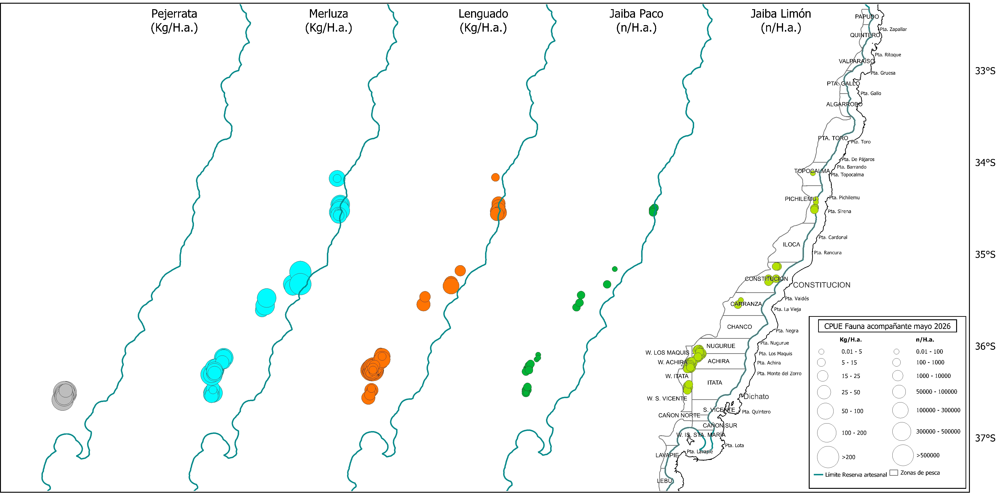
```


