\newpage

## 1 Resumen

Durante junio de 2026, la actividad pesquera de la flota de CrustaSur se desarrolló entre las regiones del Biobío y del Libertador General Bernardo O’Higgins, con lances distribuidos en distintos sectores de la unidad de pesquería. La operación presentó una organización espacial en núcleos diferenciados, con actividad en los caladeros de Punta Toro, Topocalma, Pichilemu, Iloca y Constitución, además de un núcleo sur asociado a W. Los Maquis, Achira, W. Achira e Itata/W. Itata. De manera más puntual, también se observó actividad hacia el sector de W. Sta. María/San Vicente. La cobertura espacial varió entre recursos: el langostino colorado presentó la distribución más amplia, mientras que el langostino amarillo y el camarón nailon mostraron una operación más localizada.

En términos operacionales, el langostino colorado registró la mayor captura mensual, con 420 toneladas en un total de 202 lances y con un rendimiento promedio de 997 kg/ha. El langostino amarillo alcanzó 86 toneladas, distribuidas en 160 lances, con un rendimiento promedio de 255 kg/ha. El camarón nailon tuvo una menor participación relativa dentro de la operación mensual, con 5,6 toneladas registradas en 49 lances y un rendimiento promedio de 60 kg/ha. Estos resultados indican que, durante junio, el langostino colorado mantuvo la mayor importancia en términos de captura, aunque con un rendimiento menor al observado en los meses previos de este año. 

Desde el punto de vista biológico, el langostino colorado presentó una proporción sexual favorable a las hembras, mientras que en langostino amarillo predominó ampliamente la fracción de machos. En camarón nailon también se observó una mayor proporción de hembras, aunque con un tamaño muestral menor respecto de los langostinos. Las tallas medias de langostino colorado se mantuvieron cercanas a 36 mm de longitud cefalotorácica, con valores levemente superiores en machos. En langostino amarillo, la diferencia entre sexos fue más marcada, con machos de mayor talla media que las hembras. En camarón nailon, las tallas medias fueron similares entre sexos, aunque levemente superiores en hembras. 

En relación con los aspectos reproductivos, junio evidenció una alta proporción de hembras ovígeras en langostino colorado, alcanzando el 95 % de las hembras muestreadas. En langostino amarillo, el 60 % de las hembras se registró en condición ovígera, en contraste con los meses previos de 2026, lo que indica el inicio de su actividad reproductiva. En camarón nailon, la mayoría de las hembras analizadas se encontró en condición madura, con una proporción cercana al 89 %. 

La composición de tallas mostró diferencias entre recursos, sexos y zonas de pesca. En langostino colorado y langostino amarillo se mantuvo el patrón de mayores tallas en machos, aunque con variabilidad espacial en la forma y amplitud de las distribuciones por caladero. En langostino colorado, las mayores tallas se observaron principalmente en W. Punta Toro, donde ambos sexos presentaron distribuciones desplazadas hacia longitudes mayores; de manera secundaria, también destacaron W. Bucalemu y W. Achira, especialmente en machos. En langostino amarillo, las mayores tallas se concentraron en los caladeros W. Punta Gallo y W. Punta Toro, asociadas principalmente a la fracción de machos, mientras que las hembras presentaron distribuciones más acotadas y centradas en tallas menores. En camarón nailon, la información de tallas correspondió al caladero de Pichilemu, donde las hembras mostraron una distribución más amplia que los machos. Finalmente, la fauna acompañante estuvo representada principalmente por pejerrata, merluza, lenguado, jaiba paco y jaiba limón, con baja participación relativa respecto de las capturas objetivo. 

\newpage

# 2 Aspectos Pesqueros

## 2.1 Actividad pesquera

La distribución espacial de los lances realizados durante junio de 2026 mostró una operación concentrada entre las regiones del Biobío y del Libertador General Bernardo O’Higgins. La actividad se organizó principalmente en dos núcleos operacionales: un núcleo centro-norte, asociado a los sectores de Punta Toro, Topocalma y Pichilemu, y un núcleo sur, vinculado a W. Los Maquis, Achira, W. Achira e Itata/W. Itata. De manera más puntual, también se registraron lances en sectores próximos a Iloca/Constitución y hacia W. Sta. María/San Vicente. Esta distribución confirma una operación espacialmente agregada, asociada a caladeros históricamente utilizados por la flota, pero con diferencias en la cobertura e intensidad de pesca entre caladeros (Fig. 1).

```{r echo=FALSE, fig.width=4,fig.height=5,out.width="55%", fig.cap="Distribución espacial del total de lances de pesca realizados durante junio de 2026",fig.align="center" }
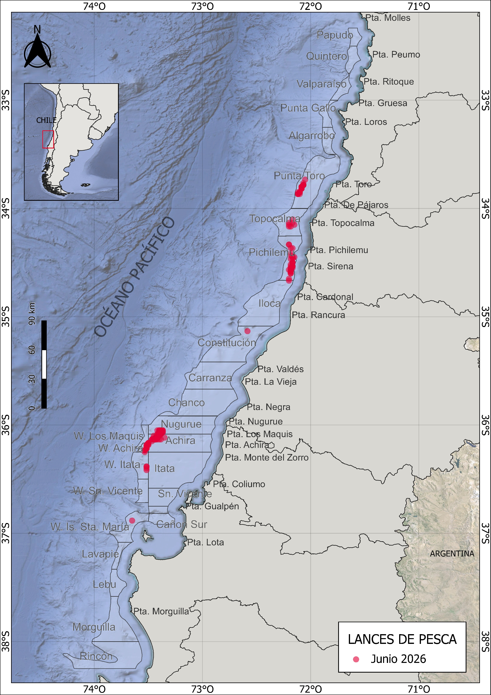
```


## 2.2 Captura, esfuerzo y rendimientos de pesca

La actividad pesquera estuvo dominada por lances con captura de langostino colorado, recurso que presentó la mayor cobertura espacial dentro del área de operación. Su distribución incluyó sectores del núcleo centro-norte, principalmente Punta Toro, Topocalma y Pichilemu, además de registros hacia Iloca/Constitución y un núcleo sur asociado a W. Los Maquis, Achira, W. Achira e Itata/W. Itata. El langostino amarillo presentó una distribución más acotada, mientras que el camarón nailon tuvo una participación menor y más localizada, principalmente en sectores asociados a Punta Toro, Pichilemu, Iloca, W. Los Maquis, W. Achira y W. Itata (Fig. 2).


```{r echo=FALSE, fig.width=3,fig.height=3,out.width="90%",fig.cap=" Distribución espacial de los lances de pesca orientados a langostino colorado, langostino amarillo y camarón nailon durante junio de 2026",fig.align="center"}
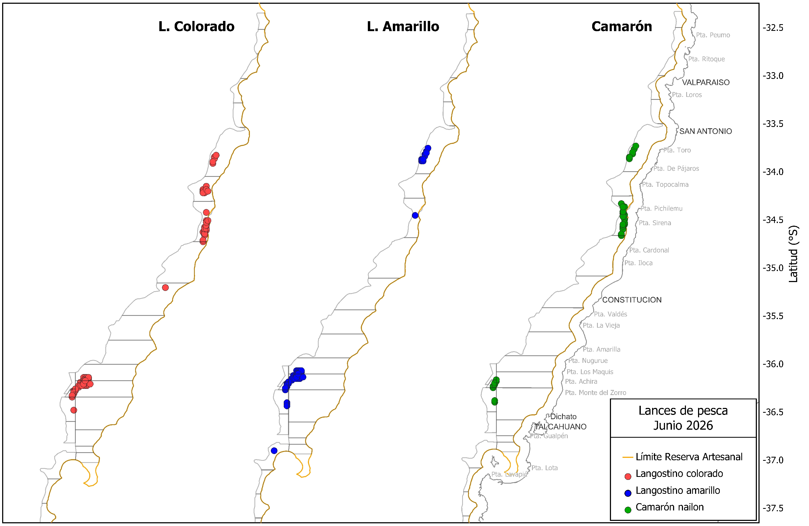
```


El langostino colorado registró la mayor captura mensual, con 419 toneladas en 202 lances, un promedio de 2078 kg por lance, 420 horas de arrastre y un rendimiento promedio de 997 kg/ha. En comparación con los meses previos de 2026, este recurso mantuvo la mayor importancia en términos de captura total, aunque mostró una disminución del rendimiento promedio respecto de marzo, abril y mayo. El langostino amarillo alcanzó 86 toneladas, con 160 lances, 538 kg por lance, 338 horas de arrastre y un rendimiento promedio de 255 kg/ha. En tanto, el camarón nailon registró una captura de 5640 kg, con 49 lances, 115 kg por lance, 94 horas de arrastre y un rendimiento promedio de 60 kg/ha (Tabla 1).

\newpage

##### *Tabla 1. Indicadores operacionales de la pesquería de langostino colorado, langostino amarillo y camarón nailon, año 2026.*

|**Recurso**|**Mes**|**N° de lances(n)**|**Cap. (kg)**|**Cap.lances (kg/n)**|**h arrast.(ha)**|**Rend. (kg/ha)**|**Prof.de fondo(m)**| 
|--------|-------|--------|-------|---------|-------|------|-------|
|**L.colorado**|marzo|137|351754|2567|121|2907|249|
|              |abril|162|384280|2372|230|1281|224|
|               |mayo|208|552006|2653|331|1666|189|
|               |junio|202|419871|2078|420|997|173|
|**L.amarillo**|marzo|83|42789|515|49|877|264|
|              |abril|86|48702|566|138|352|238|
|              |mayo|107|41075|383|172|238|186|
|              |junio|160|86177|538|338|255|170|
|**Camarón**|marzo|57|98820|1733|87|1138|324|
|           |abril|37|46825|1265|67|693|283|
|           |junio|49|5640|115|94|60|210|


La distribución mensual del esfuerzo mostró un aumento de las horas de arrastre hacia junio, particularmente en langostino colorado y langostino amarillo. Sin embargo, este mayor esfuerzo no se tradujo necesariamente en mayores rendimientos, especialmente en langostino colorado, cuyo rendimiento promedio descendió a 997 kg/ha. En langostino amarillo, el rendimiento se mantuvo bajo en comparación con marzo y abril, aunque con una captura mensual superior a la registrada en los meses previos. En camarón nailon, tanto la captura como el rendimiento fueron considerablemente menores respecto de marzo y abril, lo que evidencia una baja participación relativa de este recurso en la operación de junio (Tabla 1; Fig. 3).

```{r echo=FALSE,fig.width=4,fig.height=5,out.width="80%",fig.cap="Distribución de frecuencia del esfuerzo de pesca (en horas de arrastre, A) y del rendimiento (en kg/ha, B), para langostino colorado, langostino amarillo y camarón nailon durante junio de 2026",fig.align="center"}
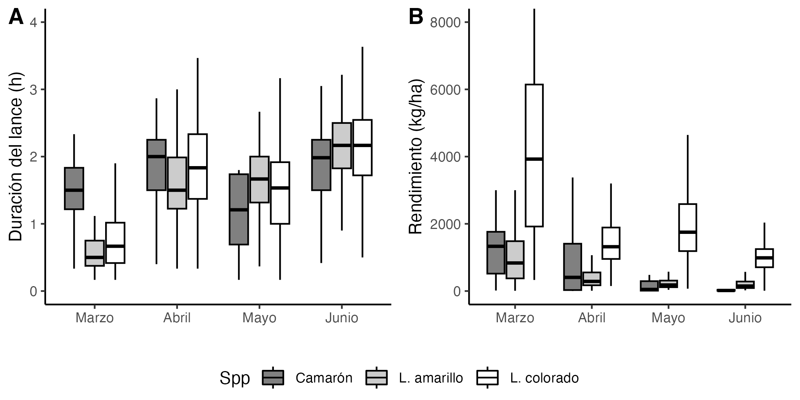
```


A escala espacial, los rendimientos presentaron una marcada variabilidad entre caladeros y recursos. En langostino colorado, los mayores valores y la mayor dispersión se observaron principalmente en Pichilemu, con rendimientos también relevantes en Constitución, W. Achira, Achira, W. Los Maquis y Punta Toro. En langostino amarillo, los valores más altos se asociaron a un registro puntual en W. Sta. María y a rendimientos relativamente mayores en Punta Toro, junto con sectores del núcleo sur como W. Itata, W. Achira y W. Los Maquis. Para camarón nailon, los rendimientos fueron bajos en general, aunque se observó una mayor concentración de valores en W. Itata, seguido por registros menores en Pichilemu, Punta Toro y W. Achira (Figs. 4–5).

```{r echo=FALSE,fig.width=4,fig.height=5,out.width="80%",fig.cap="Rendimiento de pesca (captura por hora de arrastre) de langostino colorado (A), langostino amarillo (B) y camarón nailon (C), en junio de 2026",fig.align="center"}
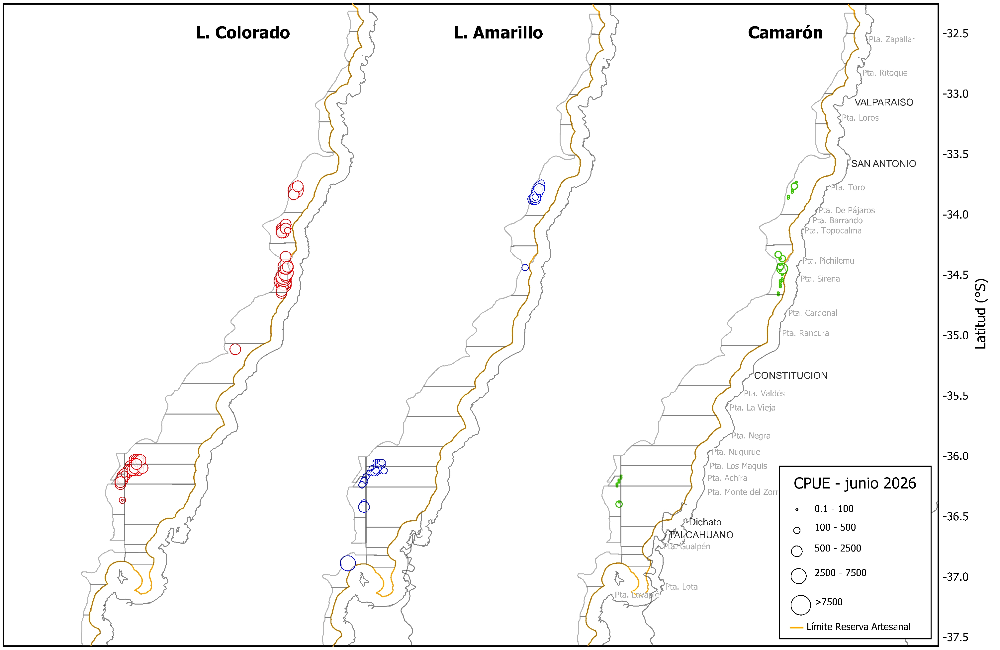
```


```{r echo=FALSE,fig.width=4,fig.height=5,out.width="110%",fig.cap="Distribución del rendimiento de pesca (kg/ha) de langostino colorado, langostino amarillo y camarón nailon en junio de 2026",fig.align="center"}
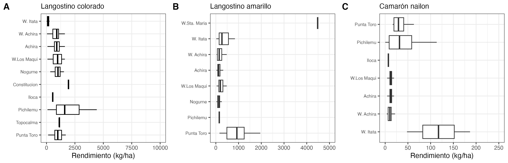
```


\newpage
# 3 Aspectos biológicos

Los indicadores biológicos considerados incluyeron la proporción sexual, la talla promedio por sexo, la estructura de tallas, la condición reproductiva de las hembras y la proporción de hembras ovígeras, maduras o inmaduras, según el recurso analizado. La información provino de muestreos biológicos realizados sobre ejemplares capturados en las zonas visitadas por la flota durante junio de 2026. Para cada recurso se procuró mantener una cobertura muestral suficiente para caracterizar la composición biológica mensual, aunque el tamaño efectivo de muestra varió según la disponibilidad de ejemplares en las capturas. La longitud cefalotorácica fue medida con pie de metro de precisión 0,01 mm, registrándose además el peso individual, la condición del ejemplar, el sexo y, en hembras, la presencia de huevos o el estado de madurez, según correspondiera.

## 3.1 Proporción sexual y talla promedio

La proporción sexual mostró diferencias claras entre recursos. En langostino colorado, las hembras representaron la fracción predominante de la muestra, con 2131 hembras y 1230 machos, equivalentes aproximadamente al 63 % y 37 % del total, respectivamente. En langostino amarillo se observó el patrón opuesto, con una marcada predominancia de machos, los que alcanzaron 1127 ejemplares, frente a 399 hembras, equivalentes aproximadamente al 74 % y 26 % del total. En camarón nailon, aunque el tamaño muestral fue menor, también predominó la fracción de hembras, con 166 hembras y 84 machos, correspondientes aproximadamente al 66 % y 34 % del total muestreado (Tabla 2; Fig. 6).

En términos de talla media, el langostino colorado presentó valores similares entre sexos, aunque levemente superiores en machos. Las hembras alcanzaron una longitud cefalotorácica media de 35,9 mm LC, mientras que los machos registraron 36,6 mm LC. Estos valores se mantuvieron dentro del rango observado durante 2026 y son coherentes con la tendencia reciente de la serie, caracterizada por tallas medias cercanas o superiores a 35 mm LC en ambos sexos (Tabla 2; Fig. 7).
En langostino amarillo, la diferencia entre sexos fue más marcada. Los machos presentaron una talla media de 38,4 mm LC, superior a la registrada en hembras, que alcanzaron 33,3 mm LC. Este patrón confirma la persistencia de una estructura de tallas diferenciada por sexo, con machos de mayor tamaño promedio, tal como se observa en la serie histórica reciente (Tabla 2; Fig. 7).

En camarón nailon, las tallas medias fueron más próximas entre sexos, aunque levemente superiores en hembras. Las hembras registraron una talla media de 29,9 mm LC, mientras que los machos alcanzaron 29,0 mm LC. La amplitud de tallas fue mayor en hembras, con registros entre 23,6 y 36,3 mm LC, mientras que en machos el rango varió entre 25,0 y 33,7 mm LC. Estos resultados deben interpretarse considerando el menor tamaño muestral disponible para este recurso durante junio (Tabla 2; Fig. 6).

\newpage

##### *Tabla 2. Proporción sexual y talla promedio de langostino colorado, langostino amarillo y camarón nailon en las capturas de la UPS, 2026*

|   |Mes|Sexo|n|LC(mm)|DE(mm)|Min.(mm)|Max.(mm)|
|----|---|----|-|------|------|----------|----------|
|**L.colorado**|marzo|hembra|813|35,9|2,44|29,8|43,7|
|         |    |macho|1595|37,0|2,34|29,9|46,5|
|         |abril|hembra|1508|36,2|2,06|30,0|44,1|
|         |   |macho|1561|37,7|2,09|29,9|46,0|
|         |mayo|hembra|2374|35,3|2,26|27,0|43,4|
|         |   |macho|1219|36,4|2,53|28,9|47,4|
|         |junio|hembra|2131|35,9|2,89|28,7|47,1|
|         |   |macho|1230|36,6|2,40|28,9|45,6|
|**L.amarillo**|marzo|hembra|246|29,3|3,77|20,7|41,8|
|         |    |macho|732|36,1|6,45|20,2|51,6|
|         |abril|hembra|336|31,7|3,30|20,3|40,9|
|         |     |macho|729|40,0|4,71|19,6|49,2|
|         |mayo|hembra|164|32,7|2,65|26,9|41,0|
|         |     |macho|1363|37,3|4,43|25,2|48,3|
|         |junio|hembra|399|33,3|2,23|25,5|40,2|
|         |     |macho|1127|38,4|4,54|26,0|51,5|
|**Camarón**|marzo|hembra|1163|29,9|2,31|24,3|36,9|
|      |     |macho|587|28,7|1,36|25,0|33,2|
|      |abril|hembra|700|30,0|2,48|23,9|37,6|
|      |      |macho|300|28,4|1,47|25,1|33,4|
|      |junio|hembra|166|29,9|2,91|23,6|36,3|
|      |      |macho|84|29,0|1,50|25,0|33,7|


\newpage
```{r echo=FALSE,fig.width=4,fig.height=5,out.width="90%",fig.cap="Proporción sexual de langostino colorado (A), langostino amarillo (B) y camarón nailon (C), durante marzo, abril, mayo y junio de 2026",fig.align="center"}
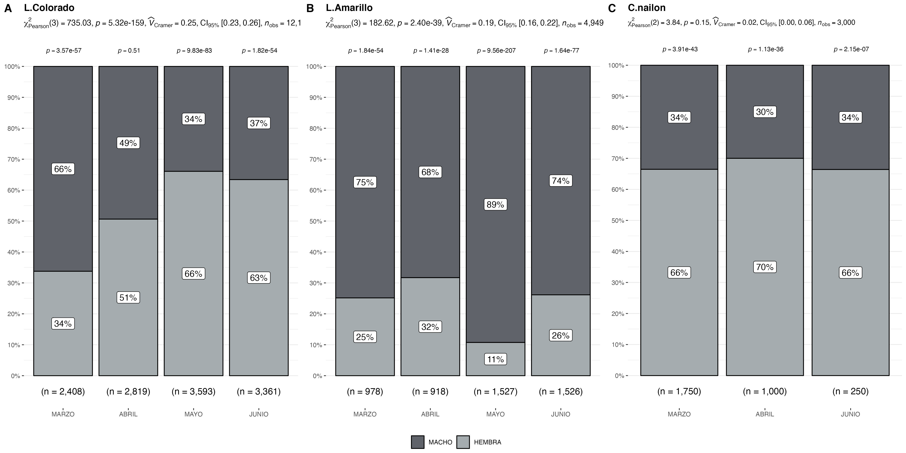
```

```{r echo=FALSE,fig.width=4,fig.height=5,out.width="90%",fig.cap="Talla promedio (LC, mm) de langostino colorado y langostino amarillo por sexo, en el periodo enero 2016 a junio de 2026",fig.align="center"}
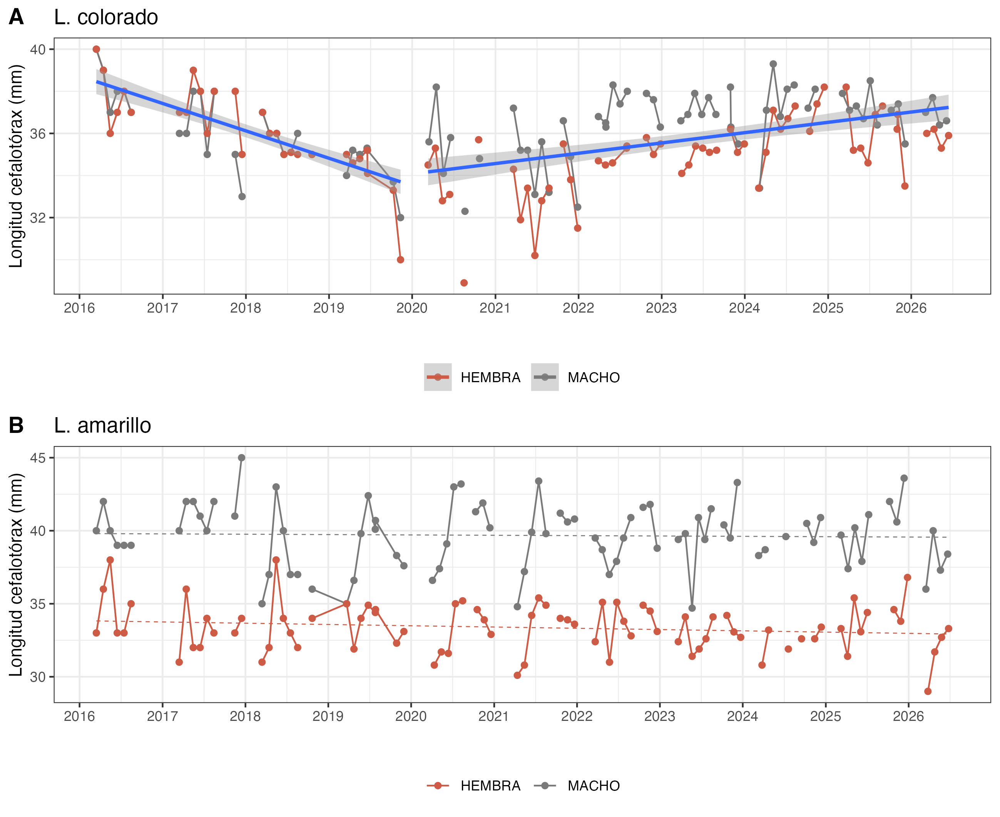
```
\newpage

## 3.2 Aspectos reproductivos

Durante junio de 2026, el langostino colorado presentó una alta proporción de hembras ovígeras, alcanzando el 95 % de las hembras muestreadas. Este valor representa el máximo registrado para el recurso durante 2026 y da cuenta de una marcada predominancia de la condición ovígera en el periodo analizado. La fracción restante correspondió principalmente a hembras maduras (4 %) y, en menor proporción, a hembras normales (1 %) (Tabla 3; Fig. 8).

El langostino amarillo mostró un cambio relevante respecto de los meses previos del año. Mientras que entre marzo y mayo no se registraron hembras ovígeras, durante junio el 60 % de las hembras muestreadas se encontró en condición ovígera, y el 40 % restante en condición normal. Este resultado indica el inicio  de la actividad reproductiva observable en las capturas de este recurso durante junio, en concordancia con el patrón estacional mostrado en la serie histórica de hembras ovígeras (Tabla 3; Fig. 8).

En camarón nailon, la condición reproductiva se evaluó a partir de la proporción de hembras inmaduras y maduras. Durante junio, el 89 % de las hembras analizadas se encontró en condición madura, mientras que el 11 % correspondió a hembras inmaduras. Este patrón contrasta con marzo, cuando predominó ampliamente la condición inmadura, y con abril, donde se observó una mayor proporción de hembras maduras, aunque todavía inferior a la registrada en junio (Tabla 3).

Al analizar la distribución espacial de hembras ovígeras de langostino colorado, se observaron porcentajes elevados en todos los caladeros con información disponible para junio de 2026. Los valores más altos se registraron en Punta Toro y Pichilemu, ambos con 100 % de hembras ovígeras. También se observaron porcentajes muy altos en W. Los Maquis (99,8 %), Achira (99,3 %) y W. Achira (97,5 %). En comparación con el histórico de junio 2024–2025, los valores registrados en junio de 2026 se mantuvieron en niveles similares o superiores en los caladeros comparables, reforzando la alta intensidad reproductiva observada para este recurso durante el mes (Fig. 9).

\newpage
##### *Tabla 3. Porcentaje de hembras normales, ovígeras y maduras de langostino colorado y langostino amarillo, y porcentaje de hembras inmaduras y maduras de camarón nailon en la UPS, 2026*

| **Recurso**    | **Estado**   | **mar.** |**abr.** |**may.** |**jun.** |
|----------------|------------ |--------|--------|--------|--------|
| **L.colorado** | Normal       | 95%   |79%|35%|1%|
|                | Ovígeras     | 4%       |20%|65%|95%|
|                | Maduras       | 1%        |1%|0,1%|4%|
| Total n°       |              | 813       |1508|2374|2131|
| **L.amarillo** | Normal       | 100%      | 100%|100%|40%|
|                | Ovígeras     | 0%        | 0%|0%|60%|
|                | Maduras       | 0%        |0%|0%|0%|
| Total n°       |              | 246       |336|164|399|
| **C.nailon** | Inmaduras      | 96%      | 73%|-|11%|
|                | Maduras       | 4%        |27%|-|89%|
| Total n°       |              | 1221       |700|-|166|


```{r echo=FALSE, fig.width=4,fig.height=5,out.width="50%",fig.cap="Porcentaje mensual de hembras ovígeras de langostino colorado y langostino amarillo durante 2026, en comparación con la media registrada entre 2017 y 2024.",fig.align="center"}
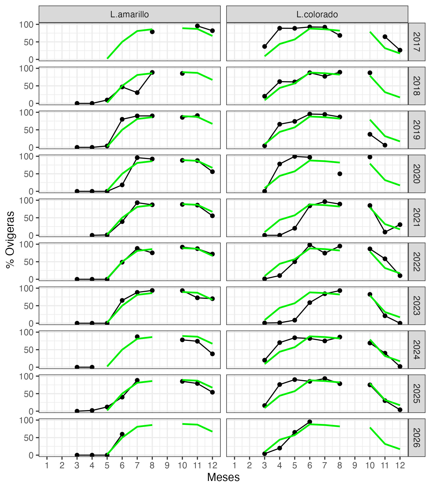
```

\newpage
```{r echo=FALSE, fig.width=4,fig.height=5,out.width="80%",fig.cap="Porcentaje de hembras ovígeras de langostino colorado por caladero durante junio de 2026 y comparación con el histórico de junio 2024–2025. El valor n corresponde al número de hembras analizadas por celda.",fig.align="center"}
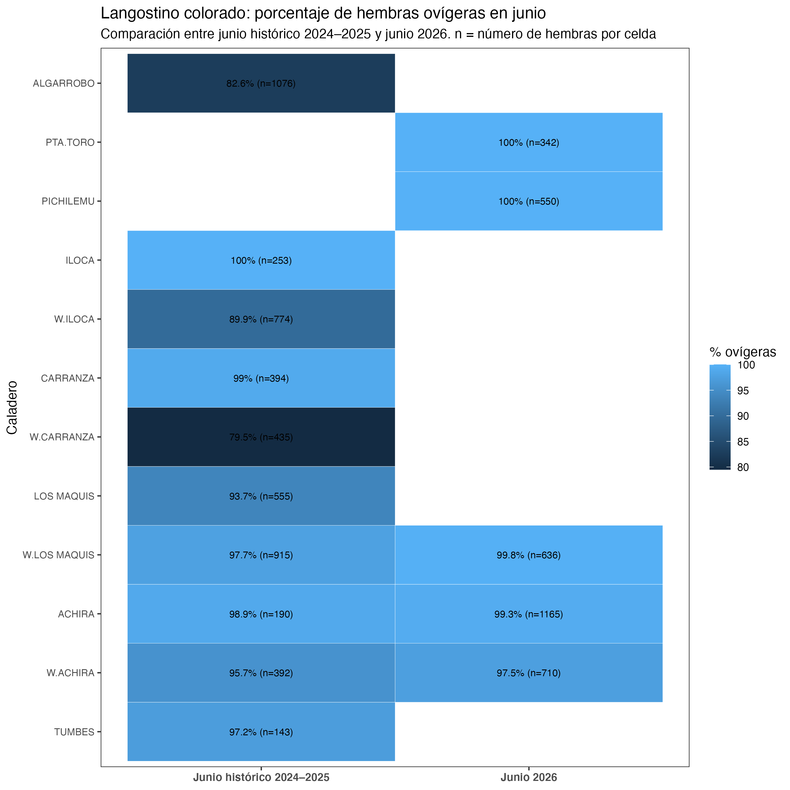
```


\newpage

## 3.3 Composición de tallas

La composición de tallas evidenció diferencias entre recursos, sexos y caladeros de pesca. En langostino colorado, las tallas medias fueron levemente superiores en machos respecto de las hembras, con valores de 36,6 mm LC y 35,9 mm LC, respectivamente. Aunque las distribuciones de ambos sexos presentaron un importante grado de superposición, los machos mostraron una mayor concentración en tallas ligeramente superiores, mientras que las hembras presentaron una distribución algo más amplia hacia tallas menores (Tabla 2; Fig. 10).

En langostino amarillo, la diferencia entre sexos fue más marcada. Los machos alcanzaron una talla media de 38,4 mm LC, mientras que las hembras registraron 33,3 mm LC. Esta separación se reflejó claramente en la composición de tallas, con machos distribuidos hacia rangos de mayor longitud cefalotorácica y hembras concentradas principalmente en tallas menores (Tabla 2; Fig. 11).

En camarón nailon, la composición de tallas de junio correspondió al caladero de Pichilemu. Las hembras presentaron una talla media de 29,9 mm LC, levemente superior a la de los machos, que alcanzaron 29,0 mm LC. A diferencia de los langostinos, las diferencias entre sexos fueron menos marcadas en términos de talla media; sin embargo, las hembras mostraron una distribución más amplia, con registros entre 23,6 y 36,3 mm LC, mientras que los machos se concentraron en un rango más estrecho, entre 25,0 y 33,7 mm LC (Tabla 2; Fig. 12).

Al analizar la composición de tallas por zona de pesca, el langostino colorado presentó variabilidad espacial entre caladeros. Las mayores tallas se observaron principalmente en W. Punta Toro, donde tanto machos como hembras presentaron distribuciones desplazadas hacia longitudes mayores. De manera secundaria, también destacaron W. Bucalemu y W. Achira, especialmente en machos. En contraste, W. Pichilemu y W. Los Maquis mostraron distribuciones relativamente más desplazadas hacia tallas menores, particularmente en hembras (Fig. 13).

En langostino amarillo, las mayores tallas se concentraron principalmente en W. Punta Gallo y W. Punta Toro, asociadas sobre todo a la fracción de machos. En estos caladeros, los machos presentaron distribuciones más extendidas hacia tallas altas, mientras que las hembras se mantuvieron concentradas en rangos menores y más estrechos. En W. Chanco, W. Los Maquis y W. Achira también se observó el patrón general de machos de mayor talla que hembras, aunque con diferencias en la amplitud y posición de las distribuciones entre caladeros (Fig. 14).

```{r echo=FALSE, fig.width=4,fig.height=5,out.width="70%",fig.cap=" Composición de tallas de langostino colorado entre sexos, durante junio de 2026",fig.align="center"}
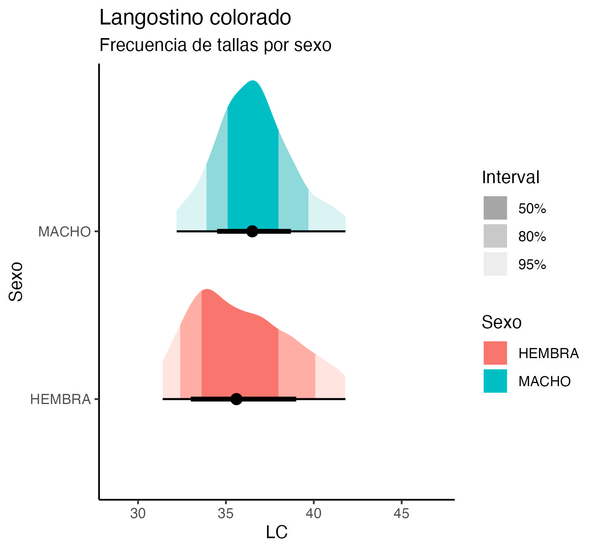
```


```{r echo=FALSE, fig.width=4,fig.height=5,out.width="70%",fig.cap=" Composición de tallas de langostino amarillo entre sexos, durante junio de 2026",fig.align="center"}
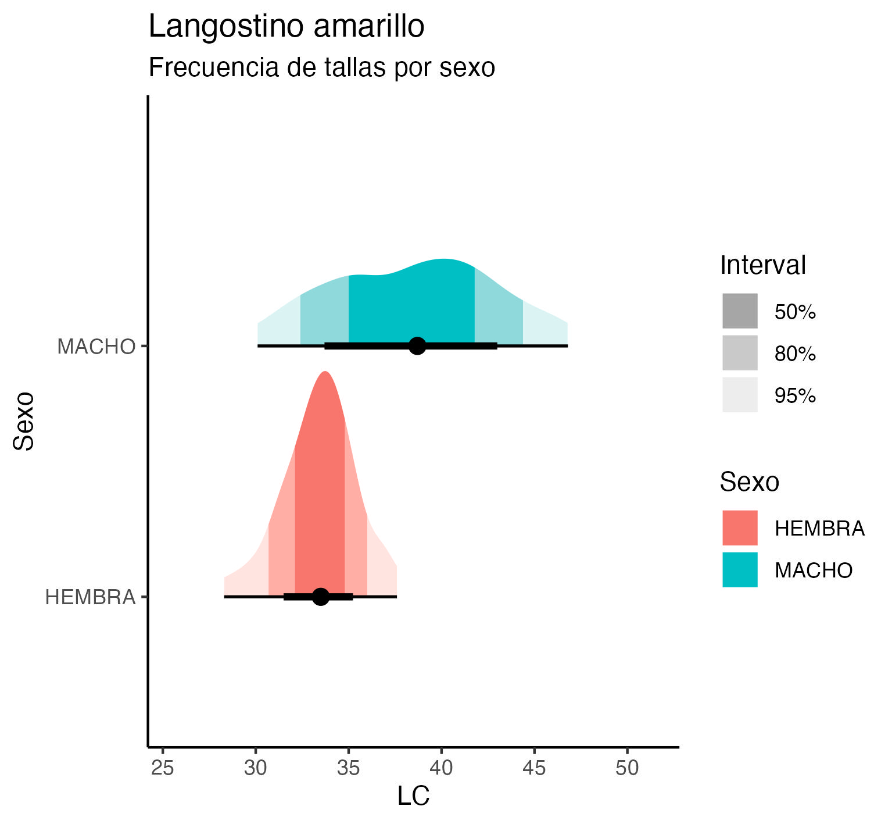
```

```{r echo=FALSE, fig.width=4,fig.height=5,out.width="70%",fig.cap=" Composición de tallas de camarón nailon entre sexos, en el caladero de Pichilemu durante junio de 2026",fig.align="center"}
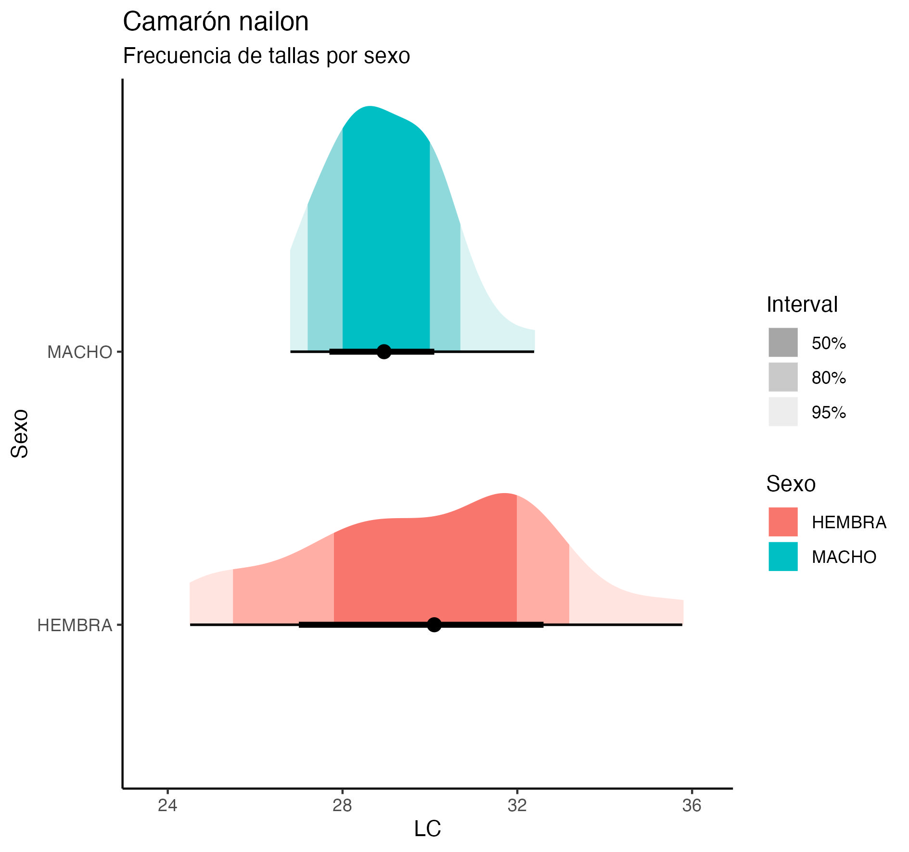
```


```{r echo=FALSE, fig.width=4,fig.height=5,out.width="80%",fig.cap="Composición de tallas de langostino colorado por caladero de pesca, durante junio de 2026",fig.align="center"}
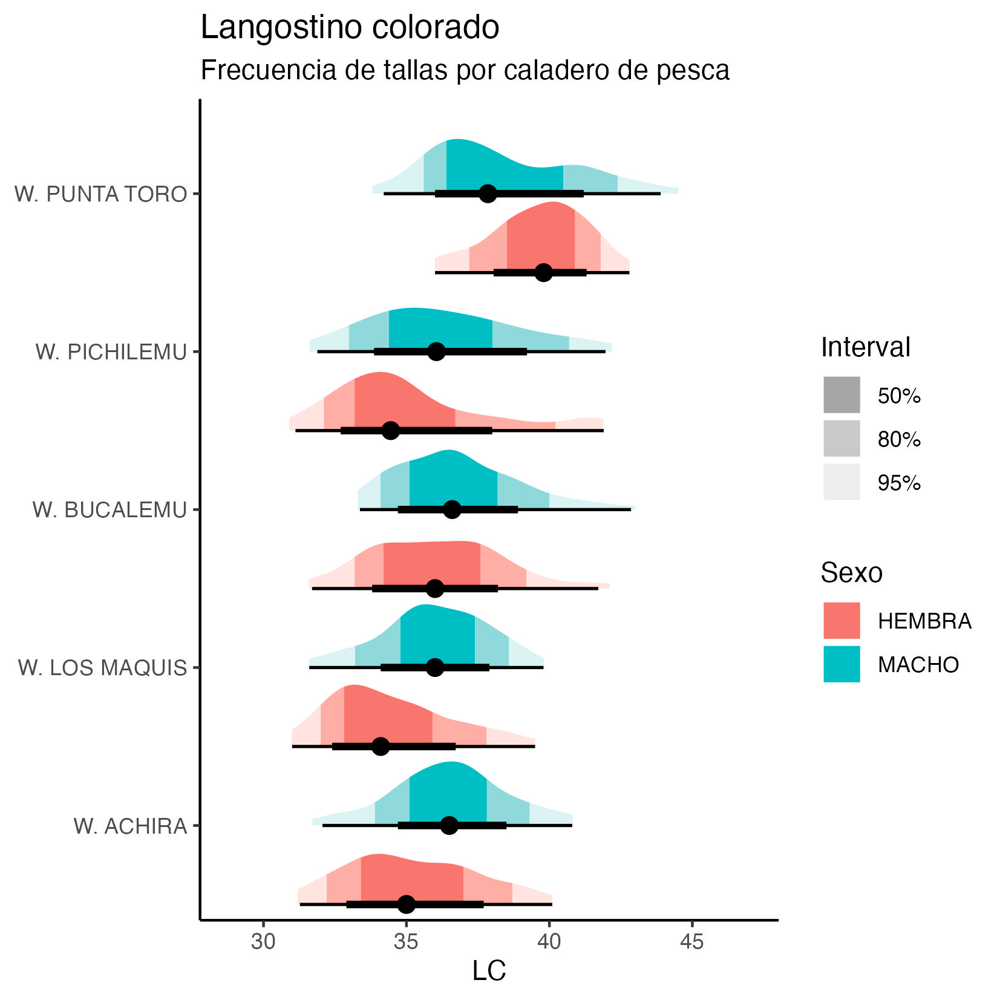
```


```{r echo=FALSE, fig.width=4,fig.height=5,out.width="80%",fig.cap="Composición de tallas de langostino amarillo por caladero de pesca, durante junio de 2026",fig.align="center"}
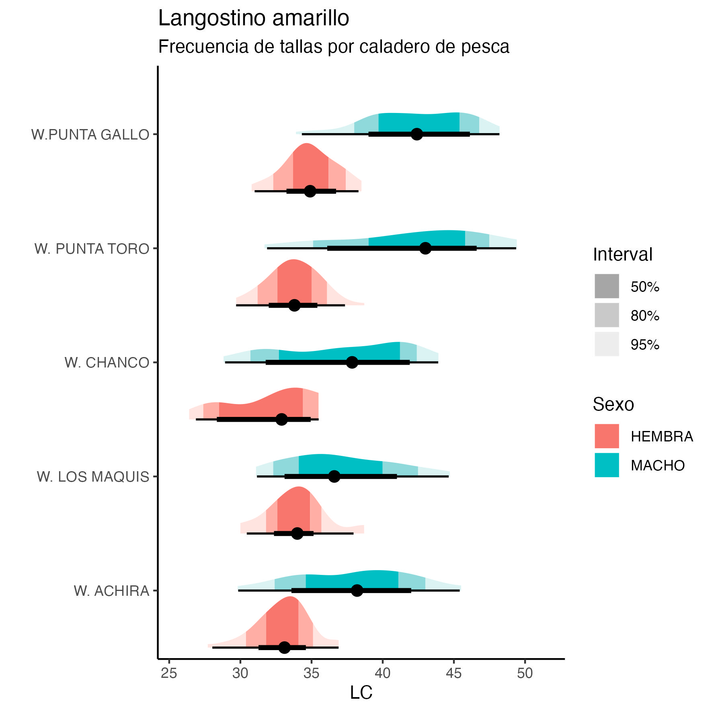
```


\newpage
## 3.4 Fauna acompañante

Durante junio de 2026, la fauna acompañante registrada en las operaciones de pesca presentó una baja participación relativa respecto de las capturas objetivo. La composición del desembarque estuvo dominada por langostino colorado y langostino amarillo, que representaron aproximadamente el 84% y 15% del total, respectivamente. El camarón nailon alcanzó cerca del 1%, mientras que la pejerrata representó solo el 0,12 % del desembarque total, evidenciando una baja incidencia relativa durante el periodo analizado (Fig. 15).

La distribución espacial de los lances con presencia de pejerrata mostró registros puntuales dentro del área de operación mensual, principalmente asociados a los sectores donde se concentró la actividad pesquera de junio. Estos registros se observaron en áreas vinculadas al núcleo centro-norte de operación, en torno a Punta Toro, Topocalma y Pichilemu, y de manera más localizada hacia el núcleo sur, asociado a sectores próximos a Achira, W. Achira, W. Los Maquis e Itata/W. Itata. Esta distribución sugiere que la presencia de pejerrata estuvo asociada a la propia cobertura espacial de los lances, más que a una ocurrencia generalizada en toda el área de pesca (Fig. 15).

Además de pejerrata, se registraron otras especies de fauna acompañante, entre ellas merluza, lenguado, jaiba paco y jaiba limón. La merluza y el lenguado presentaron una distribución más evidente en sectores del área centro-norte, coincidente con zonas de operación sobre langostino colorado y langostino amarillo. Las jaibas paco y limón, en tanto, mostraron registros más acotados y de menor magnitud, distribuidos principalmente en sectores específicos del área de pesca. En conjunto, estos resultados indican que la fauna acompañante de junio estuvo compuesta por especies demersales asociadas a los mismos fondos de operación de la flota, pero con niveles de captura bajos en comparación con los recursos objetivo (Fig. 16).

```{r echo=FALSE, fig.width=4,fig.height=5,out.width="80%",fig.cap=" Distribución de los lances de pesca con captura de pejerrata y proporción relativa de pejerrata en las capturas totales durante junio de  2026.",fig.align="center"}
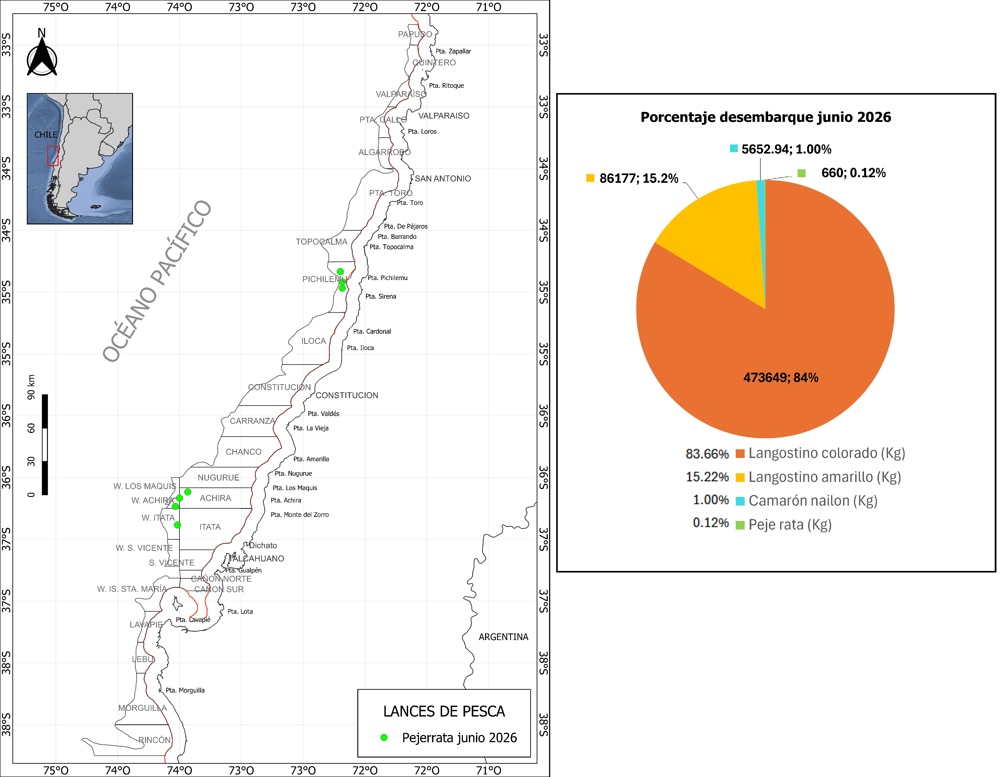
```


```{r echo=FALSE, fig.width=4,fig.height=5,out.width="110%",fig.cap=" Distribución espacial y abundancia de la fauna acompañante en los lances de pesca orientados a langostinos colorado y langostino amarillo por la flota arrastrera de CrustaSur, junio de 2026",fig.align="center"}
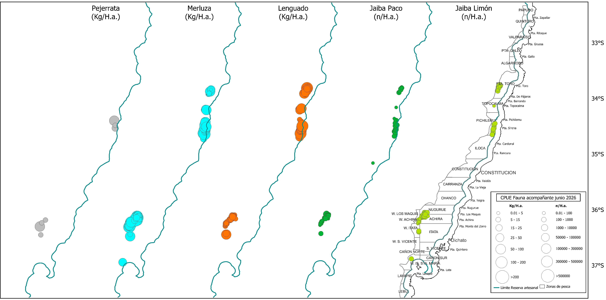
```


