\newpage

## 1 Resumen

Durante julio de 2026, la actividad pesquera de la flota de CrustaSur se desarrolló entre las regiones de Valparaíso y Ñuble, con lances distribuidos en distintos sectores de la unidad de pesquería. La operación presentó una distribución espacial discontinua, con diferencias en la cobertura e intensidad de pesca entre recursos. El langostino colorado mantuvo la mayor cobertura espacial y constituyó el principal recurso de la operación mensual, mientras que el langostino amarillo presentó una actividad más acotada y el camarón nailon tuvo una participación considerablemente menor como fauna acompañante. 

En términos operacionales, el langostino colorado registró una captura de 273,5 toneladas en 126 lances, equivalente a 2170 kg por lance, con 300 horas de arrastre y un rendimiento promedio de 909 kg/ha. El langostino amarillo alcanzó 19,5 toneladas en 36 lances, con 540 kg por lance, 83 horas de arrastre y un rendimiento promedio de 235 kg/ha. Por su parte, el camarón nailon presentó una actividad reducida, con 588 kg capturados en tres lances, seis horas de arrastre y un rendimiento promedio de 104 kg/ha. En comparación con junio, se observó una disminución de la captura y del esfuerzo pesquero en los tres recursos, particularmente marcada en langostino amarillo y camarón nailon. 

Desde el punto de vista biológico, el langostino colorado presentó un predominio de hembras, que representaron aproximadamente el 67 % de los ejemplares muestreados durante julio, con 1455 hembras y 706 machos. Las tallas medias fueron similares entre sexos, alcanzando 36,1 mm de longitud cefalotorácica (LC) en hembras y 36,6 mm LC en machos. En langostino amarillo predominó la fracción de machos, que representó aproximadamente el 68 % de la muestra, con 315 machos y 146 hembras. En este recurso se mantuvo una diferenciación de talla entre sexos, con una media de 38,1 mm LC en machos y 34,3 mm LC en hembras. Para camarón nailon no se dispuso de información biológica correspondiente a julio. 

En relación con los aspectos reproductivos, el langostino colorado mantuvo una alta proporción de hembras ovígeras durante julio, correspondiente al 84 % de las hembras analizadas, mientras que el 10 % se encontró en condición madura y el 6 % en condición normal. Respecto de junio, cuando las hembras ovígeras representaron el 95 %, se observó una disminución de esta condición, aunque continuó siendo predominante. En langostino amarillo se registró un aumento de la proporción de hembras ovígeras, desde 60 % en junio a 88 % en julio, mientras que el 12 % restante correspondió a hembras normales. 

La comparación espacial de la condición ovígera del langostino colorado se realizó únicamente en los caladeros con información disponible tanto para julio de 2026 como para el histórico de julio 2024–2025. Entre estos caladeros comparables, W. Iloca registró un 100 % de hembras ovígeras, seguido por W. Achira con 99,7 %, W. Punta Toro con 95,4 % y W. Los Maquis con 84,4 %. En comparación con el histórico, W. Iloca y W. Achira presentaron valores superiores, mientras que W. Punta Toro y W. Los Maquis mostraron porcentajes menores. 

La composición de tallas presentó diferencias entre recursos, sexos y caladeros. En langostino colorado, las distribuciones de machos y hembras mostraron una amplia superposición, consistente con las escasas diferencias observadas en sus tallas medias. A escala espacial se registró variabilidad entre W. Punta Toro, W. Achira, W. Los Maquis y W. Iloca. En langostino amarillo, la diferenciación entre sexos fue más evidente, con los machos desplazados hacia mayores longitudes cefalotorácicas en los caladeros W. Punta Toro, W. Achira y W. Los Maquis. 

Finalmente, las capturas consideradas durante julio estuvieron ampliamente dominadas por langostino colorado, que representó aproximadamente el 93,2 %, seguido por langostino amarillo con 6,6 % y camarón nailon con 0,2 %. El pejerrata presentó una participación mínima, cercana al 0,01 %. Además, entre la fauna acompañante se registraron merluza, lenguado, jaiba paco y jaiba limón.


\newpage

# 2 Aspectos Pesqueros

## 2.1 Actividad pesquera

Durante julio de 2026, la actividad pesquera de la flota de CrustaSur se desarrolló a lo largo de un amplio sector de la costa centro-sur de Chile, entre las regiones de Valparaíso y Ñuble. Los lances presentaron una distribución espacial discontinua, con sectores de mayor concentración separados por áreas con menor intensidad de operación. En el sector norte de la unidad de pesquería se registró actividad frente a la costa de las regiones de Valparaíso y del Libertador General Bernardo O’Higgins, con lances asociados principalmente al entorno de Punta Toro, Topocalma y Pichilemu. Hacia el sur, se observó otro conjunto de lances frente a la costa del Maule, particularmente en sectores próximos a Iloca y Constitución.

La mayor concentración de actividad se observó más al sur, en el sector comprendido entre Carranza, W. Los Maquis, Achira y W. Achira, mientras que también se registraron lances más dispersos hacia sectores próximos al límite entre las regiones del Maule y Ñuble. En conjunto, la distribución espacial de julio muestra una operación extendida latitudinalmente, pero concentrada en caladeros específicos dentro de la unidad de pesquería (Fig. 1).


```{r echo=FALSE, fig.width=4,fig.height=5,out.width="55%", fig.cap="Distribución espacial del total de lances de pesca realizados durante julio de 2026",fig.align="center" }
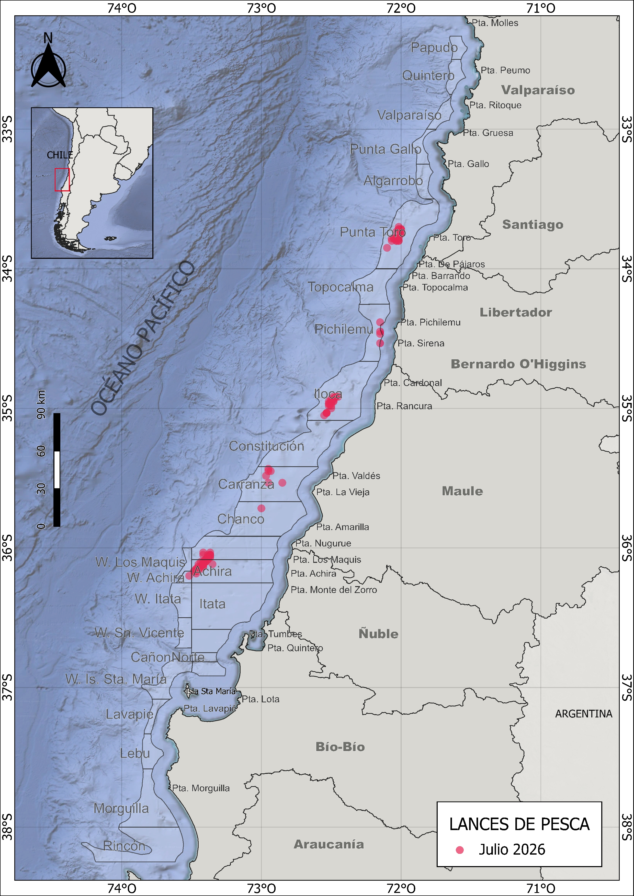
```


## 2.2 Captura, esfuerzo y rendimientos de pesca

Durante julio de 2026, el langostino colorado concentró la mayor actividad pesquera, con una captura de 273,5 t en 126 lances y un rendimiento promedio de 909 kg/ha. Respecto de junio, disminuyeron la captura, el número de lances y el rendimiento, aunque la captura promedio por lance aumentó de 2078 a 2170 kg/lance.

El langostino amarillo registró 19,5 t en 36 lances y un rendimiento promedio de 235 kg/ha, evidenciando una marcada reducción de la actividad respecto de junio. El camarón nailon presentó una operación marginal durante julio, con solo tres lances, 588 kg de captura y un rendimiento promedio de 104 kg/ha (Tabla 1).

En términos generales, julio presentó una disminución del esfuerzo y de las capturas respecto de junio, manteniéndose el langostino colorado como el principal recurso de la operación. Los rendimientos mostraron variabilidad espacial entre los caladeros visitados durante el mes (Figs. 2–5).


```{r echo=FALSE, fig.width=3,fig.height=3,out.width="90%",fig.cap=" Distribución espacial de los lances de pesca orientados a langostino colorado, langostino amarillo y camarón nailon durante julio de 2026",fig.align="center"}
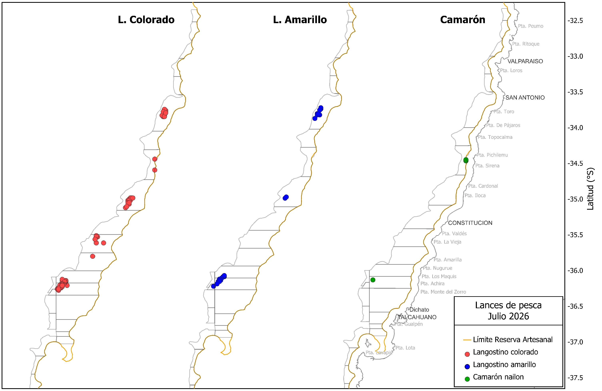
```


\newpage

##### *Tabla 1. Indicadores operacionales de la pesquería de langostino colorado, langostino amarillo y camarón nailon, año 2026.*

|**Recurso**|**Mes**|**N° de lances(n)**|**Cap. (kg)**|**Cap.lances (kg/n)**|**h arrast.(ha)**|**Rend. (kg/ha)**|**Prof.de fondo(m)**| 
|--------|-------|--------|-------|---------|-------|------|-------|
|**L.colorado**|marzo|137|351754|2567|121|2907|249|
|              |abril|162|384280|2372|230|1281|224|
|               |mayo|208|552006|2653|331|1666|189|
|               |junio|202|419871|2078|420|997|173|
|               |julio|126|273489|2170|300|909|149|
|**L.amarillo**|marzo|83|42789|515|49|877|264|
|              |abril|86|48702|566|138|352|238|
|              |mayo|107|41075|383|172|238|186|
|              |junio|160|86177|538|338|255|170|
|              |julio|36|19468|540|83|235|157|
|**Camarón**|marzo|57|98820|1733|87|1138|324|
|           |abril|37|46825|1265|67|693|283|
|           |junio|49|5640|115|94|60|210|
|           |julio|3|588|196|6|104|185|


En términos generales, la distribución mensual del esfuerzo muestra que durante julio disminuyó la intensidad de operación respecto de junio en los tres recursos analizados. La reducción fue particularmente evidente en langostino amarillo y camarón nailon, mientras que el langostino colorado continuó concentrando la mayor parte del esfuerzo pesquero. A pesar de la disminución de las horas de arrastre, el langostino colorado mantuvo una captura promedio superior a 2 toneladas por lance, aunque su rendimiento promedio descendió a 909 kg/ha (Tabla 1; Fig. 3).

```{r echo=FALSE,fig.width=4,fig.height=5,out.width="80%",fig.cap="Distribución de frecuencia del esfuerzo de pesca (en horas de arrastre, A) y del rendimiento (en kg/ha, B), para langostino colorado, langostino amarillo y camarón nailon durante julio de 2026",fig.align="center"}
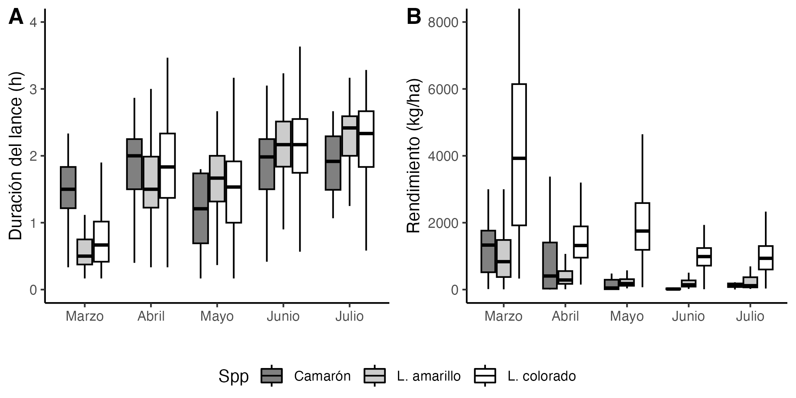
```

A escala espacial, los rendimientos mostraron variabilidad entre sectores y recursos. En langostino colorado se observaron diferencias importantes entre los caladeros muestreados, destacando sectores con rendimientos elevados y una mayor amplitud de valores, particularmente en el área de Iloca, junto con registros relevantes en Punta Toro y otros sectores de la unidad de pesquería. En langostino amarillo, los rendimientos más altos se concentraron principalmente en Punta Toro, mientras que en otros sectores los valores fueron comparativamente menores. Para camarón nailon, la información espacial de julio fue considerablemente más limitada debido al bajo número de lances, por lo que el patrón observado representa solamente los sectores efectivamente visitados durante el mes (Figs. 4–5).

```{r echo=FALSE,fig.width=4,fig.height=5,out.width="80%",fig.cap="Rendimiento de pesca (captura por hora de arrastre) de langostino colorado (A), langostino amarillo (B) y camarón nailon (C), en julio de 2026",fig.align="center"}
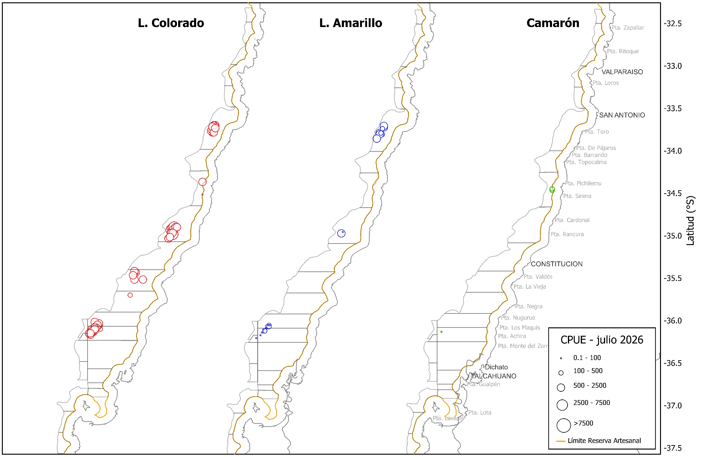
```


```{r echo=FALSE,fig.width=4,fig.height=5,out.width="110%",fig.cap="Distribución del rendimiento de pesca (kg/ha) de langostino colorado, langostino amarillo y camarón nailon en julio de 2026",fig.align="center"}
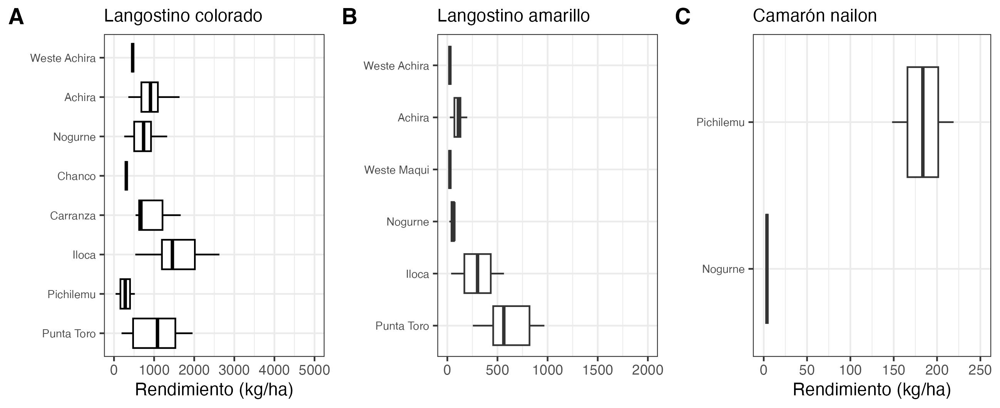
```


\newpage

# 3 Aspectos biológicos

Los indicadores biológicos considerados incluyeron la proporción sexual, talla promedio, composición de tallas y condición reproductiva. La información correspondió a los muestreos biológicos realizados durante julio de 2026. Para camarón nailon no se dispuso de información biológica durante este mes.

## 3.1 Proporción sexual y talla promedio

La proporción sexual presentó patrones contrastantes entre ambos langostinos. En langostino colorado se mantuvo el predominio de hembras observado durante los últimos meses, con 1.455 hembras y 706 machos, equivalentes aproximadamente al 67 % y 33 % de la muestra, respectivamente. Esta proporción fue levemente más favorable a las hembras que en junio, cuando representaron cerca del 63 % de los ejemplares analizados.

En langostino amarillo se observó el patrón opuesto, con predominio de machos. Durante julio se registraron 315 machos y 146 hembras, correspondientes aproximadamente al 68 % y 32 % de la muestra, respectivamente. Aunque los machos continuaron constituyendo la fracción predominante, su participación disminuyó respecto de junio, cuando representaron aproximadamente el 74 % de los ejemplares muestreados (Tabla 2; Fig. 6).

En términos de talla, el langostino colorado presentó valores medios similares entre sexos. Las hembras alcanzaron una longitud cefalotorácica media de 36,1 mm LC y los machos de 36,6 mm LC. La amplitud de tallas fue comparable entre ambos sexos, con registros entre 25,6 y 48,6 mm LC en hembras y entre 29,0 y 47,3 mm LC en machos. Estos valores mantienen el patrón reciente de tallas medias cercanas a 36 mm LC durante 2026.

En langostino amarillo, la diferencia de talla entre sexos fue más evidente. Las hembras presentaron una talla media de 34,3 mm LC, mientras que los machos alcanzaron 38,1 mm LC. Además, los machos presentaron una distribución de tallas más amplia, entre 21,4 y 49,8 mm LC, mientras que las hembras se distribuyeron entre 29,7 y 39,1 mm LC. Estos resultados mantienen el patrón característico del recurso, con machos de mayor talla promedio que las hembras (Tabla 2; Fig. 7).

\newpage

##### *Tabla 2. Proporción sexual y talla promedio de langostino colorado, langostino amarillo y camarón nailon en las capturas de la UPS, 2026*

|   |Mes|Sexo|n|LC(mm)|DE(mm)|Min.(mm)|Max.(mm)|
|----|---|----|-|------|------|----------|----------|
|**L.colorado**|marzo|hembra|813|35,9|2,44|29,8|43,7|
|         |    |macho|1595|37,0|2,34|29,9|46,5|
|         |abril|hembra|1508|36,2|2,06|30,0|44,1|
|         |   |macho|1561|37,7|2,09|29,9|46,0|
|         |mayo|hembra|2374|35,3|2,26|27,0|43,4|
|         |   |macho|1219|36,4|2,53|28,9|47,4|
|         |junio|hembra|2131|35,9|2,89|28,7|47,1|
|         |   |macho|1230|36,6|2,40|28,9|45,6|
|         |julio|hembra|1455|36,1|2,98|25,6|48,6|
|         |   |macho|706|36,6|3,01|29,0|47,3|
|**L.amarillo**|marzo|hembra|246|29,3|3,77|20,7|41,8|
|         |    |macho|732|36,1|6,45|20,2|51,6|
|         |abril|hembra|336|31,7|3,30|20,3|40,9|
|         |     |macho|729|40,0|4,71|19,6|49,2|
|         |mayo|hembra|164|32,7|2,65|26,9|41,0|
|         |     |macho|1363|37,3|4,43|25,2|48,3|
|         |junio|hembra|399|33,3|2,23|25,5|40,2|
|         |     |macho|1127|38,4|4,54|26,0|51,5|
|         |julio|hembra|146|34,3|1,52|29,7|39,1|
|         |     |macho|315|38,1|4,21|21,4|49,8|
|**Camarón**|marzo|hembra|1163|29,9|2,31|24,3|36,9|
|      |     |macho|587|28,7|1,36|25,0|33,2|
|      |abril|hembra|700|30,0|2,48|23,9|37,6|
|      |      |macho|300|28,4|1,47|25,1|33,4|
|      |junio|hembra|166|29,9|2,91|23,6|36,3|
|      |      |macho|84|29,0|1,50|25,0|33,7|


\newpage
```{r echo=FALSE,fig.width=4,fig.height=5,out.width="90%",fig.cap="Proporción sexual de langostino colorado (A) y langostino amarillo (B), durante marzo, abril, mayo, junio y julio de 2026",fig.align="center"}
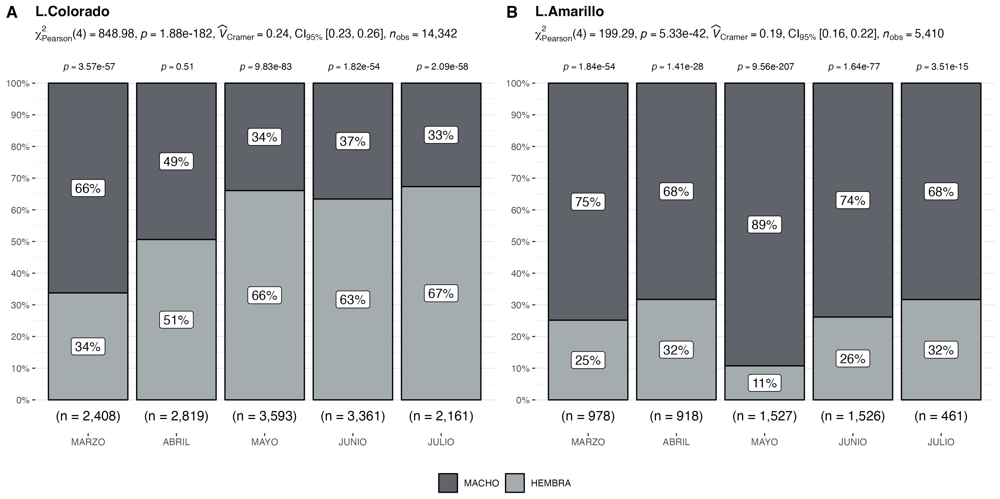
```

```{r echo=FALSE,fig.width=4,fig.height=5,out.width="90%",fig.cap="Talla promedio (LC, mm) de langostino colorado y langostino amarillo por sexo, en el periodo enero 2016 a julio de 2026",fig.align="center"}
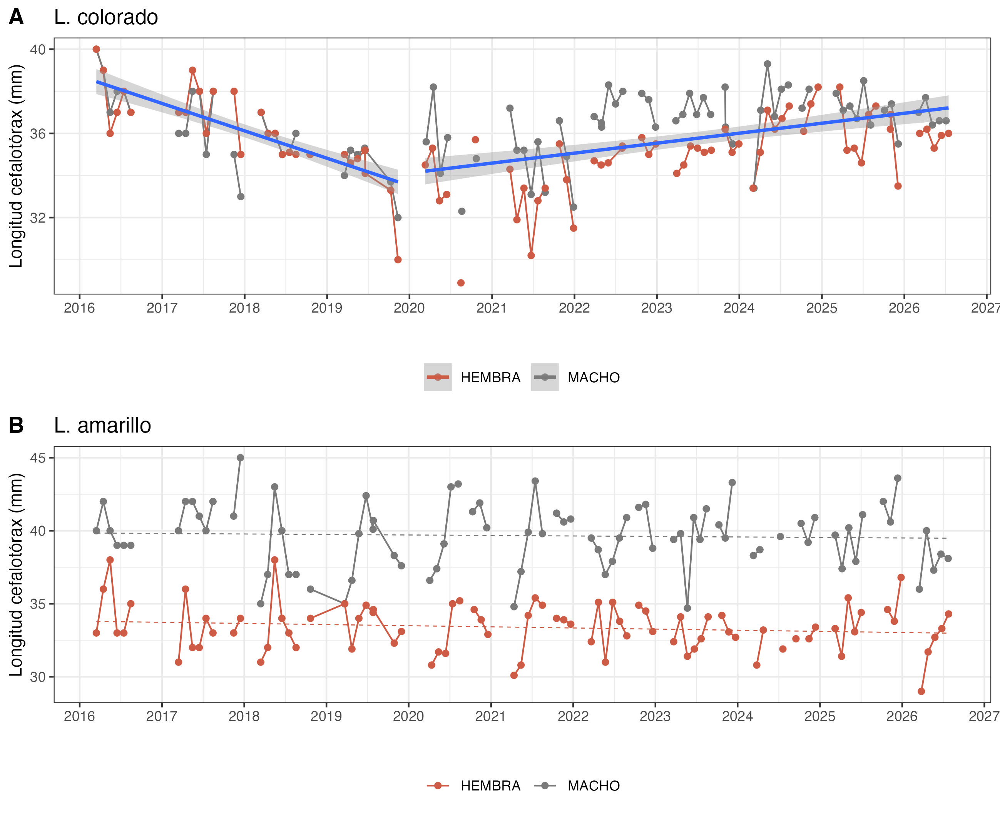
```
\newpage

## 3.2 Aspectos reproductivos


Durante julio de 2026, el langostino colorado mantuvo una alta proporción de hembras ovígeras, que alcanzó el 84 % de las hembras analizadas. El 10 % correspondió a hembras maduras y el 6 % a hembras normales. Respecto de junio, cuando las hembras ovígeras representaron el 95 %, se observó una disminución de esta condición, aunque continuó siendo ampliamente predominante (Tabla 3; Fig. 8).

En langostino amarillo se observó un aumento de la actividad reproductiva. La proporción de hembras ovígeras aumentó desde 60 % en junio a 88 % en julio, mientras que el 12 % restante correspondió a hembras normales. Este resultado muestra una intensificación de la condición ovígera durante julio, luego de su aparición en las capturas durante junio (Tabla 3; Fig. 8).

Para camarón nailon no se dispuso de información biológica correspondiente a julio, por lo que no fue posible actualizar su condición reproductiva durante este mes.

A escala espacial, la comparación entre julio de 2026 y el histórico de julio 2024–2025 se realizó en los cuatro caladeros con información disponible en ambos períodos. W. Iloca registró un 100 % de hembras ovígeras, seguido por W. Achira con 99,7 %, W. Punta Toro con 95,4 % y W. Los Maquis con 84,4 %. En comparación con el histórico, W. Iloca y W. Achira presentaron valores superiores, mientras que W. Punta Toro y W. Los Maquis mostraron porcentajes menores (Fig. 9).


\newpage
##### *Tabla 3. Porcentaje de hembras normales, ovígeras y maduras de langostino colorado y langostino amarillo, y porcentaje de hembras inmaduras y maduras de camarón nailon en la UPS, 2026*

| **Recurso**    | **Estado**   | **mar.** |**abr.** |**may.** |**jun.** |**jul.** |
|----------------|------------ |--------|--------|--------|--------|--------|
| **L.colorado** | Normal       | 95%   |79%|35%|1%|6%|
|                | Ovígeras     | 4%       |20%|65%|95%|84%|
|                | Maduras       | 1%        |1%|0,1%|4%|10%|
| Total n°       |              | 813       |1508|2374|2131|1455|
| **L.amarillo** | Normal       | 100%      | 100%|100%|40%|12%|
|                | Ovígeras     | 0%        | 0%|0%|60%|88%|
|                | Maduras       | 0%        |0%|0%|0%|0%|
| Total n°       |              | 246       |336|164|399|146|
| **C.nailon** | Inmaduras      | 96%      | 73%|-|11%|-|
|                | Maduras       | 4%        |27%|-|89%|-|
| Total n°       |              | 1221       |700|-|166|-|


```{r echo=FALSE, fig.width=4,fig.height=5,out.width="50%",fig.cap="Porcentaje mensual de hembras ovígeras de langostino colorado y langostino amarillo durante 2026, en comparación con la media registrada entre 2017 y 2024.",fig.align="center"}
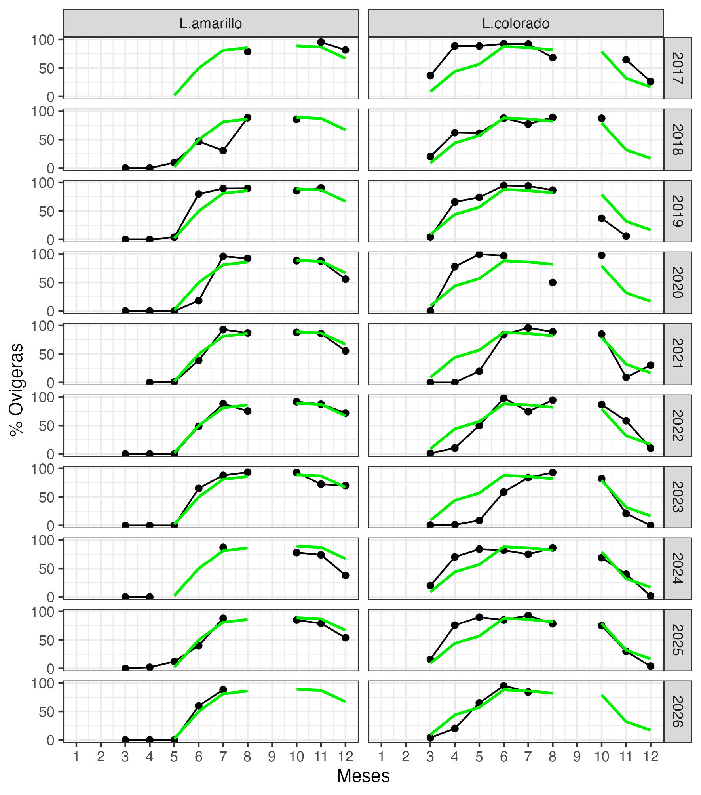
```

\newpage
```{r echo=FALSE, fig.width=4,fig.height=5,out.width="80%",fig.cap="Porcentaje de hembras ovígeras de langostino colorado por caladero durante julio de 2026 y comparación con el histórico de julio 2024–2025. Se presentan únicamente los caladeros con información disponible en ambos períodos. El valor n corresponde al número de hembras analizadas por celda.",fig.align="center"}
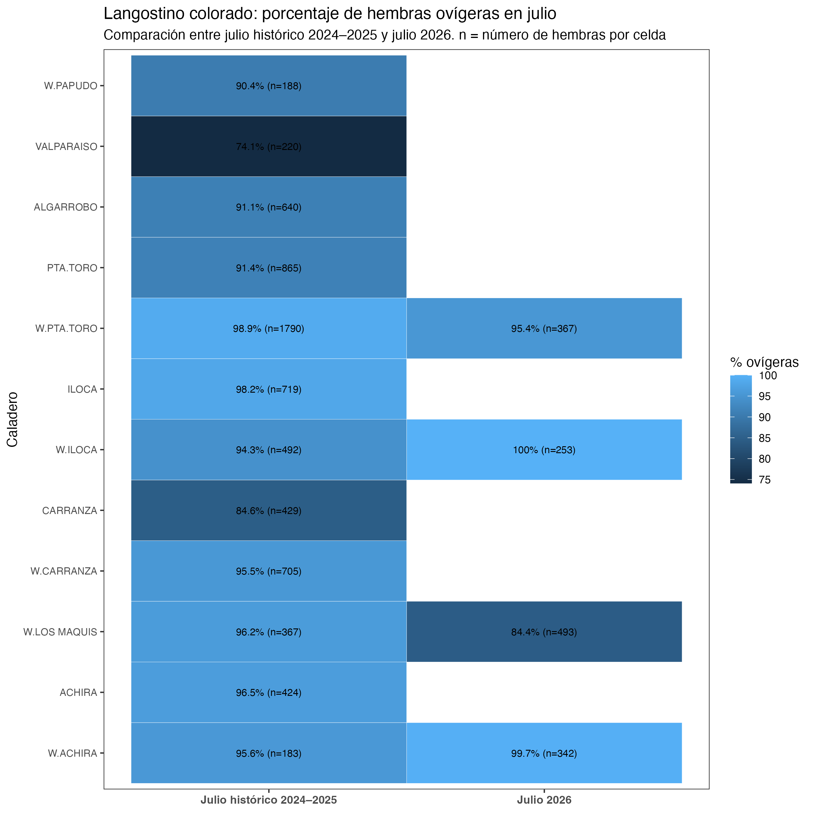
```


\newpage

## 3.3 Composición de tallas

Durante julio de 2026, la composición de tallas presentó diferencias entre recursos, sexos y caladeros de pesca. En langostino colorado, las distribuciones de machos y hembras mostraron una amplia superposición, consistente con las tallas medias similares registradas durante el mes: 36,6 mm LC en machos y 36,1 mm LC en hembras. No obstante, los machos presentaron una distribución algo más extendida hacia tallas mayores (Tabla 2; Fig. 10).

En langostino amarillo, la diferenciación entre sexos fue más evidente. Los machos alcanzaron una talla media de 38,1 mm LC, superior a los 34,3 mm LC registrados en hembras. La distribución de los machos fue además considerablemente más amplia, mientras que las hembras se concentraron en un intervalo de tallas más estrecho (Tabla 2; Fig. 10).

A escala espacial, el langostino colorado mostró diferencias entre los cuatro caladeros representados. Las distribuciones de mayor talla se observaron principalmente en W. Punta Toro y W. Iloca, mientras que W. Los Maquis presentó tallas relativamente menores, especialmente en hembras. W. Achira mostró una distribución intermedia y con importante superposición entre sexos (Fig. 11).

En langostino amarillo se mantuvo el patrón de mayores tallas en machos en los tres caladeros analizados. Esta diferencia fue particularmente marcada en W. Punta Toro y W. Achira, donde las distribuciones de los machos estuvieron claramente desplazadas hacia longitudes mayores. En W. Los Maquis la diferencia entre sexos fue menor, aunque los machos continuaron presentando una distribución hacia tallas superiores (Fig. 12).


```{r echo=FALSE, fig.width=4,fig.height=5,out.width="70%",fig.cap=" Composición de tallas de langostino colorado y langostino amarillo entre sexos, durante julio de 2026",fig.align="center"}
knitr::include_graphics("Fig_juLio_26/frec_sexual.jpg")
```

```{r echo=FALSE, fig.width=4,fig.height=5,out.width="80%",fig.cap="Composición de tallas de langostino colorado por caladero de pesca, durante julio de 2026",fig.align="center"}
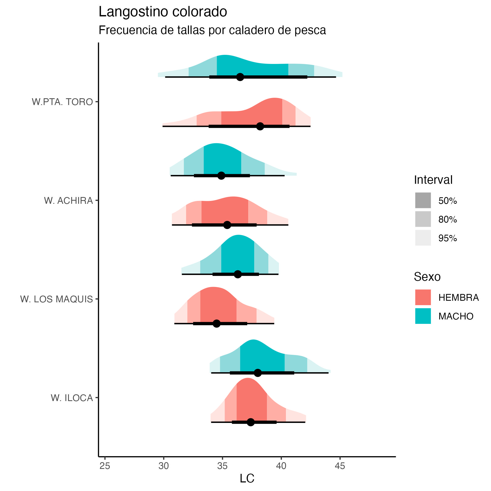
```

```{r echo=FALSE, fig.width=4,fig.height=5,out.width="80%",fig.cap="Composición de tallas de langostino amarillo por caladero de pesca, durante julio de 2026",fig.align="center"}
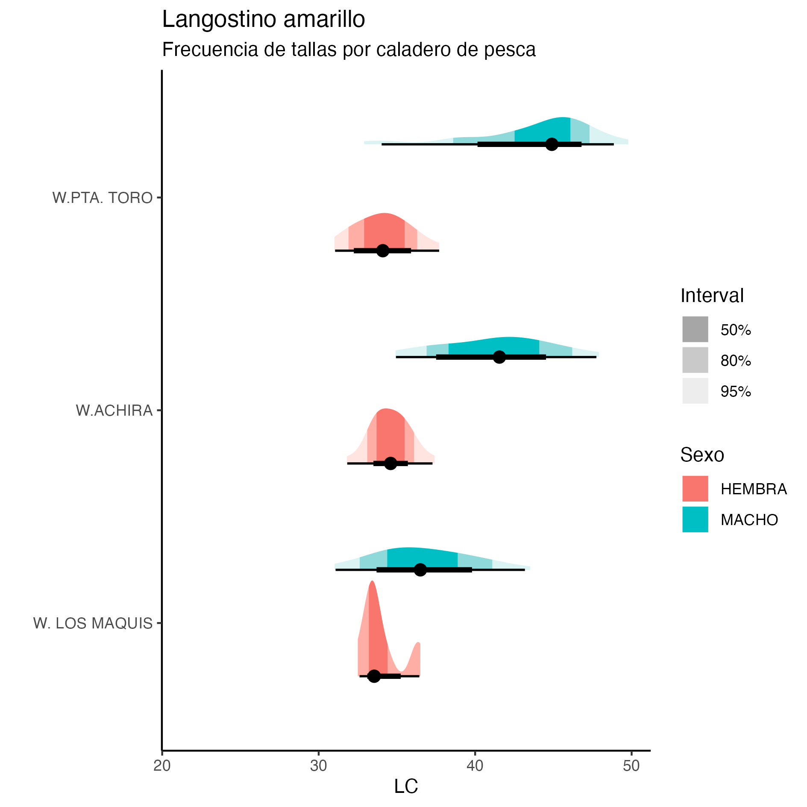
```


\newpage
## 3.4 Fauna acompañante

Durante julio de 2026, la fauna acompañante presentó una baja participación relativa respecto de los recursos objetivo. El desembarque estuvo ampliamente dominado por langostino colorado, que representó el 93,15 % del total, seguido por langostino amarillo con 6,63 % y camarón nailon con 0,20 %. La pejerrata registró una captura de 40 kg, equivalente a solo el 0,01 % del desembarque total, evidenciando una incidencia muy baja durante el mes (Fig. 13).

La presencia de pejerrata fue puntual y estuvo restringida al sector sur del área de operación, por lo que su ocurrencia espacial durante julio fue limitada. Además de esta especie, la fauna acompañante incluyó merluza, lenguado, jaiba paco y jaiba limón, con registros distribuidos en distintos sectores de la zona de pesca y diferencias en su abundancia relativa entre lances.

En conjunto, la información de julio muestra una baja participación de la fauna acompañante respecto de las capturas de langostinos, aunque con presencia de distintas especies demersales a lo largo del área de operación de la flota (Figs. 13–14).


```{r echo=FALSE, fig.width=4,fig.height=5,out.width="80%",fig.cap=" Distribución de los lances de pesca con captura de pejerrata y proporción relativa de pejerrata en las capturas totales durante julio de  2026.",fig.align="center"}
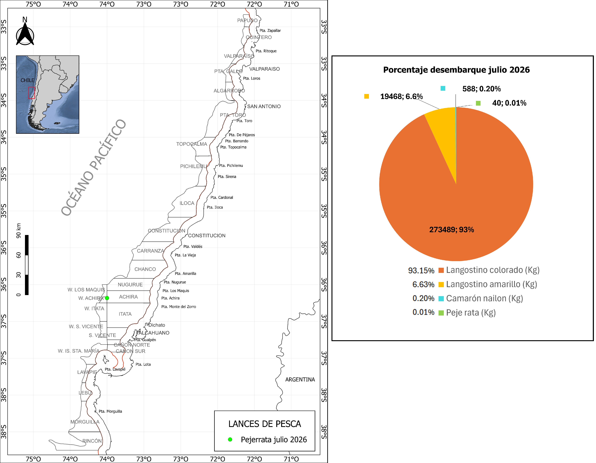
```


```{r echo=FALSE, fig.width=4,fig.height=5,out.width="110%",fig.cap=" Distribución espacial y abundancia de la fauna acompañante en los lances de pesca orientados a langostinos colorado y langostino amarillo por la flota arrastrera de CrustaSur, junio de 2026",fig.align="center"}
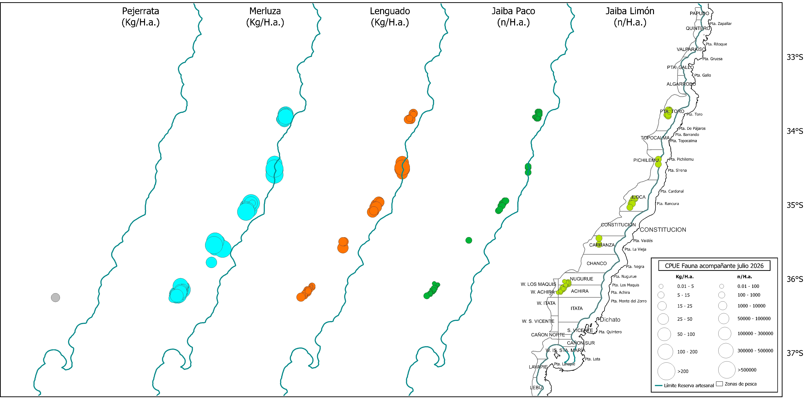
```


